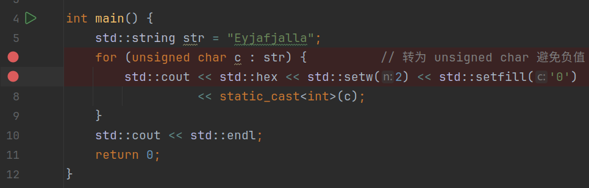
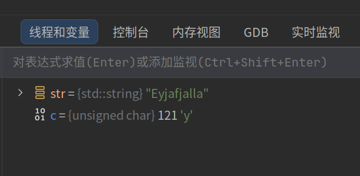
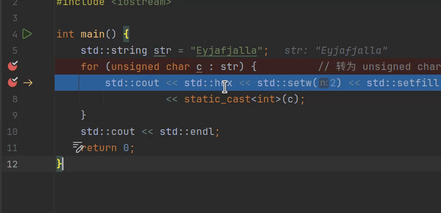
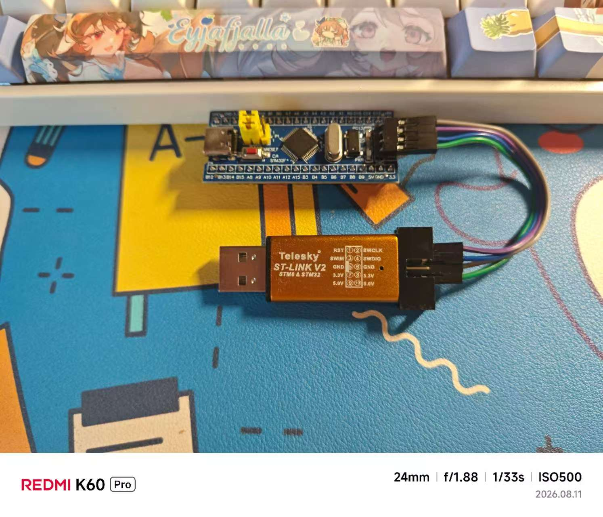
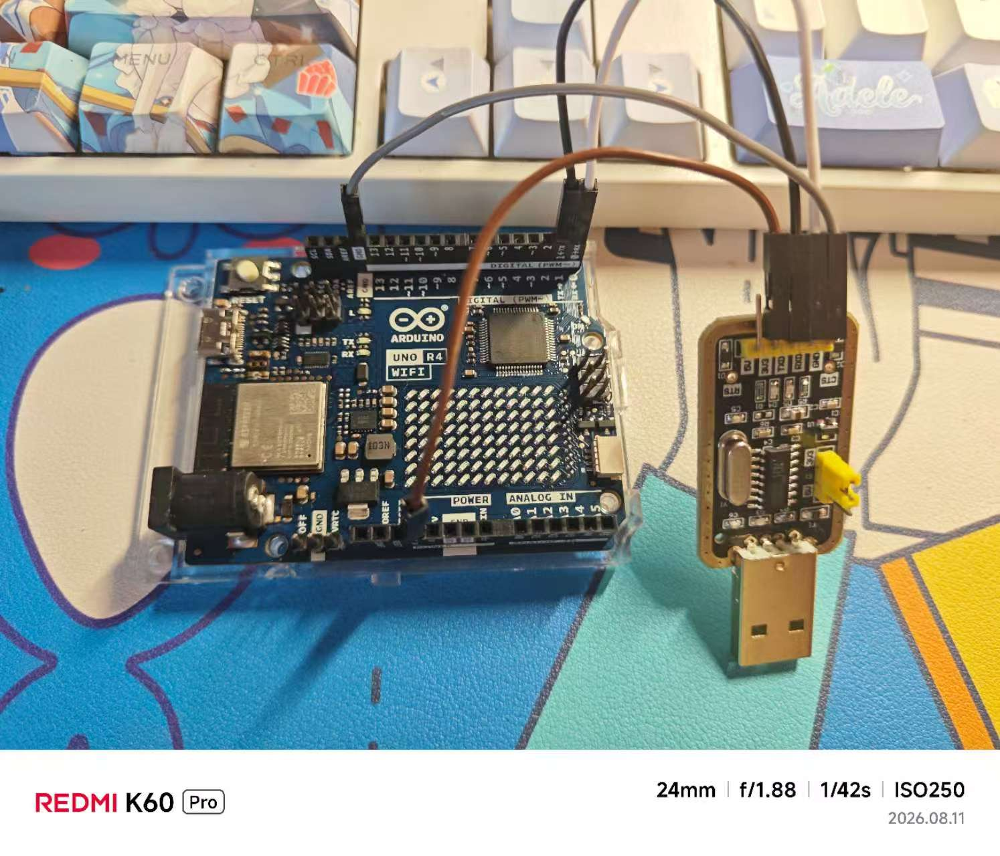
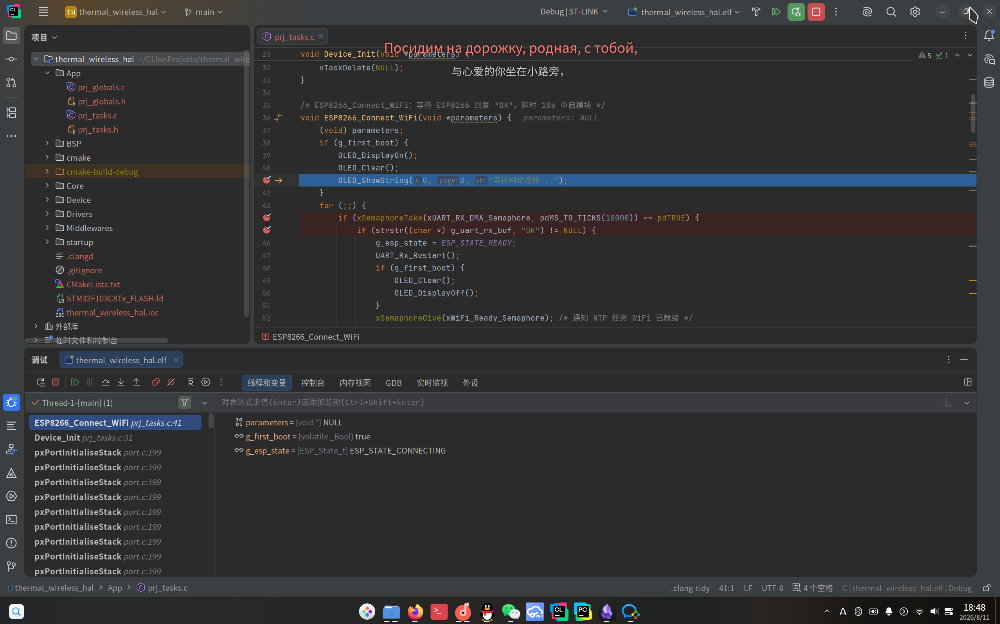
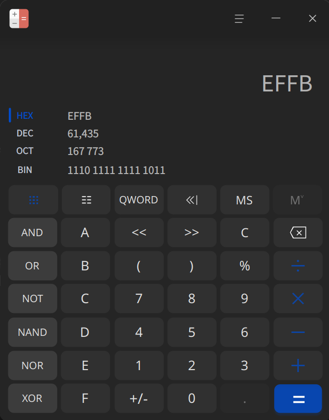
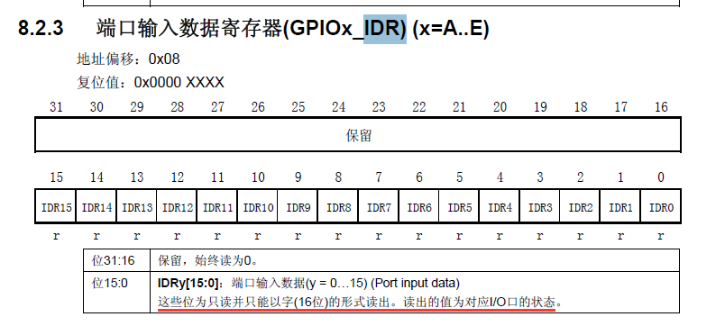

# C++程序的调试

## 1. 一般C++程序的调试

一般在IDE中（例如CLion、VS Code、Visual Studio等，这里以CLion为例），我们可以指定调试器在某一行代码执行前暂停程序执行。这个暂停点叫做断点，而设置断点的过程被称为“打断点”。就像这样：



一般在CMake中会有一个Debug配置，我们可以使用这个Debug配置完成程序调试。

> [!INFO] 提示
> 在调试程序前，请确保电脑上安装了调试器。

对于纯软件调试来说，当程序运行到断点时，程序暂停运行，此时调试器入场，它的任务是收集到这个断点为止的所有局部变量信息，然后进行汇总。就像这样：



Visual Studio与CLion都支持“悬停查看”功能，即鼠标悬停在我们希望查看值的变量上，即可看到这个变量的值。就像这样：



当然，我们也可以选择使用命令行来查看指定变量或地址的值。这在嵌入式程序的调试中十分常见。例如在这个程序中，我们可以使用以下命令查看c的值：

```gdb
p c
```

执行结果如下：

```text
(gdb) p c
$2 = 121 'y'
```

我们还可以利用gdb得到程序的汇编代码，从而对程序行为进行更深层次的分析。使用disas命令获取程序的反汇编代码：

```text
(gdb) disas
Dump of assembler code for function main():
   0x0000555555555209 <+0>:	push   %rbp
   0x000055555555520a <+1>:	mov    %rsp,%rbp
   0x000055555555520d <+4>:	push   %rbx
   0x000055555555520e <+5>:	sub    $0x48,%rsp
   0x0000555555555212 <+9>:	lea    -0x1a(%rbp),%rax
   0x0000555555555216 <+13>:	mov    %rax,%rdi
   0x0000555555555219 <+16>:	call   0x555555555100 
   ......
```

## 2. 嵌入式程序的调试

### 1. 使用专用调试器进行调试

在嵌入式程序的调试中，我们需要用到专用的调试器（例如JTAG、USB转TTL调试器、ST-Link等）。就像这样：




> 注意：这里图2的接线有一处错误——USB转TTL模块的TX/RX接线顺序应与单片机相反，即TX接单片机RX，RX接单片机TX。

其中前者能够实现完整的调试功能（包括断点、步入步出、步过代码、调试器交互等），而后者只能够通过开发板的UART串口来接收或发送信息。实际上对于后者开发板（Arduino Uno R4 WiFi）以及其他开发板（例如ESP32、Pico以及一些FPGA开发板等），它们在USB口上自带了程序调试功能，所以不需要像前者（例如STM32系列）一样使用专用的调试器。

> [!WARNING] 注意
> 如果使用了STM32 HAL库进行固件开发，必须将SYS板块中的Debug选项设置为Serial Wire（对于ST-Link）或者JTAG（对于J-TAG调试器），否则程序刷入后这些GPIO口将会锁死，进而不能调试程序，也不能在这种状态下刷入新程序。要解决由于芯片锁死导致不能刷入程序的问题，需要将芯片的BOOT0引脚拉高，刷入程序后断电调回低位（对于一般的最小系统板来说，板上都有跳线帽用于快速调整这个引脚，只需要将跳线帽拔出，插入高位对应的接口即可；调回低位同理）。

将调试器连接到电脑，点击IDE中的调试按钮，此时调试器会将固件刷写到单片机上，然后启动调试程序。就像这样：



针对嵌入式的调试对比针对一般PC的调试有更多功能，例如查看单片机寄存器状态、获取程序接下来要执行的代码等。例如我们可以用以下gdb命令查看程序接下来执行的10条指令：

```gdb
x/10i $pc
```

命令执行结果如下：

```text
(gdb) x/10i $pc
=> 0x800120a <ESP8266_Connect_WiFi+26>:	ldr	r2, [pc, #140]	@ (0x8001298 <ESP8266_Connect_WiFi+168>)
   0x800120c <ESP8266_Connect_WiFi+28>:	movs	r1, #0
   0x800120e <ESP8266_Connect_WiFi+30>:	movs	r0, #0
   0x8001210 <ESP8266_Connect_WiFi+32>:	bl	0x8001098 <OLED_ShowString>
   0x8001214 <ESP8266_Connect_WiFi+36>:	ldr	r3, [pc, #132]	@ (0x800129c <ESP8266_Connect_WiFi+172>)
   0x8001216 <ESP8266_Connect_WiFi+38>:	ldr	r3, [r3, #0]
   0x8001218 <ESP8266_Connect_WiFi+40>:	movw	r1, #10000	@ 0x2710
   0x800121c <ESP8266_Connect_WiFi+44>:	mov	r0, r3
   0x800121e <ESP8266_Connect_WiFi+46>:	bl	0x800817c <xQueueSemaphoreTake>
   0x8001222 <ESP8266_Connect_WiFi+50>:	mov	r3, r0
```

用以下指令读取这个STM32芯片中GPIOB->IDR寄存器的值：

```gdb
x/1wx 0x40010C08
```

执行结果如下：

```text
(gdb) x/1wx 0x40010C08
0x40010c08:	0x0000effb
```

我们根据GPIO中IDR寄存器的定义查看Pin 12的电平：

```text
(gdb) x/1wx 0x40010C08
0x40010c08:	0x0000effb
```

其中0x40010C00是STM32F103中GPIOB的基地址，要查询IDR寄存器，需要加上一个8 Bytes的偏移量。对我们取到的数据取二进制低16位，结果如下：



根据下图我们可以得知IDR中的数据反向存储了B15-B0口的电平位：



再结合计算器结果，B12口的电平是计算结果中的第4位，结果为0，所以B12口的电平是低电平。

### 2. 在没有调试器的情况下进行调试

这个时候可能有人要问：主播主播，我现在手头上只有下载器，没有调试器，该怎么办呢？有没有一种能够不需要调试器也能调试程序的方法呢？

有的兄弟，有的。

对于无调试器的场合，我们可以使用上述图2中的USB转TTL模块进行调试。在单片机上指定一个UART接口进行信息输出，之后在调试时连接USB转TTL模块即可。这种情况下，我们需要在浏览器中打开一个串口调试助手，并指定调试串口为该串口。同时我们需要调整调试接收和发送参数与代码设置一致（包括波特率、数据位数、校验位数、终止位数）。这样我们就能够通过串口来接收与发送数据了。

这个时候可能还有人要问：主播主播，我连串口调试器都没有，固件直接用USB下载就行，这个时候还有办法调试吗？

有的兄弟，有的。

几乎所有的最小系统板或开发板上都有板载LED灯用于测试开发板功能是否正常，我们可以利用这个LED灯来输出信息。这个LED灯通常由一个GPIO口进行控制（例如STM32F103C8T6开发板通常有一个LED连接到C13口、Arduino Uno开发板的板载LED连接到D13口、树莓派Pico/Pico 2的板载LED连接到25号口等，具体以各开发板的数据手册和引脚定义为准），我们可以通过控制这个LED在不同的时候进行常亮、常暗或以不同的频率进行闪烁，从而得到开发板内部程序的运行情况。例如我们可以设置LED快闪一次为“外设初始化失败”，快闪两次为“外设未及时响应”等，具体可以以自己的情况设计对应的错误闪烁方式。
