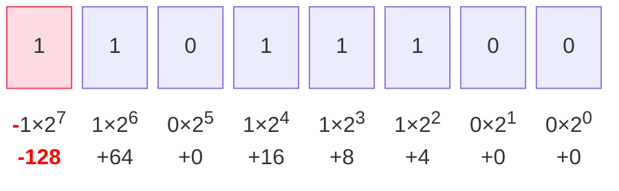

# 对补码的本质理解

前段时间在玩 [Turing Complete](https://store.steampowered.com/app/1444480/Turing_Complete/) 的时候看到的，觉得醍醐灌顶。

下面为了简洁，我们考虑 1 字节 8 位整数（即 C/C++ 中的 `char` 型，其他长度的整型同理）。

## 传统说法

传统的教学对补码停留在操作层面：最高位作为符号位，负数取反加一。

首先是原码，最高位是符号位，符号位为 `0` 就是正数，符号位为 `1` 的是负数：

```log
正数原码 +36 = 0 010 0100 = 0x24
负数原码 -36 = 1 010 0100 = 0xA4
　　　　       ╰── 符号位，正数为 0 负数为 1
```

正数的补码与原码相同，负数的补码需要额外处理，方式是**除了符号位外取反再加一**，即 `(0xA4 ^ 0x7F) + 0x01 = 0xDC = 220`：

```log
    1010 0100
XOR 0111 1111
─────────────
    1101 1011
  + 0000 0001
─────────────
    1101 1100
```

这里的 `1101 1100`（`0xDC`）就是数字 -36 的补码。

## 最高位的负权重

实质上，补码最本质的意义在于将最高位赋予负权重：



我们来算一下：$-128+64+16+8+4=-36$，在这个规定下，补码可以直接表达对应的负数！

除此之外，这种解释方法还可以完美地应用于正数——因为正数的符号位为 `0`，自然没有这 $-2^{8i}$。正数和负数的补码统一在了一起。

## 模运算

我们知道补码系统「正负相消」来自于高位的溢出，在数学意义上对于 $i$ 字节的整型就是模 $2^{8i}$ 的算术。对于单字节就是：

$$
x_{补} = \begin{cases}
x & 0 \leq x < 128 \\
256 - |x| & -128 \leq x < 0
\end{cases}
$$

在这里 -36 的补码为 220，假设加上 37，就有

$$
220+37=257 \equiv 1 \mod 256
$$

画在数轴上，单字节整型的表示其实是：

```log
0 +1 +2   ···   +127
└──┴──┴───────────┴──┬───────────┬──┐··╷
                   -128   ···   -2 -1  0
```

由于溢出的存在，这段数轴被无限重复：

```log
           0 +1 +2   ···   +127                      0 +1 +2
──┬──┬──┐··┗━━┻━━┻━━━━━━━━━━━┻━━┳━━━━━━━━━━━┳━━┳━━┓··└──┴──┴─
 -3 -2 -1                     -128   ···   -3 -2 -1
```

那为什么最高位负权重就能实现这一点呢？

对于任意的负整数 $-n$，存储在 $i$ 字节的空间里（$0\le n\le2^{8i-1}$）：

补码最高位表示 $-2^{8i-1}$，设补码中除了最高位之外还要有的正数部分等于 $x$，那么就有 $-2^{8i-1}+x=-n$，即 $x=2^{8i-1}-n$。而此时补码在数值上等于 $2^{8i-1}+x=2^{8i}-n$。这和前面的补码公式是吻合的。

## 计算法则的由来

现在我们尝试从这个角度理解一下负数的补码运算法则，即计算 $2^{8i}-n$：

```log
  1000 0000
- 0ABC DEFG
───────────
          x
```

减法从低位开始。首先要找到 $n$ 的最低非零位，假设这里是位 `E`。那这里开始要往前借 2，不够借，继续向前直到借到开头的 `1`，`E` 就等于 `10-1=1`：

```log
  . . . .  .
  1 0 0 0  0 0 0 0
- 0 A B C  D E F G
──────────────────
             1 0 0 = x
```

那么接下来的 `A~D` 都变成了 1 减去该位，即取反：

```log
  .  .  .  .    .
  1  0  0  0    0  0  0  0
- 0  A  B  C    D  E  F  G
──────────────────────────
  0 !A !B !C   !D  1  0  0 = x
```

那到这里如何简化这个结果？**只要将这个结果减 1，就相当于原值除符号位之外按位取反了：**

```log
  .  .  .  .    .
  1  0  0  0    0  0  0  0
- 0  A  B  C    D  E  F  G
──────────────────────────
  0 !A !B !C   !D  1  0  0 = x
-                        1
──────────────────────────
  0 !A !B !C   !D  0  1  1 = x+1
= 0 !A !B !C   !D !E !F !G = n^0x7f = x+1
```

换句话说，$x$ 等于 $n$ 除了符号位之外按位取反再加 1。再补上符号位的 `1`，就是补码的计算方式了。
