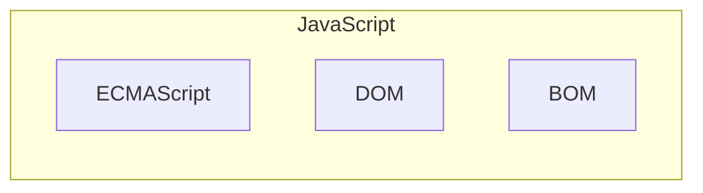
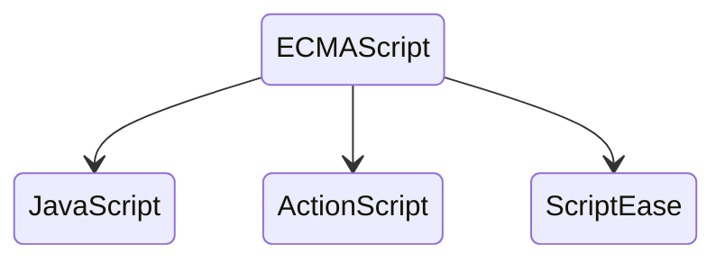

# 1.4\* JavaScript 实现

## ECMAScript、DOM 和 BOM

[1.2 JavaScript 的历史](./1.2%20历史) 中我们提到了 ECMAScript 标准。尽管 ECMAScript 是一个重要的标准，但它并不是 JavaScript 唯一的部分，当然，也不是唯一被标准化的部分。通常，一个完整的 JavaScript 实现是由以下 3 个不同部分组成的：

- 核心 ECMAScript，描述语言的语法和基本对象；
- 文档对象模型 DOM，描述处理网页内容的方法和接口；
- 浏览器对象模型 BOM，描述与浏览器进行交互的方法和接口。



### ECMAScript

ECMAScript 并不与任何具体浏览器相绑定，实际上，它也没有提到用于任何用户输入输出的方法（这点与 C 这类语言不同，它需要依赖外部的库来完成这类任务）。那么什么才是 ECMAScript 呢？ECMA-262 标准（第 2 段）的描述如下：

> ECMAScript 可以为不同种类的宿主环境提供核心的脚本编程能力，因此核心的脚本语言是与任何特定的宿主环境分开进行规定的。

Web 浏览器对于 ECMAScript 来说是一个宿主环境，但它并不是唯一的宿主环境。事实上，还有不计其数的其他各种环境（例如 Nombas 的 ScriptEase，以及 Macromedia 同时用在 Flash 和 Director MX 中的 ActionScript，以及当下如日中天的 Node）可以容纳 ECMAScript 实现。那么 ECMAScript 在浏览器之外规定了些什么呢？

简单地说，ECMAScript 描述了以下内容：

- 语法
- 类型
- 语句
- 关键字
- 保留字
- 运算符
- 对象

ECMAScript 仅仅是一个描述，定义了脚本语言的所有属性、方法和对象。其他语言可以实现 ECMAScript 来作为功能的基准，JavaScript 就是这样：



每个浏览器都有它自己的 ECMAScript 接口的实现，然后这个实现又被扩展，包含了 DOM 和 BOM（在以下几节中再探讨）。当然还有其他实现并扩展了 ECMAScript 的语言，例如 Windows 脚本宿主（Windows Scripting Host, WSH）、Macromedia 在 Flash 和 Director MX 中的 ActionScript，以及 Nombas ScriptEase。

#### 何谓 ECMAScript 符合性

在 ECMA-262 中，ECMAScript 符合性（conformance）有明确的定义。一个脚本语言必须满足以下四项基本原则：

- 符合的实现必须按照 ECMA-262 中所描述的支持所有的「类型、值、对象、属性、函数和程序语言及语义」（ECMA-262，第一页）
- 符合的实现必须支持 Unicode 字符标准（UCS）
- 符合的实现可以增加没有在 ECMA-262 中指定的「额外类型、值、对象、属性和函数」。ECMA-262 将这些增加描述为规范中未给定的新对象或对象的新属性
- 符合的实现可以支持没有在 ECMA-262 中定义的「程序和正则表达式语法」（意思是可以替换或者扩展内建的正则表达式支持）
  所有 ECMAScript 实现必须符合以上标准。

如今，所有主流的 Web 浏览器都遵守 ECMA-262 第三版。

### DOM

DOM（文档对象模型）是 HTML 和 XML 的应用程序接口（API）。DOM 将把整个页面规划成由节点层级构成的文档。HTML 或 XML 页面的每个部分都是一个节点的衍生物。考虑下面的 HTML 页面：

```html
<html>
  <head>
    <title>Sample Page</title>
  </head>
  <body>
    <p>hello world!</p>
  </body>
</html>
```

这段代码可以用 DOM 绘制成一个节点层次图：

```
html
├──head
│  └──title
│     └──Sample Page
└──body
   └──p
      └──Hello World!
```

DOM 通过创建树来表示文档，从而使开发者对文档的内容和结构具有空前的控制力。用 DOM API 可以轻松地删除、添加和替换节点。

#### 为什么 DOM 必不可少

自从 IE 4.0 和 Netscape Navigator 4.0 开始支持不同形态的动态 HTML（DHTML），开发者首次能够在不重载网页的情况下修改它的外观和内容。这是 Web 技术的一大飞跃，不过也带来了巨大的问题。Netscape 和微软各自开发自己的 DHTML，从而结束了 Web 开发者只编写一个 HTML 页面就可以在所有浏览器中访问的时期。

业界决定必须要做点什么以保持 Web 的跨平台特性，他们担心如果放任 Netscape 和微软公司这样做，Web 必将分化为两个独立的部分，每一部分只适用于特定的浏览器。因此，负责指定 Web 通信标准的团体 W3C（World Wide Web Consortium）就开始制定 DOM。

#### 其他 DOM

除了 DOM Core 和 DOM HTML 外，还有其他几种语言发布了自己的 DOM 标准。这些语言都是基于 XML 的，每种 DOM 都给对应语言添加了特有的方法和接口：

- 可缩放矢量语言（SVG）1.0
- 数字标记语言（MathML）1.0
- 同步多媒体集成语言（SMIL）

此外，其他语言也开发了自己的 DOM 实现，如 Mozilla 的 XML 用户界面语言（XUL）。不过，只有上面列出的几种语言是 W3C 的推荐标准。

#### Web 浏览器中的 DOM 支持

DOM 在被 Web 浏览器开始实现之前就已经是一种标准了。IE 首次尝试 DOM 是在 5.0 版本中，不过其实直到 5.5 版本之后才具有真正的 DOM 支持，IE 5.5 实现了 DOM Level 1。从那时起，IE 就没有引入新的 DOM 功能。

Netscape 直到 Netscape 6（Mozilla 0.6.0）才引入 DOM 支持。目前，Mozilla 具有最好的 DOM 支持，实现了完整的 Level 1、几乎所有 Level 2 以及一部分 Level 3。（Mozilla 开发小组的目标是构造一个与标准 100% 兼容的浏览器，他们的工作得到了回报。）

Opera 直到 7.0 版本才加入 DOM 支持，还有 Safari 也实现了大部分 DOM Level 1。它们几乎都与 IE 5.5 处于同一水平，有些情况下，甚至超过了 IE 5.5。不过，就对 DOM 的支持而论，所有浏览器都远远落后于 Mozilla。

如今所有的主流浏览器都对最近的 DOM 有良好的支持。

### BOM

IE 3.0 和 Netscape Navigator 3.0 提供了一种特性 - BOM（浏览器对象模型），可以对浏览器窗口进行访问和操作。使用 BOM，开发者可以移动窗口、改变状态栏中的文本以及执行其他与页面内容不直接相关的动作。使 BOM 独树一帜且又常常令人怀疑的地方在于，它只是 JavaScript 的一个部分，没有任何相关的标准。

BOM 主要处理浏览器窗口和框架，不过通常浏览器特定的 JavaScript 扩展都被看做 BOM 的一部分。这些扩展包括：

- 弹出新的浏览器窗口
- 移动、关闭浏览器窗口以及调整窗口大小
- 提供 Web 浏览器详细信息的定位对象
- 提供用户屏幕分辨率详细信息的屏幕对象
- 对 cookie 的支持
- IE 扩展了 BOM，加入了 ActiveXObject 类，可以通过 JavaScript 实例化 ActiveX 对象

由于没有相关的 BOM 标准，每种浏览器都有自己的 BOM 实现。有一些事实上的标准，如具有一个窗口对象和一个导航对象，不过每种浏览器可以为这些对象或其他对象定义自己的属性和方法。

## 基于原型

JavaScript 的面向对象不同于传统的面向对象语言，它是基于一种叫做「原型链」的机制实现的。

> 在传统的面向对象编程模型中，「类」是描述数据结构的蓝图，用于创建具有相同属性和方法的「实例」。每个实例都是类的独立副本，拥有自己的内存空间来存储属性。
>
> 我们可以把「类」比作做蛋糕的菜谱，「实例」便是做出来的蛋糕。菜谱不能闻也不能吃，也没有气味、蛋白质含量等性质，但是可以指导我们做一个蛋糕。
>
> 对应过来，类能用来存储具体的属性和方法，但是可以用来定义一个实例。实例就具有方法，可以用来存储具体的值。
>
> ```c++
> using namespace std;
>
> // 定义类 Dog，其具有属性 name，方法 bark 和 getInfo
> class Dog {
> private:
>     string name;
>     int age;
> public:
>     Dog(string n, int a) : name(n), age(a) {}
>     void bark() {
>         cout << name << " says: Woof!" << endl;
>     }
>     void getInfo() {
>         cout << "Name: " << name << ", Age: " << age << endl;
>     }
> };
>
> // 建立两个 Dog 的实例
> Dog dog1("Buddy", 3);
> Dog dog2("Max", 5);
>
> // 调用实例的方法
> dog1.bark();
> dog2.getInfo();
> ```
>
> 在此基础上，类可以继承。相当于，在蛋糕的食谱上修改可以得到奶油蛋糕的食谱。这里不再展开。

JavaScript 没有类和实例的概念。有的只是**对象及其继承**。

**JavaScript 中一切引用类型都是对象，对象就是属性的集合。**

也就是说，**数组是对象、函数是对象、对象还是对象。**

在 JavaScript 中，每个对象都有一个内部链接指向另一个对象，称为它的**原型**。那它的原型既然也是一个对象，那它的原型也会有一个原型。这一链条不断上溯，直到到达最顶层的原型（通常是 `Object.prototype`）。这一链条就被称为**原型链**。

当我们尝试访问一个对象的属性时，如果该对象本身没有这个属性，JavaScript 会沿着原型链向上查找，直到找到该属性或到达原型链的末端。

```js
// 创建一个构造函数
function Dog(name, age) {
  // 函数内 this 指向构造的对象
  this.name = name;
  this.age = age;
}

// 在 Dog 的原型上添加属性和方法
Dog.prototype.isAnimal = true;
Dog.prototype.bark = function () {
  console.log(this.name + " says: Woof!");
};
Dog.prototype.getInfo = function () {
  console.log("Name: " + this.name + ", Age: " + this.age);
};

// 创建 Dog 的实例
let dog1 = new Dog("Buddy", 3);
let dog2 = new Dog("Max", 5);

dog1.bark(); // Buddy says: Woof!
dog2.getInfo(); // Name: Max, Age: 5
dog1.isAnimal; // true

console.log(dog1.hasOwnProperty("name")); // true
console.log(dog1.hasOwnProperty("bark")); // false

// 添加一个新方法到原型
Dog.prototype.play = function () {
  console.log(this.name + " is playing!");
};

dog1.play(); // Buddy is playing!
dog2.play(); // Max is playing!
```

构造函数用来创建对象，同一构造函数创建的对象，其原型相同。例如上面的例子中，构造函数 `Dog` 定义的对象，其原型都是 `Dog.prototype`。方法 `bark()` 和 `getInfo()` 被添加到 `Dog.prototype` 上，而不是直接添加到每个实例中。这意味着所有 `Dog` 定义的对象（`dog1` 和 `dog2`）共享这些方法，而不是每个实例都拥有自己的副本。

系统提供的 `hasOwnProperty` 方法用来查询某个属性是「自己的」还是「继承的」。可以看到，`dog1` 和 `dog2` 都具有自己的 `name` 属性，但是 `bark`、`isAnimal` 是 `Dog.prototype` 的。很明显，`hasOwnProperty` 方法肯定也是继承来的。

`Object.getPrototypeOf` 方法用来获取对象的原型。

```js
Object.getPrototypeOf(dog1) === Dog.prototype; // true
```

继续在这条原型链上搜索：

```js
Object.getPrototypeOf(Dog.prototype); // [Object: null prototype] {}
Object.getPrototypeOf(Dog.prototype) === Object.prototype; // true
```

`Object.prototype` 便是原型链的顶端。

```js
Object.prototype.hasOwnProperty("hasOwnProperty"); // true
```

可以看到，`hasOwnProperty` 这一方法定义在 `Object.prototype` 上，因此所有对象上都能调用到这个方法。

原型链机制使 JavaScript 能够实现更灵活的对象创建和继承模式。不需要预先定义类，对象就可以动态地共享和继承属性。这是 JavaScript 独特而强大的特性之一，使得它在处理动态数据结构和实现面向对象编程范式时具有很大的灵活性。

有关原型更详细的内容，后面的章节会介绍。

## 头等函数

说实话，这是一个很糟糕的翻译，原文是 `first-class function`。意思是说，在一门程序设计语言中，函数被当做头等公民。函数整体就是一个值，可以作为别的函数的参数、函数的返回值，赋值给变量或存储在数据结构中。

常见的函数定义方式是这样的：

```js
function foo(arg) {
  console.log(arg);
}

foo("some text"); // some text
```

上面的函数定义其实相当于使用 `var` 声明：

```js
var foo = function (arg) {
  console.log(arg);
};

foo("some text"); // some text
```

也就是说，定义一个函数，其本质是定义一个变量，并将一个函数（整体作为一个值）赋给这个变量。这里的 `function(arg){ ... }` 称为**函数表达式**或者**匿名函数**，这个函数本身其实没有名称，`foo` 这个名称和这个函数本身并不挂钩：

```js
let baz = foo;
baz("some text"); // some text
```

ES6 还引入了一种更方便的定义函数的方式：箭头函数。

```js
let arrowFunc = (arg) => {
  console.log(arg);
};

arrowFunc("some text"); // some text
```

有关函数的更多内容，我们会在 [2.6 函数 Function](../2%20数据/2.6%20函数) 一节中介绍。
