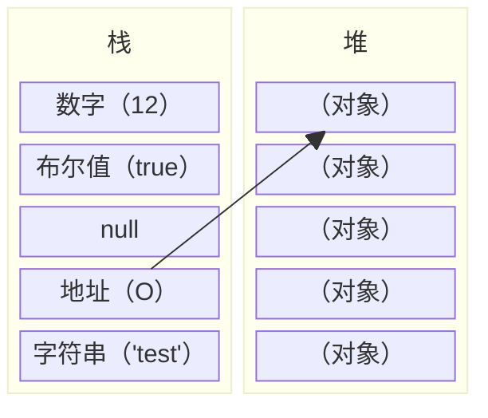

# 2.1 数据类型

## 原始类型和引用类型

JavaScript 语言的每一个值，都属于某一种数据类型。JavaScript 的数据类型，共有八种。

- 数值（number）：整数和小数（比如 `1` 和 `3.14`）。
- 字符串（string）：文本（比如 `Hello World`）。
- 布尔值（boolean）：表示真伪的两个特殊值，即 `true`（真）和 `false`（假）。
- 符号（symbol）：ES6 新增，表示独一无二的值，用于属性名称。
- 大整数（bigInt）：ES6 新增，高精度整数。
- `undefined`：表示「未定义」或不存在，即由于目前没有定义，所以此处暂时没有任何值。
- `null`：表示空值，即此处的值为空。
- 对象（object）：各种值组成的集合。

通常，数值、字符串、布尔值、符号、大整数合称为原始类型（primitive type）的值（即原始值），即它们是最基本的数据类型，不能再细分了。原始值直接存储在栈（stack）中，这样存储便于迅速查寻变量的值。

对象被称为合成类型（complex type）的值（即引用值），因为一个对象往往是多个原始类型的值的合成，可以看作是一个存放各种值的容器。

由于引用值的大小会改变，所以不能把它放在栈中，否则会降低变量查寻的速度。因此，引用值是存储在堆（heap）中的对象，存储在变量处的值是一个指针（point），指向存储对象的内存处。地址的大小是固定的，所以把它存储在栈中对变量性能无任何负面影响。



对象是最复杂的数据类型，又可以分成三个子类型：

- 狭义的对象（object）
- 数组（array）
- 函数（function）

狭义的对象和数组是两种不同的数据组合方式，除非特别声明，本教程的「对象」都特指狭义的对象。函数其实是处理数据的方法，JavaScript 把它当成一种数据类型，可以赋值给变量，这为编程带来了很大的灵活性，也为 JavaScript 的「函数式编程」奠定了基础。

至于 `undefined` 和 `null`，我们讲其看成两个特殊值。

> [!note]
>
> 在许多语言中，字符串都被看作引用类型，而非原始类型，因为字符串的长度是可变的。JavaScript 打破了这一传统。

## 类型的判断

JavaScript 有三种方法，可以确定一个值到底是什么类型。

- `typeof` 运算符
- `instanceof` 运算符
- `Object.prototype.toString` 方法

`instanceof` 运算符和 `Object.prototype.toString` 方法，将在后文介绍。这里介绍 `typeof` 运算符。

`typeof` 运算符可以返回一个值的数据类型。

数值、字符串、布尔值分别返回 `"number"`、`"string"`、`"boolean"`。

```js
typeof 123; // "number"
typeof "123"; // "string"
typeof false; // "boolean"
```

函数返回 `"function"`。

```js
function f() {}
typeof f;
// "function"
```

`undefined` 返回 `"undefined"`。

```js
typeof undefined;
// "undefined"
```

利用这一点，`typeof` 可以用来检查一个没有声明的变量，而不报错。

```js
v;
// ReferenceError: v is not defined

typeof v;
// "undefined"
```

上面代码中，变量 `v` 没有用 `var` 命令声明，直接使用就会报错。但是，放在 `typeof` 后面，就不报错了，而是返回 `undefined`。

实际编程中，这个特点通常用在判断语句。尤其常用于判断浏览器的一些私有方法（部分浏览器实现了但部分浏览器没有实现）。

```js
// 错误:
if (v === undefined) {
  // ...
}
// ReferenceError: v is not defined

// 正确:
if (typeof v === "undefined") {
  // ...
}
```

> [!caution]
>
> ES6 引入 `let` 和 `const` 后，`typeof` 运算符也不再是 100% 安全的了：
>
> ```js
> console.log(typeof n); // "undefined"
> console.log(typeof m); // Uncaught ReferenceError: m is not defined
> let m = 1;
> ```
>
> 这是一个奇特的地方。如果某一个块级作用域中，使用 `let` 命令声明了某一变量，则该作用域中，如果在声明语句之前对此变量使用 `typeof` 算符也会报错。
>
> 如果没有用 `let` 声明此变量，反而不会报错。`const` 同理。
>
> 也就是说，`let` 和 `const` 命令其实也有某种「提升」机制，在执行到这一行之前，引擎已经知道会有这样一个变量了，并禁止提前访问它。
>
> 所以如非必要，不要乱用未定义量。以及，尽量将 `let` 和 `const` 声明的变量限制在其所需的最小范围之内（这本来就是最佳实践）。
>
> ```js
> // 错误:
> let i;
> for (i = 1; i < 10; i++) {
>   // do something...
> }
>
> // 正确:
> for (let i = 1; i < 10; i++) {
>   // do something...
> }
> ```

对象返回 `object`。

```js
typeof window; // "object"
typeof {}; // "object"
typeof []; // "object"
```

上面代码中，空数组（`[]`）的类型也是 `object`，这表示在 JavaScript 内部，数组本质上只是一种特殊的对象。这里顺便提一下，区分数组和对象的最佳方式是 ES6 引入的 `Array.isArray` 方法：

```js
let o = {};
let a = [];

Array.isArray(o); // false
Array.isArray(a); // true
```

`null` 返回 `object`。

```js
typeof null; // "object"
```

> `typeof null == "object"` 这个问题的产生可以追溯到 JavaScript 的第一个版本，在这个版本中只设计了五种数据类型（对象、整数、浮点数、字符串和布尔值），没考虑 `null`。单个值在栈中占用 32 位的存储单元，而这 32 位的存储单元又可以划分为类型标签（1-3 位）和实际数据，类型标签存储于低位中，具体可以分成 5 种：
>
> 1. `000`，typeof 判断类型为 **object**；
> 2. `1**`，typeof 判断类型为 **number（整数）**；
> 3. `010`，typeof 判断类型为 **number（浮点）**；
> 4. `001`，typeof 判断类型为 **string**；
> 5. `011`，typeof 判断类型为 **boolean**；
>
> 可是 `null` 的 4 个字节全部是 0，恰好符合 object，于是就输出 object 了。后来有提案说要改成 `typeof null == "null"`，但为了兼容以前的代码，只得作罢。

## 强制类型转换

### 显式强制类型转换

显式强制类型转换通过系统提供的三个函数实现：`Number()`、`String()`、`Boolean()`，很好理解。

```js
Number("123"); // 123
String(3.14); // '3.14'
Boolean(null); // false
```

### 隐式强制类型转换

有一个经典的 JS 笑话：

```js
0 == "0"; // true
0 == []; // true
[] == "0"; // false
```

这便是隐式强制类型转换的锅。`0 == '0'` 中 `0` 被转换为 `'0'`，等式成立。`0 == []` 中二者都被转换为 `false`，等式成立。`[] == '0'` 中 `[]` 被转换为 `''`，等式不成立。

JavaScript 宽松的类型系统使得如果不加以注意，程序中就会充斥着隐式强制类型转换，导致很多奇怪的问题。`==` 的隐式类型转换规则非常复杂，这里不再赘述，有需要请自行搜索。

所以，最佳实践是永远使用**严格相等运算符** `===`（有的人也将其称为全等号）。`===` 不执行隐式类型转换而是直接判断。

```js
0 === "0"; // false
0 === []; // false
[] === "0"; // false
```
