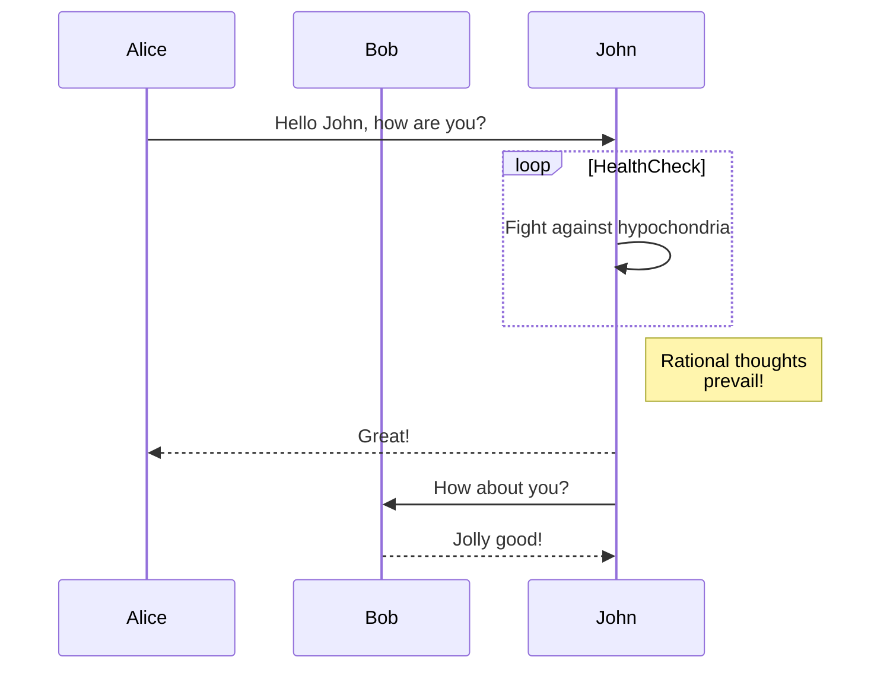

# 基本扩展

基本扩展指的是在相当多平台受认可的 Markdown 扩展语法。

## GFM 风格提示框

支持使用 GFM 提示框标记特别的段落。

```markdown
> [!tip]
>
> 应引起关注的文本。

> [!note]
>
> 应引起关注的文本。

> [!important]
>
> 应引起关注的文本。

> [!warning]
>
> 应引起关注的文本。

> [!caution]
>
> 应引起关注的文本。
```

::: details 渲染结果

> [!tip]
>
> 应引起关注的文本。

> [!note]
>
> 应引起关注的文本。

> [!important]
>
> 应引起关注的文本。

> [!warning]
>
> 应引起关注的文本。

> [!caution]
>
> 应引起关注的文本。

:::

## 公式

使用 $\LaTeX$ 书写公式。

- 使用 `$` 标记行内公式，使用 `$$` 标记行间公式。
- `$` 的前后不能都是空格，否则会导致渲染失败。
- LaTeX 标准不统一，因此不作过多要求，但应保持基本的兼容性，如在 VSCode 中应能正常渲染。

```markdown
When $a \ne 0$, there are two solutions to $(ax^2 + bx + c = 0)$ and they are

$$
x = {-b \pm \sqrt{b^2-4ac} \over 2a}
$$
```

::: details 渲染结果

When $a \ne 0$, there are two solutions to $(ax^2 + bx + c = 0)$ and they are

$$
x = {-b \pm \sqrt{b^2-4ac} \over 2a}
$$

:::

## 脚注

支持使用 `[^1]` 标记脚注。

```markdown
需要标记的文字[^1]。

...

[^1]: 脚注内容。
```

::: details 渲染结果

需要标记的文字[^1]。

...

[^1]: 脚注内容。

:::

## Mermaid 示意图

使用 `mermaid` 代码框标记 Mermaid 示意图。当前使用 Mermaid v11.3。

````markdown

````

::: details 渲染结果


:::