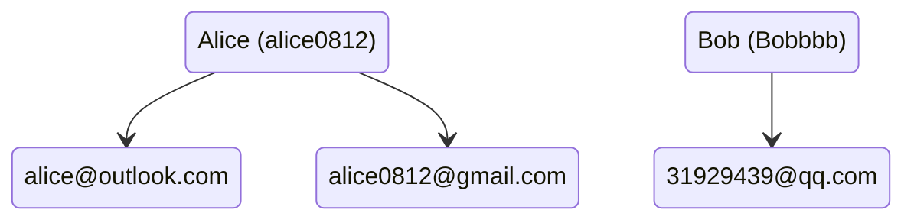
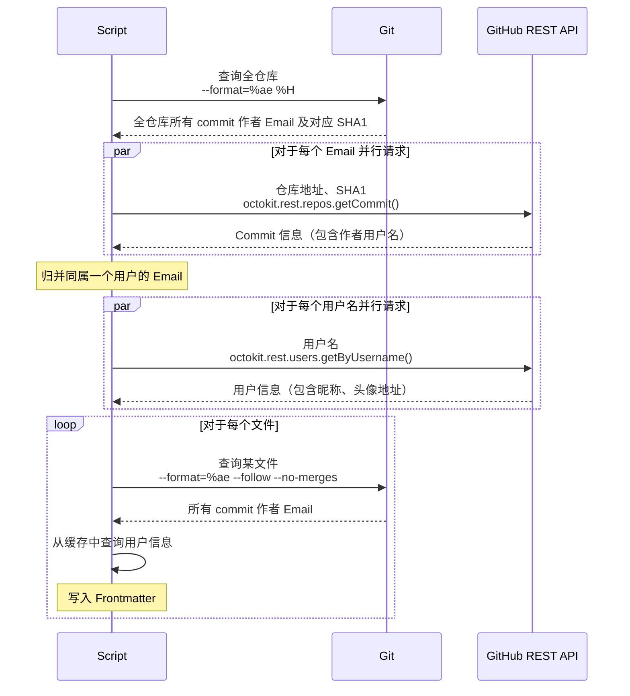

# VitePress 在文章底部显示贡献者列表

## 目标效果

在每篇文章的结尾处显示该文章对应的 `.md` 文件的历史贡献者名单。名单上显示每个贡献者的昵称、用户名和头像，并提供按钮跳转到其 GitHub 主页。

大致实现思路是在构建阶段，将仓库所有贡献者的头像下载，再通过 Vite 插件在每个 `.md` 文件的 Frontmatter 中插入该文件贡献者的信息，在页面上的 Vue 组件通过读取 Frontmatter 展示贡献者信息。

## 构建阶段：获取贡献者信息并写入

### 基本逻辑

首先要意识到一个问题：Git 和 GitHub 中「提交者」或者说「用户」的概念是有一定区别的。Git log 中记录一个贡献者，记录的是其名称和 Email，Email 是唯一标识符（主键）；而 GitHub 用户是一个在线账户，有用户名、昵称、邮箱这些信息，用户名是其主键。Git log 中的作者和 GitHub 用户并非一一对应：一个 GitHub 用户可能在提交时使用不同的邮件。所以这是一对多的关系：



此外，由于用户的隐私设置，通过 Email 地址也不一定能通过 API 查询到其对应的 GitHub 账户。那如何将 Git 中的邮件信息和 GitHub 用户关联起来？

可以通过对 commit 的查询实现。GitHub 提供了根据 SHA1 查询 commit 的 API[^1]，其返回的数据中包含了 `author` 字段，且其中的 `login` 属性是该 commit 作者在 GitHub 的用户名。有了用户名，就可以通过 API[^2] 查询其昵称和头像 URL 了。

查询到所有的作者信息之后缓存下来，可以得到这样的数据：

```ts
type FullContributorData = {
  username: string;
  nickname: string;
  avatar: string;
  emails: string[];
};
```

接下来在 Vite 插件中对所有 `.md` 文件进行处理，通过 Git 查询该文件所有作者的 Email，从缓存中查找对应的用户信息，并添加到 Frontmatter 中即可。

所以大概的流程是：



### 代码实现

和 Git 交互这里使用 `simple-git` 实现。首先查询全仓库所有 commit 作者 Email 及对应 SHA1，然后进行一些简单的字符串处理即可。

```ts
type EmailWithSha1 = { email: string; sha1: string };

async function getRepoContributors(): Promise<EmailWithSha1[]> {
  const log = (await git.log(["--format=%ae %H"])).latest?.hash.split("\n");
  if (!log) throw new Error("Unexpected falsy log");
  const contributors = new Map<string, string>(); // email -> sha1
  log.reverse().forEach((commit) => {
    const [email, sha1] = commit.split(" ");
    if (!contributors.has(email)) contributors.set(email, sha1);
  });
  return Array.from(contributors).map(([email, sha1]) => ({ email, sha1 }));
}
```

然后是从 GitHub REST API 请求数据。使用官方提供的 `@octokit/rest` 包，其使用方式为：

```ts
import { Octokit } from "@octokit/rest";
const octokit = new Octokit({
  auth: process.env.GITHUB_TOKEN,
});
// octokit.rest.repos.getCommit( ... ).then( ... )
```

> [!note]
>
> 如果不提供 token，API 请求会被限制在 60 次 / 小时[^3]。Token 可在 GitHub 设置中生成[^4]。
>
> Token 是隐私信息，不要把 token 写死在代码里！可采用 `dotenv` 等模块将其分离出来保存在 `.env` 文件中并添加到 `.gitignore` 中。

如果在顶层产生 `Octokit` 实例，则只要引入模块就会产生网络请求，并不方便。因此下面与 GitHub REST API 相关的函数，`Octokit` 实例全部从参数传入。

查询给定 EmailWithSha1 的用户名的函数如下：

```ts
type EmailWithSha1 = { email: string; sha1: string };
type EmailWithUsername = { email: string; username: string };

async function queryUsername(
  { email, sha1 }: EmailWithSha1,
  octokit: Octokit
): Promise<EmailWithUsername> {
  const authorQuery = (
    await octokit.rest.repos.getCommit({ owner, repo, ref: sha1 })
  ).data?.author;
  if (!authorQuery) throw new Error("Author not found");
  return { email, username: authorQuery.login };
}
```

归并同属一个用户的 Email 并查询完整用户信息的函数如下：

```ts
function queryFullDataList(
  emailTuples: EmailWithUsername[],
  octokit: Octokit
): Promise<FullContributorData[]> {
  const user2emails = new Map<string, string[]>(); // username -> emails
  emailTuples.forEach(({ email, username }) => {
    if (user2emails.has(username)) user2emails.get(username)!.push(email);
    else user2emails.set(username, [email]);
  });
  return Promise.all(
    Array.from(user2emails).map(([username, emails]) =>
      octokit.rest.users.getByUsername({ username }).then(({ data }) => ({
        username,
        nickname: data.name ?? username,
        avatar: data.avatar_url,
        emails,
      }))
    )
  );
}
```

至此，已经获取到了所有贡献者的完整信息。接下来就是通过 Vite 插件，在读入 `.md` 文件时，查询其所有作者的 Email，从缓存中查找对应的用户信息，并添加到 Frontmatter 中。

获取给定文件的所有贡献者的 Email 的函数如下：

```ts
async function getEmailList(filePath: string): Promise<string[]> {
  const log = (
    await git.log(["--format=%ae", "--follow", "--no-merges", filePath])
  ).latest?.hash
    .split("\n")
    .reverse();
  if (!log) throw new Error("Unexpected log");
  return Array.from(new Set(log));
}
```

Vite 插件是对象的形式。官方提供了详细的文档[^5]。其类型信息可以这样引入：

```ts
import type { Plugin } from "vite";
```

那么插件的主体部分大概像这样：

```ts
// queryFullDataList 的结果保存在 fullUsrData 中
({
  name: "add-contributors",
  enforce: "pre",
  async transform(code, path) {
    if (!path.endsWith(".md") || code.trim().match(/^---\r?\n/) !== null)
      return; // 若 Frontmatter 存在则跳过
    const nameTuples = (await getEmailList(path))
      .map((e) => fullUsrData.find(({ emails }) => emails.includes(e))!)
      .map(({ nickname, username }) => `${nickname},${username}`);
    const finalList = Array.from(new Set(nameTuples)).join(";");
    return `---\ncontributorList: ${finalList}\n---\n\n` + code;
  },
}) as Plugin;
```

完整代码实现详见 [addContributors.ts](https://github.com/Linho1219/LinhoNotes/blob/main/.vitepress/contributors/addContributors.ts)。

此外还需要在 `config.mts` 中引入插件（也可以使用传统的 Vite 项目配置方式，在项目根目录下建立 `vite.config.mts` 来配置）。

```ts [.vitepress/config.mts]
export default {
  vite: {
    plugins: [addContributor],
  },
  // ...
} as UserConfig<DefaultTheme.Config>;
```

## 客户端：读取 Frontmatter 并展示

扩展默认主题，并通过 VitePress 内置主题提供的 `doc-footer-before` 布局插槽[^6]，把贡献者列表 Vue 组件塞进去。此外，VitePress 提供了读取 Frontmatter 的 API `useData().frontmatter`[^7]，配合 `v-for` 即可渲染贡献者列表。

此处提供部分组件代码供参考：

```vue
<template>
  <div id="contributors">
    <div v-for="person in contributorList" class="contributor">
      
      <span class="nickname">{{ person.nickname }}</span>
      <span class="username">{{ person.username }}</span>
      <a
        class="github-link vpi-social-github"
        :href="`https://github.com/${person.username}/`"
        target="_blank"
      ></a>
    </div>
  </div>
</template>

<script lang="ts" setup>
import { watchEffect, ref } from "vue";
import { useData } from "vitepress";

type Contributor = {
  username: string;
  nickname: string;
  avatar: string;
};

const { frontmatter } = useData();
const contributorList = ref<Contributor[]>([]);
const link = ref("");

watchEffect(() => {
  contributorList.value = frontmatter.value.contributorList
    .split(";")
    .map((raw) => raw.split(","))
    .map(([nickname, username]) => ({
      nickname,
      username,
      avatar: `/avatars/${username}.png`,
    }));
});
</script>
```

完整代码实现详见 [contributors.vue](https://github.com/Linho1219/LinhoNotes/blob/main/.vitepress/contributors/contributors.vue)。

## 相关文档链接

[^1]: [GitHub Docs: REST API endpoints for commits - Get a commit](https://docs.github.com/en/rest/commits/commits#get-a-commit)

[^2]: [GitHub Docs: REST API endpoints for users - Get a user](https://docs.github.com/en/rest/users/users#get-a-user)

[^3]: [GitHub Docs: Rate limits for the REST API](https://docs.github.com/en/rest/using-the-rest-api/rate-limits-for-the-rest-api)

[^4]: [GitHub Docs: Managing your personal access tokens](https://docs.github.com/en/authentication/keeping-your-account-and-data-secure/managing-your-personal-access-tokens)

[^5]: [Vite 中文文档：插件 API](https://cn.vite.dev/guide/api-plugin)

[^6]: [VitePress 文档：默认主题布局插槽](https://vitepress.dev/zh/guide/extending-default-theme#layout-slots)

[^7]: [VitePress 文档：useData API](https://vitepress.dev/zh/reference/runtime-api#usedata)
