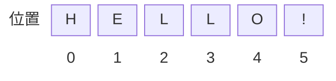

# 2.4 字符串 String

## 字符串字面量

字符串字面量是由双引号（`"`）或单引号（`'`）声明的。而 Java 和 C/C++ 则是用双引号声明字符串，用单引号声明字符。但是由于 JavaScript 没有字符类型，所以可使用这两种表示法中的任何一种。例如，下面的两行代码都有效：

```js
'abc'
"abc"
```

单引号字符串的内部，可以使用双引号。双引号字符串的内部，可以使用单引号。下面两个都是合法的字符串。

```js
'key = "value"'
"It's a long journey"
```

如果字符串内需要同时出现单引号和双引号，可以使用转义字符。

下面列出了 JacaScript 的一些转义字符：

| 字面量      | 含义                                                         |
| ----------- | ------------------------------------------------------------ |
| `\0`       | null                                 |
| `\n`       | 换行（LF）                                             |
| `\t`       | 制表符                                                 |
| `\b`       | 空格                                                   |
| `\r`       | 回车（CR）                                             |
| `\f`       | 换页符                                                 |
| `\\`        | 反斜杠                                                       |
| `\'`        | 单引号                                                       |
| `\"`        | 双引号                                                       |
| `\NNN` | 八进制代码 `NNN` 表示的字符（n 是 0 到 7 中的一个八进制数字），如 `\251` 表示「©️」 |
| `\xNN`      | 十六进制代码 `NN` 表示的字符（n 是 0 到 F 中的一个十六进制数字），如 `\xA9` 表示「©️」 |
| `\uNNNN`    | 十六进制代码 `NNNN` 表示的 Unicode 字符（n 是 0 到 F 中的一个十六进制数字）如 `\u00A9` 表示「©️」 |

例如：

```js
console.log('Did she say \'Hello\'?')
// Did she say 'Hello'?

console.log("Did she say \"Hello\"?")
// Did she say "Hello"?

'\172' === 'z'   // true
'\x7A' === 'z'   // true
'\u007A' === 'z' // true
```

如果在非特殊字符前面使用反斜杠，则反斜杠会被省略。

```js
'\a'
// 'a'
```

由于 HTML 语言的属性值使用双引号，所以有些项目约定 JavaScript 语言的字符串只使用单引号。当然，只使用双引号也完全可以。

> [!tip]
>
> 通常，代码格式化工具会帮你统一单双引号。

字符串默认只能写在一行内，分成多行将会报错。

```js
'a
b
c'
// SyntaxError: Unexpected token ILLEGAL
```

上面代码将一个字符串分成三行，JavaScript 就会报错。

> [!tip]
>
> 如果长字符串必须分成多行，可以在每一行的尾部使用反斜杠。
>
> ```js
> let longString = 'Long \
> long \
> long \
> string';
> 
> console.log(longString)
> // Long long long string
> ```
>
> 上面代码表示，加了反斜杠以后，原来写在一行的字符串，可以分成多行书写。但是，输出的时候还是单行，效果与写在同一行完全一样。注意，反斜杠的后面必须是换行符，而不能有其他字符（比如空格），否则会报错。
>
> 如果是想在字符串内出现换行符，应当使用转义字符 `\n`。
>
> ```js
> let longString = 'Long\nlong\nlong\nstring';
> 
> console.log(longString)
> /*
> Long
> long
> long
> string
> */
> ```
> 或者直接使用下面介绍的模版字符串。

ES6 新增了模板字符串字面量，使用反引号（<code>`</code>）标记。

```js
`template string`
// 'template string'
```

其强大之处在于，它既可以当作普通字符串使用，也可以用来定义多行字符串，或者在字符串中嵌入变量（使用 `${ }` 标记）

```js
`In "template string" this is
 legal.`
// 'In "template string" this is\n legal.'

console.log(`string text line 1
string text line 2`);
/*
string text line 1
string text line 2
*/

let name = "Bob", time = "today";
`Hello ${name}, how are you ${time}?`
// 'Hello Bob, how are you today?'
```

大括号内部可以放入任意的 JavaScript 表达式，可以进行运算、引用对象属性、调用函数。

```js
function fn() {
  return "Hello World";
}

`foo ${fn()} bar`
// foo Hello World bar

let x = 1;
let y = 2;

`${x} + ${y} = ${x + y}`
// "1 + 2 = 3"

`${x} + ${y * 2} = ${x + y * 2}`
// "1 + 4 = 5"

let obj = {x: 1, y: 2};
`${obj.x + obj.y}`
// "3"
```

## 字符串与数组

字符串的独特之处在于，它是唯一没有固定大小的原始类型。可以用字符串存储 0 或更多的 Unicode 字符，有 16 位整数表示（Unicode 是一种国际字符集，本教程后面将讨论它）。

字符串中每个字符都有特定的位置，首字符从位置 0 开始，第二个字符在位置 1，依此类推。这意味着字符串中的最后一个字符的位置一定是字符串的长度减 1：



字符串可以被**视为**（但不等同于）字符数组，因此可以使用数组的方括号运算符，用来返回某个位置的字符。

```js
let s = 'HELLO!';
s[0] // "H"
s[1] // "E"
s[4] // "O"

// 直接对字符串字面量使用方括号运算符
'HELLO!'[1] // "e"
```

如果方括号中的数字大于等于字符串的长度，或者方括号中根本不是数字，则返回 `undefined`。

```js
'abc'[3]   // undefined
'abc'[-1]  // undefined
'abc'['x'] // undefined
```

但是，无法通过这种方式改动字符串中的单个字符。

```js
let s = 'HELLO!';

delete s[0];
s // 'HELLO!'

s[1] = 'a';
s // 'HELLO!'

s[5] = '!';
s // 'HELLO!'
```

上面代码表示，字符串内部的单个字符无法改变和增删，这些操作会默默地失败。

> [!note]
>
> 这是因为，即使字符串表现出了某些引用类型的特性，但其依然是原始类型，是一个整体，不能被部分地改动。

与数组类似，字符串拥有 `length` 属性，返回字符串的长度。该属性无法改变。

```js
let s = 'hello';
s.length // 5

s.length = 3;
s.length // 5

s.length = 7;
s.length // 5
```

## 字符集

JavaScript 使用 Unicode 字符集。JavaScript 引擎内部，所有字符都用 Unicode 表示。

JavaScript 不仅以 Unicode 储存字符，还允许直接在程序中使用 Unicode 码点表示字符，即将字符写成 `\uNNNN` 的形式，其中 `NNNN` 代表该字符的 Unicode 码点。

解析代码的时候，JavaScript 会自动识别一个字符是字面形式表示，还是 Unicode 形式表示。输出给用户的时候，所有字符都会转成字面形式。

```js
let f\u006F\u006F = 'abc';
foo // 'abc'
```

> [!caution]
>
> 用 Unicode 形式表示标识符名称是很不好的实践，因为这样做会使代码可读性变得很糟糕。
