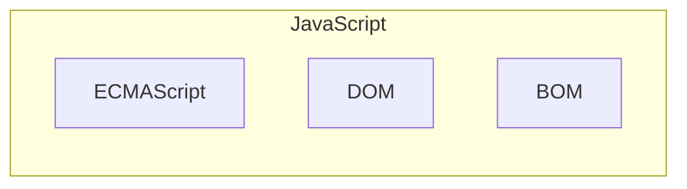
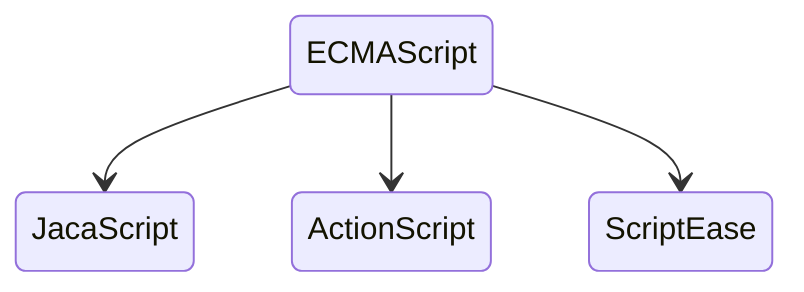

# JavaScript 简介

## JavaScript 的历史

> 为了发挥 JavaScript 的全部潜力，了解它的本质、历史及局限性是十分重要的。
本节为您讲解 JavaScript 和客户端脚本的起源。

### Nombas 和 ScriptEase

大概在 1992 年，一家称作 Nombas 的公司开发了一种叫做 C 减减（C-minus-minus，简称 Cmm）的嵌入式脚本语言。Cmm 背后的理念很简单：一个足够强大可以替代宏操作（macro）的脚本语言，同时保持与 C （和 C++）足够的相似性，以便开发人员能很快学会。这个脚本语言捆绑在一个叫做 CEnvi 的共享软件中，它首次向开发人员展示了这种语言的威力。

Nombas 最终把 Cmm 的名字改成了 ScriptEase，原因是后面的部分（mm）听起来过于消极，同时字母 C “令人害怕”。

现在 ScriptEase 已经成为了 Nombas 产品背后的主要驱动力。

### Netscape 发明了 JavaScript

当 Netscape Navigator 崭露头角时，Nombas 开发了一个可以嵌入网页中的 CEnvi 的版本。这些早期的试验被称为 Espresso Page（浓咖啡般的页面），它们代表了第一个在万维网上使用的客户端语言。而 Nombas 丝毫没有料到它的理念将会成为万维网的一块重要基石。

当网上冲浪越来越流行时，对于开发客户端脚本的需求也逐渐增大。此时，大部分因特网用户还仅仅通过 28.8 kbit/s 的调制解调器连接到网络，即便这时网页已经不断地变得更大和更复杂。而更加加剧用户痛苦的是，仅仅为了简单的表单有效性验证，就要与服务器进行多次地往返交互。设想一下，用户填完一个表单，点击提交按钮，等待了 30 秒的处理后，看到的却是一条告诉你忘记填写一个必要的字段。

那时正处于技术革新最前沿的 Netscape，开始认真考虑开发一种客户端脚本语言来解决简单的处理问题。

当时工作于 Netscape 的 Brendan Eich，开始着手为即将在 1995 年发行的 Netscape Navigator 2.0 开发一个称之为 LiveScript 的脚本语言，当时的目的是在浏览器和服务器（本来要叫它 LiveWire）端使用它。Netscape 与 Sun 及时完成 LiveScript 实现。

就在 Netscape Navigator 2.0 即将正式发布前，Netscape 将其更名为 JavaScript，目的是为了利用 Java 这个因特网时髦词汇。Netscape 的赌注最终得到回报，JavaScript 从此变成了因特网的必备组件。

### 三足鼎立
因为 JavaScript 1.0 如此成功，Netscape 在 Netscape Navigator 3.0 中发布了 1.1 版。恰巧那个时候，微软决定进军浏览器，发布了 IE 3.0 并搭载了一个 JavaScript 的克隆版，叫做 JScript（这样命名是为了避免与 Netscape 潜在的许可纠纷）。微软步入 Web 浏览器领域的这重要一步虽然令其声名狼藉，但也成为 JavaScript 语言发展过程中的重要一步。

在微软进入后，有 3 种不同的 JavaScript 版本同时存在：Netscape Navigator 3.0 中的 JavaScript、IE 中的 JScript 以及 CEnvi 中的 ScriptEase。与 C 和其他编程语言不同的是，JavaScript 并没有一个标准来统一其语法或特性，而这 3 种不同的版本恰恰突出了这个问题。随着业界担心的增加，这个语言的标准化显然已经势在必行。

### 标准化
1997 年，JavaScript 1.1 作为一个草案提交给欧洲计算机制造商协会（ECMA）。第 39 技术委员会（TC39）被委派来“标准化一个通用、跨平台、中立于厂商的脚本语言的语法和语义。由来自 Netscape、Sun、微软、Borland 和其他一些对脚本编程感兴趣的公司的程序员组成的 TC39 锤炼出了 ECMA-262，该标准定义了名为 ECMAScript 的全新脚本语言。

在接下来的几年里，国际标准化组织及国际电工委员会（ISO/IEC）也采纳 ECMAScript 作为标准（ISO/IEC-16262）。从此，Web 浏览器就开始努力（虽然有着不同的程度的成功和失败）将 ECMAScript 作为 JavaScript 实现的基础。

## JavaScript 实现

> JavaScript 的核心 ECMAScript 描述了该语言的语法和基本对象；
DOM 描述了处理网页内容的方法和接口；
BOM 描述了与浏览器进行交互的方法和接口。

### ECMAScript、DOM 和 BOM
尽管 ECMAScript 是一个重要的标准，但它并不是 JavaScript 唯一的部分，当然，也不是唯一被标准化的部分。实际上，一个完整的 JavaScript 实现是由以下 3 个不同部分组成的：

- 核心（ECMAScript）
- 文档对象模型（DOM）
- 浏览器对象模型（BOM）



### ECMAScript

ECMAScript 并不与任何具体浏览器相绑定，实际上，它也没有提到用于任何用户输入输出的方法（这点与 C 这类语言不同，它需要依赖外部的库来完成这类任务）。那么什么才是 ECMAScript 呢？ECMA-262 标准（第 2 段）的描述如下：

> “ECMAScript 可以为不同种类的宿主环境提供核心的脚本编程能力，因此核心的脚本语言是与任何特定的宿主环境分开进行规定的... ...”

Web 浏览器对于 ECMAScript 来说是一个宿主环境，但它并不是唯一的宿主环境。事实上，还有不计其数的其他各种环境（例如 Nombas 的 ScriptEase，以及 Macromedia 同时用在 Flash 和 Director MX 中的 ActionScript）可以容纳 ECMAScript 实现。那么 ECMAScript 在浏览器之外规定了些什么呢？

简单地说，ECMAScript 描述了以下内容：

- 语法
- 类型
- 语句
- 关键字
- 保留字
- 运算符
- 对象

ECMAScript 仅仅是一个描述，定义了脚本语言的所有属性、方法和对象。其他语言可以实现 ECMAScript 来作为功能的基准，JavaScript 就是这样：



每个浏览器都有它自己的 ECMAScript 接口的实现，然后这个实现又被扩展，包含了 DOM 和 BOM（在以下几节中再探讨）。当然还有其他实现并扩展了 ECMAScript 的语言，例如 Windows 脚本宿主（Windows Scripting Host, WSH）、Macromedia 在 Flash 和 Director MX 中的 ActionScript，以及 Nombas ScriptEase。

#### ECMAScript 的版本
ECMAScript 分成几个不同的版本，它是在一个叫做 ECMA-262 的标准中定义的。和其他标准一样，ECMA-262 会被编辑和更新。当有了主要更新时，就会发布一个标准的新版。最新 ECMA-262 的版本是 5.1，于 2011 年 6 月发布。

ECMA-262 的第一版在本质上与 Netscape 的 JavaScript 1.1 是一样，只是把所有与浏览器相关的代码删除了，此外还有一些小的调整。首先，ECMA-262 要求对 Unicode 标准的支持（以便支持多语言）。第二，它要求对象是平台无关的（Netscape 的 JavaScript 1.1 事实上有不同的对象实现，例如 Date 对象，是依赖于平台）。这是 JavaScript 1.1 和 1.2 为什么不符合 ECMA-262 规范第一版的主要原因。

ECMA-262 的第二版大部分更新本质上是编辑性的。这次标准的更新是为了与 ISO/IEC-16262 的严格一致，也并没有特别添加、更改和删除内容。ECMAScript 一般不会遵守第二版。

ECMA-262 第三版是该标准第一次真正的更新。它提供了对字符串处理、错误定义和数值输出的更新。同时，它还增加了正则表达式、新的控制语句、try...catch 异常处理的支持，以及一些为使标准国际化而做的小改动。一般来说，它标志着 ECMAScript 成为一种真正的编程语言。

#### 何谓 ECMAScript 符合性
在 ECMA-262 中，ECMAScript 符合性（conformance）有明确的定义。一个脚本语言必须满足以下四项基本原则：

- 符合的实现必须按照 ECMA-262 中所描述的支持所有的“类型、值、对象、属性、函数和程序语言及语义”（ECMA-262，第一页）
- 符合的实现必须支持 Unicode 字符标准（UCS）
- 符合的实现可以增加没有在 ECMA-262 中指定的“额外类型、值、对象、属性和函数”。ECMA-262 将这些增加描述为规范中未给定的新对象或对象的新属性
- 符合的实现可以支持没有在 ECMA-262 中定义的“程序和正则表达式语法”（意思是可以替换或者扩展内建的正则表达式支持）
所有 ECMAScript 实现必须符合以上标准。

#### Web 浏览器中的 ECMAScript 支持
含有 JavaScript 1.1 的 Netscape Navigator 3.0 在 1996 年发布。然后，JavaScript 1.1 规范被作为一个新标准的草案被提交给 EMCA。有了 JavaScript 轰动性的流行，Netscape 十分高兴地开始开发 1.2 版。但有一个问题，ECMA 并未接受 Netscape 的草案。在 Netscape Navigator 3.0 发布后不久，微软就发布了 IE 3.0。该版本的 IE 含有 JScript 1.0（微软自己的 JavaScript 实现的名称），原本计划可以与 JavaScript 1.1 相提并论。然后，由于文档不全以及一些不当的重复特性，JScript 1.0 远远没有达到 JavaScript 1.1 的水平。

在 ECMA-262 第一版定稿之前，发布含有 JavaScript 1.2 的 Netscape Navigator 4.0 是在 1997 年，在那年晚些时候，ECMA-262 标准被接受并标准化。因此，JavaScript 1.2 并不和 ECMAScript 的第一版兼容，虽然 ECMAScript 应该基于 JavaScript 1.1。

JScript 的下一步是 IE 4.0 中加入的 JScript 3.0（2.0 版是随 IIS 3.0 一起发布的，但并未包含在浏览器中）。微软大力宣传 JScript 3.0 是世界上第一个真正符合 ECMA 标准的脚本语言。而那时，ECMA-262 还没有最终定稿，所以 JScript 3.0 也遭受了和 JavaScript 1.2 同样的命运 - 它还是没能符合最终的 ECMAScript 标准。

Netscape 选择在 Netscape Navigator 4.06 中升级它的 JavaScript 实现。JavaScript 1.3 使 Netscape 终于完全符合了 ECMAScript 第一版。Netscape 加入了对 Unicode 标准的支持，并让所有的对象保留了在 JavaScript 1.2 中引入的新特性的同时实现了平台独立。

当 Netscape 将它的源代码作为 Mozilla 项目公布于众时，本来计划 JavaScript 1.4 将会嵌入到 Netscape Navigator 5.0 中。然而，一个冒进的决定 - 要完全从头重新设计 Netscape 的代码，破坏了这个工作。JavaScript 1.4 仅仅作为一个 Netscape Enterprise Server 的服务器端脚本语言发布，以后也没有被放入浏览器中。

如今，所有主流的 Web 浏览器都遵守 ECMA-262 第三版。

下面的表格列出了大部分流行的 Web 浏览器中的 ECMAScript 支持：

| 浏览器                         | DOM 兼容性 |
| ------------------------------ | ---------- |
| Netscape Navigator 2.0         | -          |
| Netscape Navigator 3.0         | -          |
| Netscape Navigator 4.0 - 4.05  | -          |
| Netscape Navigator 4.06 - 4.79 | Edition 1  |
| Netscape 6.0+ (Mozilla 0.6.0+) | Edition 3  |
| Internet Explorer 3.0          | -          |
| Internet Explorer 4.0          | -          |
| Internet Explorer 5.0          | Edition 1  |
| Internet Explorer 5.5+         | Edition 3  |
| Opera 6.0 - 7.1                | Edition 2  |
| Opera 7.2+                     | Edition 3  |
| Safari 1.0+/Konqueror ~ 2.0+   | Edition 3  |

### DOM
DOM（文档对象模型）是 HTML 和 XML 的应用程序接口（API）。DOM 将把整个页面规划成由节点层级构成的文档。HTML 或 XML 页面的每个部分都是一个节点的衍生物。请考虑下面的 HTML 页面：

```html
<html>
  <head>
    <title>Sample Page</title>
  </head>
  <body>
    <p>hello world!</p>
  </body>
</html>
```


这段代码可以用 DOM 绘制成一个节点层次图：

```
html
├──head
│  └──title
│     └──Sample Page
└──body
   └──p
      └──Hello World!
```

DOM 通过创建树来表示文档，从而使开发者对文档的内容和结构具有空前的控制力。用 DOM API 可以轻松地删除、添加和替换节点。

#### 为什么 DOM 必不可少
自从 IE 4.0 和 Netscape Navigator 4.0 开始支持不同形态的动态 HTML（DHTML），开发者首次能够在不重载网页的情况下修改它的外观和内容。这是 Web 技术的一大飞跃，不过也带来了巨大的问题。Netscape 和微软各自开发自己的 DHTML，从而结束了 Web 开发者只编写一个 HTML 页面就可以在所有浏览器中访问的时期。

业界决定必须要做点什么以保持 Web 的跨平台特性，他们担心如果放任 Netscape 和微软公司这样做，Web 必将分化为两个独立的部分，每一部分只适用于特定的浏览器。因此，负责指定 Web 通信标准的团体 W3C（World Wide Web Consortium）就开始制定 DOM。

#### DOM 的各个 level
DOM Level 1 是 W3C 于 1998 年 10 月提出的。它由两个模块组成，即 DOM Core 和 DOM HTML。前者提供了基于 XML 的文档的结构图，以便访问和操作文档的任意部分；后者添加了一些 HTML 专用的对象和方法，从而扩展了 DOM Core。

注意，DOM 不是 JavaScript 专有的，事实上许多其他语言都实现了它。不过，Web 浏览器中的 DOM 已经用 ECMAScript 实现了，现在是 JavaScript 语言的一个很大组成部分。

DOM Level 1 只是一个目标，即规划文档的结构，DOM Level 2 的目标就广泛多了。对原始 DOM 的扩展添加了对鼠标和用户界面事件（DHTML 对此有丰富的支持）、范围、遍历（重复执行 DOM 文档的方法）的支持，并通过对象接口添加了对 CSS（层叠样式表）的支持。由 Level 1 引入的原始 DOM Core 也加入了对 XML 命名空间的支持。

DOM Level 2 引入了几种 DOM 新模块，用于处理新的接口类型：

- DOM 视图 - 描述跟踪文档的各种视图（即 CSS 样式化之前和 CSS 样式化之后的文档）
- DOM 事件 - 描述事件的接口
- DOM 样式 - 描述处理基于 CSS 样式的接口
- DOM 遍历和范围 - 描述遍历和操作文档树的接口
- DOM Level 3 引入了以统一的方式载入和保持文档的方法（包含在新模块 DOM Load and Save）以及验证文档（DOM Validation）的方法，从而进一步扩展了 DOM。在 Level 3 中，DOM Core 被扩展为支持所有的 XML 1.0 特性，包括 XML Infoset、XPath 和 XML Base。

在学习 DOM 时，可能会遇到有人引用 DOM Level 0。注意，根本没有 DOM Level 0 这个标准，它只是 DOM 的一个历史参考点（DOM Level 0 指的是 IE 4.0 和 Netscape Navigator 4.0 中支持的原始 DHTML）。

#### 其他 DOM
除了 DOM Core 和 DOM HTML 外，还有其他几种语言发布了自己的 DOM 标准。这些语言都是基于 XML 的，每种 DOM 都给对应语言添加了特有的方法和接口：

- 可缩放矢量语言（SVG）1.0
- 数字标记语言（MathML）1.0
- 同步多媒体集成语言（SMIL）

**注释：** 如果希望学习更多相关内容，请访问 w3school 的 SMIL 教程 和 SVG 教程。

此外，其他语言也开发了自己的 DOM 实现，如 Mozilla 的 XML 用户界面语言（XUL）。不过，只有上面列出的几种语言是 W3C 的推荐标准。

#### Web 浏览器中的 DOM 支持
DOM 在被 Web 浏览器开始实现之前就已经是一种标准了。IE 首次尝试 DOM 是在 5.0 版本中，不过其实直到 5.5 版本之后才具有真正的 DOM 支持，IE 5.5 实现了 DOM Level 1。从那时起，IE 就没有引入新的 DOM 功能。

Netscape 直到 Netscape 6（Mozilla 0.6.0）才引入 DOM 支持。目前，Mozilla 具有最好的 DOM 支持，实现了完整的 Level 1、几乎所有 Level 2 以及一部分 Level 3。（Mozilla 开发小组的目标是构造一个与标准 100% 兼容的浏览器，他们的工作得到了回报。）

Opera 直到 7.0 版本才加入 DOM 支持，还有 Safari 也实现了大部分 DOM Level 1。它们几乎都与 IE 5.5 处于同一水平，有些情况下，甚至超过了 IE 5.5。不过，就对 DOM 的支持而论，所有浏览器都远远落后于 Mozilla。下表列出了常用浏览器对 DOM 的支持。

| 浏览器                         | DOM 兼容性                            |
| ------------------------------ | ------------------------------------- |
| Netscape Navigator 1.0 - 4.x   | -                                     |
| Netscape 6.0+ (Mozilla 0.6.0+) | Level 1、Level 2、Level 3（部分）     |
| IE 2.0 - 4.x                   | -                                     |
| IE 5.0                         | Level 1（最小）                       |
| IE 5.5+                        | Level 1（几乎全部）                   |
| Opera 1.0 - 6.0                | -                                     |
| Opera 7.0+                     | Level 1（几乎全部）、Level 2 （部分） |
| Safari 1.0+/Konqueror ~ 2.0+   | Level 1                               |

**注释：** 如果希望进一步地学习 DOM 的知识，请访问 w3school 的 HTML DOM 教程 和 XML DOM 教程。

### BOM
IE 3.0 和 Netscape Navigator 3.0 提供了一种特性 - BOM（浏览器对象模型），可以对浏览器窗口进行访问和操作。使用 BOM，开发者可以移动窗口、改变状态栏中的文本以及执行其他与页面内容不直接相关的动作。使 BOM 独树一帜且又常常令人怀疑的地方在于，它只是 JavaScript 的一个部分，没有任何相关的标准。

BOM 主要处理浏览器窗口和框架，不过通常浏览器特定的 JavaScript 扩展都被看做 BOM 的一部分。这些扩展包括：

- 弹出新的浏览器窗口
- 移动、关闭浏览器窗口以及调整窗口大小
- 提供 Web 浏览器详细信息的定位对象
- 提供用户屏幕分辨率详细信息的屏幕对象
- 对 cookie 的支持
- IE 扩展了 BOM，加入了 ActiveXObject 类，可以通过 JavaScript 实例化 ActiveX 对象

由于没有相关的 BOM 标准，每种浏览器都有自己的 BOM 实现。有一些事实上的标准，如具有一个窗口对象和一个导航对象，不过每种浏览器可以为这些对象或其他对象定义自己的属性和方法。
