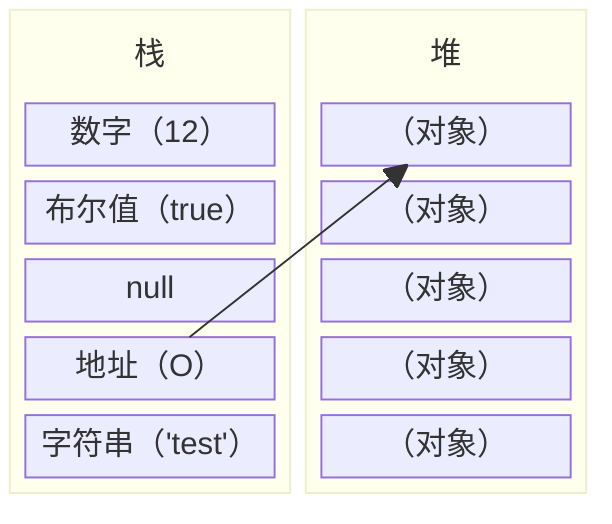
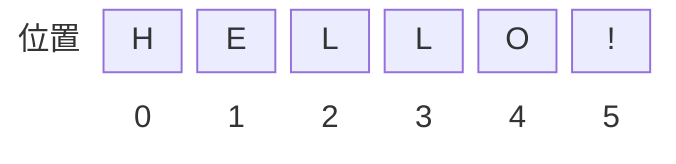

# ECMAScript 基础
## ECMAScript 语法

> 熟悉 Java、C 和 Perl 这些语言的开发者会发现 ECMAScript 的语法很容易掌握，因为它借用了这些语言的语法。
Java 和 ECMAScript 有一些关键的语法特性相同，也有一些完全不同。

### 区分大小写
与 Java 一样，变量、函数名、运算符以及其他一切东西都是区分大小写的。比如：变量 `test` 与变量 `TEST` 是不同的。

### 变量是弱类型的
与 Java 和 C 不同，ECMAScript 中的变量无特定的类型，定义变量时只用 var 运算符，可以将它初始化为任意值。

因此，可以随时改变变量所存数据的类型（尽量避免这样做）。

例子：

```js
var color = "red";
var num = 25;
var visible = true;
```

> [!note]
>
> 弱类型虽然自由，但未必是好事——这会使合作开发和调试的难度急剧增加。所以后来有了 TypeScript 项目，给 JavaScript 添加类型系统。当然这是后话。
>
> 使用 var 声明变量现在会出现一些问题。就算你不知道 ES6，也直接在编码中使用 `let` 替换掉 `var`。
>
> ```js
> var a = 1 ---> let a = 1
> ```
>
> 具体为什么要这样做，后面再说。

### 每行结尾的分号可有可无

Java、C 和 Perl 都要求每行代码以分号（;）结束才符合语法。

ECMAScript 则允许开发者自行决定是否以分号结束一行代码。如果没有分号，ECMAScript 就把折行代码的结尾看做该语句的结尾（与 Visual Basic 和 VBScript 相似），前提是这样没有破坏代码的语义。

最好的代码编写习惯是总加入分号，因为没有分号，有些浏览器就不能正确运行，不过根据 ECMAScript 标准，下面两行代码都是正确的：

```js
var test1 = "red"
var test2 = "blue";
```

> [!note]
>
> 通常，代码格式化工具会自动帮你加上分号。所以自己敲的时候真没必要加分号。
>
> 但是——如果你想压行，就必须加上分号。

### 注释与 Java、C 和 PHP 语言的注释相同

ECMAScript 借用了这些语言的注释语法。

有两种类型的注释：

- 单行注释以双斜杠开头（`//`）
- 多行注释以单斜杠和星号开头（`/*`），以星号和单斜杠结尾（`*/`）

```js
//this is a single-line comment

/*this is a multi-
line comment*/
```


### 括号表示代码块
从 Java 中借鉴的另一个概念是代码块。

代码块表示一系列应该按顺序执行的语句，这些语句被封装在左括号（`{`）和右括号（`}`）之间。

例如：

```js
if (test1 == "red") {
   test1 = "blue";
   console.log(test1);
}
```

## ECMAScript 变量

> 请使用 var 运算符声明变量。
变量名需要遵守一些简单的规则。

### 声明变量
在上一节中我们讲解过，ECMAScript 中的变量是用 var 运算符（variable 的缩写）加变量名定义的。例如：

```js
var test = "hi";
```

在这个例子中，声明了变量 `test`，并把它的值初始化为 `"hi"`（字符串）。由于 ECMAScript 是弱类型的，所以解释程序会为 `test` 自动创建一个字符串值，**无需明确的类型声明**。

还可以用一个 var 语句定义两个或多个变量：

```js
var test1 = "hi", test2 = "hello";
```

前面的代码定义了变量 `test1`，初始值为 `"hi"`，还定义了变量 `test2`，初始值为 `"hello"`。

不过用同一个 `var` 语句定义的变量不必具有相同的类型，如下所示：

```js
var test = "hi", age = 25;
```

这个例子除了定义 `test` 外，还定义了 `age`，并把它初始化为 `25`。即使 `test` 和 `age` 属于两种不同的数据类型，在 ECMAScript 中这样定义也是完全合法的。

与 Java 不同，ECMAScript 中的变量并 **不一定要初始化** （它们是在幕后初始化的，将在后面讨论这一点）。因此，下面这一行代码也是有效的：

```js
var test;
```

此外，与 Java 不同的还有变量 **可以存放不同类型的值** 。这是弱类型变量的优势。例如，可以把变量初始化为字符串类型的值，之后把它设置为数字值，如下所示：

```js
var test = "hi";
console.log(test);
test = 55;
console.log(test);
```

这段代码将毫无问题地输出字符串值和数字值。但是，如前所述，使用变量时，好的编码习惯是始终存放相同类型的值。

### 命名变量
变量名需要遵守两条简单的规则：

- 第一个字符必须是字母、下划线（`_`）或美元符号（`$`）
- 余下的字符可以是下划线、美元符号或任何字母或数字字符
下面的变量都是合法的：

```js
var test;
var $test;
var $1;
var _$te$t2;
```

### 著名的变量命名规则
只是因为变量名的语法正确，并不意味着就该使用它们。变量还应遵守以下某条著名的命名规则：

#### Camel 标记法
首字母是小写的，接下来的字母都以大写字符开头。例如：

```js
var myTestValue = 0, mySecondValue = "hi";
```

> [!note]
>
> 就是我们说的“驼峰命名法”。JavaScript 中的变量都应该用这样的方式命名。

#### Pascal 标记法

首字母是大写的，接下来的字母都以大写字符开头。例如：

```js
var MyTestValue = 0, MySecondValue = "hi";
```

> [!note]
>
> 原型和构造函数会这样命名。

#### 匈牙利类型标记法

在以 Pascal 标记法命名的变量前附加一个小写字母（或小写字母序列），说明该变量的类型。例如，`i` 表示整数，`s` 表示字符串，如下所示：

```js
var iMyTestValue = 0, sMySecondValue = "hi";
```

本教程采用了这些前缀，以使示例代码更易阅读：

| 类型                   | 前缀 | 示例      |
| ---------------------- | ---- | --------- |
| 数组                   | a    | aValues   |
| 布尔型                 | b    | bFound    |
| 浮点型（数字）         | f    | fValue    |
| 函数                   | fn   | fnMethod  |
| 整型（数字）           | i    | iValue    |
| 对象                   | o    | oType     |
| 正则表达式             | re   | rePattern |
| 字符串                 | s    | sValue    |
| 变型（可以是任何类型） | v    | vValue    |

> [!note]
>
> 现在没人这么做其实。因为越来越多的人开始用 TypeScript，IDE 会自动帮你识别变量类型，鼠标悬停就能看得见。

### 变量声明不是必须的

ECMAScript 另一个有趣的方面（也是与大多数程序设计语言的主要区别），是在使用变量之前不必声明。例如：

```js
var sTest = "hello ";
sTest2 = sTest + "world";
console.log(sTest2);
```

在上面的代码中，首先，`sTest` 被声明为字符串类型的值 `"hello"`。接下来的一行，用变量 `sTest2` 把 `sTest` 与字符串 `"world"` 连在一起。变量 `sTest2` 并没有用 `var` 运算符定义，这里只是插入了它，就像已经声明过它一样。

ECMAScript 的解释程序遇到未声明过的标识符时，用该变量名创建一个全局变量，并将其初始化为指定的值。

这是该语言的便利之处，不过如果不能紧密跟踪变量，这样做也很危险。最好的习惯是像使用其他程序设计语言一样，总是声明所有变量。

> [!note]
>
> **先用再声明是非常糟糕的实践**。旧标准里的 `var` 为了兼容性依然允许这种行为，但是 `let` 禁止这种行为。这是用 `let` 的理由之一。
>
> ```js
> a = 1;
> let a;
> // Uncaught ReferenceError: Cannot access 'a' before initialization
> ```

## ECMAScript 关键字
> 本节提供完整的 ECMAScript 关键字列表。

### ECMAScript 关键字
ECMA-262 定义了 ECMAScript 支持的一套关键字（keyword）。

这些关键字标识了 ECMAScript 语句的开头和/或结尾。根据规定，关键字是保留的，不能用作变量名或函数名。

下面是 ECMAScript 关键字的完整列表：

```js
break
case
catch
continue
default
delete
do
else
finally
for
function
if
in
instanceof
new
return
switch
this
throw
try
typeof
var
void
while
with
```

**注意：** 如果把关键字用作变量名或函数名，可能得到诸如 "Identifier Expected"（应该有标识符、期望标识符）这样的错误消息。

> [!note]
>
> 尽管如此，你依然可以用其中的部分关键字作为属性名。比如：
>
> ```js
> let m = { in:true }
> console.log(m.in)  //true
> ```
>
> 但这是糟糕的实践。如果之后需要解构变量等，会带来不少麻烦。所以换个名字是最好的选择，比如改成 `isIn`。

## ECMAScript 保留字
> 本节提供完整的 ECMAScript 保留字列表。

### ECMAScript 保留字
ECMA-262 定义了 ECMAScript 支持的一套保留字（reserved word）。

保留字在某种意思上是为将来的关键字而保留的单词。因此保留字不能被用作变量名或函数名。

ECMA-262 第三版中保留字的完整列表如下：

```js
abstract
boolean
byte
char
class
const
debugger
double
enum
export
extends
final
float
goto
implements
import
int
interface
long
native
package
private
protected
public
short
static
super
synchronized
throws
transient
volatile
```

**注意：** 如果将保留字用作变量名或函数名，那么除非将来的浏览器实现了该保留字，否则很可能收不到任何错误消息。当浏览器将其实现后，该单词将被看做关键字，如此将出现关键字错误。

> [!note]
>
> 其中的一部分现在已经成为关键字了，它们是：
>
> ```js
> class
> const
> debugger
> export
> extends
> import
> super
> ```
>
> 另外，新标准中，`then` 被定义为一个重要的方法，`require` 被用于引入模块，所以也避免在变量或属性名称中使用 `then` 和 `reqire`。

## ECMAScript 原始值和引用值
> 在 ECMAScript 中，变量可以存在两种类型的值，即原始值和引用值。

### 原始值和引用值
在 ECMAScript 中，变量可以存在两种类型的值，即原始值和引用值。

**原始值**：存储在栈（stack）中的简单数据段，也就是说，它们的值直接存储在变量访问的位置。

**引用值**：存储在堆（heap）中的对象，也就是说，存储在变量处的值是一个指针（point），指向存储对象的内存处。

为变量赋值时，ECMAScript 的解释程序必须判断该值是原始类型，还是引用类型。要实现这一点，解释程序则需尝试判断 **该值是否为 ECMAScript 的原始类型之一** ，即 Undefined、Null、Boolean、Number 和 String 型。由于这些原始类型占据的空间是固定的，所以可将他们存储在较小的内存区域——栈中。这样存储便于迅速查寻变量的值。

**在许多语言中，字符串都被看作引用类型，而非原始类型，因为字符串的长度是可变的。ECMAScript 打破了这一传统。**

如果一个值是引用类型的，那么它的存储空间将从堆中分配。由于引用值的大小会改变，所以不能把它放在栈中，否则会降低变量查寻的速度。相反，放在变量的栈空间中的值是该对象存储在堆中的地址。地址的大小是固定的，所以把它存储在栈中对变量性能无任何负面影响。如下图所示：



### 原始类型

如前所述，ECMAScript 有 5 种原始类型（primitive type），即 Undefined、Null、Boolean、Number 和 String。ECMA-262 把术语类型（type）定义为值的一个集合，每种原始类型定义了它包含的值的范围及其字面量表示形式。

ECMAScript 提供了 `typeof` 运算符来判断一个值是否在某种类型的范围内。可以用这种运算符判断一个值是否表示一种原始类型：如果它是原始类型，还可以判断它表示哪种原始类型。

在稍后的章节，我们将为您深入讲解 ECMAScript 的原始类型和引用类型。

## ECMAScript 原始类型
> ECMAScript 有 5 种原始类型（primitive type），即 Undefined、Null、Boolean、Number 和 String。

### typeof 运算符
`typeof` 运算符有一个参数，即要检查的变量或值。例如：

```js
var sTemp = "test string";
console.log(typeof sTemp);    //输出 "string"
console.log(typeof 86);    //输出 "number"
```

对变量或值调用 `typeof` 运算符将返回下列值之一：

- undefined - 如果变量是 Undefined 类型的
- boolean - 如果变量是 Boolean 类型的
- number - 如果变量是 Number 类型的
- string - 如果变量是 String 类型的
- object - 如果变量是一种引用类型或 Null 类型的

**注释：** 您也许会问，为什么 `typeof` 运算符对于 `null` 值会返回 `"Object"`。这实际上是 JavaScript 最初实现中的一个错误，然后被 ECMAScript 沿用了。现在，`null` 被认为是对象的占位符，从而解释了这一矛盾，但从技术上来说，它仍然是原始值。

> [!note]
>
> `typeof null == "object"` 这个问题的产生可以追溯到 JavaScript 的第一个版本，在这个版本中，单个值在栈中占用 32 位的存储单元，而这 32 位的存储单元又可以划分为类型标签（1-3 位）和实际数据，类型标签存储于低位中，具体可以分成 5 种:
>
> 1. `000`，typeof 判断类型为 **object**；
> 2. `1**`，typeof 判断类型为 **number（整数）**；
> 3. `010`，typeof 判断类型为 **number（浮点）**；
> 4. `001`，typeof 判断类型为 **string**；
> 5. `011`，typeof 判断类型为 **boolean**；
>
> 可是 `null` 的 4 个字节全部是 0，恰好符合 object，于是就输出 object 了。后来有提案说要改成 `typeof null == "null"`，被否决了，理由是兼容性。
>
> 不过，现在 JavaScript 的底层早就不是 4 字节存储了，就不要想着 2147483647+1=-2147483648 了。
>
> 另外，新版本的 ECMAScript 加入了其他的原始类型。后面再说。

### Undefined 类型
如前所述，Undefined 类型只有一个值，即 `undefined`。当声明的变量未初始化时，该变量的默认值是 `undefined`。

```js
var oTemp;
```

前面一行代码声明变量 `oTemp`，没有初始值。该变量将被赋予值 `undefined`，即 Undefined 类型的字面量。可以用下面的代码段测试该变量的值是否等于 `undefined`：

```js
var oTemp;
console.log(oTemp == undefined);
```

这段代码将显示 `"true"`，说明这两个值确实相等。还可以用 `typeof` 运算符显示该变量的值是 `undefined`：

```js
var oTemp;
console.log(typeof oTemp); //输出 "undefined"
```

**提示：** 值 undefined 并不同于未定义的值。但是，`typeof` 运算符并不真正区分这两种值。考虑下面的代码：

```js
var oTemp;

console.log(typeof oTemp);  //输出 "undefined"
console.log(typeof oTemp2);  //输出 "undefined"
```

前面的代码对两个变量输出的都是 `"undefined"`，即使只有变量 `oTemp2` 从未被声明过。如果对 `oTemp2` 使用除 `typeof` 之外的其他运算符的话，会引起错误，因为其他运算符只能用于已声明的变量上。

例如，下面的代码将引发错误：

```js
var oTemp;
console.log(oTemp2 == undefined);
```

当函数无明确返回值时，返回的也是值 `"undefined"`，如下所示：

```js
function testFunc() {
}

console.log(testFunc() == undefined);  //输出 "true"
```

### Null 类型
另一种只有一个值的类型是 Null，它只有一个专用值 `null`，即它的字面量。值 `undefined` 实际上是从值 `null` 派生来的，因此 ECMAScript 把它们定义为相等的。

```js
console.log(null == undefined);  //输出 "true"
```

尽管这两个值相等，但它们的含义不同。`undefined` 是声明了变量但未对其初始化时赋予该变量的值，`null` 则用于表示尚未存在的对象（在讨论 `typeof` 运算符时，简单地介绍过这一点）。如果函数或方法要返回的是对象，那么找不到该对象时，返回的通常是 `null`。

### Boolean 类型
Boolean 类型是 ECMAScript 中最常用的类型之一。它有两个值 `true` 和 `false` （即两个 Boolean 字面量）。

即使 `false` 不等于 `0`，`0` 也可以在必要时被转换成 `false`，这样在 Boolean 语句中使用两者都是安全的。

```js
var bFound = true;
var bLost = false;
```

### Number 类型
ECMA-262 中定义的最特殊的类型是 Number 类型。这种类型既可以表示 32 位的整数，还可以表示 64 位的浮点数。

直接输入的（而不是从另一个变量访问的）任何数字都被看做 Number 类型的字面量。例如，下面的代码声明了存放整数值的变量，它的值由字面量 86 定义：

```js
var iNum = 86;
```

> [!note]
>
> 从 C 语言走来的你一定会想，既然溢出值不是 2147483647，那是多少？
>
> ECMAScript的 Number 类型是一个双精度 64 位二进制格式 IEEE 754 值，类似于 Java 或者 C# 中的 double，使用 64 位来表示科学计数法的 3 个部分：
>
> - 1 位用于表示*符号（sign）*（正数或者负数）
> - 11 位用于表示*指数（exponent）*（-1022 到 1023）
> - 52 位用于表示*尾数（mantissa）*（表示 0 和 1 之间的数值）
>
> 所以 ECMAScript 中的最大安全整数就是尾数所能表示的最大数值，也就是 2<sup>53</sup>-1，可以直接通过调用 `Number.MAX_SAFE_INTEGER` 得到。
>
> ```js
> Number.MAX_SAFE_INTEGER; // 9007199254740991
> Number.MIN_SAFE_INTEGER; // -9007199254740991
> ```
>
> 比它大的数不是不能存储和表示，而是会出现各种问题：
>
> ```js
> const x = Number.MAX_SAFE_INTEGER + 1;
> const y = Number.MAX_SAFE_INTEGER + 2;
> 
> console.log(Number.MAX_SAFE_INTEGER);
> // 9007199254740991
> 
> console.log(x);
> // 9007199254740992
> 
> console.log(x === y);
> // true
> ```
>

#### 八进制数和十六进制数
整数也可以被表示为八进制（以 8 为底）或十六进制（以 16 为底）的字面量。

要创建十六进制的字面量，首位数字必须为 0，后面接字母 x，然后是任意的十六进制数字（0 到 9 和 A 到 F）。这些字母可以是大写的，也可以是小写的。例如：

```js
var iNum = 0x1f;  //0x1f 等于十进制的 31
var iNum = 0xAB;  //0xAB 等于十进制的 171
```

八进制字面量的首数字必须是 0，其后的数字可以是任何八进制数字（0-7），如下面的代码所示：

```js
var iNum = 070;  //070 等于十进制的 56
```

> [!note]
>
> 以 0 开头的八进制字面量表示法现在已经弃用（因为这太容易混淆了）。在严格模式下会直接报错（严格模式是新版本引入的东西，在首行写一个 `'use strict'` 来标记）。
>
> ```js
> 'use strict'
> console.log(010);
> // Uncaught SyntaxError: Octal literals are not allowed in strict mode.
> ```
>
> 现在的最佳实践是使用 `0o` 作为开头：
>
> ```js
> 'use strict'
> 0o10;
> // 8
> ```
>
> 类似地，新版本还引入了 `0b` 作为二进制字面量的开头：
>
> ```js
> 0b10;
> // 2
> ```

**提示：** 尽管所有整数都可以表示为八进制或十六进制的字面量，但所有数学运算返回的都是十进制结果。

#### 浮点数
要定义浮点值，必须包括小数点和小数点后的一位数字（例如，用 1.0 而不是 1）。这被看作浮点数字面量。例如：

```js
var fNum = 5.0;
```

> [!note]
>
> 天坑来了。这其实是所有 IEEE 754 存储格式的通病：
>
> ```js
> 0.1 + 0.2 == 0.3;
> // false
> 0.2 + 0.7 == 0.9；
> // false
> 0.125 + 0.25 == 0.375;
> // true
> ```
>
> 为什么？很简单，0.1 和 0.2 在计算的时候要转化为二进制，而二进制下的 0.1 和 0.2 是无限循环小数，存储的是取整过的近似值。所以，如果是二进制下的有限小数，计算的时候就不会损失：
>
> ```js
> 0.1 + 0.2;
> // 0.30000000000000004
> 0.2 + 0.7;
> // 0.8999999999999999
> 0.125 + 0.25;
> // 0.375
> ```
>
> 所以，**算钱的时候不要用浮点**，不然你的客户会面对 0.9999999999999999 块钱而提不出来。最佳实践是以“分”为单位进行存储、传输和计算，仅在展示的时候除以 100。

#### 科学计数法
对于非常大或非常小的数，可以用科学计数法表示浮点数，可以把一个数表示为数字（包括十进制数字）加 e（或 E），后面加乘以 10 的倍数。例如：

```js
var fNum = 5.618e7
```

该符号表示的是数 56180000。把科学计数法转化成计算式就可以得到该值：5.618 × 10<sup>7</sup>。

也可以用科学计数法表示非常小的数，例如 0.00000000000000008 可以表示为 8-e17（这里，10 被升到 -17 次冥，意味着需要被 10 除 17 次）。ECMAScript 默认把具有 6 个或 6 个以上前导 0 的浮点数转换成科学计数法。

**提示：** 也可用 64 位 IEEE 754 形式存储浮点值，这意味着十进制值最多可以有 17 个十进制位。17 位之后的值将被裁去，从而造成一些小的数学误差。

#### 特殊的 Number 值
几个特殊值也被定义为 Number 类型。前两个是 `Number.MAX_VALUE` 和 `Number.MIN_VALUE`，它们定义了 Number 值集合的外边界。所有 ECMAScript 数都必须在这两个值之间。不过计算生成的数值结果可以不落在这两个值之间。

当计算生成的数大于 `Number.MAX_VALUE` 时，它将被赋予值 `Number.POSITIVE_INFINITY`，意味着不再有数字值。同样，生成的数值小于 `Number.MIN_VALUE` 的计算也会被赋予值 `Number.NEGATIVE_INFINITY`，也意味着不再有数字值。如果计算返回的是无穷大值，那么生成的结果不能再用于其他计算。

事实上，有专门的值表示无穷大，（如你猜到的）即 `Infinity`。`Number.POSITIVE_INFINITY` 的值为 `Infinity`。`Number.NEGATIVE_INFINITY` 的值为 `-Infinity`。

由于无穷大数可以是正数也可以是负数，所以可用一个方法判断一个数是否是有穷的（而不是单独测试每个无穷数）。可以对任何数调用 `isFinite()` 方法，以确保该数不是无穷大。例如：

```js
var iResult = iNum * some_really_large_number;

if (isFinite(iResult)) {
    console.log("finite");
}

else {
    console.log("infinite");
}
```

最后一个特殊值是 `NaN`，表示非数（Not a Number）。NaN 是个奇怪的特殊值。一般说来，这种情况发生在类型（String、Boolean 等）转换失败时。例如，要把单词 `"blue"` 转换成数值就会失败，因为没有与之等价的数值。与无穷大一样，`NaN` 也不能用于算术计算。**`NaN` 的另一个奇特之处在于，它与自身不相等**，这意味着下面的代码将返回 `false`：

```js
console.log(NaN == NaN);  // false
```

出于这个原因，不推荐使用 `NaN` 值本身。函数 `isNaN()` 会做得相当好：

```js
console.log(isNaN("blue"));  // true
console.log(isNaN("666"));  // false
```

> [!note]
>
> 

### String 类型

String 类型的独特之处在于，它是唯一没有固定大小的原始类型。可以用字符串存储 0 或更多的 Unicode 字符，有 16 位整数表示（Unicode 是一种国际字符集，本教程后面将讨论它）。

字符串中每个字符都有特定的位置，首字符从位置 0 开始，第二个字符在位置 1，依此类推。这意味着字符串中的最后一个字符的位置一定是字符串的长度减 1：



字符串字面量是由双引号（`"`）或单引号（`'`）声明的。而 Java 则是用双引号声明字符串，用单引号声明字符。但是由于 ECMAScript 没有字符类型，所以可使用这两种表示法中的任何一种。例如，下面的两行代码都有效：

```js
var sColor1 = "red";
var sColor2 = 'red';
```

String 类型还包括几种字符字面量，Java、C 和 Perl 的开发者应该对此非常熟悉。

下面列出了 ECMAScript 的字符字面量：

| 字面量   | 含义                                                                        |
| -------- | --------------------------------------------------------------------------- |
| `\n`     | 换行                                                                        |
| `\t`     | 制表符                                                                      |
| `\b`     | 空格                                                                        |
| `\r`     | 回车                                                                        |
| `\f`     | 换页符                                                                      |
| `\\`     | 反斜杠                                                                      |
| `\'`     | 单引号                                                                      |
| `\"`     | 双引号                                                                      |
| `\0nnn`  | 八进制代码 `nnn` 表示的字符（n 是 0 到 7 中的一个八进制数字）               |
| `\xnn`   | 十六进制代码 `nn` 表示的字符（n 是 0 到 F 中的一个十六进制数字）            |
| `\unnnn` | 十六进制代码 `nnnn` 表示的 Unicode 字符（n 是 0 到 F 中的一个十六进制数字） |

## ECMAScript 类型转换

> 所有程序设计语言最重要的特征之一是具有进行类型转换的能力。
ECMAScript 给开发者提供了大量简单的类型转换方法。

大部分类型具有进行简单转换的方法，还有几个全局方法可以用于更复杂的转换。无论哪种情况，在 ECMAScript 中，类型转换都是简短的一步操作。

### 转换成字符串
ECMAScript 的 Boolean 值、数字和字符串的原始值的有趣之处在于它们是伪对象，这意味着它们实际上具有属性和方法。

例如，要获得字符串的长度，可以采用下面的代码：

```js
var sColor = "red";
console.log(sColor.length);	//输出 "3"
```

尽管 `"red"` 是原始类型的字符串，它仍然具有属性 `length`，用于存放字符串的大小。

总而言之，3 种主要的原始类型 Boolean 值、数字和字符串都有 `toString()` 方法，可以把它们的值转换成字符串。

**提示：** 您也许会问，“字符串还有 `toString()` 方法吗，这不是多余吗？”是的，的确如此，不过 ECMAScript 定义所有对象都有 `toString()` 方法，无论它是伪对象，还是真对象。因为 String 类型属于伪对象，所以它一定有 `toString()` 方法。

Boolean 类型的 `toString()` 方法只是输出 `"true"` 或 `"false"`，结果由变量的值决定：

```js
var bFound = false;
console.log(bFound.toString());	//输出 "false"
```

Number 类型的 `toString()` 方法比较特殊，它有两种模式，即**默认模式**和**基模式**。采用默认模式，`toString()` 方法只是用相应的字符串输出数字值（无论是整数、浮点数还是科学计数法），如下所示：

```js
var iNum1 = 10;
var iNum2 = 10.0;
console.log(iNum1.toString());	//输出 "10"
console.log(iNum2.toString());	//输出 "10"
```

**注释：** 在默认模式中，无论最初采用什么表示法声明数字，Number 类型的 `toString()` 方法返回的都是数字的十进制表示。因此，以八进制或十六进制字面量形式声明的数字输出的都是十进制形式的。

采用 Number 类型的 `toString()` 方法的基模式，可以用不同的**基**输出数字，例如二进制的基是 2，八进制的基是 8，十六进制的基是 16。

**基** 只是要转换成的基数的另一种加法而已，它是 `toString()` 方法的参数：

```js
var iNum = 10;
console.log(iNum.toString(2));	//输出 "1010"
console.log(iNum.toString(8));	//输出 "12"
console.log(iNum.toString(16));	//输出 "A"
```

在前面的示例中，以 3 种不同的形式输出了数字 10，即二进制形式、八进制形式和十六进制形式。HTML 采用十六进制表示每种颜色，在 HTML 中处理数字时这种功能非常有用。

**注释：** 对数字调用 `toString(10)` 与调用 `toString()` 相同，它们返回的都是该数字的十进制形式。

### 转换成数字
ECMAScript 提供了两种把非数字的原始值转换成数字的方法，即 `parseInt()` 和 `parseFloat()`。

正如您可能想到的，前者把值转换成整数，后者把值转换成浮点数。只有对 String 类型调用这些方法，它们才能正确运行；对其他类型返回的都是 `NaN`。

#### parseInt()
在判断字符串是否是数字值前，`parseInt()` 和 `parseFloat()` 都会仔细分析该字符串。

`parseInt()` 方法首先查看位置 0 处的字符，判断它是否是个有效数字；如果不是，该方法将返回 `NaN`，不再继续执行其他操作。但如果该字符是有效数字，该方法将查看位置 1 处的字符，进行同样的测试。这一过程将持续到发现非有效数字的字符为止，此时 `parseInt()` 将把该字符之前的字符串转换成数字。

例如，如果要把字符串 `"12345red"` 转换成整数，那么 `parseInt()` 将返回 12345，因为当它检查到字符 r 时，就会停止检测过程。

字符串中包含的数字字面量会被正确转换为数字，比如 `"0xA"` 会被正确转换为数字 10。不过，字符串 `"22.5"` 将被转换成 22，因为对于整数来说，小数点是无效字符。

一些示例如下：

```js
var iNum1 = parseInt("12345red");	//返回 12345
var iNum1 = parseInt("0xA");	//返回 10
var iNum1 = parseInt("56.9");	//返回 56
var iNum1 = parseInt("red");	//返回 NaN
```

`parseInt()` 方法还有基模式，可以把二进制、八进制、十六进制或其他任何进制的字符串转换成整数。基是由 `parseInt()` 方法的第二个参数指定的，所以要解析十六进制的值，需如下调用 `parseInt()` 方法：

```js
var iNum1 = parseInt("AF", 16);	//返回 175
```

当然，对二进制、八进制甚至十进制（默认模式），都可以这样调用 `parseInt()` 方法：

```js
var iNum1 = parseInt("10", 2);	//返回 2
var iNum2 = parseInt("10", 8);	//返回 8
var iNum3 = parseInt("10", 10);	//返回 10
```

如果十进制数包含前导 0，那么最好采用基数 10，这样才不会意外地得到八进制的值。例如：

```js
var iNum1 = parseInt("010");	//返回 8
var iNum2 = parseInt("010", 8);	//返回 8
var iNum3 = parseInt("010", 10);	//返回 10
```

在这段代码中，两行代码都把字符 "010" 解析成一个数字。第一行代码把这个字符串看作八进制的值，解析它的方式与第二行代码（声明基数为 8）相同。最后一行代码声明基数为 10，所以 iNum3 最后等于 10。

#### parseFloat()
`parseFloat()` 方法与 `parseInt()` 方法的处理方式相似，从位置 0 开始查看每个字符，直到找到第一个非有效的字符为止，然后把该字符之前的字符串转换成整数。

不过，对于这个方法来说，第一个出现的小数点是有效字符。如果有两个小数点，第二个小数点将被看作无效的。`parseFloat()` 会把这个小数点之前的字符转换成数字。这意味着字符串 `"11.22.33"` 将被解析成 11.22。

使用 `parseFloat()` 方法的另一不同之处在于，字符串必须以十进制形式表示浮点数，而不是用八进制或十六进制。该方法会忽略前导 0，所以八进制数 0102 将被解析为 102。对于十六进制数 0xA，该方法将返回 NaN，因为在浮点数中，x 不是有效字符。（注释：经测试，具体的浏览器实现会返回 `0`，而不是 `NaN`。）

此外，`parseFloat()` 方法也没有基模式。

下面是使用 `parseFloat()` 方法的一些示例：

```js
var fNum1 = parseFloat("12345red");	//返回 12345
var fNum2 = parseFloat("0xA");	//返回 NaN
var fNum3 = parseFloat("11.2");	//返回 11.2
var fNum4 = parseFloat("11.22.33");	//返回 11.22
var fNum5 = parseFloat("0102");	//返回 102
var fNum1 = parseFloat("red");	//返回 NaN
```


### 强制类型转换
您还可以使用**强制类型转换（type casting）**来处理转换值的类型。使用强制类型转换可以访问特定的值，即使它是另一种类型的。

**编者注：**cast 有“铸造”之意，很贴合“强制转换”的意思。

ECMAScript 中可用的 3 种强制类型转换如下：

- `Boolean(value)` - 把给定的值转换成 Boolean 型；
- `Number(value)` - 把给定的值转换成数字（可以是整数或浮点数）；
- `String(value)` - 把给定的值转换成字符串。

用这三个函数之一转换值，将创建一个新值，存放由原始值直接转换成的值。这会造成意想不到的后果。

#### Boolean() 函数
当要转换的值是至少有一个字符的字符串、非 0 数字或对象时，Boolean() 函数将返回 `true`。如果该值是空字符串、数字 0、`undefined` 或 `null`，它将返回 `false`。

可以用下面的代码测试 Boolean 型的强制类型转换：

```js
var b1 = Boolean("");		//false - 空字符串
var b2 = Boolean("hello");		//true - 非空字符串
var b1 = Boolean(50);		//true - 非零数字
var b1 = Boolean(null);		//false - null
var b1 = Boolean(0);		//false - 零
var b1 = Boolean(new object());	//true - 对象
```

#### Number() 函数
`Number()` 函数的强制类型转换与 `parseInt()` 和 `parseFloat()` 方法的处理方式相似，只是它转换的是整个值，而不是部分值。

还记得吗，`parseInt()` 和 `parseFloat()` 方法只转换第一个无效字符之前的字符串，因此 `"1.2.3"` 将分别被转换为 `"1"` 和 `"1.2"`。

用 `Number()` 进行强制类型转换，`"1.2.3"` 将返回 `NaN`，因为整个字符串值不能转换成数字。如果字符串值能被完整地转换，`Number()` 将判断是调用 `parseInt()` 方法还是 `parseFloat()` 方法。

下表说明了对不同的值调用 `Number()` 方法会发生的情况：

| 用法                 | 结果 |
| -------------------- | ---- |
| Number(false)        | 0    |
| Number(true)         | 1    |
| Number(undefined)    | NaN  |
| Number(null)         | 0    |
| Number("1.2")        | 1.2  |
| Number("12")         | 12   |
| Number("1.2.3")      | NaN  |
| Number(new object()) | NaN  |
| Number(50)           | 50   |
#### String() 函数
最后一种强制类型转换方法 `String()` 是最简单的，因为它可把任何值转换成字符串。

要执行这种强制类型转换，只需要调用作为参数传递进来的值的 `toString()` 方法，即把 `12` 转换成 `"12"`，把 `true` 转换成 `"true"`，把 `false` 转换成 `"false"`，以此类推。

强制转换成字符串和调用 `toString()` 方法的唯一不同之处在于，对 `null` 和 `undefined` 值强制类型转换可以生成字符串而不引发错误：

```js
var s1 = String(null);	//"null"
var oNull = null;
var s2 = oNull.toString();	//会引发错误
```

在处理 ECMAScript 这样的弱类型语言时，强制类型转换非常有用，不过应该确保使用值的正确。

## ECMAScript 引用类型
>引用类型通常叫做类（class）。 
本教程会讨论大量的 ECMAScript 预定义引用类型。

### 引用类型
引用类型通常叫做类（class），也就是说，遇到引用值，所处理的就是对象。

本教程会讨论大量的 ECMAScript 预定义引用类型。

从现在起，将重点讨论与已经讨论过的原始类型紧密相关的引用类型。

**注意：** 从传统意义上来说，ECMAScript 并不真正具有类。事实上，除了说明不存在类，在 ECMA-262 中根本没有出现“类”这个词。ECMAScript 定义了“对象定义”，逻辑上等价于其他程序设计语言中的类。

**编者注：** ECMAScript 6 中引入了类的概念，其本质是构造函数的代码糖。

**提示：** 本教程将使用术语“对象”。

对象是由 `new` 运算符加上要实例化的对象的名字创建的。例如，下面的代码创建 `Object` 对象的实例：

```js
var o = new Object();
```

这种语法与 Java 语言的相似，不过当有不止一个参数时，ECMAScript 要求使用括号。如果没有参数，如以下代码所示，括号可以省略：

```js
var o = new Object;
```

**注意：** 尽管括号不是必需的，但是为了避免混乱，最好使用括号。

**提示：** 我们会在对象基础这一章中更深入地探讨对象及其行为。

这一节的重点是具有等价的原始类型的引用类型。

### Object 对象
`Object` 对象自身用处不大，不过在了解其他类之前，还是应该了解它。因为 ECMAScript 中的 `Object` 对象与 Java 中的 `java.lang.Object` 相似，ECMAScript 中的所有对象都由这个对象继承而来，`Object` 对象中的所有属性和方法都会出现在其他对象中，所以理解了 `Object` 对象，就可以更好地理解其他对象。

#### Object 对象具有下列属性：

`constructor`：对创建对象的函数的引用（指针）。对于 `Object` 对象，该指针指向原始的 `Object()` 函数。

`prototype`：对该对象的对象原型的引用。对于所有的对象，它默认返回 Object 对象的一个实例。

#### Object 对象还具有几个方法：

`hasOwnProperty(property)`：判断对象是否有某个特定的属性。必须用字符串指定该属性。（例如，`o.hasOwnProperty("name")`）

`isPrototypeOf(object)`：判断该对象是否为另一个对象的原型。

`propertyIsEnumerable`：判断给定的属性是否可以用 for...in 语句进行枚举。

`toString()`：返回对象的原始字符串表示。对于 Object 对象，ECMA-262 没有定义这个值，所以不同的 ECMAScript 实现具有不同的值。

`valueOf()`：返回最适合该对象的原始值。对于许多对象，该方法返回的值都与 `toString()` 的返回值相同。

**注释：** 上面列出的每种属性和方法都会被其他对象覆盖。

### Boolean 对象
Boolean 对象是 Boolean 原始类型的引用类型。

要创建 Boolean 对象，只需要传递 Boolean 值作为参数：

```js
var oBooleanObject = new Boolean(true);
```

Boolean 对象将覆盖 Object 对象的 `ValueOf()` 方法，返回原始值，即 `true` 和 `false`。`toString()` 方法也会被覆盖，返回字符串 `"true"` 或 `"false"`。

遗憾的是，在 ECMAScript 中很少使用 Boolean 对象，即使使用，也不易理解。

问题通常出现在 Boolean 表达式中使用 Boolean 对象时。例如：

```js
var oFalseObject = new Boolean(false);
var bResult = oFalseObject && true;	//输出 true
```

在这段代码中，用 `false` 值创建 Boolean 对象。然后用这个值与原始值 `true` 进行 AND 操作。在 Boolean 运算中，`false` 和 `true` 进行 AND 操作的结果是 `false`。不过，在这行代码中，计算的是 `oFalseObject`，而不是它的值 `false`。

正如前面讨论过的，在 Boolean 表达式中，所有对象都会被自动转换为 `true`，所以 `oFalseObject` 的值是 `true`。然后 `true` 再与 `true` 进行 AND 操作，结果为 `true`。

**注意：** 虽然你应该了解 Boolean 对象的可用性，不过最好还是使用 Boolean 原始值，避免发生这一节提到的问题。

### Number 对象
正如你可能想到的，Number 对象是 Number 原始类型的引用类型。要创建 Number 对象，采用下列代码：

```js
var oNumberObject = new Number(68);
```

您应该已认出本章前面小节中讨论特殊值（如 `Number.MAX_VALUE`）时提到的 Number 对象。所有特殊值都是 Number 对象的静态属性。

要得到数字对象的 Number 原始值，只需要使用 `valueOf()` 方法：

```js
var iNumber = oNumberObject.valueOf();
```

当然，Number 类也有 `toString()` 方法，在讨论类型转换的小节中已经详细讨论过该方法。

除了从 Object 对象继承的标准方法外，Number 对象还有几个处理数值的专用方法。

#### toFixed() 方法
`toFixed()` 方法返回的是具有指定位数小数的数字的字符串表示。例如：

```js
var oNumberObject = new Number(68);
console.log(oNumberObject.toFixed(2));  //输出 "68.00"
```

在这里，`toFixed()` 方法的参数是 2，说明应该显示两位小数。该方法返回 "68.00"，空的字符串位由 0 来补充。对于处理货币的应用程序，该方法非常有用。`toFixed()` 方法能表示具有 0 到 20 位小数的数字，超过这个范围的值会引发错误。

#### toExponential() 方法
与格式化数字相关的另一个方法是 `toExponential()`，它返回的是用科学计数法表示的数字的字符串形式。

与 `toFixed()` 方法相似，`toExponential()` 方法也有一个参数，指定要输出的小数的位数。例如：

```js
var oNumberObject = new Number(68);
console.log(oNumberObject.toExponential(1));  //输出 "6.8e+1"
```

这段代码的结果是 `"6.8e+1"`，前面解释过，它表示 6.8 x 10<sup>1</sup>。问题是，如果不知道要用哪种形式（预定形式或指数形式）表示数字怎么办？可以用 `toPrecision()` 方法。

#### toPrecision() 方法
`toPrecision()` 方法根据最有意义的形式来返回数字的预定形式或指数形式。它有一个参数，即用于表示数的数字总数（不包括指数）。例如，

```js
var oNumberObject = new Number(68);
console.log(oNumberObject.toPrecision(1));  //输出 "7e+1"
```

这段代码的任务是用一位数字表示数字 68，结果为 `"7e+1"`，以另外的形式表示即 70。的确，`toPrecision()` 方法会对数进行舍入。不过，如果用 2 位数字表示 68，就容易多了：

```js
var oNumberObject = new Number(68);
console.log(oNumberObject.toPrecision(2));  //输出 "68"
```

当然，输出的是 `"68"`，因为这正是该数的准确表示。不过，如果指定的位数多于需要的位数又如何呢？

```js
var oNumberObject = new Number(68);
console.log(oNumberObject.toPrecision(3));  //输出 "68.0"
```

在这种情况下，`toPrecision(3)` 等价于 `toFixed(1)`，输出的是 `"68.0"`。

`toFixed()`、`toExponential()` 和 `toPrecision()` 方法都会进行舍入操作，以便用正确的小数位数正确地表示一个数。

**提示：** 与 Boolean 对象相似，Number 对象也很重要，不过应该少用这种对象，以避免潜在的问题。只要可能，都使用数字的原始表示法。

### String 对象
String 对象是 String 原始类型的对象表示法，它是以下方式创建的：

```js
var oStringObject = new String("hello world");
```

String 对象的 `valueOf()` 方法和 `toString()` 方法都会返回 String 类型的原始值：

```js
console.log(oStringObject.valueOf() == oStringObject.toString());	//输出 true
```

如果运行这段代码，输出是 `true`，说明这些值真的相等。

**注释：** String 对象是 ECMAScript 中比较复杂的引用类型之一。同样，本节的重点只是 String 类的基本功能。更多的高级功能请阅读本教程相关的章节，或参阅 JavaScript String 对象参考手册。

#### length 属性
String 对象具有属性 length，它是字符串中的字符个数：

```js
var oStringObject = new String("hello world");
console.log(oStringObject.length);	//输出 11
```

这个例子输出的是 `11`，即 `"hello world"` 中的字符个数。注意，即使字符串包含双字节的字符（与 ASCII 字符相对，ASCII 字符只占用一个字节），每个字符也只算一个字符。

#### charAt() 和 charCodeAt() 方法
String 对象还拥有大量的方法。

首先，两个方法 `charAt()` 和 `charCodeAt()` 访问的是字符串中的单个字符。这两个方法都有一个参数，即要操作的字符的位置。

`charAt()` 方法返回的是包含指定位置处的字符的字符串：

```js
var oStringObject = new String("hello world");
console.log(oStringObject.charAt(1));	//输出 "e"
```

在字符串 `"hello world"` 中，位置 1 处的字符是 `"e"`。在“ECMAScript 原始类型”这一节中我们讲过，第一个字符的位置是 0，第二个字符的位置是 1，依此类推。因此，调用 `charAt(1)` 返回的是 `"e"`。

如果想得到的不是字符，而是字符代码，那么可以调用 `charCodeAt()` 方法：

```js
var oStringObject = new String("hello world");
console.log(oStringObject.charCodeAt(1));	//输出 "101"
```

这个例子输出 "101"，即小写字母 e 的字符代码。

#### concat() 方法
接下来是 `concat()` 方法，用于把一个或多个字符串连接到 String 对象的原始值上。该方法返回的是 String 原始值，保持原始的 String 对象不变：

```js
var oStringObject = new String("hello ");
var sResult = oStringObject.concat("world");
console.log(sResult);		//输出 "hello world"
console.log(oStringObject);	//输出 "hello "
```

在上面这段代码中，调用 `concat()` 方法返回的是 `"hello world"`，而 String 对象存放的仍然是 `"hello "`。出于这种原因，较常见的是用加号（`+`）连接字符串，因为这种形式从逻辑上表明了真正的行为：

```js
var oStringObject = new String("hello ");
var sResult = oStringObject + "world";
console.log(sResult);		//输出 "hello world"
console.log(oStringObject);	//输出 "hello "
```

#### indexOf() 和 lastIndexOf() 方法
迄今为止，已讨论过连接字符串的方法，访问字符串中的单个字符的方法。不过如果无法确定在某个字符串中是否确实存在一个字符，应该调用什么方法呢？这时，可调用 `indexOf()` 和 `lastIndexOf()` 方法。

`indexOf()` 和 `lastIndexOf()` 方法返回的都是指定的子串在另一个字符串中的位置，如果没有找不到子串，则返回 `-1`。

这两个方法的不同之处在于，`indexOf()` 方法是从字符串的开头（位置 0）开始检索字符串，而 `lastIndexOf()` 方法则是从字符串的结尾开始检索子串。例如：

```js
var oStringObject = new String("hello world!");
console.log(oStringObject.indexOf("o"));		//输出 "4"
console.log(oStringObject.lastIndexOf("o"));	//输出 "7"
```

在这里，第一个 `"o"` 字符串出现在位置 4，即 "hello" 中的 `"o"`；最后一个 `"o"` 出现在位置 7，即 "world" 中的 `"o"`。如果该字符串中只有一个 `"o"` 字符串，那么 `indexOf()` 和 `lastIndexOf()` 方法返回的位置相同。

#### localeCompare() 方法
下一个方法是 `localeCompare()`，对字符串进行排序。该方法有一个参数——要进行比较的字符串，返回的是下列三个值之一：

- 如果 String 对象按照字母顺序排在参数中的字符串之前，返回负数。
- 如果 String 对象等于参数中的字符串，返回 0
- 如果 String 对象按照字母顺序排在参数中的字符串之后，返回正数。
- 
**注释：** 如果返回负数，那么最常见的是 `-1`，不过真正返回的是由实现决定的。如果返回正数，那么同样的，最常见的是 `1`，不过真正返回的是由实现决定的。

示例如下：

```js
var oStringObject = new String("yellow");
console.log(oStringObject.localeCompare("brick"));		//输出 "1"
console.log(oStringObject.localeCompare("yellow"));		//输出 "0"
console.log(oStringObject.localeCompare("zoo"));		//输出 "-1"
```

在这段代码中，字符串 `"yellow"` 与 3 个值进行了对比，即 `"brick"`、`"yellow"` 和 `"zoo"`。由于按照字母顺序排列，`"yellow"` 位于 `"brick"` 之后，所以 `localeCompare()` 返回 `1`；`"yellow"` 等于 `"yellow"`，所以 localeCompare() 返回 0；`"zoo"` 位于 `"yellow"` 之后，`localeCompare()` 返回 -1。再强调一次，由于返回的值是由实现决定的，所以最好以下面的方式调用 `localeCompare()` 方法：

```js
var oStringObject1 = new String("yellow");
var oStringObject2 = new String("brick");

var iResult = oStringObject1.localeCompare(oStringObject2);

if(iResult < 0) {
  console.log(oStringObject1 + " comes before " + oStringObject2);
} else if (iResult > 0) {
  console.log(oStringObject1 + " comes after " + oStringObject2);
} else {
  console.log("The two strings are equal");
}
```

采用这种结构，可以确保这段代码在所有实现中都能正确运行。

`localeCompare()` 方法的独特之处在于，实现所处的区域（locale，兼指国家/地区和语言）确切说明了这种方法运行的方式。在美国，英语是 ECMAScript 实现的标准语言，`localeCompare()` 是区分大小写的，大写字母在字母顺序上排在小写字母之后。不过，在其他区域，情况可能并非如此。

#### slice() 和 substring()
ECMAScript 提供了两种方法从子串创建字符串值，即 `slice()` 和 `substring()`。这两种方法返回的都是要处理的字符串的子串，都接受一个或两个参数。第一个参数是要获取的子串的起始位置，第二个参数（如果使用的话）是要获取子串终止前的位置（也就是说，获取终止位置处的字符不包括在返回的值内）。如果省略第二个参数，终止位就默认为字符串的长度。

与 `concat()` 方法一样，`slice()` 和 `substring()` 方法都不改变 String 对象自身的值。它们只返回原始的 String 值，保持 String 对象不变。

```js
var oStringObject = new String("hello world");
console.log(oStringObject.slice("3"));		//输出 "lo world"
console.log(oStringObject.substring("3"));		//输出 "lo world"
console.log(oStringObject.slice("3", "7"));		//输出 "lo w"
console.log(oStringObject.substring("3", "7"));	//输出 "lo w"
```

在这个例子中，`slice()` 和 `substring()` 的用法相同，返回值也一样。当只有参数 3 时，两个方法返回的都是 `"lo world"`，因为 "hello" 中的第二个 "l" 位于位置 3 上。当有两个参数 3 和 7 时，两个方法返回的值都是 `"lo w"`（"world" 中的字母 "o" 位于位置 7 上，所以它不包括在结果中）。

为什么有两个功能完全相同的方法呢？事实上，这两个方法并不完全相同，不过只在参数为负数时，它们处理参数的方式才稍有不同。

对于负数参数，slice() 方法会用字符串的长度加上参数，substring() 方法则将其作为 0 处理（也就是说将忽略它）。例如：

```js
var oStringObject = new String("hello world");
console.log(oStringObject.slice(-3));		//输出 "rld"
console.log(oStringObject.substring(-3));	//输出 "hello world"
console.log(oStringObject.slice(3, -4));		//输出 "lo w"
console.log(oStringObject.substring(3, -4));	//输出 "hel"
```

这样即可看出 `slice()` 和 `substring()` 方法的主要不同。

当只有参数 -3 时，`slice()` 返回 `"rld"`，`substring()` 则返回 `"hello world"`。这是因为对于字符串 `"hello world"`，`slice(-3)` 将被转换成 `slice(8)`，而 `substring(-3)` 将被转换成 `substring(0)`。

同样，使用参数 3 和 -4 时，差别也很明显。`slice()` 将被转换成 `slice(3, 7)`，与前面的例子相同，返回 `"lo w"`。而 `substring()` 方法则将两个参数解释为 `substring(3, 0)`，实际上即 `substring(0, 3)`，因为 `substring()` 总把较小的数字作为起始位，较大的数字作为终止位。因此，`substring(3, -4)` 返回的是 `"hel"`。这里的最后一行代码用来说明如何使用这些方法。

#### toLowerCase()、toLocaleLowerCase()、toUpperCase() 和 toLocaleUpperCase()
最后一套要讨论的方法涉及大小写转换。有 4 种方法用于执行大小写转换，即

- `toLowerCase()`
- `toLocaleLowerCase()`
- `toUpperCase()`
- `toLocaleUpperCase()`

从名字上可以看出它们的用途，前两种方法用于把字符串转换成全小写的，后两种方法用于把字符串转换成全大写的。

`toLowerCase()` 和 `toUpperCase()` 方法是原始的，是以 `java.lang.String` 中相同方法为原型实现的。

`toLocaleLowerCase()` 和 `toLocaleUpperCase()` 方法是基于特定的区域实现的（与 `localeCompare()` 方法相同）。在许多区域中，区域特定的方法都与通用的方法完全相同。不过，有几种语言对 Unicode 大小写转换应用了特定的规则（例如土耳其语），因此必须使用区域特定的方法才能进行正确的转换。

```js
var oStringObject = new String("Hello World");
console.log(oStringObject.toLocaleUpperCase());	//输出 "HELLO WORLD"
console.log(oStringObject.toUpperCase());		//输出 "HELLO WORLD"
console.log(oStringObject.toLocaleLowerCase());	//输出 "hello world"
console.log(oStringObject.toLowerCase());		//输出 "hello world"
```

这段代码中，`toUpperCase()` 和 `toLocaleUpperCase()` 输出的都是 `"HELLO WORLD"`，`toLowerCase()` 和 `toLocaleLowerCase()` 输出的都是 `"hello world"`。一般来说，如果不知道在以哪种编码运行一种语言，则使用区域特定的方法比较安全。

**提示：** 记住，String 对象的所有属性和方法都可应用于 String 原始值上，因为它们是伪对象。

### instanceof 运算符
在使用 typeof 运算符时采用引用类型存储值会出现一个问题，无论引用的是什么类型的对象，它都返回 `"object"`。ECMAScript 引入了另一个 Java 运算符 `instanceof` 来解决这个问题。

`instanceof` 运算符与 `typeof` 运算符相似，用于识别正在处理的对象的类型。与 `typeof` 方法不同的是，`instanceof` 方法要求开发者明确地确认对象为某特定类型。例如：

```js
var oStringObject = new String("hello world");
console.log(oStringObject instanceof String);	//输出 "true"
```

这段代码问的是“变量 `oStringObject` 是否为 `String` 对象的实例？”`oStringObject` 的确是 `String` 对象的实例，因此结果是 `"true"`。尽管不像 `typeof` 方法那样灵活，但是在 `typeof` 方法返回 `"object"` 的情况下，`instanceof` 方法还是很有用的。
