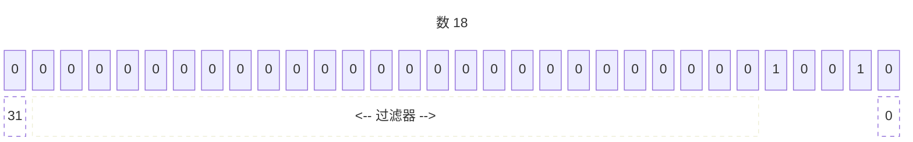
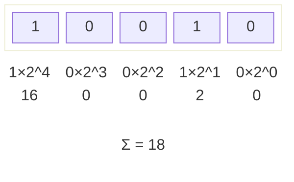
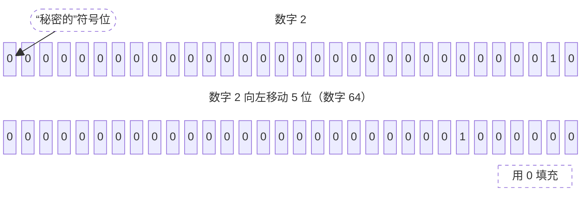
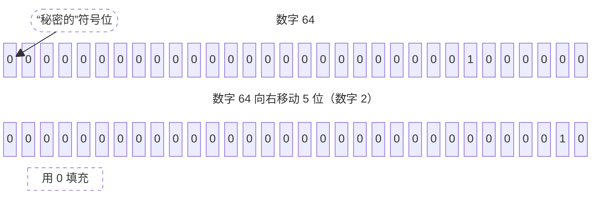

# ECMAScript 运算符
## ECMAScript 一元运算符
> 一元运算符只有一个参数，即要操作的对象或值。它们是 ECMAScript 中最简单的运算符。

### delete
delete 运算符删除对以前定义的对象属性或方法的引用。例如：

```js
var o = new Object;
o.name = "David";
console.log(o.name);	//输出 "David"
delete o.name;
console.log(o.name);	//输出 "undefined"
```

在这个例子中，删除了 `name` 属性，意味着强制解除对它的引用，将其设置为 `undefined`（即创建的未初始化的变量的值）。

`delete` 运算符不能删除开发者未定义的属性和方法。例如，下面的代码将引发错误：

```js
delete o.toString;
```

即使 `toString` 是有效的方法名，这行代码也会引发错误，因为 `toString()` 方法是原始的 ECMAScript 方法，不是开发者定义的。

### void
void 运算符对任何值返回 `undefined`。该运算符通常用于避免输出不应该输出的值，例如，从 HTML 的 `<a>` 元素调用 JavaScript 函数时。要正确做到这一点，函数不能返回有效值，否则浏览器将清空页面，只显示函数的结果。例如：

```html
<a href="javascript:window.open('about:blank')">Click me</a>
```

如果把这行代码放入 HTML 页面，点击其中的链接，即可看到屏幕上显示 "[object]"。

这是因为 `window.open()` 方法返回了新打开的窗口的引用。然后该对象将被转换成要显示的字符串。

要避免这种效果，可以用 `void` 运算符调用 `window.open()` 函数：

```html
<a href="javascript:void(window.open('about:blank'))">Click me</a>
```

这使 `window.open()` 调用返回 `undefined`，它不是有效值，不会显示在浏览器窗口中。

**提示：** 请记住，没有返回值的函数真正返回的都是 `undefined`。

### 前增量/前减量运算符
直接从 C（和 Java）借用的两个运算符是前增量运算符和前减量运算符。

所谓前增量运算符，就是数值上加 1，形式是在变量前放两个加号（`++`）：

```js
var iNum = 10;
++iNum;
```

第二行代码把 iNum 增加到了 11，它实质上等价于：

```js
var iNum = 10;
iNum = iNum + 1；
```

同样，前减量运算符是从数值上减 1，形式是在变量前放两个减号（`--`）：

```js
var iNum = 10;
--iNum;
```

在这个例子中，第二行代码把 iNum 的值减到 9。

在使用前缀式运算符时，注意增量和减量运算符都发生在计算表达式之前。考虑下面的例子：

```js
var iNum = 10;
--iNum;
console.log(iNum);	//输出 9
console.log(--iNum);	//输出 8
console.log(iNum);	//输出 8
```

第二行代码对 `iNum` 进行减量运算，第三行代码显示的结果是 `9`。第四行代码又对 `iNum` 进行减量运算，不过这次前减量运算和输出操作出现在同一个语句中，显示的结果是 `8`。为了证明已实现了所有的减量操作，第五行代码又输出一次 `8`。

在算术表达式中，前增量和前减量运算符的优先级是相同的，因此要按照从左到右的顺序计算之。例如：

```js
var iNum1 = 2;
var iNum2 = 20;
var iNum3 = --iNum1 + ++iNum2;	//等于 22
var iNum4 = iNum1 + iNum2;		//等于 22
```

在前面的代码中，`iNum3` 等于 `22`，因为表达式要计算的是 `1 + 21`。变量 `iNum4` 也等于 `22`，也是 `1 + 21`。

### 后增量/后减量运算符
还有两个直接从 C（和 Java）借用的运算符，即后增量运算符和后减量运算符。

后增量运算符也是给数值上加 1，形式是在变量后放两个加号（`++`）：

```js
var iNum = 10;
iNum++;
```

不出所料，后减量运算符也是从数值上减 1，形式为在变量后加两个减号（`--`）：

```js
var iNum = 10;
iNum--;
```

第二行代码把 `iNum` 的值减到 `9`。

与前缀式运算符不同的是，后缀式运算符是在计算过包含它们的表达式后才进行增量或减量运算的。考虑以下的例子：

```js
var iNum = 10;
iNum--;
console.log(iNum);	//输出 9
console.log(iNum--);	//输出 9
console.log(iNum);	//输出 8
```

与前缀式运算符的例子相似，第二行代码对 iNum 进行减量运算，第三行代码显示结果 `9`。第四行代码继续显示 `iNum` 的值，不过这次是在同一语句中应用减量运算符。由于减量运算发生在计算过表达式之后，所以这条语句显示的数是 `9`。执行了第五行代码后，控制台显示的是 `8`，因为在执行第四行代码之后和执行第五行代码之前，执行了后减量运算。

在算术表达式中，后增量和后减量运算符的优先级是相同的，因此要按照从左到右的顺序计算之。例如：

```js
var iNum1 = 2;
var iNum2 = 20;
var iNum3 = iNum1-- + iNum2++;	//等于 22
var iNum4 = iNum1 + iNum2;		//等于 22
```

在前面的代码中，iNum3 等于 22，因为表达式要计算的是 2 + 20。变量 iNum4 也等于 22，不过它计算的是 1 + 21，因为增量和减量运算都在给 iNum3 赋值后才发生。

### 一元加法和一元减法
大多数人都熟悉一元加法和一元减法，它们在 ECMAScript 中的用法与您高中数学中学到的用法相同。

一元加法本质上对数字无任何影响：

```js
var iNum = 20;
iNum = +iNum;
console.log(iNum);	//输出 20
```

这段代码对数字 `20` 应用了一元加法，返回的还是 `20`。

尽管一元加法对数字无作用，但对字符串却有有趣的效果，会把字符串转换成数字。

```js
var sNum = "20";
console.log(typeof sNum);	//输出 "string"
var iNum = +sNum;
console.log(typeof iNum);	//输出 "number"
```

这段代码把字符串 `"20"` 转换成真正的数字。当一元加法运算符对字符串进行操作时，它计算字符串的方式与 `parseInt()` 相似，主要的不同是只有对以 `"0x"` 开头的字符串（表示十六进制数字），一元运算符才能把它转换成十进制的值。因此，用一元加法转换 `"010"`，得到的总是 `10`，而 `"0xB"` 将被转换成 `11`。

另一方面，一元减法就是对数值求负（例如把 `20` 转换成 `-20`）：

```js
var iNum = 20;
iNum = -iNum;
console.log(iNum);	//输出 -20
```

与一元加法运算符相似，一元减法运算符也会把字符串转换成近似的数字，此外还会对该值求负。例如：

```js
var sNum = "20";
console.log(typeof sNum);	//输出 "string"
var iNum = -sNum;
console.log(iNum);		//输出 "-20"
console.log(typeof iNum);	//输出 "number"
```

在上面的代码中，一元减法运算符将把字符串 `"-20"` 转换成 `-20`（一元减法运算符对十六进制和十进制的处理方式与一元加法运算符相似，只是它还会对该值求负）。

## ECMAScript 位运算符
> 位运算符是在数字底层（即表示数字的 32 个数位）进行操作的。

> [!note]
>
> 前面已经提过，ECMAScript 中的整数已经不再这样存储，但是结果是类似的，这里尊重原文，不作改动。

### 重温整数

ECMAScript 整数有两种类型，即有符号整数（允许用正数和负数）和无符号整数（只允许用正数）。在 ECMAScript 中，所有整数字面量默认都是有符号整数，这意味着什么呢？

有符号整数使用 31 位表示整数的数值，用第 32 位表示整数的符号，0 表示正数，1 表示负数。数值范围从 -2147483648 到 2147483647。

可以以两种不同的方式存储二进制形式的有符号整数，一种用于存储正数，一种用于存储负数。正数是以真二进制形式存储的，前 31 位中的每一位都表示 2 的幂，从第 1 位（位 0）开始，表示 20，第 2 位（位 1）表示 21。没用到的位用 0 填充，即忽略不计。例如，下图展示的是数 18 的表示法。



18 的二进制版本只用了前 5 位，它们是这个数字的有效位。把数字转换成二进制字符串，就能看到有效位：

```js
var iNum = 18;
console.log(iNum.toString(2));	//输出 "10010"
```

这段代码只输出 `"10010"`，而不是 18 的 32 位表示。其他的数位并不重要，因为仅使用前 5 位即可确定这个十进制数值。如下图所示：



负数也存储为二进制代码，不过采用的形式是二进制补码。计算数字二进制补码的步骤有三步：

1. 确定该数字的非负版本的二进制表示（例如，要计算 `-18` 的二进制补码，首先要确定 `18` 的二进制表示）
2. 求得二进制反码，即要把 `0` 替换为 `1`，把 `1` 替换为 `0`
3. 在二进制反码上加 `1`

要确定 `-18` 的二进制表示，首先必须得到 18 的二进制表示，如下所示：

```
0000 0000 0000 0000 0000 0000 0001 0010
```

接下来，计算二进制反码，如下所示：

```
1111 1111 1111 1111 1111 1111 1110 1101
```

最后，在二进制反码上加 1，如下所示：

```
1111 1111 1111 1111 1111 1111 1110 1101
+                                     1
---------------------------------------
1111 1111 1111 1111 1111 1111 1110 1110
```

因此，`-18` 的二进制表示即 `1111 1111 1111 1111 1111 1111 1110 1110`。记住，在处理有符号整数时，开发者不能访问 31 位。

有趣的是，把负整数转换成二进制字符串后，ECMAScript 并不以二进制补码的形式显示，而是用数字绝对值的标准二进制代码前面加负号的形式输出。例如：

```js
var iNum = -18;
console.log(iNum.toString(2));	//输出 "-10010"
```

这段代码输出的是 `"-10010"`，而非二进制补码，这是为避免访问位 31。为了简便，ECMAScript 用一种简单的方式处理整数，使得开发者不必关心它们的用法。

另一方面，无符号整数把最后一位作为另一个数位处理。在这种模式中，第 32 位不表示数字的符号，而是值 231。由于这个额外的位，无符号整数的数值范围为 0 到 4294967295。对于小于 2147483647 的整数来说，无符号整数看来与有符号整数一样，而大于 2147483647 的整数则要使用位 31（在有符号整数中，这一位总是 0）。

把无符号整数转换成字符串后，只返回它们的有效位。

**注意：** 所有整数字面量都默认存储为有符号整数。只有 ECMAScript 的位运算符才能创建无符号整数。

### 位运算 NOT
位运算 NOT 由否定号（`~`）表示，它是 ECMAScript 中为数不多的与二进制算术有关的运算符之一。

位运算 NOT 是三步的处理过程：

把运算数转换成 32 位数字
把二进制数转换成它的二进制反码
把二进制数转换成浮点数
例如：

```js
var iNum1 = 25;		//25 等于 00000000000000000000000000011001
var iNum2 = ~iNum1;	//转换为 11111111111111111111111111100110
console.log(iNum2);		//输出 "-26"
```

位运算 NOT 等价于对数字求负，然后减 1，因此 25 变 -26。用下面的方法也可以得到同样的方法：

```js
var iNum1 = 25;
var iNum2 = -iNum1 -1;
console.log(iNum2);	//输出 -26
```

### 位运算 AND
位运算 AND 由和号（`&`）表示，直接对数字的二进制形式进行运算。它把每个数字中的数位对齐，然后用下面的规则对同一位置上的两个数位进行 AND 运算：

| 第一个数字中的数位 | 第二个数字中的数位 | 结果 |
| ------------------ | ------------------ | ---- |
| 1                  | 1                  | 1    |
| 1                  | 0                  | 0    |
| 0                  | 1                  | 0    |
| 0                  | 0                  | 0    |

例如，对数字 25 和 3 进行 AND 运算，代码如下所示：

```js
var iResult = 25 & 3;
console.log(iResult);	//输出 1
```

25 和 3 进行 AND 运算的结果是 1。为什么？分析如下：

```
 25 = 0000 0000 0000 0000 0000 0000 0001 1001
  3 = 0000 0000 0000 0000 0000 0000 0000 0011
---------------------------------------------
AND = 0000 0000 0000 0000 0000 0000 0000 0001
```

可以看出，在 25 和 3 中，只有一个数位（位 0）存放的都是 1，因此，其他数位生成的都是 0，所以结果为 1。

### 位运算 OR
位运算 OR 由符号（`|`）表示，也是直接对数字的二进制形式进行运算。在计算每位时，OR 运算符采用下列规则：

| 第一个数字中的数位 | 第二个数字中的数位 | 结果 |
| ------------------ | ------------------ | ---- |
| 1                  | 1                  | 1    |
| 1                  | 0                  | 1    |
| 0                  | 1                  | 1    |
| 0                  | 0                  | 0    |

仍然使用 AND 运算符所用的例子，对 25 和 3 进行 OR 运算，代码如下：

```js
var iResult = 25 | 3;
console.log(iResult);	//输出 "27"
```

25 和 3 进行 OR 运算的结果是 27：

```
25 = 0000 0000 0000 0000 0000 0000 0001 1001
 3 = 0000 0000 0000 0000 0000 0000 0000 0011
--------------------------------------------
OR = 0000 0000 0000 0000 0000 0000 0001 1011
```

可以看出，在两个数字中，共有 4 个数位存放的是 1，这些数位被传递给结果。二进制代码 11011 等于 27。

### 位运算 XOR
位运算 XOR 由符号（`^`）表示，当然，也是直接对二进制形式进行运算。XOR 不同于 OR，当只有一个数位存放的是 1 时，它才返回 1。真值表如下：

| 第一个数字中的数位 | 第二个数字中的数位 | 结果 |
| ------------------ | ------------------ | ---- |
| 1                  | 1                  | 0    |
| 1                  | 0                  | 1    |
| 0                  | 1                  | 1    |
| 0                  | 0                  | 0    |

对 25 和 3 进行 XOR 运算，代码如下：

```js
var iResult = 25 ^ 3;
console.log(iResult);	//输出 "26"
```

25 和 3 进行 XOR 运算的结果是 26：

```
 25 = 0000 0000 0000 0000 0000 0000 0001 1001
  3 = 0000 0000 0000 0000 0000 0000 0000 0011
---------------------------------------------
XOR = 0000 0000 0000 0000 0000 0000 0001 1010
```

可以看出，在两个数字中，共有 4 个数位存放的是 1，这些数位被传递给结果。二进制代码 `11010` 等于 `26`。

### 左移运算
左移运算由两个小于号表示（`<<`）。它把数字中的所有数位向左移动指定的数量。例如，把数字 2（等于二进制中的 10）左移 5 位，结果为 64（等于二进制中的 1000000）：

```js
var iOld = 2;		//等于二进制 10
var iNew = iOld << 5;	//等于二进制 1000000 十进制 64
```

**注意：** 在左移数位时，数字右边多出 5 个空位。左移运算用 0 填充这些空位，使结果成为完整的 32 位数字。



**注意：** 左移运算保留数字的符号位。例如，如果把 -2 左移 5 位，得到的是 -64，而不是 64。“符号仍然存储在第 32 位中吗？”是的，不过这在 ECMAScript 后台进行，开发者不能直接访问第 32 个数位。即使输出二进制字符串形式的负数，显示的也是负号形式（例如，-2 将显示 -10。）

### 有符号右移运算

有符号右移运算符由两个大于号表示（`>>`）。它把 32 位数字中的所有数位整体右移，同时保留该数的符号（正号或负号）。有符号右移运算符恰好与左移运算相反。例如，把 64 右移 5 位，将变为 2：

```js
var iOld = 64;		//等于二进制 1000000
var iNew = iOld >> 5;	//等于二进制 10 十进制 2
```

同样，移动数位后会造成空位。这次，空位位于数字的左侧，但位于符号位之后。ECMAScript 用符号位的值填充这些空位，创建完整的数字，如下图所示：



### 无符号右移运算

无符号右移运算符由三个大于号（`>>>`）表示，它将无符号 32 位数的所有数位整体右移。对于正数，无符号右移运算的结果与有符号右移运算一样。

用有符号右移运算中的例子，把 64 右移 5 位，将变为 2：

```js
var iOld = 64;		//等于二进制 1000000
var iNew = iOld >>> 5;	//等于二进制 10 十进制 2
```

对于负数，情况就不同了。

无符号右移运算用 0 填充所有空位。对于正数，这与有符号右移运算的操作一样，而负数则被作为正数来处理。

由于无符号右移运算的结果是一个 32 位的正数，所以负数的无符号右移运算得到的总是一个非常大的数字。例如，如果把 -64 右移 5 位，将得到 134217726。如何得到这种结果的呢？

要实现这一点，需要把这个数字转换成无符号的等价形式（尽管该数字本身还是有符号的），可以通过以下代码获得这种形式：

```js
var iUnsigned64 = -64 >>> 0;
```

然后，用 Number 类型的 toString() 获取它的真正的位表示，采用的基为 2：

```js
console.log(iUnsigned64.toString(2));
```

这将生成 `11111111111111111111111111000000`，即有符号整数 -64 的二进制补码表示，不过它等于无符号整数 4294967232。

出于这种原因，使用无符号右移运算符要小心。

## ECMAScript Boolean 运算符
> Boolean 运算符非常重要，它使得程序语言得以正常运行。

Boolean 运算符有三种：NOT、AND 和 OR。

### ToBoolean 操作
在学习各种逻辑运算符之前，让我们先了解一下 ECMAScript-262 v5 规范中描述的 ToBoolean 操作。

抽象操作 ToBoolean 将其参数按照下表中的规则转换为逻辑值：

| 参数类型  | 结果                                                            |
| --------- | --------------------------------------------------------------- |
| Undefined | `false`                                                         |
| Null      | `false`                                                         |
| Boolean   | 结果等于输入的参数（不转换）                                    |
| Number    | 如果参数为 `+0`, `-0` 或 `NaN`，则结果为 `false`；否则为 true。 |
| String    | 如果参数为空字符串，则结果为 `false`；否则为 `true`。           |
| Object    | `true`                                                          |

### 逻辑 NOT 运算符
在 ECMAScript 中，逻辑 NOT 运算符与 C 和 Java 中的逻辑 NOT 运算符相同，都由感叹号（`!`）表示。

与逻辑 OR 和逻辑 AND 运算符不同的是，逻辑 NOT 运算符返回的一定是 Boolean 值。

逻辑 NOT 运算符的行为如下：

- 如果运算数是对象，返回 `false`
- 如果运算数是数字 0，返回 `true`
- 如果运算数是 `0` 以外的任何数字，返回 `false`
- 如果运算数是 `null`，返回 `true`
- 如果运算数是 `NaN`，返回 `true`
- 如果运算数是 `undefined`，发生错误

**编者注：** 在浏览器的实现中，`!undefined` 通常返回 `true` 而不是出现错误，但是若对未定义的变量执行逻辑 NOT 运算，则会发生错误。

通常，该运算符用于控制循环：

```js
var bFound = false;
var i = 0;

while (!bFound) {
  if (aValue[i] == vSearchValues) {
    bFound = true;
  } else {
    i++;
  }
}
```

在这个例子中，Boolean 变量（`bFound`）用于记录检索是否成功。找到问题中的数据项时，`bFound` 将被设置为 `true`，`!bFound` 将等于 `false`，意味着运行将跳出 `while` 循环。

判断 ECMAScript 变量的 Boolean 值时，也可以使用逻辑 NOT 运算符。这样做需要在一行代码中使用两个 NOT 运算符。无论运算数是什么类型，第一个 NOT 运算符返回 Boolean 值。第二个 NOT 将对该 Boolean 值求负，从而给出变量真正的 Boolean 值。

```js
var bFalse = false;
var sRed = "red";
var iZero = 0;
var iThreeFourFive = 345;
var oObject = new Object;

document.write("bFalse 的逻辑值是 " + (!!bFalse));
document.write("sRed 的逻辑值是 " + (!!sRed));
document.write("iZero 的逻辑值是 " + (!!iZero));
document.write("iThreeFourFive 的逻辑值是 " + (!!iThreeFourFive));
document.write("oObject 的逻辑值是 " + (!!oObject));
```

结果：

```
bFalse 的逻辑值是 false
sRed 的逻辑值是 true
iZero 的逻辑值是 false
iThreeFourFive 的逻辑值是 true
oObject 的逻辑值是 true 
```

### 逻辑 AND 运算符
在 ECMAScript 中，逻辑 AND 运算符用双和号（`&&`）表示：

例如：

```js
var bTrue = true;
var bFalse = false;
var bResult = bTrue && bFalse;
```

下面的真值表描述了逻辑 AND 运算符的行为：

| 运算数 1 | 运算数 2 | 结果  |
| -------- | -------- | ----- |
| true     | true     | true  |
| true     | false    | false |
| false    | true     | false |
| false    | false    | false |

逻辑 AND 运算的运算数可以是任何类型的，不止是 Boolean 值。

如果某个运算数不是原始的 Boolean 型值，逻辑 AND 运算并不一定返回 Boolean 值：

- 如果一个运算数是对象，另一个是 Boolean 值，返回该对象。
- 如果两个运算数都是对象，返回第二个对象。
- 如果某个运算数是 null，返回 null。
- 如果某个运算数是 NaN，返回 NaN。
- 如果某个运算数是 undefined，发生错误。

**编者注：** 在浏览器的实现中，运算数中出现 `NaN` 时通常返回 `0` 而不是 `NaN`；运算数中出现 `undefined` 时通常返回 `undefined` 而不是出现错误，但若对未定义的变量执行逻辑 AND 运算，则会出现错误。

与 Java 中的逻辑 AND 运算相似，ECMAScript 中的逻辑 AND 运算也是简便运算，即如果第一个运算数决定了结果，就不再计算第二个运算数。对于逻辑 AND 运算来说，如果第一个运算数是 `false`，那么无论第二个运算数的值是什么，结果都不可能等于 `true`。

考虑下面的例子：

```js
var bTrue = true;
var bResult = (bTrue && bUnknown);	//发生错误
console.log(bResult);			//这一行不会执行
```

这段代码在进行逻辑 AND 运算时将引发错误，因为变量 `bUnknown` 是未定义的。变量 `bTrue` 的值为 `true`，因为逻辑 AND 运算将继续计算变量 `bUnknown`。这样做就会引发错误，因为 `bUnknown` 的值是 `undefined`，不能用于逻辑 AND 运算。

如果修改这个例子，把第一个数设为 `false`，那么就不会发生错误：

```js
var bFalse = false;
var bResult = (bFalse && bUnknown);
console.log(bResult);			//输出 "false"
```

在这段代码中，脚本将输出逻辑 AND 运算返回的值，即 `false`。即使变量 `bUnknown` 的未定义，它也不会被计算，因为第一个运算数的值是 `false`。

**提示：** 在使用逻辑 AND 运算符时，必须记住它的这种简便计算特性。

### 逻辑 OR 运算符
ECMAScript 中的逻辑 OR 运算符与 Java 中的相同，都由双竖线（`||`）表示：

```js
var bTrue = true;
var bFalse = false;
var bResult = bTrue || bFalse;
```

下面的真值表描述了逻辑 OR 运算符的行为：

| 运算数 1 | 运算数 2 | 结果  |
| -------- | -------- | ----- |
| true     | true     | true  |
| true     | false    | true  |
| false    | true     | true  |
| false    | false    | false |

与逻辑 AND 运算符相似，如果某个运算数不是 Boolean 值，逻辑 OR 运算并不一定返回 Boolean 值：

- 如果一个运算数是对象，并且该对象左边的运算数值均为 `false`，则返回该对象。
- 如果两个运算数都是对象，返回第一个对象。
- 如果最后一个运算数是 `null`，并且其他运算数值均为 `false`，则返回 `null`。
- 如果最后一个运算数是 `NaN`，并且其他运算数值均为 `false`，则返回 `NaN`。
- 如果某个运算数是 `undefined`，发生错误。

**编者注：** 在浏览器的实现中，最后一个运算数为 `undefined` 时通常返回 `undefined` 而不是出现错误，但若对未定义的变量执行逻辑 AND 运算，则会出现错误。

与逻辑 AND 运算符一样，逻辑 OR 运算也是简便运算。对于逻辑 OR 运算符来说，如果第一个运算数值为 true，就不再计算第二个运算数。

例如：

```js
var bTrue = true;
var bResult = (bTrue || bUnknown);
console.log(bResult);			//输出 true
```

与前面的例子相同，变量 `bUnknown` 是未定义的。不过，由于变量 `bTrue` 的值为 `true`，`bUnknown` 不会被计算，因此输出的是 `true`。

如果把 `bTrue` 改为 `false`，将发生错误：

```js
var bFalse = false;
var bResult = (bFalse || bUnknown);	//发生错误
console.log(bResult);			//不会执行这一行
```

## ECMAScript 乘性运算符
> ECMAScript 的乘性运算符与 Java、C、Perl 等于语言中的同类运算符的运算方式相似。
需要注意的是，乘性运算符还具有一些自动转换功能。

### 乘法运算符
乘法运算符由星号（`*`）表示，用于两数相乘。

ECMAScript 中的乘法语法与 C 语言中的相同：

```js
var iResult = 12 * 34
```

不过，在处理特殊值时，ECMAScript 中的乘法还有一些特殊行为：

- 如果结果太大或太小，那么生成的结果是 `Infinity` 或 `-Infinity`。
- 如果某个运算数是 `NaN`，结果为 `NaN`。
- `Infinity` 乘以 0，结果为 `NaN`。
- `Infinity` 乘以 0 以外的任何数字，结果为 `Infinity` 或 `-Infinity`。
- `Infinity` 乘以 `Infinity`，结果为 `Infinity`。

**注释：** 如果运算数是数字，那么执行常规的乘法运算，即两个正数或两个负数为正数，两个运算数符号不同，结果为负数。

### 除法运算符
除法运算符由斜杠（`/`）表示，用第二个运算数除第一个运算数：

```js
var iResult = 88 /11;
```

与乘法运算符相似，在处理特殊值时，除法运算符也有一些特殊行为：

- 如果结果太大或太小，那么生成的结果是 `Infinity` 或 `-Infinity`。
- 如果某个运算数是 `NaN`，结果为 `NaN`。
- `Infinity` 除以 `Infinity`，结果为 `NaN`。
- 一个任何非无穷大的数字除以 0，结果为 `NaN`。
- `Infinity` 除以 0 以外的任何数字，结果为 `Infinity` 或 `-Infinity`。

**注释：** 如果运算数是数字，那么执行常规的除法运算，即两个正数或两个负数为正数，两个运算数符号不同，结果为负数。

**编者注：** 浏览器实现中，任何正数除以 `+0`，结果为 `Infinity`，任何正数除以 `-0`，结果为 `-Infinity`；任何负数除以 `+0`，结果为 `-Infinity`，任何负数除以 `-0`，结果为 `Infinity`。部分参考书利用此特性判断 `+0` 和 `-0`，但更推荐的方法是使用 `Object.is()` 判断。

### 取模运算符
取模（余数）运算符由百分号（`%`）表示，使用方法如下：

```js
var iResult = 26%5; //等于 1
```

与其他乘性运算符相似，对于特殊值，取模运算符也有特殊的行为：

- 如果被除数是 `Infinity`，或除数是 `0`，结果为 `NaN`。
- `Infinity` 除以 `Infinity`，结果为 `NaN`。
- 如果除数是无穷大的数，结果为被除数。
- 如果被除数为 0，结果为 0。

**注释：** 如果运算数是数字，那么执行常规的算术除法运算，返回除法运算得到的余数。

## ECMAScript 加性运算符
> 在多数程序设计语言中，加性运算符（即加号或减号）通常是最简单的数学运算符。

在 ECMAScript 中，加性运算符有大量的特殊行为。

### 加法运算符
加法运算符由加号（`+`）表示：

```js
var iResult = 1 + 2
```

与乘性运算符一样，在处理特殊值时，ECMAScript 中的加法也有一些特殊行为：

- 某个运算数是 `NaN`，那么结果为 `NaN`。
- `Infinity` 加 `Infinity`，结果为 `Infinity`。
- `-Infinity` 加 `-Infinity`，结果为 `-Infinity`。
- `Infinity` 加 `-Infinity`，结果为 `NaN`。
- `+0` 加 `+0`，结果为 `+0`。
- `-0` 加 `+0`，结果为 `+0`。
- `-0` 加 `-0`，结果为 `-0`。

不过，如果某个运算数是字符串，那么采用下列规则：

- 如果两个运算数都是字符串，把第二个字符串连接到第一个上。
- 如果只有一个运算数是字符串，把另一个运算数转换成字符串，结果是两个字符串连接成的字符串。

例如：

```js
var result = 5 + 5;	//两个数字
console.log(result);		//输出 10
var result2 = 5 + "5";	//一个数字和一个字符串
console.log(result2);		//输出 "55"
```

这段代码说明了加法运算符的两种模式之间的差别。正常情况下，5+5 等于 `10`（原始数值），如上述代码中前两行所示。不过，如果把一个运算数改为字符串 `"5"`，那么结果将变为 `"55"`（原始的字符串值），因为另一个运算数也会被转换为字符串。

**注意：** 为了避免 JavaScript 中的一种常见错误，在使用加法运算符时，一定要仔细检查运算数的数据类型。

### 减法运算符
减法运算符（`-`），也是一个常用的运算符：

```js
var iResult = 2 - 1;
```

与加法运算符一样，在处理特殊值时，减法运算符也有一些特殊行为：

- 某个运算数是 `NaN`，那么结果为 `NaN`。
- `Infinity` 减 `Infinity`，结果为 `NaN`。
- `-Infinity` 减 `-Infinity`，结果为 `NaN`。
- `Infinity` 减 `-Infinity`，结果为 `Infinity`。
- `-Infinity` 减 `Infinity`，结果为 `-Infinity`。
- `+0` 减 `+0`，结果为 `+0`。
- `-0` 减 `-0`，结果为 `-0`。
- `+0` 减 `-0`，结果为 `+0`。
- 某个运算符不是数字，那么结果为 `NaN`。

**注释：**如果运算数都是数字，那么执行常规的减法运算，并返回结果。

## ECMAScript 关系运算符
> 关系运算符执行的是比较运算。每个关系运算符都返回一个布尔值。

### 常规比较方式
关系运算符小于、大于、小于等于和大于等于执行的是两个数的比较运算，比较方式与算术比较运算相同。

每个关系运算符都返回一个布尔值：

```js
var bResult1 = 2 > 1	//true
var bResult2 = 2 < 1	//false
```

不过，对两个字符串应用关系运算符，它们的行为则不同。许多人认为小于表示“在字母顺序上靠前”，大于表示“在字母顺序上靠后”，但事实并非如此。对于字符串，第一个字符串中每个字符的代码都与会第二个字符串中对应位置的字符的代码进行数值比较。完成这种比较操作后，返回一个 Boolean 值。问题在于大写字母的代码都小于小写字母的代码，这意味这着可能会遇到下列情况：

```js
var bResult = "Blue" < "alpha";
console.log(bResult);	//输出 true
```

在上面的例子中，字符串 `"Blue"` 小于 `"alpha"`，因为字母 B 的字符代码是 66，字母 a 的字符代码是 97。要强制性得到按照真正的字母顺序比较的结果，必须把两个数转换成相同的大小写形式（全大写或全小写的），然后再进行比较：

```js
var bResult = "Blue".toLowerCase() < "alpha".toLowerCase();
console.log(bResult);	//输出 false
```

把两个运算数都转换成小写，确保了正确识别出 `"alpha"` 在字母顺序上位于 `"Blue"` 之前。

### 比较数字和字符串
另一种棘手的状况发生在比较两个字符串形式的数字时，比如：

```js
var bResult = "25" < "3";
console.log(bResult);	//输出 "true"
```

上面这段代码比较的是字符串 `"25"` 和 `"3"`。两个运算数都是字符串，所以比较的是它们的字符代码（`"2"` 的字符代码是 `50`，`"3"` 的字符代码是 `51`）。

不过，如果把某个运算数该为数字，那么结果就有趣了：

```js
var bResult = "25" < 3;
console.log(bResult);	//输出 "false"
```

这里，字符串 `"25"` 将被转换成数字 `25`，然后与数字 `3` 进行比较，结果不出所料。

无论何时比较一个数字和一个字符串，ECMAScript 都会把字符串转换成数字，然后按照数字顺序比较它们。

不过，如果字符串不能转换成数字又该如何呢？考虑下面的例子：

```js
var bResult = "a" < 3;
console.log(bResult);
```

你能预料到这段代码输出什么吗？字母 `"a"` 不能转换成有意义的数字。不过，如果对它调用 `parseInt()` 方法，返回的是 `NaN`。根据规则，任何包含 `NaN` 的关系运算符都要返回 `false`，因此这段代码也输出 `false`：

```js
var bResult = "a" >= 3;
console.log(bResult);
```

通常，如果小于运算的两个值返回 `false`，那么大于等于运算必须返回 `true`，不过如果某个数字是 `NaN`，情况则非如此。

## ECMAScript 等性运算符
> 判断两个变量是否相等是程序设计中非常重要的运算。在处理原始值时，这种运算相当简单，但涉及对象，任务就稍有点复杂。

ECMAScript 提供了两套等性运算符：等号和非等号用于处理原始值，全等号和非全等号用于处理对象。

### 等号和非等号
在 ECMAScript 中，等号由双等号（`==`）表示，当且仅当两个运算数相等时，它返回 `true`。非等号由感叹号加等号（`!=`）表示，当且仅当两个运算数不相等时，它返回 `true`。为确定两个运算数是否相等，这两个运算符都会进行类型转换。

执行类型转换的规则如下：

- 如果一个运算数是 Boolean 值，在检查相等性之前，把它转换成数字值。`false` 转换成 0，`true` 为 1。
- 如果一个运算数是字符串，另一个是数字，在检查相等性之前，要尝试把字符串转换成数字。
- 如果一个运算数是对象，另一个是字符串，在检查相等性之前，要尝试把对象转换成字符串。
- 如果一个运算数是对象，另一个是数字，在检查相等性之前，要尝试把对象转换成数字。

在比较时，该运算符还遵守下列规则：

- 值 `null` 和 `undefined` 相等。
- 在检查相等性时，不能把 `null` 和 `undefined` 转换成其他值。
- 如果某个运算数是 `NaN`，等号将返回 `false`，非等号将返回 `true`。
- 如果两个运算数都是对象，那么比较的是它们的引用值。如果两个运算数指向同一对象，那么等号返回 `true`，否则两个运算数不等。

**重要提示：** 即使两个数都是 `NaN`，等号仍然返回 `false`，因为根据规则，`NaN` 不等于 `NaN`。

下表列出了一些特殊情况，以及它们的结果：

| 表达式               | 值    |
| -------------------- | ----- |
| `null == undefined`  |`true` |
| `"NaN" == NaN`       | `false` |
| `NaN == NaN`         | `false` |
| `NaN != NaN`         |`true` |
| `0 == false`         |`true` |
| `[] == 0`            |`true` |
| `'0' == 0`           |`true` |
| `[] == false`        |`true` |
| `'0' == false`       |`true` |
| `[] == '0'`          | `false` |
| `true == 1`          |`true` |
| `true == 2`          | `false` |
| `undefined == 0`     | `false` |
| `undefined == false` | `false` |
| `null == false`      | `false` |
| `null == 0`          | `false` |
| `"5" == 5`           |`true` |

### 全等号和非全等号
等号和非等号的同类运算符是全等号和非全等号。这两个运算符所做的与等号和非等号相同，只是它们在检查相等性前，不执行类型转换。

全等号由三个等号表示（`===`），只有在无需类型转换运算数就相等的情况下，才返回 `true`。

例如：

```js
var sNum = "66";
var iNum = 66;
console.log(sNum == iNum);	//输出 true
console.log(sNum === iNum);	//输出 false
```

在这段代码中，第一个 `console.log` 使用等号来比较字符串 `"66"` 和数字 `66`，输出 `true`。如前所述，这是因为字符串 `"66"` 将被转换成数字 `66`，然后才与另一个数字 `66` 进行比较。第二个 `console.log` 使用全等号在没有类型转换的情况下比较字符串和数字，当然，字符串不等于数字，所以输出 `false`。

非全等号由感叹号加两个等号（`!==`）表示，只有在无需类型转换运算数不相等的情况下，才返回 true。

例如：

```js
var sNum = "66";
var iNum = 66;
console.log(sNum != iNum);	//输出 false
console.log(sNum !== iNum);	//输出 true
```

这里，第一个 `console.log` 使用非等号，把字符串 `"66"` 转换成数字 `66`，使得它与第二个运算数 `66` 相等。因此，计算结果为 `false`，因为两个运算数是相等的。第二个 `console.log` 使用的非全等号。该运算是在问：`sNum` 与 `iNum` 不同吗？这个问题的答案是：是的（`true`），因为 `sNum` 是字符串，而 `iNum` 是数字，它们当然不同。

> [!note]
>
> 平时应当尽量使用 `===` 和 `!==` 替代 `==` 和 `!=`，避免隐式类型转换带来的问题。有一个经典的故事：
>
> ```js
> 0 == '0';  //true
> 0 == [];   //true
> [] == '0'; //false
> ```
>
> 就是强制类型转换的锅。如果换成 `===`，三者的结果都是 false。

## ECMAScript 条件运算符
### 条件运算符
> 条件运算符是 ECMAScript 中功能最多的运算符，它的形式与 Java 中的相同。

```js
variable = boolean_expression ? true_value : false_value;
```

该表达式主要是根据 `boolean_expression` 的计算结果有条件地为变量赋值。如果 `Boolean_expression` 为 `true`，就把 `true_value` 赋给变量；如果它是 `false`，就把 `false_value` 赋给变量。

例如：

```js
var iMax = (iNum1 > iNum2) ? iNum1 : iNum2;
```

在这里例子中，`iMax` 将被赋予数字中的最大值。表达式声明如果 `iNum1` 大于 `iNum2`，则把 `iNum1` 赋予 `iMax`。但如果表达式为 `false`（即 `iNum2` 大于或等于 `iNum1`），则把 `iNum2` 赋予 `iMax`。

> [!note]
>
> 三元运算符的优先级比较低。应用时注意要不要加括号。

## ECMAScript 赋值运算符

### 赋值运算符
简单的赋值运算符由等号（`=`）实现，只是把等号右边的值赋予等号左边的变量。

例如：

```js
var iNum = 10;
```

复合赋值运算是由乘性运算符、加性运算符或位移运算符加等号（`=`）实现的。这些赋值运算符是下列这些常见情况的缩写形式：

```js
var iNum = 10;
iNum = iNum + 10；
```

可以用一个复合赋值运算符改写第二行代码：

```js
var iNum = 10;
iNum += 10；
```

每种主要的算术运算以及其他几个运算都有复合赋值运算符：

- 乘法/赋值（`*=`）
- 除法/赋值（`/=`）
- 取模/赋值（`%=`）
- 加法/赋值（`+=`）
- 减法/赋值（`-=`）
- 左移/赋值（`<<=`）
- 有符号右移/赋值（`>>=`）
- 无符号右移/赋值（`>>>=`）
- 无符号左移/赋值（`<<<=`）
## ECMAScript 逗号运算符
### 逗号运算符
用逗号运算符可以在一条语句中执行多个运算。

例如：

```js
var iNum1 = 1, iNum = 2, iNum3 = 3;
```

逗号运算符常用变量声明中。

> [!note]
>
> 逗号比较微妙，其作用要看上下文。如果你觉得根据上下文，它实在没有什么作用，那表达式的结果就是最后一个值。
>
> ```js
> let arr = [ 1, 2, 3 ]; // 数组，有意义
> let object = { foo:'someValue', bar:'otherValue' }; // 对象，有意义
> let a = 1, b = 2; // 声明变量，有意义
> 1, 2, 3; // ???，输出 3
> ```
