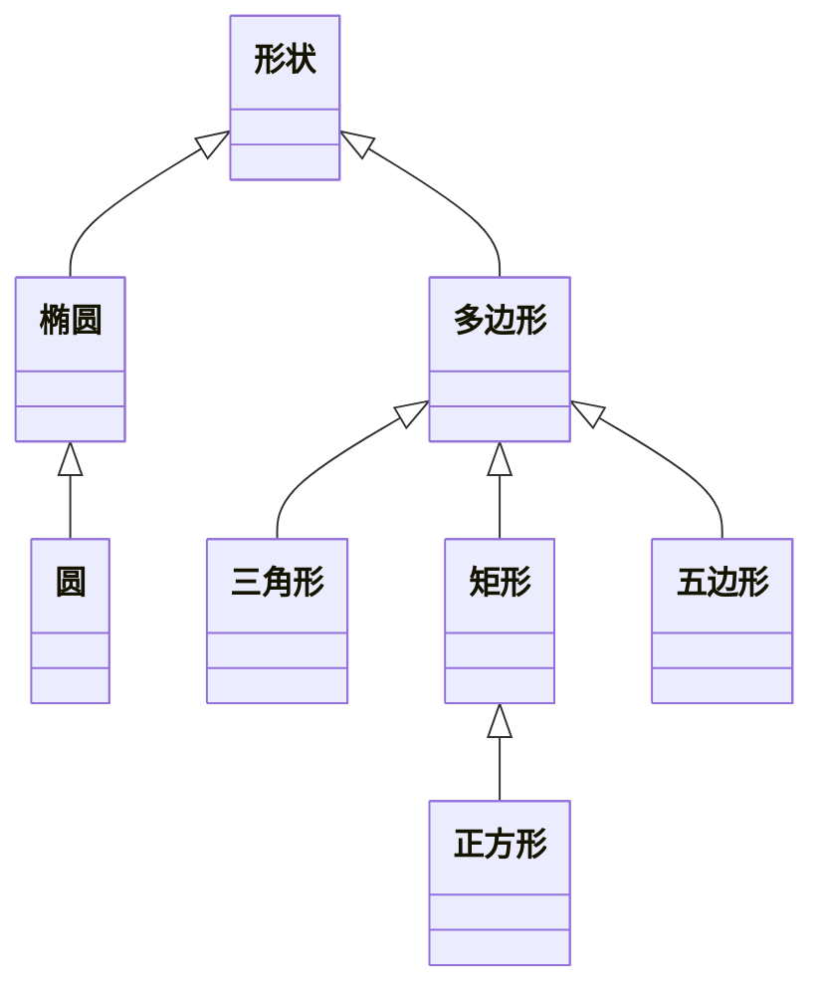

# ECMAScript 面向对象技术
## ECMAScript 对象
### 面向对象术语
#### 对象
ECMA-262 把对象（object）定义为“属性的无序集合，每个属性存放一个原始值、对象或函数”。严格来说，这意味着对象是无特定顺序的值的数组。

尽管 ECMAScript 如此定义对象，但它更通用的定义是基于代码的名词（人、地点或事物）的表示。

#### 类
每个对象都由类定义，可以把类看做对象的配方。类不仅要定义对象的接口（interface）（开发者访问的属性和方法），还要定义对象的内部工作（使属性和方法发挥作用的代码）。编译器和解释程序都根据类的说明构建对象。

#### 实例
程序使用类创建对象时，生成的对象叫作类的实例（instance）。对类生成的对象的个数的唯一限制来自于运行代码的机器的物理内存。每个实例的行为相同，但实例处理一组独立的数据。由类创建对象实例的过程叫做实例化（instantiation）。

在前面的章节我们提到过，ECMAScript 并没有正式的类。相反，ECMA-262 把对象定义描述为对象的配方。这是 ECMAScript 逻辑上的一种折中方案，因为对象定义实际上是对象自身。即使类并不真正存在，我们也把对象定义叫做类，因为大多数开发者对此术语更熟悉，而且从功能上说，两者是等价的。

### 面向对象语言的要求
一种面向对象语言需要向开发者提供四种基本能力：

- 封装 - 把相关的信息（无论数据或方法）存储在对象中的能力；
- 聚集 - 把一个对象存储在另一个对象内的能力；
- 继承 - 由另一个类（或多个类）得来类的属性和方法的能力；
- 多态 - 编写能以多种方法运行的函数或方法的能力。

ECMAScript 支持这些要求，因此可被是看做面向对象的。

### 对象的构成
在 ECMAScript 中，对象由特性（attribute）构成，特性可以是原始值，也可以是引用值。如果特性存放的是函数，它将被看作对象的方法（method），否则该特性被看作对象的属性（property）。

## ECMAScript 对象应用
> 对象的创建和销毁都在 JavaScript 执行过程中发生，理解这种范式的含义对理解整个语言至关重要。

### 声明和实例化
对象的创建方式是用关键字 new 后面跟上实例化的类的名字：

```js
var oObject = new Object();
var oStringObject = new String();
```

第一行代码创建了 Object 类的一个实例，并把它存储到变量 `oObject` 中。第二行代码创建了 String 类的一个实例，把它存储在变量 `oStringObject` 中。如果构造函数无参数，括号则不是必需的。因此可以采用下面的形式重写上面的两行代码：

```js
var oObject = new Object;
var oStringObject = new String;
```

### 对象引用

在前面的章节中，我们介绍了引用类型的概念。在 ECMAScript 中，不能访问对象的物理表示，只能访问对象的引用。每次创建对象，存储在变量中的都是该对象的引用，而不是对象本身。

### 对象废除
ECMAScript 拥有无用存储单元收集程序（garbage collection routine），意味着不必专门销毁对象来释放内存。当再没有对对象的引用时，称该对象被废除（dereference）了。运行无用存储单元收集程序时，所有废除的对象都被销毁。每当函数执行完它的代码，无用存储单元收集程序都会运行，释放所有的局部变量，还有在一些其他不可预知的情况下，无用存储单元收集程序也会运行。

把对象的所有引用都设置为 null，可以强制性地废除对象。例如：

```js
var oObject = new Object;
// do something with the object here
oObject = null;
```

当变量 oObject 设置为 null 后，对第一个创建的对象的引用就不存在了。这意味着下次运行无用存储单元收集程序时，该对象将被销毁。

每用完一个对象后，就将其废除，来释放内存，这是个好习惯。这样还确保不再使用已经不能访问的对象，从而防止程序设计错误的出现。此外，旧的浏览器（如 IE/MAC）没有全面的无用存储单元收集程序，所以在卸载页面时，对象可能不能被正确销毁。废除对象和它的所有特性是确保内存使用正确的最好方法。

**注意：** 废除对象的所有引用时要当心。如果一个对象有两个或更多引用，则要正确废除该对象，必须将其所有引用都设置为 `null`。

### 早绑定和晚绑定
所谓绑定（binding），即把对象的接口与对象实例结合在一起的方法。

早绑定（early binding）是指在实例化对象之前定义它的属性和方法，这样编译器或解释程序就能够提前转换机器代码。在 Java 和 Visual Basic 这样的语言中，有了早绑定，就可以在开发环境中使用 `IntelliSense`（即给开发者提供对象中属性和方法列表的功能）。ECMAScript 不是强类型语言，所以不支持早绑定。

另一方面，晚绑定（late binding）指的是编译器或解释程序在运行前，不知道对象的类型。使用晚绑定，无需检查对象的类型，只需检查对象是否支持属性和方法即可。ECMAScript 中的所有变量都采用晚绑定方法。这样就允许执行大量的对象操作，而无任何惩罚。

## ECMAScript 对象类型
在 ECMAScript 中，所有对象并非同等创建的。

一般来说，可以创建并使用的对象有三种：本地对象、内置对象和宿主对象。

### 本地对象
ECMA-262 把本地对象（native object）定义为“独立于宿主环境的 ECMAScript 实现提供的对象”。简单来说，本地对象就是 ECMA-262 定义的类（引用类型）。它们包括：

- Object
- Function
- Array
- String
- Boolean
- Number
- Date
- RegExp
- Error
- EvalError
- RangeError
- ReferenceError
- SyntaxError
- TypeError
- URIError

### 内置对象
ECMA-262 把内置对象（built-in object）定义为“由 ECMAScript 实现提供的、独立于宿主环境的所有对象，在 ECMAScript 程序开始执行时出现”。这意味着开发者不必明确实例化内置对象，它已被实例化了。ECMA-262 只定义了两个内置对象，即 Global 和 Math （它们也是本地对象，根据定义，每个内置对象都是本地对象）。

### 宿主对象
所有非本地对象都是宿主对象（host object），即由 ECMAScript 实现的宿主环境提供的对象。

所有 BOM 和 DOM 对象都是宿主对象。

## ECMAScript 对象作用域
> 作用域指的是变量的适用范围。

### 公用、私有和受保护作用域
#### 概念
在传统的面向对象程序设计中，主要关注于公用和私有作用域。公用作用域中的对象属性可以从对象外部访问，即开发者创建对象的实例后，就可使用它的公用属性。而私有作用域中的属性只能在对象内部访问，即对于外部世界来说，这些属性并不存在。这意味着如果类定义了私有属性和方法，则它的子类也不能访问这些属性和方法。

受保护作用域也是用于定义私有的属性和方法，只是这些属性和方法还能被其子类访问。

#### ECMAScript 只有公用作用域
对 ECMAScript 讨论上面这些作用域几乎毫无意义，因为 ECMAScript 中只存在一种作用域——公用作用域。ECMAScript 中的所有对象的所有属性和方法都是公用的。因此，定义自己的类和对象时，必须格外小心。记住，所有属性和方法默认都是公用的！

#### 建议性的解决方法
许多开发者都在网上提出了有效的属性作用域模式，解决了 ECMAScript 的这种问题。

由于缺少私有作用域，开发者确定了一个规约，说明哪些属性和方法应该被看做私有的。这种规约规定在属性前后加下划线：

```js
obj._color_ = "blue";
```

这段代码中，属性 color 是私有的。注意，下划线并不改变属性是公用属性的事实，它只是告诉其他开发者，应该把该属性看作私有的。

有些开发者还喜欢用单下划线说明私有成员，例如：`obj._color`。

### 静态作用域
静态作用域定义的属性和方法任何时候都能从同一位置访问。在 Java 中，类可具有属性和方法，无需实例化该类的对象，即可访问这些属性和方法，例如 `java.net.URLEncoder` 类，它的函数 `encode()` 就是静态方法。

#### ECMAScript 没有静态作用域
严格来说，ECMAScript 并没有静态作用域。不过，它可以给构造函数提供属性和方法。还记得吗，构造函数只是函数。函数是对象，对象可以有属性和方法。例如：

```js
function sayHello() {
  console.log("hello");
}

sayHello.alternate = function() {
  console.log("hi");
}

sayHello();		//输出 "hello"
sayHello.alternate();	//输出 "hi"
```

这里，方法 `alternate()` 实际上是函数 `sayHello` 的方法。可以像调用常规函数一样调用 `sayHello()` 输出 `"hello"`，也可以调用 `sayHello.alternate()` 输出 `"hi"`。即使如此，`alternate()` 也是 `sayHello()` 公用作用域中的方法，而不是静态方法。

### 关键字 this
#### this 的功能
在 ECMAScript 中，要掌握的最重要的概念之一是关键字 `this` 的用法，它用在对象的方法中。关键字 `this` 总是指向调用该方法的对象，例如：

```js
var oCar = new Object;
oCar.color = "red";
oCar.showColor = function() {
  console.log(this.color);
};

oCar.showColor();		//输出 "red"
```

在上面的代码中，关键字 `this` 用在对象的 `showColor()` 方法中。在此环境中，`this` 等于 `oCar`。下面的代码与上面的代码的功能相同：

```js
var oCar = new Object;
oCar.color = "red";
oCar.showColor = function() {
  console.log(oCar.color);
};

oCar.showColor();		//输出 "red"
```

#### 使用 this 的原因
为什么使用 `this` 呢？因为在实例化对象时，总是不能确定开发者会使用什么样的变量名。使用 `this`，即可在任何多个地方重用同一个函数。请思考下面的例子：

```js
function showColor() {
  console.log(this.color);
};

var oCar1 = new Object;
oCar1.color = "red";
oCar1.showColor = showColor;

var oCar2 = new Object;
oCar2.color = "blue";
oCar2.showColor = showColor;

oCar1.showColor();		//输出 "red"
oCar2.showColor();		//输出 "blue"
```

在上面的代码中，首先用 `this` 定义函数 `showColor()`，然后创建两个对象（`oCar1` 和 `oCar2`），一个对象的 `color` 属性被设置为 `"red"`，另一个对象的 `color` 属性被设置为 `"blue"`。两个对象都被赋予了属性 `showColor`，指向原始的 `showColor()` 函数（注意这里不存在命名问题，因为一个是全局函数，而另一个是对象的属性）。调用每个对象的 `showColor()`，`oCar1` 输出是 `"red"`，而 `oCar2` 的输出是 `"blue"`。这是因为调用 `oCar1.showColor()` 时，函数中的 `this` 关键字等于 `oCar1`。调用 `oCar2.showColor()` 时，函数中的 `this` 关键字等于 `oCar2`。

**注意：** 引用对象的属性时，必须使用 `this` 关键字。例如，如果采用下面的代码，`showColor()` 方法不能运行：

```js
function showColor() {
  console.log(color);
};
```

如果不用对象或 `this` 关键字引用变量，ECMAScript 就会把它看作局部变量或全局变量。然后该函数将查找名为 `color` 的局部或全局变量，但是不会找到。结果如何呢？该函数将在警告中显示 `"null"`。

## ECMAScript 定义类或对象
> 使用预定义对象只是面向对象语言的能力的一部分，它真正强大之处在于能够创建自己专用的类和对象。

ECMAScript 拥有很多创建对象或类的方法。

### 工厂方式
#### 原始的方式
因为对象的属性可以在对象创建后动态定义，所有许多开发者都在 JavaScript 最初引入时编写类似下面的代码：

```js
var oCar = new Object;
oCar.color = "blue";
oCar.doors = 4;
oCar.mpg = 25;
oCar.showColor = function() {
  console.log(this.color);
};
```

在上面的代码中，创建对象 `car`。然后给它设置几个属性：它的颜色是蓝色，有四个门，每加仑油可以跑 25 英里。最后一个属性实际上是指向函数的指针，意味着该属性是个方法。执行这段代码后，就可以使用对象 car。

不过这里有一个问题，就是可能需要创建多个 `car` 的实例。

#### 解决方案：工厂方式
要解决该问题，开发者创造了能创建并返回特定类型的对象的工厂函数（factory function）。

例如，函数 createCar() 可用于封装前面列出的创建 car 对象的操作：

```js
function createCar() {
  var oTempCar = new Object;
  oTempCar.color = "blue";
  oTempCar.doors = 4;
  oTempCar.mpg = 25;
  oTempCar.showColor = function() {
    console.log(this.color);
  };
  return oTempCar;
}

var oCar1 = createCar();
var oCar2 = createCar();
```

在这里，第一个例子中的所有代码都包含在 `createCar()` 函数中。此外，还有一行额外的代码，返回 `car` 对象（`oTempCar`）作为函数值。调用此函数，将创建新对象，并赋予它所有必要的属性，复制出一个我们在前面说明过的 `car` 对象。因此，通过这种方法，我们可以很容易地创建 `car` 对象的两个版本（`oCar1` 和 `oCar2`），它们的属性完全一样。

#### 为函数传递参数
我们还可以修改 `createCar()` 函数，给它传递各个属性的默认值，而不是简单地赋予属性默认值：

```js
function createCar(sColor,iDoors,iMpg) {
  var oTempCar = new Object;
  oTempCar.color = sColor;
  oTempCar.doors = iDoors;
  oTempCar.mpg = iMpg;
  oTempCar.showColor = function() {
    console.log(this.color);
  };
  return oTempCar;
}

var oCar1 = createCar("red",4,23);
var oCar2 = createCar("blue",3,25);

oCar1.showColor();		//输出 "red"
oCar2.showColor();		//输出 "blue"
```

给 `createCar()` 函数加上参数，即可为要创建的 `car` 对象的 `color`、`doors` 和 `mpg` 属性赋值。这使两个对象具有相同的属性，却有不同的属性值。

#### 在工厂函数外定义对象的方法
虽然 ECMAScript 越来越正式化，但创建对象的方法却被置之不理，且其规范化至今还遭人反对。一部分是语义上的原因（它看起来不像使用带有构造函数 new 运算符那么正规），一部分是功能上的原因。功能原因在于用这种方式必须创建对象的方法。前面的例子中，每次调用函数 `createCar()`，都要创建新函数 `showColor()`，意味着每个对象都有自己的 `showColor()` 版本。而事实上，每个对象都共享同一个函数。

有些开发者在工厂函数外定义对象的方法，然后通过属性指向该方法，从而避免这个问题：

```js
function showColor() {
  console.log(this.color);
}

function createCar(sColor,iDoors,iMpg) {
  var oTempCar = new Object;
  oTempCar.color = sColor;
  oTempCar.doors = iDoors;
  oTempCar.mpg = iMpg;
  oTempCar.showColor = showColor;
  return oTempCar;
}

var oCar1 = createCar("red",4,23);
var oCar2 = createCar("blue",3,25);

oCar1.showColor();		//输出 "red"
oCar2.showColor();		//输出 "blue"
```

在上面这段重写的代码中，在函数 `createCar()` 之前定义了函数 `showColor()`。在 `createCar()` 内部，赋予对象一个指向已经存在的 `showColor()` 函数的指针。从功能上讲，这样解决了重复创建函数对象的问题；但是从语义上讲，该函数不太像是对象的方法。

所有这些问题都引发了**开发者定义**的构造函数的出现。

### 构造函数方式
创建构造函数就像创建工厂函数一样容易。第一步选择类名，即构造函数的名字。根据惯例，这个名字的首字母大写，以使它与首字母通常是小写的变量名分开。除了这点不同，构造函数看起来很像工厂函数。请考虑下面的例子：

```js
function Car(sColor,iDoors,iMpg) {
  this.color = sColor;
  this.doors = iDoors;
  this.mpg = iMpg;
  this.showColor = function() {
    console.log(this.color);
  };
}

var oCar1 = new Car("red",4,23);
var oCar2 = new Car("blue",3,25);
```

下面为您解释上面的代码与工厂方式的差别。首先在构造函数内没有创建对象，而是使用 `this` 关键字。使用 `new` 运算符构造函数时，在执行第一行代码前先创建一个对象，只有用 `this` 才能访问该对象。然后可以直接赋予 `this` 属性，默认情况下是构造函数的返回值（不必明确使用 `return` 运算符）。

现在，用 `new` 运算符和类名 `Car` 创建对象，就更像 ECMAScript 中一般对象的创建方式了。

你也许会问，这种方式在管理函数方面是否存在于前一种方式相同的问题呢？是的。

就像工厂函数，构造函数会重复生成函数，为每个对象都创建独立的函数版本。不过，与工厂函数相似，也可以用外部函数重写构造函数，同样地，这么做语义上无任何意义。这正是下面要讲的原型方式的优势所在。

### 原型方式
该方式利用了对象的 prototype 属性，可以把它看成创建新对象所依赖的原型。

这里，首先用空构造函数来设置类名。然后所有的属性和方法都被直接赋予 prototype 属性。我们重写了前面的例子，代码如下：

```js
function Car() {
}

Car.prototype.color = "blue";
Car.prototype.doors = 4;
Car.prototype.mpg = 25;
Car.prototype.showColor = function() {
  console.log(this.color);
};

var oCar1 = new Car();
var oCar2 = new Car();
```

在这段代码中，首先定义构造函数（`Car`），其中无任何代码。接下来的几行代码，通过给 `Car` 的 `prototype` 属性添加属性去定义 `Car` 对象的属性。调用 `new Car()` 时，原型的所有属性都被立即赋予要创建的对象，意味着所有 `Car` 实例存放的都是指向 `showColor()` 函数的指针。从语义上讲，所有属性看起来都属于一个对象，因此解决了前面两种方式存在的问题。

此外，使用这种方式，还能用 `instanceof` 运算符检查给定变量指向的对象的类型。因此，下面的代码将输出 `true`：

```js
console.log(oCar1 instanceof Car);	//输出 true
```

#### 原型方式的问题
原型方式看起来是个不错的解决方案。遗憾的是，它并不尽如人意。

首先，这个构造函数没有参数。使用原型方式，不能通过给构造函数传递参数来初始化属性的值，因为 `Car1` 和 `Car2` 的 `color` 属性都等于 `"blue"`，`doors` 属性都等于 4，`mpg` 属性都等于 25。这意味着必须在对象创建后才能改变属性的默认值，这点很令人讨厌，但还没完。真正的问题出现在属性指向的是对象，而不是函数时。函数共享不会造成问题，但对象却很少被多个实例共享。请思考下面的例子：

```js
function Car() {
}

Car.prototype.color = "blue";
Car.prototype.doors = 4;
Car.prototype.mpg = 25;
Car.prototype.drivers = new Array("Mike","John");
Car.prototype.showColor = function() {
  console.log(this.color);
};

var oCar1 = new Car();
var oCar2 = new Car();

oCar1.drivers.push("Bill");

console.log(oCar1.drivers);	//输出 ["Mike","John","Bill"]
console.log(oCar2.drivers);	//输出 ["Mike","John","Bill"]
```

上面的代码中，属性 `drivers` 是指向 `Array` 对象的指针，该数组中包含两个名字 `"Mike"` 和 `"John"`。由于 `drivers` 是引用值，`Car` 的两个实例都指向同一个数组。这意味着给 `oCar1.drivers` 添加值 `"Bill"`，在 `oCar2.drivers` 中也能看到。输出这两个指针中的任何一个，结果都是显示字符串 `["Mike","John","Bill"]`。

由于创建对象时有这么多问题，你一定会想，是否有种合理的创建对象的方法呢？答案是有，需要联合使用构造函数和原型方式。

### 混合的构造函数/原型方式
联合使用构造函数和原型方式，就可像用其他程序设计语言一样创建对象。这种概念非常简单，即用构造函数定义对象的所有非函数属性，用原型方式定义对象的函数属性（方法）。结果是，所有函数都只创建一次，而每个对象都具有自己的对象属性实例。

我们重写了前面的例子，代码如下：

```js
function Car(sColor,iDoors,iMpg) {
  this.color = sColor;
  this.doors = iDoors;
  this.mpg = iMpg;
  this.drivers = new Array("Mike","John");
}

Car.prototype.showColor = function() {
  console.log(this.color);
};

var oCar1 = new Car("red",4,23);
var oCar2 = new Car("blue",3,25);

oCar1.drivers.push("Bill");

console.log(oCar1.drivers);	//输出 ["Mike","John","Bill"]
console.log(oCar2.drivers);	//输出 ["Mike","John"]
```

现在就更像创建一般对象了。所有的非函数属性都在构造函数中创建，意味着又能够用构造函数的参数赋予属性默认值了。因为只创建 `showColor()` 函数的一个实例，所以没有内存浪费。此外，给 `oCar1` 的 `drivers` 数组添加 `"Bill"` 值，不会影响到 `oCar2` 的数组，所以输出这些数组的值时，`oCar1.drivers` 显示的是 `["Mike","John","Bill"]`，而 oCar2.drivers 显示的是 `["Mike","John"]`。因为使用了原型方式，所以仍然能利用 `instanceof` 运算符来判断对象的类型。

这种方式是 ECMAScript 采用的主要方式，它具有其他方式的特性，却没有他们的副作用。不过，有些开发者仍觉得这种方法不够完美。

### 动态原型方法
对于习惯使用其他语言的开发者来说，使用混合的构造函数/原型方式感觉不那么和谐。毕竟，定义类时，大多数面向对象语言都对属性和方法进行了视觉上的封装。请考虑下面的 Java 类：

```js
class Car {
  public String color = "blue";
  public int doors = 4;
  public int mpg = 25;

  public Car(String color, int doors, int mpg) {
    this.color = color;
    this.doors = doors;
    this.mpg = mpg;
  }
  
  public void showColor() {
    System.out.println(color);
  }
}
```

Java 很好地打包了 `Car` 类的所有属性和方法，因此看见这段代码就知道它要实现什么功能，它定义了一个对象的信息。批评混合的构造函数/原型方式的人认为，在构造函数内部找属性，在其外部找方法的做法不合逻辑。因此，他们设计了动态原型方法，以提供更友好的编码风格。

动态原型方法的基本想法与混合的构造函数/原型方式相同，即在构造函数内定义非函数属性，而函数属性则利用原型属性定义。唯一的区别是赋予对象方法的位置。下面是用动态原型方法重写的 Car 类：

```js
function Car(sColor,iDoors,iMpg) {
  this.color = sColor;
  this.doors = iDoors;
  this.mpg = iMpg;
  this.drivers = new Array("Mike","John");
  
  if (typeof Car._initialized == "undefined") {
    Car.prototype.showColor = function() {
      console.log(this.color);
    };
     
    Car._initialized = true;
  }
}
```

直到检查 `typeof Car._initialized` 是否等于 `"undefined"` 之前，这个构造函数都未发生变化。这行代码是动态原型方法中最重要的部分。如果这个值未定义，构造函数将用原型方式继续定义对象的方法，然后把 `Car._initialized` 设置为 `true`。如果这个值定义了（它的值为 `true` 时，`typeof` 的值为 `Boolean`），那么就不再创建该方法。简而言之，该方法使用标志（`_initialized`）来判断是否已给原型赋予了任何方法。该方法只创建并赋值一次，传统的 OOP 开发者会高兴地发现，这段代码看起来更像其他语言中的类定义了。

### 混合工厂方式
这种方式通常是在不能应用前一种方式时的变通方法。它的目的是创建假构造函数，只返回另一种对象的新实例。

这段代码看起来与工厂函数非常相似：

```js
function Car() {
  var oTempCar = new Object;
  oTempCar.color = "blue";
  oTempCar.doors = 4;
  oTempCar.mpg = 25;
  oTempCar.showColor = function() {
    console.log(this.color);
  };

  return oTempCar;
}
```

与经典方式不同，这种方式使用 `new` 运算符，使它看起来像真正的构造函数：

```js
var car = new Car();
```

由于在 `Car()` 构造函数内部调用了 `new` 运算符，所以将忽略第二个 `new` 运算符（位于构造函数之外），在构造函数内部创建的对象被传递回变量 `car`。

这种方式在对象方法的内部管理方面与经典方式有着相同的问题。强烈建议：除非万不得已，还是避免使用这种方式。

### 采用哪种方式
如前所述，目前使用最广泛的是混合的构造函数/原型方式。此外，动态原始方法也很流行，在功能上与构造函数/原型方式等价。可以采用这两种方式中的任何一种。不过不要单独使用经典的构造函数或原型方式，因为这样会给代码引入问题。

### 实例
对象令人感兴趣的一点是用它们解决问题的方式。ECMAScript 中最常见的一个问题是字符串连接的性能。与其他语言类似，ECMAScript 的字符串是不可变的，即它们的值不能改变。请考虑下面的代码：

```js
var str = "hello ";
str += "world";
```

实际上，这段代码在幕后执行的步骤如下：

1. 创建存储 `"hello "` 的字符串。
2. 创建存储 `"world"` 的字符串。
3. 创建存储连接结果的字符串。
4. 把 `str` 的当前内容复制到结果中。
5. 把 `"world"` 复制到结果中。
6. 更新 `str`，使它指向结果。

每次完成字符串连接都会执行步骤 2 到 6，使得这种操作非常消耗资源。如果重复这一过程几百次，甚至几千次，就会造成性能问题。解决方法是用 `Array` 对象存储字符串，然后用 `join()` 方法（参数是空字符串）创建最后的字符串。想象用下面的代码代替前面的代码：

```js
var arr = new Array();
arr[0] = "hello ";
arr[1] = "world";
var str = arr.join("");
```

这样，无论数组中引入多少字符串都不成问题，因为只在调用 `join()` 方法时才会发生连接操作。此时，执行的步骤如下：

1. 创建存储结果的字符串
2. 把每个字符串复制到结果中的合适位置

虽然这种解决方案很好，但还有更好的方法。问题是，这段代码不能确切反映出它的意图。要使它更容易理解，可以用 `StringBuffer` 类打包该功能：

```js
function StringBuffer () {
  this._strings_ = new Array();
}

StringBuffer.prototype.append = function(str) {
  this._strings_.push(str);
};

StringBuffer.prototype.toString = function() {
  return this._strings_.join("");
};
```

这段代码首先要注意的是 `_strings_` 属性，本意是私有属性。它只有两个方法，即 `append()` 和 `toString()` 方法。`append()` 方法有一个参数，它把该参数附加到字符串数组中，`toString()` 方法调用数组的 `join` 方法，返回真正连接成的字符串。要用 `StringBuffer` 对象连接一组字符串，可以用下面的代码：

```js
var buffer = new StringBuffer ();
buffer.append("hello ");
buffer.append("world");
var result = buffer.toString();
```

可用下面的代码测试 StringBuffer 对象和传统的字符串连接方法的性能：

```js
var d1 = new Date();
var str = "";
for (var i=0; i < 10000; i++) {
    str += "text";
}
var d2 = new Date();

document.write("Concatenation with plus: "
 + (d2.getTime() - d1.getTime()) + " milliseconds");

var buffer = new StringBuffer();
d1 = new Date();
for (var i=0; i < 10000; i++) {
    buffer.append("text");
}
var result = buffer.toString();
d2 = new Date();

document.write("<br />Concatenation with StringBuffer: "
 + (d2.getTime() - d1.getTime()) + " milliseconds");
```

这段代码对字符串连接进行两个测试，第一个使用加号，第二个使用 `StringBuffer` 类。每个操作都连接 10000 个字符串。日期值 `d1` 和 `d2` 用于判断完成操作需要的时间。请注意，创建 `Date` 对象时，如果没有参数，赋予对象的是当前的日期和时间。要计算连接操作历经多少时间，把日期的毫秒表示（用 `getTime()` 方法的返回值）相减即可。这是衡量 JavaScript 性能的常见方法。该测试的结果可以帮助您比较使用 `StringBuffer` 类与使用加号的效率差异。

## ECMAScript 修改对象
通过使用 ECMAScript，不仅可以创建对象，还可以修改已有对象的行为。

prototype 属性不仅可以定义构造函数的属性和方法，还可以为本地对象添加属性和方法。

### 创建新方法
#### 通过已有的方法创建新方法
可以用 `prototype` 属性为任何已有的类定义新方法，就像处理自己的类一样。例如，还记得 Number 类的 `toString()` 方法吗？如果给它传递参数 16，它将输出十六进制的字符串。如果这个方法的参数是 2，那么它将输出二进制的字符串。我们可以创建一个方法，可以把数字对象直接转换为十六进制字符串。创建这个方法非常简单：

```js
Number.prototype.toHexString = function() {
  return this.toString(16);
};
```

在此环境中，关键字 this 指向 Number 的实例，因此可完全访问 Number 的所有方法。有了这段代码，可实现下面的操作：

```js
var iNum = 15;
console.log(iNum.toHexString());		//输出 "F"
```

由于数字 15 等于十六进制中的 F，因此控制台将显示 `"F"`。

#### 重命名已有方法
我们还可以为已有的方法命名更易懂的名称。例如，可以给 Array 类添加两个方法 `enqueue()` 和 `dequeue()`，只让它们调用已有的 `push()` 和 `shift()` 方法即可：

```js
Array.prototype.enqueue = function(vItem) {
  this.push(vItem);
};

Array.prototype.dequeue = function() {
  return this.shift();
};
```

#### 添加与已有方法无关的方法
当然，还可以添加与已有方法无关的方法。例如，假设要判断某个项在数组中的位置，没有本地方法可以做这种事情。我们可以轻松地创建下面的方法：

```js
Array.prototype.indexOf = function (vItem) {
  for (var i=0; i<this.length; i++) {
    if (vItem == this[i]) {
       return i;
     }
  }

  return -1;
}
```

该方法 `indexOf()` 与 String 类的同名方法保持一致，在数组中检索每个项，直到发现与传进来的项相同的项目为止。如果找到相同的项，则返回该项的位置，否则，返回 -1。有了这种定义，我们可以编写下面的代码：

```js
var aColors = new Array("red","green","blue");
console.log(aColors.indexOf("green"));	//输出 "1"
```

#### 为本地对象添加新方法
最后，如果想给 ECMAScript 中每个本地对象添加新方法，必须在 Object 对象的 `prototype` 属性上定义它。前面的章节我们讲过，所有本地对象都继承了 Object 对象，所以对 Object 对象做任何改变，都会反应在所有本地对象上。例如，如果想添加一个用 `alert` 弹窗输出对象的当前值的方法，可以采用下面的代码：

```js
Object.prototype.showValue = function () {
  alert(this.valueOf());
};

var str = "hello";
var iNum = 25;
str.showValue();		//输出 "hello"
iNum.showValue();		//输出 25
```

这里，String 和 Number 对象都从 Object 对象继承了 `showValue()` 方法，分别在它们的对象上调用该方法，将显示 `"hello"` 和 `25`。

### 重定义已有方法
就像能给已有的类定义新方法一样，也可重定义已有的方法。如前面的章节所述，函数名只是指向函数的指针，因此可以轻松地指向其他函数。如果修改了本地方法，如 `toString()`，会出现什么情况呢？

```js
Function.prototype.toString = function() {
  return "Function code hidden";
}
```

前面的代码完全合法，运行结果完全符合预期：

```js
function sayHi() {
  console.log("hi");
}

console.log(sayHi.toString());	//输出 "Function code hidden"
```

也许你还记得，Function 对象这一章中介绍过 Function 的 `toString()` 方法通常输出的是函数的源代码。覆盖该方法，可以返回另一个字符串（在这个例子中，可以返回 "Function code hidden"）。不过，`toString()` 指向的原始函数怎么了呢？它将被无用存储单元回收程序回收，因为它被完全废弃了。没有能够恢复原始函数的方法，所以在覆盖原始方法前，比较安全的做法是存储它的指针，以便以后的使用。有时你甚至可能在新方法中调用原始方法：

```js
Function.prototype.originalToString = Function.prototype.toString;

Function.prototype.toString = function() {
  if (this.originalToString().length > 100) {
    return "Function too long to display.";
  } else {
    return this.originalToString();
  }
};
```

在这段代码中，第一行代码把对当前 `toString()` 方法的引用保存在属性 `originalToString` 中。然后用定制的方法覆盖了 `toString()` 方法。新方法将检查该函数源代码的长度是否大于 100。如果是，就返回错误信息，说明该函数代码太长，否则调用 `originalToString()` 方法，返回函数的源代码。

### 极晚绑定（Very Late Binding）
从技术上讲，根本不存在极晚绑定。本书采用该术语描述 ECMAScript 中的一种现象，即能够在对象实例化后再定义它的方法。例如：

```js
var o = new Object();

Object.prototype.sayHi = function () {
  console.log("hi");
};

o.sayHi();
```

在大多数程序设计语言中，必须在实例化对象之前定义对象的方法。这里，方法 `sayHi()` 是在创建 Object 类的一个实例之后来添加进来的。在传统语言中不仅没听说过这种操作，也没听说过该方法还会自动赋予 Object 对象的实例并能立即使用（接下来的一行）。

**注意：** 不建议使用极晚绑定方法，因为很难对其跟踪和记录。不过，还是应该了解这种可能。

## ECMAScript 继承机制实例
> 本节使用一个经典的例子解释 ECMAScript 的继承机制。

### 继承机制实例
说明继承机制最简单的方式是，利用一个经典的例子——几何形状。实际上，几何形状只有两种，即椭圆形（是圆形的）和多边形（具有一定数量的边）。圆是椭圆的一种，它只有一个焦点。三角形、矩形和五边形都是多边形的一种，具有不同数量的边。正方形是矩形的一种，所有的边等长。这就构成了一种完美的继承关系。

在这个例子中，形状（Shape）是椭圆形（Ellipse）和多边形（Polygon）的基类（base class）（所有类都由它继承而来）。椭圆具有一个属性 foci，说明椭圆具有的焦点的个数。圆形（Circle）继承了椭圆形，因此圆形是椭圆形的子类（subclass），椭圆形是圆形的超类（superclass）。同样，三角形（Triangle）、矩形（Rectangle）和五边形（Pentagon）都是多边形的子类，多边形是它们的超类。最后，正方形（Square）继承了矩形。

最好用图来解释这种继承关系，这是 UML（统一建模语言）的用武之地。UML 的主要用途之一是，可视化地表示像继承这样的复杂对象关系。下面的图示是解释 Shape 和它的子类之间关系的 UML 图示：



在 UML 中，每个方框表示一个类，由类名说明。三角形 、矩形和五边形顶部的线段汇集在一起，指向形状，说明这些类都由形状继承而来。同样，从正方形指向矩形的箭头说明了它们之间的继承关系。

## ECMAScript 继承机制实现
### 继承机制的实现
要用 ECMAScript 实现继承机制，您可以从要继承的基类入手。所有开发者定义的类都可作为基类。出于安全原因，本地类和宿主类不能作为基类，这样可以防止公用访问编译过的浏览器级的代码，因为这些代码可以被用于恶意攻击。

选定基类后，就可以创建它的子类了。是否使用基类完全由你决定。有时，你可能想创建一个不能直接使用的基类，它只是用于给子类提供通用的函数。在这种情况下，基类被看作抽象类。

尽管 ECMAScript 并没有像其他语言那样严格地定义抽象类，但有时它的确会创建一些不允许使用的类。通常，我们称这种类为抽象类。

创建的子类将继承超类的所有属性和方法，包括构造函数及方法的实现。记住，所有属性和方法都是公用的，因此子类可直接访问这些方法。子类还可添加超类中没有的新属性和方法，也可以覆盖超类的属性和方法。

#### 继承的方式
和其他功能一样，ECMAScript 实现继承的方式不止一种。这是因为 JavaScript 中的继承机制并不是明确规定的，而是通过模仿实现的。这意味着所有的继承细节并非完全由解释程序处理。作为开发者，你有权决定最适用的继承方式。

下面为您介绍几种具体的继承方式。

### 对象冒充
构想原始的 ECMAScript 时，根本没打算设计对象冒充（object masquerading）。它是在开发者开始理解函数的工作方式，尤其是如何在函数环境中使用 `this` 关键字后才发展出来。

其原理如下：构造函数使用 `this` 关键字给所有属性和方法赋值（即采用类声明的构造函数方式）。因为构造函数只是一个函数，所以可使 ClassA 构造函数成为 ClassB 的方法，然后调用它。ClassB 就会收到 ClassA 的构造函数中定义的属性和方法。例如，用下面的方式定义 ClassA 和 ClassB：

```js
function ClassA(sColor) {
    this.color = sColor;
    this.sayColor = function () {
        alert(this.color);
    };
}

function ClassB(sColor) {
}
```
还记得吗？关键字 this 引用的是构造函数当前创建的对象。不过在这个方法中，this 指向的所属的对象。这个原理是把 ClassA 作为常规函数来建立继承机制，而不是作为构造函数。如下使用构造函数 ClassB 可以实现继承机制：

```js
function ClassB(sColor) {
    this.newMethod = ClassA;
    this.newMethod(sColor);
    delete this.newMethod;
}
```
在这段代码中，为 `ClassA` 赋予了方法 `newMethod`（请记住，函数名只是指向它的指针）。然后调用该方法，传递给它的是 `ClassB` 构造函数的参数 `sColor`。最后一行代码删除了对 `ClassA` 的引用，这样以后就不能再调用它。

所有新属性和新方法都必须在删除了新方法的代码行后定义。否则，可能会覆盖超类的相关属性和方法：

```js
function ClassB(sColor, sName) {
    this.newMethod = ClassA;
    this.newMethod(sColor);
    delete this.newMethod;

    this.name = sName;
    this.sayName = function () {
        alert(this.name);
    };
}

```
为证明前面的代码有效，可以运行下面的例子：

```js
var objA = new ClassA("blue");
var objB = new ClassB("red", "John");
objA.sayColor();	//输出 "blue"
objB.sayColor();	//输出 "red"
objB.sayName();		//输出 "John"
```

#### 对象冒充可以实现多重继承
有趣的是，对象冒充可以支持多重继承。也就是说，一个类可以继承多个超类。用 UML 表示的多重继承机制如下图所示：


例如，如果存在两个类 ClassX 和 ClassY，ClassZ 想继承这两个类，可以使用下面的代码：

```js
function ClassZ() {
    this.newMethod = ClassX;
    this.newMethod();
    delete this.newMethod;

    this.newMethod = ClassY;
    this.newMethod();
    delete this.newMethod;
}

```
这里存在一个弊端，如果存在两个类 ClassX 和 ClassY 具有同名的属性或方法，ClassY 具有高优先级。因为它从后面的类继承。除这点小问题之外，用对象冒充实现多重继承机制轻而易举。

由于这种继承方法的流行，ECMAScript 的第三版为 Function 对象加入了两个方法，即 `call()` 和 `apply()`。

### call() 方法
`call()` 方法是与经典的对象冒充方法最相似的方法。它的第一个参数用作 `this` 的对象。其他参数都直接传递给函数自身。例如：

```js
function sayColor(sPrefix,sSuffix) {
    alert(sPrefix + this.color + sSuffix);
};

var obj = new Object();
obj.color = "blue";

sayColor.call(obj, "The color is ", "a very nice color indeed.");

```
在这个例子中，函数 sayColor() 在对象外定义，即使它不属于任何对象，也可以引用关键字 `this`。对象 `obj` 的 `color` 属性等于 `blue`。调用 `call()` 方法时，第一个参数是 `obj`，说明应该赋予 `sayColor()` 函数中的 `this` 关键字值是 `obj`。第二个和第三个参数是字符串。它们与 `sayColor()` 函数中的参数 `sPrefix` 和 `sSuffix` 匹配，最后生成的消息 `"The color is blue, a very nice color indeed."` 将被显示出来。

要与继承机制的对象冒充方法一起使用该方法，只需将前三行的赋值、调用和删除代码替换即可：

```js
function ClassB(sColor, sName) {
    //this.newMethod = ClassA;
    //this.newMethod(color);
    //delete this.newMethod;
    ClassA.call(this, sColor);

    this.name = sName;
    this.sayName = function () {
        alert(this.name);
    };
}
```

这里，我们需要让 `ClassA` 中的关键字 `this` 等于新创建的 `ClassB` 对象，因此 `this` 是第一个参数。第二个参数 `sColor` 对两个类来说都是唯一的参数。

### apply() 方法
apply() 方法有两个参数，用作 this 的对象和要传递给函数的参数的数组。例如：

```js
function sayColor(sPrefix,sSuffix) {
    alert(sPrefix + this.color + sSuffix);
};

var obj = new Object();
obj.color = "blue";

sayColor.apply(obj, ["The color is ", "a very nice color indeed."]);
```
这个例子与前面的例子相同，只是现在调用的是 apply() 方法。调用 apply() 方法时，第一个参数仍是 obj，说明应该赋予 sayColor() 函数中的 this 关键字值是 obj。第二个参数是由两个字符串构成的数组，与 sayColor() 函数中的参数 sPrefix 和 sSuffix 匹配，最后生成的消息仍是 "The color is blue, a very nice color indeed."，将被显示出来。

该方法也用于替换前三行的赋值、调用和删除新方法的代码：

```js
function ClassB(sColor, sName) {
    //this.newMethod = ClassA;
    //this.newMethod(color);
    //delete this.newMethod;
    ClassA.apply(this, [sColor]);

    this.name = sName;
    this.sayName = function () {
        alert(this.name);
    };
}
```

同样的，第一个参数仍是 `this`，第二个参数是只有一个值 `color` 的数组。可以把 `ClassB` 的整个 `arguments` 对象作为第二个参数传递给 `apply()` 方法：

```js
function ClassB(sColor, sName) {
    //this.newMethod = ClassA;
    //this.newMethod(color);
    //delete this.newMethod;
    ClassA.apply(this, arguments);

    this.name = sName;
    this.sayName = function () {
        alert(this.name);
    };
}

```
当然，只有超类中的参数顺序与子类中的参数顺序完全一致时才可以传递参数对象。如果不是，就必须创建一个单独的数组，按照正确的顺序放置参数。此外，还可使用 `call()` 方法。

### 原型链（prototype chaining）
继承这种形式在 ECMAScript 中原本是用于原型链的。上一章介绍了定义类的原型方式。原型链扩展了这种方式，以一种有趣的方式实现继承机制。

在上一章学过，`prototype` 对象是个模板，要实例化的对象都以这个模板为基础。总而言之，prototype 对象的任何属性和方法都被传递给那个类的所有实例。原型链利用这种功能来实现继承机制。

如果用原型方式重定义前面例子中的类，它们将变为下列形式：

```js
function ClassA() {
}

ClassA.prototype.color = "blue";
ClassA.prototype.sayColor = function () {
    alert(this.color);
};

function ClassB() {
}

ClassB.prototype = new ClassA();
```

原型方式的神奇之处在于最后一行。这里，把 `ClassB` 的 `prototype` 属性设置成 `ClassA` 的实例。这很有意思，因为想要 `ClassA` 的所有属性和方法，但又不想逐个将它们 `ClassB` 的 `prototype` 属性。还有比把 `ClassA` 的实例赋予 `prototype` 属性更好的方法吗？

**注意：** 调用 ClassA 的构造函数，没有给它传递参数。这在原型链中是标准做法。要确保构造函数没有任何参数。

与对象冒充相似，子类的所有属性和方法都必须出现在 `prototype` 属性被赋值后，因为在它之前赋值的所有方法都会被删除。为什么？因为 `prototype` 属性被替换成了新对象，添加了新方法的原始对象将被销毁。所以，为 `ClassB` 类添加 `name` 属性和 `sayName()` 方法的代码如下：

```js
function ClassB() {
}

ClassB.prototype = new ClassA();

ClassB.prototype.name = "";
ClassB.prototype.sayName = function () {
    alert(this.name);
};
```

可通过运行下面的例子测试这段代码：

```js
var objA = new ClassA();
var objB = new ClassB();
objA.color = "blue";
objB.color = "red";
objB.name = "John";
objA.sayColor();
objB.sayColor();
objB.sayName();
```

此外，在原型链中，`instanceof` 运算符的运行方式也很独特。对 `ClassB` 的所有实例，`instanceof` 为 `ClassA` 和 `ClassB` 都返回 true。例如：

```js
var objB = new ClassB();
alert(objB instanceof ClassA);	//输出 "true"
alert(objB instanceof ClassB);	//输出 "true"
```

在 ECMAScript 的弱类型世界中，这是极其有用的工具，不过使用对象冒充时不能使用它。

原型链的弊端是不支持多重继承。记住，原型链会用另一类型的对象重写类的 `prototype` 属性。

### 混合方式

这种继承方式使用构造函数定义类，并非使用任何原型。对象冒充的主要问题是必须使用构造函数方式，这不是最好的选择。不过如果使用原型链，就无法使用带参数的构造函数了。开发者如何选择呢？答案很简单，两者都用。

在前一章，我们曾经讲解过创建类的最好方式是用构造函数定义属性，用原型定义方法。这种方式同样适用于继承机制，用对象冒充继承构造函数的属性，用原型链继承 `prototype` 对象的方法。用这两种方式重写前面的例子，代码如下：

```js
function ClassA(sColor) {
    this.color = sColor;
}

ClassA.prototype.sayColor = function () {
    alert(this.color);
};

function ClassB(sColor, sName) {
    ClassA.call(this, sColor);
    this.name = sName;
}

ClassB.prototype = new ClassA();

ClassB.prototype.sayName = function () {
    alert(this.name);
};

```
在此例子中，继承机制由两行代码实现。在第10行代码中，在 `ClassB` 构造函数中，用对象冒充继承 `ClassA` 类的 `sColor` 属性。在第14行代码中，用原型链继承 `ClassA` 类的方法。由于这种混合方式使用了原型链，所以 `instanceof` 运算符仍能正确运行。

下面的例子测试了这段代码：

```js
var objA = new ClassA("blue");
var objB = new ClassB("red", "John");
objA.sayColor();	//输出 "blue"
objB.sayColor();	//输出 "red"
objB.sayName();	//输出 "John"
```