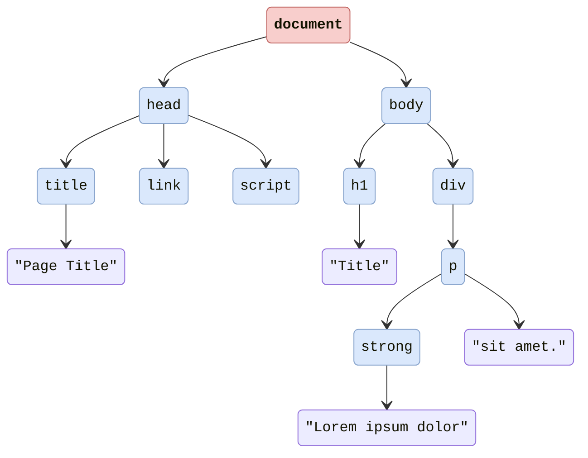
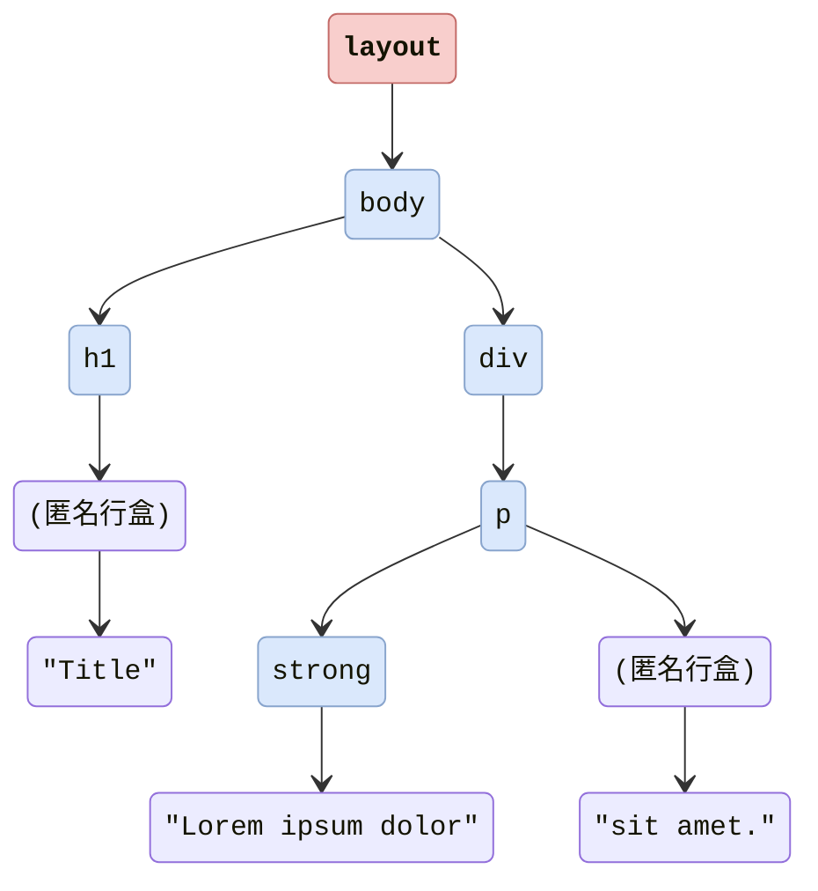

# 浏览器渲染原理

```html
<html>
  <head>
    <title>Page Title</title>
    <link rel="stylesheet" href="style.css" />
    <script src="script.js"></script>
  </head>
  <body>
    <h1>Title</h1>
    <div>
      <p><strong>Lorem ipsum dolor</strong> sit amet.</p>
    </div>
  </body>
</html>
```



