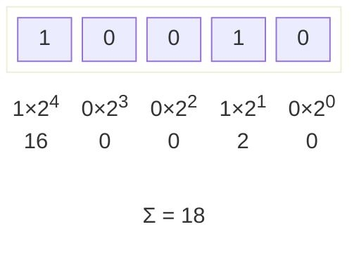

# JavaScript 位运算详解

## 概述

二进制位运算符用于直接对二进制位进行计算，一共有 7 个。

- 按位或（or）：`|`
- 按位与（and）：`&`
- 按位非（not）：`~`
- 按位异或（xor）：`^`
- 左移（left shift）：`<<`
- 带符号右移（right shift）：`>>`
- 无符号右移（zero filled right shift）：`>>>`

这些位运算符直接处理每一个比特位（bit），是非常底层的运算，好处是速度极快，缺点是很不直观。

但是，众所周知，浮点数是无法执行位运算的，而 JavaScript 中所有的数字都是以浮点形式存储的（见 [数据存储与安全](./数值存储与安全)）。所以，JavaScript 中执行位运算的时候，会**先把数字转换为 32 位有符号整数，然后再进行运算**。这一操作在标准中称为 `ToInt32`。

可以利用这个特性，将任意数值转为 32 位整数。

- 对于小数，小数部分会直接舍去。
- 超出表示范围的数会被截断。
- `Infinity` 或 `NaN` 会转换为 `0`。
- 对于非数值，会先强制类型转换为数值。

```js
const toInt32 = (x) => x | 0;

toInt32(1); // 1
toInt32(1999.9); // 1999
toInt32(-5.5); // -5
toInt32(2147483647); // 2147483647
toInt32(2147483648); // -2147483648
toInt32(-2147483649); // 2147483647
toInt32(2 ** 32); // 0
toInt32(2 ** 35 + 10); // 10
toInt32(NaN); // 0
toInt32(Infinity); // 0
```

## 重温整数

有符号整数使用 31 位表示整数的数值，用第 32 位表示整数的符号，0 表示正数，1 表示负数。数值范围从 -2147483648 到 2147483647。

可以以两种不同的方式存储二进制形式的有符号整数，一种用于存储正数，一种用于存储负数。正数是以真二进制形式存储的，前 31 位中的每一位都表示 2 的幂，从 0 号位开始，表示 $2^0$，1 号位表示 $2^1$。没用到的位用 0 填充，即忽略不计。例如，数 18 表示为：

```log
  ╭──── 符号位
┌─┴─┬─────┬──────┬──────┬──────┬──────┬──────┬──────┬──────┐
│ 0 │ 000   0000   0000   0000   0000   0000   0001   0010 │
└───┴─────┴──────┴──────┴──────┴──────┴──────┴──────┴──────┘
```

把数字转换成二进制字符串，就能看到有效位：

```js
(18).toString(2); // "10010"
```

这段代码输出 `"10010"`，而不是 18 的 32 位表示，因为仅使用前 5 位即可确定这个十进制数值。



负数也存储为二进制代码，不过采用的形式是二进制补码。计算数字二进制补码的步骤如下：

1. 确定该数字的非负版本的二进制表示（例如，要计算 `-18` 的二进制补码，首先要确定 `18` 的二进制表示）；
2. 求得二进制反码，即要把 `0` 替换为 `1`，把 `1` 替换为 `0`；
3. 在二进制反码上加 `1`。

即：补码 = 反码 + 1 = `(~|x|) + 1`

要确定 `-18` 的二进制表示，首先必须得到 18 的二进制表示，如下所示：

```log
0000 0000 0000 0000 0000 0000 0001 0010
```

接下来计算反码：

```log
1111 1111 1111 1111 1111 1111 1110 1101
```

最后，在反码上加 1：

```log
1111 1111 1111 1111 1111 1111 1110 1101
+                                     1
───────────────────────────────────────
1111 1111 1111 1111 1111 1111 1110 1110
```

因此，`-18` 的二进制表示即 `1111 1111 1111 1111 1111 1111 1110 1110`。

> [!note]
>
> ```js
> (-18).toString(2); // "10010"
> ```
>
> 这段代码输出的是 `"-10010"`，而非二进制补码。我们会在后面的 [无符号右移运算符](#无符号右移运算符) 处提到查看完整 32 位二进制表示的方式。这里先给出代码，不进行解释：
>
> ```js
> const get32Bits = (n) => (n >>> 0).toString(2).padStart(32, "0");
> get32Bits(-18); // '11111111111111111111111111101110'
> ```


## 按位或运算符

| 位 1 | 位 2 | 结果 |
| ---- | ---- | ---- |
| 1    | 1    | 1    |
| 1    | 0    | 1    |
| 0    | 1    | 1    |
| 0    | 0    | 0    |

按位或运算符（`|`）逐位比较两个运算子，两个二进制位之中只要有一个为 `1`，就返回 `1`，否则返回 `0`。

```js
25 | 3; // 27
```

运算过程：

```log
25 = 0000 0000 0000 0000 0000 0000 0001 1001
 3 = 0000 0000 0000 0000 0000 0000 0000 0011
────────────────────────────────────────────
OR = 0000 0000 0000 0000 0000 0000 0001 1011
```

> [!tip]
>
> 可以看出，任意 32 位整数与 0 作按位或，结果一定返回其本身。所以 `x | 0` 在 $\pm 2^{31}$ 内可以用于向下取整。不过，由于数据范围必须在 32 位整数的安全范围，加上可读性问题，还是建议使用 JavaScript 提供的 `Math` 对象。
>
> ```js
> Math.floor(3.7); // 3
> Math.ceil(6.2); // 7
> Math.round(3.55); // 4
> Math.round(3.45); // 3
> ```

## 按位与运算符

| 位 1 | 位 2 | 结果 |
| ---- | ---- | ---- |
| 1    | 1    | 1    |
| 1    | 0    | 0    |
| 0    | 1    | 0    |
| 0    | 0    | 0    |

按位与运算符（`&`）的规则是逐位比较两个运算子，两个二进制位之中只要有一个位为 `0`，就返回 `0`，否则返回 `1`。

```js
25 & 3; // 1
```

运算过程：

```log
 25 = 0000 0000 0000 0000 0000 0000 0001 1001
  3 = 0000 0000 0000 0000 0000 0000 0000 0011
─────────────────────────────────────────────
AND = 0000 0000 0000 0000 0000 0000 0000 0001
```

> [!tip]
>
> 与运算有时用来判断一个数是否是偶数：
>
> ```js
> const oddOrEven = (n) => (n & 1 ? "odd" : "even");
> oddOrEven(5); // "odd"
> oddOrEven(16); // "even"
> ```

## 按位非运算符

| 位  | 结果 |
| --- | ---- |
| 1   | 0    |
| 0   | 1    |

按位非运算符（`~`）也称按位取反运算符，将每个二进制位都变为相反值（`0` 变为 `1`，`1` 变为 `0`）。

```js
~25; // -26
```

可以看出，按位非把符号位也一起处理了。

```log
 25 = 0000 0000 0000 0000 0000 0000 0001 1001
─────────────────────────────────────────────
NOT = 1111 1111 1111 1111 1111 1111 1110 0110
```

根据补码的运算规则，取反之后再加一即可得到原数字的相反数。

```js
const check = (x) => -x === ~x + 1;
check(0); // true
check(648); // true
check(-328); // true
```

> [!tip]
>
> 显然，两次取反会得到这个数本身。因此 `~~` 也用于取整。
>
> ```js
> ~~2.9; // 2
> ~~47.11; // 47
> ~~1.9999; // 1
> ~~-3.5; // -3
> ```
>
> 理论上，使用按位非运算取整是最快的。但是现代 JS 引擎已对各类取整方法做了充分优化，应优先考虑语义明确性而非「微优化」。

## 按位异或运算符

| 位 1 | 位 2 | 结果 |
| ---- | ---- | ---- |
| 1    | 1    | 0    |
| 1    | 0    | 1    |
| 0    | 1    | 1    |
| 0    | 0    | 0    |

异或运算（`^`）在两个二进制位不同时返回 `1`，相同时返回 `0`。

```js
25 ^ 3; // 26
```

运算过程：

```log
 25 = 0000 0000 0000 0000 0000 0000 0001 1001
  3 = 0000 0000 0000 0000 0000 0000 0000 0011
─────────────────────────────────────────────
XOR = 0000 0000 0000 0000 0000 0000 0001 1010
```

### 异或的特殊运用

这里我们讨论异或的几种特殊用法。这样的做法被广泛应用，所以应当知晓。

#### 对布尔值取反

```js
1 ^ 1; // 0
0 ^ 1; // 1
```

由这个性质，我们可以将其用于布尔值的取反。

```js
let flag = true;
flag ^= 1;

if (flag) console.log("flag is true");
else console.log("flag is false");
// flag is false
```

其结果类似 `flag=!flag`，但是如果布尔值的名字很长，或者是一个属性时这种做法就有优越性了。

```js
someObject.someProperty.config.someConfigGroup.something ^= 1;
// 相比于
someObject.someProperty.config.someConfigGroup.something =
  !someObject.someProperty.config.someConfigGroup.something;
```

但是这种做法有个问题：`flag` 的类型会被改变。

```js
let flag = true;
typeof flag; // 'boolean'
flag ^= 1;
typeof flag; // 'number'
```

在 JavaScript 中这不是什么大问题。但是 TypeScript 这样严格检查类型的变体就会报错。

但 JavaScript 中没有按位或运算，因此这种做法甚至没有很好的替代。只能用 `flag=!flag`。真是一个悲伤的故事。

在 JavaScript 中，笔者认为这样的做法是可以推荐的，因为这种做法太常用了，以至于大家都懂，也没什么可读性问题了。

#### 交换两个变量的值

异或运算有一个特殊运用，连续对两个数 `a` 和 `b` 进行三次或运算，`a^=b; b^=a; a^=b;`，可以互换它们的值。其原理我们这里不展开，有兴趣请自行搜索。

```js
let a = 648,
  b = 114514;
(a ^= b), (b ^= a), (a ^= b);
a; // 114514
b; // 648
```

但是这样的做法可读性不佳，而且有可能损失精度。最佳实践是使用 ES6 引入的数组解构。

```js
let a = 648,
  b = 114514;
[a, b] = [b, a];
a; // 114514
b; // 648
```

#### 取整

异或运算也可以用来取整。

```js
12.9 ^ 0; // 12
```

## 左移运算符

```log
   2 = 0000 0000 0000 0000 0000 0000 0000 0010
       ╭─────╯                         ╭─────╯
2<<5 = 0000 0000 0000 0000 0000 0000 0100 0000 = 64
                                        ^ ^^^^ 用 0 填充
```

左移运算符（`<<`）表示将一个数的二进制值向左移动指定的位数，尾部补 `0`，相当于乘以 `2` 的指定次方。向左移动的时候，**最高位的符号位是一起移动的**。

```js
let a = -(2 ** 31 - 1);
a; // -2147483647
a << 1; // 2
```

计算过程：

```log
   a = 1000 0000 0000 0000 0000 0000 0000 0001
a<<1 = 0000 0000 0000 0000 0000 0000 0000 0010
      ^ 最高位（符号位）溢出
```

左移运算符用于二进制数值非常方便。下面的例子使用左移运算符，将颜色的 RGB 值转为 HEX 值。

```js
// RGB to HEX
const rgb2hex = (r, g, b) =>
  "#" +
  ((r << 16) + (g << 8) + b)
    .toString(16) // 先转成十六进制，然后返回字符串
    .padStart(6, "0"); // 高位补 0

let color = [186, 218, 85];
rgb2hex(...color);
// "#bada55"
```

> [!tip]
>
> 左移 0 位返回本身。因此 `<<0` 也用于取整。右移同理。

## 右移运算符

```log
    64 = 0000 0000 0000 0000 0000 0000 0100 0000
         ╰─────╮                         ╰─────╮
 64>>5 = 0000 0000 0000 0000 0000 0000 0000 0010 = 2
         ^^^^ ^ 用 0 填充
┄┄┄┄┄┄┄┄┄┄┄┄┄┄┄┄┄┄┄┄┄┄┄┄┄┄┄┄┄┄┄┄┄┄┄┄┄┄┄┄┄┄┄┄┄┄┄┄┄┄┄┄┄
   -64 = 1111 1111 1111 1111 1111 1111 1100 0000
         ╰─────╮                         ╰─────╮
-64>>5 = 1111 1111 1111 1111 1111 1111 1111 1110 = -2
         ^^^^ ^ 用 1 填充
```

带符号右移运算符（`>>`）简称右移运算符，表示将一个数的二进制值向右移动指定的位数。如果是正数，头部全部补 `0`；如果是负数，头部全部补 `1`。右移运算符基本上相当于除以 `2` 的指定次方（最高位即符号位参与移动）。

右移运算可以模拟 2 的整除运算。

```js
5 >> 1;
// 2
// 相当于 5 / 2 = 2

21 >> 2;
// 5
// 相当于 21 / 4 = 5

21 >> 3;
// 2
// 相当于 21 / 8 = 2

21 >> 4;
// 1
// 相当于 21 / 16 = 1
```

## 无符号右移运算符

```log
    64 = 0000 0000 0000 0000 0000 0000 0100 0000
         ╰─────╮                         ╰─────╮
 64>>5 = 0000 0000 0000 0000 0000 0000 0000 0010 = 2
         ^^^^ ^ 用 0 填充
┄┄┄┄┄┄┄┄┄┄┄┄┄┄┄┄┄┄┄┄┄┄┄┄┄┄┄┄┄┄┄┄┄┄┄┄┄┄┄┄┄┄┄┄┄┄┄┄┄┄┄┄┄┄┄┄┄┄┄┄
   -64 = 1111 1111 1111 1111 1111 1111 1100 0000
         ╰─────╮                         ╰─────╮
-64>>5 = 0000 0111 1111 1111 1111 1111 1111 1110 = 134217726
         ^^^^ ^ 依然用 0 填充（符号位改变）
```

无符号右移运算符（`>>>`）也称头部补零的右移运算符，与右移运算符（`>>`）只有一个差别，就是一个数的二进制形式向右移动时，头部一律补零，而不考虑符号位。所以，该运算总是得到正值。对于正数，该运算的结果与右移运算符（`>>`）完全一致，区别主要在于负数。

**并且这个运算返回值时，将这 32 位解读为无符号整数**。

```js
-1 >>> 0; // 4294967295
```

上面代码表示，`-1` 作为 32 位整数时，内部的储存形式使用无符号整数格式解读，值为 4294967295（即 $2^{32}-1$）。可以使用这个方法快速获取某个整数的 32 位二进制字符串：

```js
const get32Bits = (n) => (n >>> 0).toString(2).padStart(32, "0");
get32Bits(18); // "00000000000000000000000000010010"
```

## 总结与应用

### 运算符优先级

|        运算符         | 优先级 |
| :-------------------: | :----: |
|          `~`          |  最高  |
|    `<<` `>>` `>>>`    |   高   |
|          `&`          |   中   |
|          `^`          |   低   |
| <code>&#x007C;</code> |  最低  |

### 位运算解析色值

可以利用位运算处理 RGBA 和 HEX 格式颜色的互相转换：

```js
function hex2rgba(color) {
  const r = (color >> 24) & 0xff;
  const g = (color >> 16) & 0xff;
  const b = (color >> 8) & 0xff;
  const a = color & 0xff;
  return [r, g, b, a];
}
function rgba2hex(r, g, b, a) {
  [r, g, b, a] = [r, g, b, a].map((n) => n & 0xff);
  return (((r << 24) + (g << 16) + (b << 8) + a) >>> 0)
    .toString(16)
    .padStart(8, "0")
    .toUpperCase();
}
hex2rgba(0xff0000ff); // [255, 0, 0, 255]
rgba2hex(128, 255, 0, 128); // "80ff0080"
```

### 位运算与开关

位运算符可以用作设置对象属性的开关。用来做属性设置或者权限控制之类的。

假定某个对象有四个开关，每个开关都是一个变量。那么，可以设置一个四位的二进制数，它的每个位对应一开关。

```js
const FLAG_A = 0b0001;
const FLAG_B = 0b0010;
const FLAG_C = 0b0100;
const FLAG_D = 0b1000;
```

上面代码设置 A、B、C、D 四个开关，每个开关分别占有一个二进制位。

然后，就可以用按位与运算，检查当前设置是否打开了指定开关。

```js
let flags = 0b0101;

if (flags & FLAG_C) {
  // ...
}
// 0101 & 0100 => 0100 => true
```

上面代码检验是否打开了开关 `C`。如果打开，会返回 `true`，否则返回 `false`。

现在假设需要打开 `A`、`B`、`D` 三个开关，我们可以构造一个掩码变量。

```js
let mask = FLAG_A | FLAG_B | FLAG_D;
// 0001 | 0010 | 1000 = 1011
```

上面代码对 `A`、`B`、`D` 三个变量进行按位或运算，得到掩码值为二进制的 `1011`。

有了掩码，按位或运算可以确保打开指定的开关。

```js
flags = flags | mask;
```

上面代码中，计算后得到的 `flags` 变量，代表三个开关的二进制位都打开了。

二进制与运算可以将当前设置中凡是与开关设置不一样的项，全部关闭。

```js
flags = flags & mask;
```

异或运算可以切换当前设置，即第一次执行可以得到当前设置的相反值，再执行一次又得到原来的值。

```js
flags = flags ^ mask;
```

按位非运算可以翻转当前设置，即原设置为 `0`，运算后变为 `1`；原设置为 `1`，运算后变为 `0`。

```js
flags = ~flags;
```

但是现在这样的做法越来越少了。因为 ES6 引入了 `Map`，可以更好地解决这个问题。
