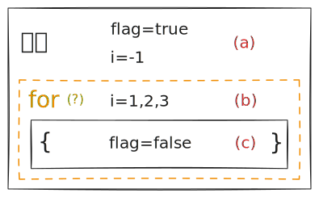
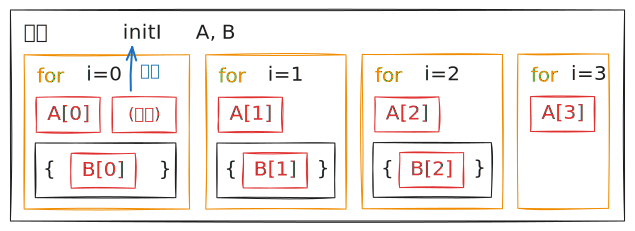
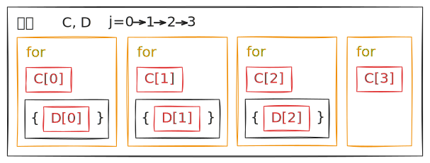

# JavaScript 作用域、闭包与隐式块

## 词法作用域与动态作用域

思考下面一段代码。

```js
const str = "outer";
function foo() {
  console.log(str);
}
function bar() {
  const str = "inner";
  foo();
}
bar();
```

控制台输出的是 `"inner"` 还是 `"outer"`？不同的语言可能会有不同的行为。JS 会输出 `"outer"`。

- 一种做法是，既然 `foo` 中找不到 `str`，而 `foo` 是由 `bar` 调用的，那么 `foo` 应该在 `bar` 的作用域中查找 `str`。找到了 `str = "inner"`，所以输出 `"inner"`。这被称为「动态作用域」。

- 另一种做法是，`foo` 中找不到 `str`，那么应该在定义 `foo` 的作用域（即全局）中查找 `str`。找到了 `str = "outer"`，所以输出 `"outer"`。这被称为「词法作用域」或「静态作用域」。

可以看出，动态作用域实际上是在调用栈中从上往下查找变量，而词法作用域是在代码中从内往外查找变量（也可以理解为在抽象语法树中从叶子向根查找变量）。


词法作用域的优势在于，可以在代码编写时就确定变量的作用范围，而不需要等到运行时才确定。这样可以提高代码的可读性和可维护性，也便于编辑器和引擎在执行前进行优化。

**大部分语言都采用词法作用域，包括 JavaScript**。所以上面的 JS 代码输出 `"outer"`。

> 与词法作用域相对应地，Bash 就是动态作用域的典型代表。考虑下面的代码。
>
> ```bash
> value=1
> function foo () {
>     echo $value;
> }
> function bar () {
>     local value=2;
>     foo;
> }
> bar
> ```
>
> 这段代码输出 `2`。

## 闭包

考虑这样一个场景：我们需要一个计数器，需要能随时读取其当前的值，并进行累加。通常，因为我们需要在各处调用它，很多人的第一反应是建立一个全局变量。

```js
let count = 0;

// 在代码的某处
count += 1;
```

但是，作为全局变量，`count` 可能被错误地改写，造成意料之外的结果。

```js
let count = 0;

count += 2; // 2
count += 1; // 3
count += "1"; // '31'
count += 1; // '311'
count += 2; // '3112'
```

现在思考下面的代码。

```js
function createCounter() {
  let count = 0;
  return {
    getValue: () => count,
    add: (val) => {
      if (Number.isFinite(val)) count += val;
      if (val === undefined) count++;
    },
  };
}

const counter = createCounter();
console.log(counter.getValue()); // 0
counter.add(); // 1
counter.add(2); // 3
counter.add(""); // 3
console.log(counter.getValue()); // 3
typeof count; // undefined
```

`createCounter` 函数返回了一个对象，这个对象包含了两个方法：`getValue` 和 `add`。这两个方法都可以访问到 `count`，并且可以修改它。即使 `createCounter` 函数已经执行完毕，在词法作用域下，`getValue` 和 `add` 两个方法依然可以访问到 `count`，因此 `count` 不会被系统回收。这样，只有这两个方法可以访问和修改 `count`，其他地方无法访问到 `count`，实现了对 `count` 的保护。同时，`createCounter` 函数可以被多次调用，每次调用都会创建一个新的 `count`，互不干扰。这样的写法叫做**模块模式**。

这就是闭包（closure）的思想：用函数作用域来保护变量。闭包就像时间胶囊，将变量状态封装在定义时的时空环境中，不受外部世界变化的影响。

**闭包是词法作用域的一个重要应用**。闭包访问的作用域是定义时的作用域而不是运行时的作用域，因此可以访问已经结束运行的函数。动态作用域做不到这一点，因为动态作用域在调用栈中查找变量，而已经结束运行的函数已经不在调用栈中了。

由于 JS 中函数是一等公民，可以作为参数传递、作为返回值返回，闭包在 JS 中是非常常见的。除了上面的写法，另一种常见写法是使用 IIFE（立即执行函数表达式）。

```js
const counter = (() => {
  let count = 0;
  return {
    getValue: () => count,
    add: (val) => {
      if (Number.isFinite(val)) count += val;
      if (val === undefined) count++;
    },
  };
})();
```

> [!note]
>
> 显然，闭包保存的是整个词法环境的引用，而不仅仅是单个变量。这意味着即使外层函数已执行完毕，只要闭包存在，整个相关词法环境都会被保留。
>
> 不过，JS 引擎的垃圾回收机制做了大量的优化。如果闭包确实不再访问某些变量，而上层函数也已经执行完毕，这些内存还是会被回收。

## 块作用域

在 ES5 之前，JS 只提供了 `var` 关键字来声明变量，ES6 引入了 `let` 和 `const` 关键字。它们的核心区别就在于作用域的生效范围。

`var` 声明的变量是「函数作用域」的，而 `let` 和 `const` 声明的变量是「块作用域」的。即，`var` 声明的变量在考虑作用域时，以函数的边界作为界限；而 `let` 和 `const` 声明的变量在考虑作用域时，以块的边界作为界限。

> [!warning]
>
> 对于在非严格模式下不声明直接赋值的变量，JS 会自动将其声明为全局变量。**这种做法应当避免**。在严格模式，未声明的赋值操作会直接抛出错误，防止意外的全局变量污染。
>
> ```js
> "use strict";
> function foo() {
>   undeclaredVar = 1; // [!code error]
> }
> // ReferenceError: undeclaredVar is not defined
> ```

> [!note]
>
> **「块」是什么？**
>
> 块是什么？可以粗浅地将块理解为由花括号 `{}` 包裹的一部分代码。在任何位置使用花括号都可以创造一个块。比如 `if` 语句、`for` 循环、`while` 循环等。
>
> 我们稍后会详细地讨论这个问题。

考虑以下代码：

```js
function foo() {
  if (true) {
    var a = 1;
    let b = 2;
    c = 3;
  }
  console.log(a); // 1
  console.log(typeof b); // undefined
  console.log(c); // 3
}
foo();
console.log(typeof a); // undefined
console.log(typeof b); // undefined
console.log(c); // 3
```

> [!tip]
>
> 使用 `typeof` 可以避免在找不到变量时抛出 `ReferenceError` 错误。

从上面的代码中可以看到，用 `var` 声明的 `a` 即使在出了 `if` 块之后，仍然可以访问到。而用 `let` 声明的 `b` 在块外是无法访问的。但无论哪个，都被限制在了 `foo` 函数的作用域内。而不加声明的 `c` 则被自动声明为全局变量。

块作用域相比函数作用域具有明显的优势。考虑下面的代码：

```js
for (var i = 0; i < 5; i++) {
  var someVar1 = Math.floor(i / 2);
  // do something
}
for (let j = 0; j < 5; j++) {
  let someVar2 = Math.floor(i / 2);
  // do something
}

console.log(i); // 5
console.log(someVar1); // 2

console.log(typeof j); // undefined
console.log(typeof someVar2); // undefined
```

可以看到，`var` 声明的循环变量 `i` 和 `someVar1`「泄露」到了循环外，而 `let` 声明的 `j` 和 `someVar2` 则没有。这样可以避免很多潜在的问题。

此外，使用 `let` 和 `const` 还可以使得引擎的垃圾回收更加高效，因为它们的作用范围更小，引擎可以更早地回收无用的变量，避免浪费内存。

因此，**推荐在一切场合下使用 `let` 和 `const` 完全替代 `var`**。

可以说，闭包是在函数作用域下限制变量范围的一种手段，而块作用域强化了限制变量的能力，提高了代码的可读性、可维护性和健壮性。

> [!note]
>
> 还有没有不支持块作用域的编程语言呢？有的兄弟，有的。例如 Python 不支持块作用域：
>
> ```python
> a = 0
> if True:
>     a = 1
> print(a) # 1
> ```
>
> 但是 Python 有函数作用域，因此也可以像 ES5 一样使用闭包。还算有点出路。

## `for` 语句中的隐式块

### 隐式块的存在

块一定就是花括号吗？其实也不是。花括号只是创建块的一种方式。考虑下面的代码。

```js
let i = -1;
let flag = true;
console.log("(a)", i, flag);
for (let i = 0; console.log("(b)", i, flag), i < 3; i++) {
  let flag = false;
  console.log("(c)", i, flag);
}
// (a) -1 true
// (b) 0 true
// (c) 0 false
// (b) 1 true
// (c) 1 false
// (b) 2 true
// (c) 2 false
// (b) 3 true
```

> [!note]
>
> 这里 `for` 循环的第二个表达式 `console.log("(b)", i, flag), i < 3;` 可能会让一些人感到困惑。这是 JS 的逗号表达式。逗号表达式会依次执行其中的表达式，并返回最后一个表达式的值。因此，这里的 `console.log` 会在每次循环开始时执行，但只有 `i < 3` 会影响循环的继续。
>
> 逗号表达式的这种用法在实际开发中确实比较少见，但如果你真的一点都没听说过，我建议你去补一下基础。

可以看到，循环变量 `i` 在循环内和循环外是不一样的，除此之外，变量 `flag` 在循环的 `()` 部分和 `{}` 部分也是不一样的，这说明 `for` 循环的 `()` 部分和 `{}` 部分作用域不同，画成图就是：



可以看到，除了我们用 `{}` 创建的块之外，`for` 循环本身也自动生成了一个块（图中黄色），我们的 `let i` 就定义在这个块里。这样的块通常称为「隐式块」。

然而，隐式块真的像图中这样只有一个吗？

### 循环变量的重新绑定

除此之外，我们还关心：在每次循环中，是否会重复创建块？这里我们先定义一个工具函数 `createFnSaver`：

```js
const createFnSaver = () => {
  const data = [];
  const push = (fn) => data.push(fn);
  const log = () => console.log(data.map((fn) => fn()));
  return { push, log };
};
```

这个函数调用时返回一个函数保存器，当我们调用 `.push(()=>a)` 时，就创建了一个闭包，匿名函数 `()=>a` 会留存当前作用域下的变量 `a` 的**引用**以便后续调用 `.log` 打印。

> [!note]
>
> 不知道你是否注意到，这个 `createFnSaver` 已经在运用模块模式了。

我们先来看第一个循环：

```js
let initI;
const A = createFnSaver(),
  B = createFnSaver();

for (let i = 0, _ = (initI = () => i); A.push(() => i), i < 3; i++) {
  B.push(() => i);
}

console.log(initI()); // 0
A.log(); // [0, 1, 2, 3]
B.log(); // [0, 1, 2]
```

1. `initI` 函数保留了初始化变量 `i` 时的这个 `i` 的**引用**。3 次循环之后，这个 `i` 的值依然是 `0`。
2. `A` 保留的 `i` 来自 `for` 循环产生的隐式块，3 次循环 + 1 次仅判断存下了 4 个 `i` 的**引用**，这四个引用在最后求值的结果是 `[0, 1, 2, 3]`。
3. `B` 保留的 `i` 来自 `for` 循环内显式定义的代码块，3 次循环存下了 3 个 `i` 的**引用**，这三个引用在最后求值的结果是 `[0, 1, 2]`。

(1) 意味着，循环一开始定义的这个 `i` 自始至终都没有变过！从定义开始就一直是 `0`，三次循环下来**这个** `i` 一直是 `0`。也就是说，后来的循环中看到的这个 `i`，已经不是一开始我们定义的那个 `i` 了，而是全新的 `i`。这一点在 (2) (3) 中也得到了印证。每次循环中的 `i` 都是独立的 `i`，不会被后续的循环修改。画成图就是：



我们可以尝试验证一下这个结论。使用下面的代码：

```js
let getOriginal;
for (
  let i = 0, _ = (getOriginal = () => i), changeOriginal = () => (i += 3);
  i < 3;
  i++
) {
  console.log("original =", getOriginal());
  changeOriginal();
  console.log("i we get =", i);
}
console.log("original =", getOriginal());

// original = 0
// i we get = 0
// original = 3
// i we get = 1
// original = 6
// i we get = 2
// original = 9
```

可以看到，无论我们怎样改动原来的那个 `i`，都不会影响到后续循环中得到的 `i`。

再来看第二个循环：

```js
const C = createFnSaver(),
  D = createFnSaver();

let j = 0;
for (; C.push(() => j), j < 3; j++) {
  D.push(() => j);
}

C.log(); // [3, 3, 3, 3]
D.log(); // [3, 3, 3]
```

第二个循环先定义了 `j`，然后：

1. `C` 保留的 `i` 来自 `for` 循环产生的隐式块，3 次循环 + 1 次仅判断存下了 4 个 `i` 的**引用**，这四个引用在最后求值的结果是 `[3, 3, 3, 3]`。
2. `D` 保留的 `i` 来自 `for` 循环内显式定义的代码块，3 次循环存下了 3 个 `i` 的**引用**，这三个引用在最后求值的结果是 `[3, 3, 3]`。

这里的 `for` 循环行为和前面的似乎不一样。每次访问到的都是同一个 `j` —— 在顶层的那个 `j`，从 0 到 1, 2, 3，操作的都是这个 `j`。画成图就是：



现在我们来总结一下 `for` 表现出的行为：**每次循环会创建新的块作用域。在 `for` 的第一个分句中用 `let` 定义的变量，会在每次循环时重新创建并绑定；在循环之外提前定义的变量不受影响。**

### 重新绑定与异步

这样做初看似乎有点令人费解，但是这确确实实就是写在 ECMAScript 标准里面的[^1]。为什么要做这样的「优化」呢？答案是为了让异步操作更加「无痛」。考虑下面的代码：

```js {10-12}
const nameArr = ["foo", "bar", "baz"];
const promises = [];
const records = new Map();
function getAsyncData(_index) {
  // some time-consuming async operation
  return new Promise((resolve) => resolve("some data"));
}
for (let i = 0; i < 3; i++) {
  promises.push(
    getAsyncData(i).then((data) => {
      records.set(nameArr[i], data);
    })
  );
}
Promise.all(promises).then(() => {
  console.log(records);
});

// Map(3) {
//   'foo' => 'some data',
//   'bar' => 'some data',
//   'baz' => 'some data'
// }
```

这段代码能够成功执行的关键就在于每次循环的 `i` 是不同的。`.then( ... )` 产生了一个闭包，其中的匿名函数保留了这次循环的 `i` 并在后续异步执行。如果 `i` 没有重新绑定，等到异步执行的时候 `i` 的值已经变成了 `3`，此时 `nameArr[i]` 越界访问，返回 `undefined`。将 `i` 改为在外部声明就会导致这个结果：

```js {2-3}
// ...
let i;
for (i = 0; i < 3; i++) {
  promises.push(
    getAsyncData(i).then((data) => {
      records.set(nameArr[i], data);
    })
  );
}
Promise.all(promises).then(() => {
  console.log(records);
});

// Map(1) { undefined => 'some data' }
```

相当于执行了三次 `records.set(undefined, data)`。

## 其他语句中的作用域问题

### 其他类型的 `for` 语句

除了 `for (let...)` 之外，`for (let...in...)` 和 `for (let...of...)` 也会有类似的重新绑定行为。

```js
const arr = ["foo", "bar", "baz"];
for (let item of arr) setTimeout(() => console.log(item), 0);
// foo
// bar
// baz
```

至于在 `for` 中使用 `var`，其结果和在外部定义循环变量后再使用的结果相同。这里就不再赘述了。

### `switch` 语句

`switch` 语句中，**`case` 和 `break` 不创建作用域**。整个 `switch` 语句同属一个块作用域[^2]。

```js
switch (1) {
  case 0:
    let x = 0;
    break;
  case 1:
    let x = 1; // [!code error]
    break;
  default:
    break;
}
// Uncaught SyntaxError: Identifier 'x' has already been declared
```

因此，最佳实践是始终将 `case` 语句的内容包括在花括号中。

```js {2,5,6,9}
switch (1) {
  case 0: {
    let x = 0;
    break;
  }
  case 1: {
    let x = 1;
    break;
  }
  default:
    break;
}
```

### `try...catch` 语句

很少有人会注意到，从 ES3 开始，`catch` 语句就能形成一个独立的作用域[^3]：

```js
try {
  throw undefined;
} catch (a) {
  a = "foo";
  console.log(a); // foo
}
console.log(typeof a); // undefined
```

在 `let` 和 `const` 之前，这是唯一不通过函数就能限制变量作用域的方式。虽然这个知识也没什么用，看着图一乐就是了。

## 参考资料

[^1]: [ECMA262 - 14.7.4.2 Runtime Semantics: ForLoopEvaluation](https://tc39.es/ecma262/multipage/ecmascript-language-statements-and-declarations.html#sec-runtime-semantics-forloopevaluation)

[^2]: [MDN: switch](https://developer.mozilla.org/zh-CN/docs/Web/JavaScript/Reference/Statements/switch)

[^3]: 《你不知道的 JavaScript（上卷）》，Kyle Simpson 著
