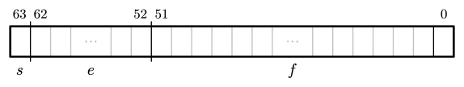
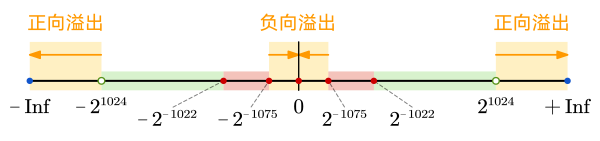

# JavaScript 数值存储、精度与安全详解

_本文只讨论 JavaScript 中的 `number` 类型的问题，不包括 `bigint`。_

在 JavaScript 里，所有 `number` 类型的数字都是 IEEE 754 标准的双精度浮点数（即大家熟悉的 `double` 型），即使整数也是如此。所以，`1` 与 `1.0` 是等价的。也就是说，JS 的底层**根本没有整型的概念**，所有数字都是浮点数。（可是某些运算，例如位运算，只有整数才能完成，此时 JavaScript 会自动把 64 位浮点数转成 32 位整数，然后再进行运算。这个我们稍后会谈。）

因此，要想弄清楚 JS 里的 `number` 类型，就要先搞懂 IEEE 754 标准对双精度浮点的定义。

## 存储格式

「浮点」的「浮」意味着小数点的位置是「浮动」的，并不是固定存储多少位小数。实际上存储采用的是**二进制下的科学计数法**。双精度使用 64 个二进制位（8 个字节）来表示科学计数法的 3 个部分：



- 1 位用于表示**符号 sign**（用 $s$ 表示）

  0 表示正数，1 表示负数

- 11 位用于表示**指数 exponent**（也称阶码，用 $e$ 表示）

  指数以 2 为底，并且实际存储的是加上 1023 后的值（1023 称为「偏置」），这样就可以表示负数指数了

- 52 位用于表示**尾数 mantissa**（用 $f$ 表示，fraction 的首字母）

  科学计数法开头的那个数字的小数部分。

> [!note]
>
> Float 类型是 1 位符号位、8 位阶码和 23 位尾数，共计 32 位。

由于阶码是 11 个二进制位，在十进制下对应取值为 $e\in[0,2047]$，以其值将数字分成三类：

- 规格数 normal number：$e\ne0$ 且 $e\ne2047$
- 非规格数 subnormal number：$e=0$，即指数位全为 0
- 特殊数 non-number：$e=2047$，即指数位全为 1


下面我们一个个来看。

### 规格数


规格数用于表示最常见的数值。规格数是可以用「标准」的科学计数法来表示的数。规格数的阶码取值范围是 $(0,2047)$ 即 $[1,2046]$，对应的指数为 $[-1022,1023]$。

现在考虑科学计数法前面的那个系数。这里有一个小心思，系数的第一位上一定是非零的，在二进制下就一定是「1.xxx」，**所以就不存了，只存小数点后的尾数部分**。

所以最后实际数值的计算公式为：

$$
(-1)^s\times(1+2^{-53}\cdot f)\times 2^{e-1023}
$$

::: details 规格数存储举例

**存储数字 $648$**

$$
\begin{align}
n&=648=(1.010000100)_2\times2^9 \\
e&=9+1023=1032 \to 10000001000 \\
f&=\cancel{1.}010000100
\end{align}
$$

最终表示：`0 10000001000 0100001000000000000000000000000000000000000000000000`

---

**存储数字 $-243.875$**

$$
\begin{align}
n&=243.875=(1.1110011111)_2\times2^7 \\
e&=1023 + 7 = 1030 \to 10000000110 \\
f&=\cancel{1.}1110011111
\end{align}
$$

最终表示：`1 10000000110 1110011111000000000000000000000000000000000000000000`

---

**存储数字 $5.8 \times 10^{32}$**

$5.8\times10^{32}=(1.01011001)_2\times2^{108}$

$$
\begin{align}
n&=5.8\times10^{32}=(1.11100100110\cdots)_2\times2^{108} \\
e&=1023 + 108 = 1131 \to 10001101011 \\
f&=\cancel{1.}11100100110\cdots
\end{align}
$$

最终表示：`0 10001101011 1100100110001010000100010011010001111101111110100001`

:::

52 个二进制位存储的数字范围是 $[0,2^{53}-1]$，对应的系数范围（绝对值）就是

$$
\begin{align}
\min&=1+2^{-53}\times0=1 \\
\max&=1+2^{-53}\times(2^{53}-1)=2-2^{-53}
\end{align}
$$

所以算上指数，规格数能表示的范围（绝对值）就应该是

$$
\begin{align}
\min&=1\times2^{-1022}=2^{-1022}\approx 2.225\times 10^{-308}\\
\max&=(2-2^{-53})\times2^{1023}=2^{1024}-2^{970}\approx 1.798\times 10^{308}
\end{align}
$$

这里的最大值就是 `double` 型能表示的最大数字了，但是这里还有点问题：

1. 其实如果把开头的 1 拿掉，其实还可以表示更小的数
2. 如果开头的 1 一直在，就不能表示 0！

这两个问题由非规格数解决。

### 非规格数


非规格数考虑比规格数更靠近 0 的情况。我们希望非规格数的最大值和规格数的最小值能够平稳地衔接起来，防止出现「数值悬崖」：

```
   0 00000000001 0000000000000000000000000000000000000000000000000000
-> 0 00000000000 1111111111111111111111111111111111111111111111111111
```

**尾数位依然只保存小数点后的尾数，但是此时规定小数点前的数字为 0 而非 1**。那这样规格数的最大值就会是 $(1-2^{-53})\times2^{0-1023}\approx 2^{-1023}$，与规格数的最小值（$2^{-1022}$）差了两倍！因此，**强制规定非规格数的指数为 $-1022$ 而非 $-1023$ 来修复这个问题**。

所以非规格数可以看作是一种「畸形」的科学计数法，在指数无法继续变小时让系数小于 1 来达到目标，产生类似 $0.{\rm xxx}\times2^{-1022}$ 这样的记法。

尾数位表示的范围依然为 $[0,2^{53}-1]$，但此时系数的范围（绝对值）为：

$$
\begin{align}
\min&=0+2^{-53}\times0=0 \\
\max&=0+2^{-53}\times(2^{53}-1)=1-2^{-53}
\end{align}
$$

算上指数 $-1022$，就是

$$
\begin{align}
\min&=0\times2^{-1022}=0 \\
\max&=(1-2^{-53})\times2^{-1022}=2^{-1022}-2^{1075}
\end{align}
$$

这便是非规格数所表示的数字范围。注意到：

1. 非规格数相比规格数，可以表示更靠近 0 的数。并且这里非规格数的最大值和前面规格数的最小值（$2^{-1022}$）平稳地衔接了起来，这被称为「逐渐溢出」（gradual underflow）。

2. 0 可以表示了。

规格数的两个问题都解决了。但是要注意，虽然表达出了更靠近 0 的数，但这是以精度为代价的——非规格数不再保证 53 位有效数字的精度。

此外，我们还关心能表示的最小正数。令尾数 $f=1$，有

$$
(1\times2^{-53})\times2^{-1022}=2^{-1075}\approx 4.941\times10^{-324}
$$

这就是非规格数中除了 0 之外的最小数字。

所以，`double` 类型所能表示的数在数轴上大概是（图未按比例）：


### 特殊数


特殊数分成两种：无穷和 `NaN`。规定：

- 当指数位全为 1 且尾数位全为 0 时，为无穷。符号位可正可负，分别对应 `+Infinity` 和 `-Infinity`。
- 当指数位全为 1 且尾数为不全为 0 时，为 `NaN`。

### 溢出



- 正向溢出：如果一个数的绝对值大于等于 $2^{1024}$，则发生正向溢出变成 `Infinity`。
- 负向溢出：如果一个数的绝对值小于等于 $2^{-1075}$，则发生负向溢出变成 `0`。

正向和负向溢出不会改变符号位。

在 JS 中，溢出的临界点可以通过调用 Number 对象的两个静态属性 `Number.MAX_VALUE` 和 `Number.MIN_VALUE` 得到。

```js
Number.MAX_VALUE; // 1.7976931348623157e+308
Number.MIN_VALUE; // 5e-324
```

### 舍入

IEEE 754 的默认舍入模式称作「**向最邻近值舍入**」，其实大体上就是我们说的四舍五入，但是有一些区别。

假设有十进制小数 $10.2$ 和 $10.8$，我们要将其舍入到整数，我们要先找到最靠近的整数 $10$ 和 $11$，然后计算其中间值 $\dfrac12(10+11)=10.5$。$10.2<10.5$，所以我们将其下取整到 $10$，$10.8>10.5$，所以我们将其上取整到 $11$。到这里都很正常。

但是 $10.5$ 呢？它要怎么取整？不知道各位读者小时候在接受「四舍五入」这一方法时会不会有这样的疑问：为什么「五入」？在两个邻近值正中间的数，凭什么总是向上取整而不是向下取整？这样的处理是否会导致近似值在统计意义上整体偏大？

答案是：**会**。「五入」会导致统计偏差。所以 IEEE 754 在遇到中间值时使用了「向偶数舍入」的方式。在这个例子中，$10$ 时偶数而 $11$ 不是，所以选择向下取整到 $10$。

听起来「向偶数舍入」是个相当随意的选择——为什么是偶数而不是奇数呢？统计意义上看偶数和奇数出现的概率相等，所以向偶数舍入可以随机地选取舍入方向，避免了系统性的偏差。此外这样的操作在底层门电路中很好实现。

回到二进制，假设对于某个二进制小数，小数点后 $i$ 位的值为 $d_i$（$d_i=0,1$），要将其舍入到小数点后 $k$ 位。

- 对于非中间值的数，即 $d_{k+1}=0$，或者 $d_{k+1}=1$ 且第 $k+2$ 位或以后有为 `1` 的位（$\exists n\in\mathbb N_+,d_{k+1+n}=1$），例如 $i=1$ 时的 $0.001,0.0102$ 等，就按最临近取整即可。
- 对于中间值的数，即 $d_{k+1}=1$ 且 $\forall n\in\mathbb N_+,d_{k+1+n}=0$，向偶数取整。在这里我们推广奇偶的概念：将最低有效位为 `0` 的称为偶数，为 `1` 的称为奇数。此时假设 $k=1$，对于二进制小数 $10.01$，向下取整变成「偶数」$10.0$，向上取整变成「奇数」$10.1$，因此选择向下取整变为 $10.0$。

::: details 当 $k=2$ 时的舍入处理举例

| 舍入前    | 舍入后 | 状态        |
| --------- | ------ | ----------- |
| $1.01010$ | $1.01$ | 向下        |
| $1.01011$ | $1.01$ | 向下        |
| $1.01100$ | $1.10$ | 向偶数 (上) |
| $1.01101$ | $1.10$ | 向上        |
| $1.01110$ | $1.10$ | 向上        |
| …         | …      | …           |
| $1.10011$ | $1.10$ | 向下        |
| $1.10100$ | $1.10$ | 向偶数 (下) |
| $1.10101$ | $1.11$ | 向上        |

:::

::: example 尝试一下

二进制数 `1.010100`（小数点后 6 位）保留 3 位小数，结果是？

---

【答案】%%向偶数舍入，下取整为 `1.010`%%

:::

### 查看数字存储

上面说了这么多，那有没有可以直接看到 JS 中某个数字是怎么存储的方法？有的兄弟，有的。可以借助 JS 中的 Buffer 来处理：

```js
function getDoubleBinary(num) {
  const buffer = new ArrayBuffer(8); // 8 字节存储 64 位
  new DataView(buffer).setFloat64(0, num); // 以双精度格式写入
  const bytes = new Uint8Array(buffer);
  let binary = "";
  for (let byte of bytes) binary += byte.toString(2).padStart(8, "0");
  const sign = binary[0];
  const exponent = binary.substr(1, 11);
  const mantissa = binary.substr(12);
  return { sign, exponent, mantissa };
}
```

这样我们就可以看到：

```js
getDoubleBinary(3.8);
// sign: "0"
// exponent: "10000000000"
// mantissa: "1110011001100110011001100110011001100110011001100110"

getDoubleBinary(5e-324);
// sign: "0"
// exponent: "00000000000"
// mantissa: "0000000000000000000000000000000000000000000000000001"

getDoubleBinary(-Infinity);
// sign: "0"
// exponent: "11111111111"
// mantissa: "0000000000000000000000000000000000000000000000000000"
```

> [!note]
>
> 有意思的是，ECMAScript 标准的 [6.1.6.1 The Number Type](https://tc39.es/ecma262/multipage/ecmascript-data-types-and-values.html#sec-ecmascript-language-types-number-type) 一节中提到：
>
> > The bit pattern that might be observed in an ArrayBuffer (see [25.1](https://tc39.es/ecma262/multipage/structured-data.html#sec-arraybuffer-objects)) or a SharedArrayBuffer (see [25.2](https://tc39.es/ecma262/multipage/structured-data.html#sec-sharedarraybuffer-objects)) after a Number value has been stored into it is not necessarily the same as the internal representation of that Number value used by the ECMAScript implementation.
>
> 即，标准不要求在 ArrayBuffer 中输出的位模式与引擎实现中的存储模式完全相同。但这其实不太重要，毕竟引擎的外在的行为和输出都遵守 IEEE 754 64 位双精度浮点标准，那我们也没必要关心引擎内部具体是什么。

你也可以使用可视化工具 [VisualNumeric64](https://alvarto.github.io/VisualNumeric64) 或者 [IEEE-754 Floating Point Converter](https://www.h-schmidt.net/FloatConverter/IEEE754.html) 来查看数字的存储方式。

::: details 为什么不用 `.toString(2)` 观察

`Number` 对象重写了 `Object` 对象的 `toString` 方法，允许接受一个正整数作为基数，输出在该数制下的数字字符串。

```js
(0.1).toString(2);
// "0.0001100110011001100110011001100110011001100110011001101"
```

这里现不提无法观察指数位的问题，先关注精度问题。如果你数一下这里的有效数字位数就会发现，`1100...1101` 这里总共只有 52 位。而根据上面的介绍，这里应该有「开头的1」加上后面 52 位共计 53 位。少了一位去哪了？

```js
getDoubleBinary(0.1);
// sign: "0"
// exponent: "01111111011"
// mantissa: "1001100110011001100110011001100110011001100110011010"
```

通过刚才的 `getDoubleBinary` 函数输出的是 52 位尾数位。注意到尾数位的最后一位是 `0`，结尾是 `11010`。也就是说，`toString(2)` 在输出的时候将末尾的 `0` 略去了。这不利于我们观察精度。

`toString` 方法这样处理是合理的，毕竟没有人想在调用 `(0.5).toString(2)` 时看到 `0.100000000000000...` 的输出。有关 `toString` 是如何定义的，可参阅标准文档：[ECMA262 6.1.6.1.20 Number::toString](https://tc39.es/ecma262/multipage/ecmascript-data-types-and-values.html#sec-numeric-types-number-tostring)。

:::

## 存储格式带来的细节问题

### `+0` 和 `-0`

我们刚才讨论的时候似乎都没有符号位什么事。从另外一个角度说就是，对于任意一个值，改变其符号位就能得到与之对应的相反数，0 也不例外。

```js
getDoubleBinary(0);
// sign: "0"
// exponent: "00000000000"
// mantissa: "0000000000000000000000000000000000000000000000000000"

getDoubleBinary(-0);
// sign: "1"
// exponent: "00000000000"
// mantissa: "0000000000000000000000000000000000000000000000000000"
```

它们基本上是等价的，但在部分特殊情况下会有不同的行为。

```js
// 二者通常等价：
0 === -0; // true
(0).toString(); // "0"
(-0).toString(); // "0"

// 不同的行为：
1 / 0; // Infinity
1 / -0; // -Infinity
Object.is(0, -0); // false
```

### `NaN` 的符号位和尾数位

`NaN` 的符号为和尾数位没有明确规定，不同的实现也可能会有不同的处理方式。这里甚至你无法依赖上面的 `getDoubleBinary` 函数——因为前面提过，标准不要求在 ArrayBuffer 中输出的位模式与引擎实现中的存储模式完全相同。

这里还涉及到 `qNaN`（Quiet NaN）和 `sNaN`（Signal NaN）的区别。部分平台会在尾数位中存储额外的信息。但作为前端程序员，我们不需要关心，也接触不到这些细节。

如果你非要关心，JS 提供了按位操作数字内存的能力，可以参考：[MDN：明显不同的 NaN 值](https://developer.mozilla.org/zh-CN/docs/Web/JavaScript/Reference/Global_Objects/NaN#%E6%98%8E%E6%98%BE%E4%B8%8D%E5%90%8C%E7%9A%84_nan_%E5%80%BC)。

## 精度问题

### 整数安全

JS 中取得最大安全整数就是当尾数位的每个位都用上，并且最后一位恰落在个位。尾数总共 52 位，加上第一位的 1，一共 53 位，所以最大安全整数是 $2^{53}-1$。同理，最小安全整数是 $-2^{53}+1$。这两个值可以直接通过调用 `Number.MAX_SAFE_INTEGER` 和 `Number.MIN_SAFE_INTEGER` 得到，大概是 $9\times10^{15}$。因此只要记住 15 位的十进制数都可以精确表示即可。

```js
Number.MAX_SAFE_INTEGER; // 9007199254740991
Number.MIN_SAFE_INTEGER; // -9007199254740991
```

比它大的整数不是不能存储和表示，而是会出现一些问题：

```js
2 ** 53 + 0; // 9007199254740992
2 ** 53 + 1; // 9007199254740992
2 ** 53 + 2; // 9007199254740994
2 ** 53 + 3; // 9007199254740996
2 ** 53 + 4; // 9007199254740996
```

大整数的问题在 ES2020 中得到了解决。ES2020 引入了 `bigint` 大整数类型，提供原生的高精度整数支持。在存储时，其本质是多个 32 位整数。你可以在 [MDN：BigInt](https://developer.mozilla.org/zh-CN/docs/Web/JavaScript/Reference/Global_Objects/BigInt) 查看更多关于 `bigint` 的信息。这里也总结一个简单的表格以供参考：

|    特性    | `number` |   `bigint`   |
| :--------: | :------: | :----------: |
|    小数    |   允许   |    不允许    |
|    精度    |  53 位   |   任意精度   |
| 运算符支持 |   全部   | 除 `>>>` 外  |
|  类型转换  | 隐式转换 | 必须显式转换 |

### 小数精度问题

`0.1 + 0.2 != 0.3` 应该算是老梗了：

```js
0.1 + 0.2 === 0.3; // false
0.2 + 0.7 === 0.9; // false
0.125 + 0.25 == 0.375; // true
```

其本质原因其实很好理解：十进制下的有限小数在二进制下未必是有限小数。

对于 $p$ 进制，其下用有限个数位能表示的数可以表达为：

$$
\sum_{i=m}^n a_i p^i\quad
\left\{\begin{array}l
a_i\in\{0,1,\cdots,p-1\} \\ m<n;\,m,n\in\mathbb Z
\end{array}\right.
$$

在二进制就是：

$$
\sum_{i=m}^n a_i 2^i\quad
\left\{\begin{array}l
a_i=0\,或\,1 \\ m<n;\,m,n\in\mathbb Z
\end{array}\right.
$$

很显然 `0.1` 和 `0.2` 是不符合这个表达式的。可以看到：

```js
(0.1).toString(2);
// sign: "0"
// exponent: "01111111011"
// mantissa: "1001100110011001100110011001100110011001100110011010"

(0.2).toString(2);
// sign: "0"
// exponent: "01111111100"
// mantissa: "1001100110011001100110011001100110011001100110011010"
```

`0.1` 和 `0.2` 在存储时转换为二进制，而二进制下的 `0.1` 和 `0.2` 是无限循环小数，存储的是取整过的近似值。进行运算时：

```js
(0.1 + 0.2).toString(2);
// sign: "0"
// exponent: "01111111101"
// mantissa: "0011001100110011001100110011001100110011001100110100"

(0.3).toString(2);
// sign: "0"
// exponent: "01111111101"
// mantissa: "0011001100110011001100110011001100110011001100110011"
```

可以看到由于 `0.1` 和 `0.2` 在存储时都向上取整了，`0.1 + 0.2` 的结果也比 `0.3`（的近似值）大了一点点。

但如果是满足上面那个求和式的小数（即 2 的幂的倍数之和），例如 `0.125` 和 `0.25`，它们的和 `0.375` 是可以精确表示的。

```js
0.125 + 0.25 === 0.375; // true
```

小数的精度问题是一个很大的话题，有很多库和算法都是为了解决这个问题而生的。在实践中最简单粗暴的方式就是避免小数运算，转而使用整数运算。例如对于金额，应当存储和处理货币最小单位（例如「分」而非「元」），并在显示时进行转换。

### 位运算时的整数安全

在 JavaScript 中，位运算符 `&`、`|`、`^`、`~`、`<<`、`>>`、`>>>` 只能操作 32 位有符号整数。当操作的数不是 32 位整数时，JavaScript 引擎会先将其转换为 32 位整数，然后再进行位运算。

32 位有符号整数的安全范围是 $[-2^{31},2^{31}-1]$，即大家喜闻乐见的 $[-2147483648,2147483647]$。超出这个范围的数会溢出。因此使用位运算进行取整等操作时，要注意数据范围。

本目录下的 [位运算](./位运算) 中有更多关于位运算的内容。

_在浮点数的世界里，「精确」是偶然，「近似」才是常态。毕竟，计算机和程序员的使命便是用离散的数描绘这多彩的世界。_

## 参考文献

- [WangDoc 网道：JavaScript 数值](https://wangdoc.com/javascript/types/number)
- [知乎 @等夏天再见啦：IEEE754规范: 四, 非规格数, ±infinity, NaN](https://zhuanlan.zhihu.com/p/343049681)
- [Wikipedia: 双精度浮点](https://en.wikipedia.org/wiki/Double-precision_floating-point_format)
- [Wikipedia: NaN](https://en.wikipedia.org/wiki/NaN)
- [ECMA 262 标准](https://tc39.es/ecma262/)

此外，本文的完成也离不开 DeekSeek R1 模型，没有跟它的「争吵」就不会有这篇文章。
