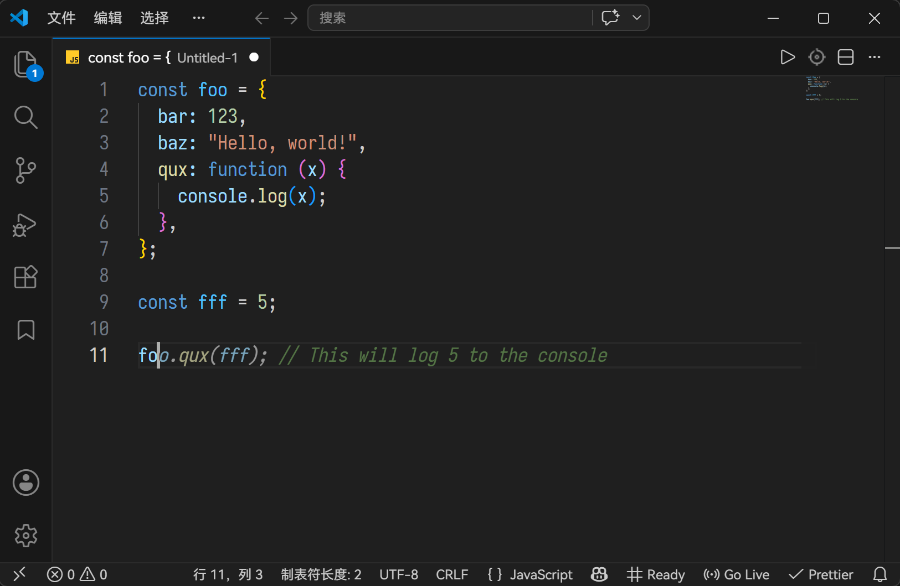
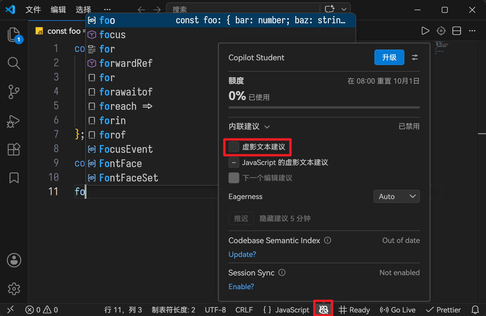
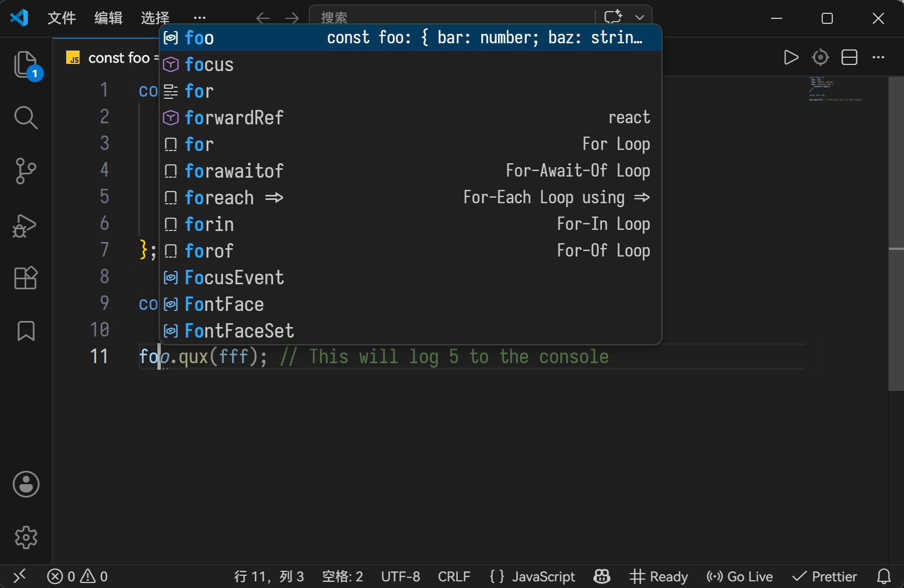

# VSCode 补全窗口与 Copilot 互斥

## 症状

在某次更新之后，只要 Copilot 有虚影文本建议（AI 自动补全），原本的自动补全弹窗就会消失：



只要关掉 Copilot，没有虚影文本建议，自动补全弹窗就会恢复：



这么做可能是为了减少干扰吧，但是 AI 出来的东西不一定是我要的，一旦 AI 补了点什么东西但我不想要，那编辑体验就退化回记事本了。此外在一些环境里，原版建议弹窗 <kbd>Tab</kbd> 补全出来会自动加上导入语句，AI 补全没有这个效果。

## 解决

VSCode 提供了 `editor.quickSuggestions` 设置项用于控制该行为，简体中文说明为：「控制是否应在键入时自动显示建议。这可以用于在注释、字符串和其他代码中键入时进行控制。可配置快速建议以显示为虚影文本或使用建议小组件显示。」直达链接为 <vscode://settings/editor.quickSuggestions>。

该项目只能在 `settings.json` 中编辑，默认值为：

```json
"editor.quickSuggestions": {
  // 在字符串和注释外启用快速建议
  "other": "offWhenInlineCompletions", 

  // 在注释内启用快速建议
  "comments": "off",

  // 在字符串内启用快速建议
  "strings": "off",
},
```

罪魁祸首就是这个 `"other": "offWhenInlineCompletions"`「显示内联完成时禁用快速建议」。将此项改为 `"on"` 即可使虚影建议与弹窗建议共存。

```json
"editor.quickSuggestions": {
  "other": "on",
  "comments": "off",
  "strings": "off",
},
```

效果如下：


