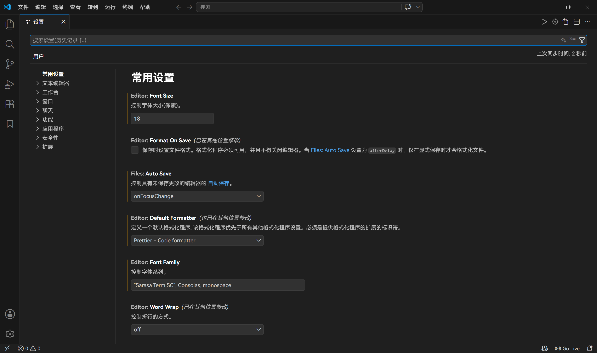
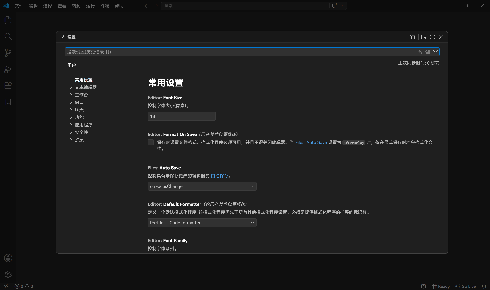

# VSCode 设置变为弹窗

## 症状

在原版行为中，VSCode 的设置以标签页形式呈现：



但在某一次更新之后，设置变为一个模态框，阻挡其他部分内容：



这个模态框并不好用，浪费了周围一圈空间（在小屏设备上尤甚），还不好及时看到改动效果。

## 解决

VSCode 提供了 `workbench.editor.useModal`「控制编辑器是否在模态浮层中打开」，可用于关闭这个行为。

可以使用直达链接打开设置项：<vscode://settings/workbench.editor.useModal>，将其置为 `off` 即可。

也可以直接在 `settings.json` 中添加：

```json
"workbench.editor.useModal": "off",
```
