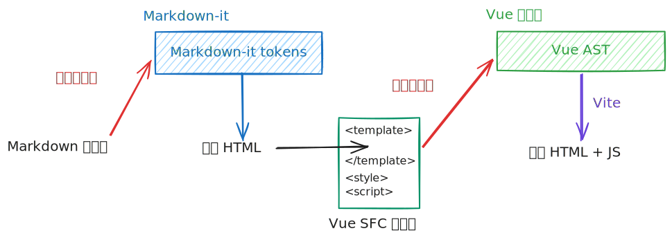

# VitePress 公式渲染导致构建占用高

## 症状

本站 [LinhoNotes](https://notes.linho.cc/) 主要是放各种笔记，随着内容增长，VitePress 的构建时间和 RAM 占用开始严重膨胀。

2024 年 10 月刚开始引入 VitePress 时 GitHub Actions 构建一次花费 1-2 分钟，到 2026 年 6 月已经膨胀到了 6-7 分钟。构建时间还不是大问题，更严重的是 RAM 占用。Node 报 heap size exceeded，只得不断提升 `--max-old-space-size`，先后从 4096 调整到 8192 再到 16384 MB，以至于本地构建一次 RAM 峰值占用十几 GB。这样的增长是病态的，总有一天会到达 GitHub Actions 的 RAM 限值导致构建失败。

于是开始着手分析原因。

## 分析

### VitePress 构建链路

VitePress 的 Markdown 编译链路可以称得上「暴力」：

1. 用 `markdown-it` 把 Markdown 转成 HTML 字符串
2. 把这个 HTML 字符串作为 `<template>`，拼上一些页面数据、路由、frontmatter 等代码，形成一个 Vue 单文件组件
3. 最后交给 Vue 编译器编译



这里的单文件组件拼接完全就是字面意义上的字符串拼接。没有什么渲染函数、VNodes 什么的转换，纯粹就是直接拼。

> 在其 [源码 `src/node/markdownToVue.ts:262`](https://github.com/vuejs/vitepress/blob/8e38b1069b7e328fe9b860801ed222a1dd38e55f/src/node/markdownToVue.ts#L262) 中：
>
> ```ts
> const vueSrc = [
>   ...injectPageDataCode(
>     sfcBlocks?.scripts.map((item) => item.content) ?? [],
>     pageData,
>   ),
>   `<template><div>${html}</div></template>`,
>   ...(sfcBlocks?.styles.map((item) => item.content) ?? []),
>   ...(sfcBlocks?.customBlocks.map((item) => item.content) ?? []),
> ].join("\n");
> ```

也就是说，每一篇 Markdown 在经过 Markdown-it 解析之后的 HTML 产物，还要作为 Vue 模板再走一遍 Vue 编译器再解析一遍，产生 JS 加上 SSR 产出的 HTML。JS 和 HTML 各自一份完整的 Markdown 产物信息，HTML 负责首屏、JS 负责水合（hydration）和后续加载。

这套逻辑初看相当费解。原因在于 VitePress 的一大招牌就是所有内容均为动态，可以通过 Markdown-it 插件加入 Vue 组件、可以在 Markdown 内随意用双花括号 `{​{}}` 写插值，等等。可是要接驳 Markdown-it 的内部数据结构和 Vue 的内部数据结构将是极大的工程挑战，维护起来也不现实。于是两边的接驳就只能用 HTML 纯文本了。

这也意味着 Markdown 渲染阶段产生的 HTML 字符串越大，Vue 编译阶段的压力就越大。这个压力不只体现在最终文件大小上，也体现在构建期间的 CPU 时间和内存占用上。尤其是 Vue 编译器这部分主要还是单线程 JS，遇到大量的模板字符串时，很容易成为整条构建链路上的瓶颈。

### 默认公式渲染策略

VitePress 内建的公式支持本质上是在 Markdown-it 中接入 `markdown-it-mathjax3` 插件。它会在 Markdown 渲染阶段调用 MathJax，把公式直接渲染成 SVG，然后把 SVG 塞进 HTML 字符串里。例如，一句含字母 $x$ 的话就会被渲染成这样：

```xml :escape-format :wrap
<p>一句含字母 <mjx-container class="MathJax" jax="SVG" style="direction: ltr; position: relative;"><svg xmlns="http://www.w3.org/2000/svg" width="1.294ex" height="1.025ex" role="img" focusable="false" viewBox="0 -442 572 453" aria-hidden="true" style="overflow: visible; min-height: 1px; min-width: 1px; vertical-align: -0.025ex;"><g stroke="currentColor" fill="currentColor" stroke-width="0" transform="scale(1,-1)"><g data-mml-node="math"><g data-mml-node="mi"><path data-c="1D465" d="M52 289Q59 331 106 386T222 442Q257 442 286 424T329 379Q371 442 430 442Q467 442 494 420T522 361Q522 332 508 314T481 292T458 288Q439 288 427 299T415 328Q415 374 465 391Q454 404 425 404Q412 404 406 402Q368 386 350 336Q290 115 290 78Q290 50 306 38T341 26Q378 26 414 59T463 140Q466 150 469 151T485 153H489Q504 153 504 145Q504 144 502 134Q486 77 440 33T333 -11Q263 -11 227 52Q186 -10 133 -10H127Q78 -10 57 16T35 71Q35 103 54 123T99 143Q142 143 142 101Q142 81 130 66T107 46T94 41L91 40Q91 39 97 36T113 29T132 26Q168 26 194 71Q203 87 217 139T245 247T261 313Q266 340 266 352Q266 380 251 392T217 404Q177 404 142 372T93 290Q91 281 88 280T72 278H58Q52 284 52 289Z" style="stroke-width: 3;"></path></g></g></g></svg><mjx-assistive-mml unselectable="on" display="inline" style="top: 0px; left: 0px; clip: rect(1px, 1px, 1px, 1px); user-select: none; position: absolute; padding: 1px 0px 0px; border: 0px; display: block; width: auto; overflow: hidden;"><math xmlns="http://www.w3.org/1998/Math/MathML"><mi>x</mi></math></mjx-assistive-mml></mjx-container> 的话就会被渲染成这样</p>
```

这在显示效果上当然没问题，但是 SVG 公式会带来一个很大的构建期成本：大量 `<path>`、`<g>`、`<defs>` 等节点都会进入 Vue 模板编译流程。公式越多越复杂，SVG 路径越多，模板字符串就越长。尽管 VitePress 会给 `<mjx-container>` 加上 `v-pre` 来避免 Vue 把里面的内容当成动态模板语法解析，但庞大的模版字符串依然会给构建带来巨大压力。

### 性能测量

要度量 MathJax 对性能的影响，方式是关闭 VitePress 的 `math` 选项，自定义一个公式渲染插件，解析 `$` 和 `$$` 语法但只输出占位符。注意不可以直接把公式渲染一关了之，因为公式中有可能出现 Vue 的插值模板 `{{}}` 导致报错。

在我的设备上构建仓库，得到如下结果：

| 公式渲染    | 构建耗时 / s | 峰值 RAM / GB | HTML 总量 / MB | JS 总量 / MB |
| ----------- | ------------ | ------------- | -------------- | ------------ |
| MathJax SVG | 230.005      | 12.65         | 157.75         | 188.81       |
| 占位插件    | 102.062      | 3.82          | 26.96          | 24.32        |

构建的绝对耗时在不同性能的设备上会有差异，但趋势与比例是大致相当的。确实是公式渲染带来了显著的性能问题。

## 解决

目标很明确，就是让 Markdown-it 产出的 HTML 更轻。有两种思路：

- 不再渲染完整的 SVG 进入 Markdown-it 产物，而是采取更轻量的渲染器，例如 KaTeX 的 HTML/CSS 模式，使用文本元素配合 webfont 显示公式
  - 优点：前端无需 JS，首屏性能优良，字体缓存后切页不易出现布局闪烁
  - 缺点：仍然会产生不少节点
- 构建时不再执行渲染，而是在浏览器访问页面时渲染公式
  - 优点：进一步减轻构建负担
  - 缺点：前端首屏更慢、切页时布局闪烁，对低性能设备不友好，禁用 JS 时无法显示公式

我最后采取的是构建时 KaTeX 渲染的方案。KaTeX 产生的 HTML 比 MathJax SVG 更适合塞进 Vue 模板里。虽然仍然会生成不少 `<span>`，但节点结构已经比 SVG path 轻得多，Vue 编译器需要处理的字符串体积和节点复杂度都会明显下降。

再跑测试，构建耗时和峰值 RAM 相比 MathJax 有显著下降，虽然比起完全不渲染还是有开销，但已经回到了可接受、可持续的范围。

| 公式渲染    | 构建耗时 / s | 峰值 RAM / GB | HTML 总量 / MB | JS 总量 / MB |
| ----------- | ------------ | ------------- | -------------- | ------------ |
| MathJax SVG | 230.005      | 12.65         | 157.75         | 188.81       |
| KaTeX HTML  | 131.332      | 7.66          | 63.84          | 64.71        |
| 占位插件    | 102.062      | 3.82          | 26.96          | 24.32        |

KaTeX 有一些小毛病，比如有一些命令不支持，不过调整一下公式写法基本都能处理得了。

如果要进一步优化的话就是用前端渲染方案了。
