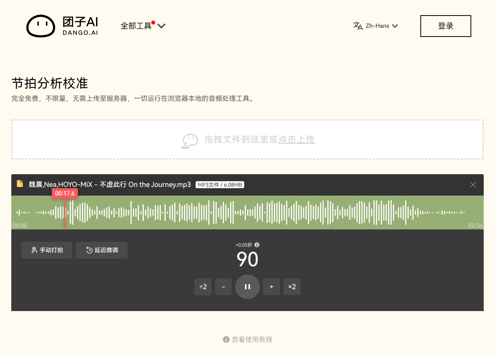

# 团子 AI 节拍分析网站逆向记录

有请本期受害者：[团子 AI - 节拍分析校准](https://www.tuanziai.com/audio-tools/tempo-analyze)



## 起因

主要是这段时间一直在做一款逐字歌词编辑器 [AMLL Editor](https://editor.amll.dev/)，就想着有没有什么方案能在前端分析歌曲节拍并对齐。上网搜到了这个网站，写的是纯前端分析，无需上传服务器。试用下来感觉质量相当不错，对于全程单 BPM 的歌曲有非常高的准确度，就想着看看它怎么实现的。

## 流程

### 一阶段：音频预处理，拍点分桶

打开 DevTools 映入眼帘的就是一堆 `<script src="/_nuxt/<hash>.js" defer></script>`。那一看就是 Nuxt + Vue，几乎不可能通过事件侦听器分析逻辑。

直接转到 Network 选项卡，勾上禁用缓存，刷新。丢个音频上去发现确实没有出现什么上传，但是请求了一个 `essentia-wasm.web.wasm`。这种纯前端分析大概率就是用 WASM 做的，所以很可疑。

WASM 本身肯定看不出什么东西，找它的调用点。搜索一下 `essentia` 找到了 `essentia-wasm.web.js`。一打开映入眼帘的是：

```js
/*
 * Copyright (C) 2006-2020  Music Technology Group - Universitat Pompeu Fabra
 *
 * This file is part of Essentia
 *
 * Essentia is free software: you can redistribute it and/or modify it under
 * the terms of the GNU Affero General Public License as published by the Free
 * Software Foundation (FSF), either version 3 of the License, or (at your
 * option) any later version.
 *
 * This program is distributed in the hope that it will be useful, but WITHOUT
 * ANY WARRANTY; without even the implied warranty of MERCHANTABILITY or FITNESS
 * FOR A PARTICULAR PURPOSE.  See the GNU General Public License for more
 * details.
 *
 * You should have received a copy of the Affero GNU General Public License
 * version 3 along with this program.  If not, see http://www.gnu.org/licenses/
 */
```

很明了了，这应该是一个现成的音频处理库。上网一搜找到其官网 <https://essentia.upf.edu/>，及其 WASM 前端封装 essentia.js，文档在 <https://mtg.github.io/essentia.js/docs/api/index.html>。

这个 Essentia 是 AGPLv3 协议，官网有提「also available under a proprietary license upon request」。这个团子 AI 网站有可能是向他们购买了专门的授权，也有可能是没买授权违规使用（因为如果他们既没买授权又没有开源，就违反 GPL），具体是不是这里就不瞎猜了。

实现方面 Essentia 是 C++ 写的，通过 Emscripten 编译成了 WASM。

接下来我们要看这个团子 AI 是如何调用 Essentia 的，是只是 thin wrapper 还是有做一些前后处理。先把 essentia.js 的 API 文档 <https://mtg.github.io/essentia.js/docs/api/Essentia.html> 开着备用。

寻找 Essentia 的调用点。拉出内容搜索面板搜 `essentia-wasm.web.js`，找到 [1a210e7.worker.js](https://www.tuanziai.com/_nuxt/1a210e7.worker.js) 中出现了 `self.importScripts("".concat(r,"/essentia-wasm.web.js"))`。转到 Sources 面板准备仔细分析。

先随便搜几个关键词。试一下 `bpm`，就找到了一段。

```js
for (
  t.prev = 0,
    n = p(r, 120, 0.05).buffer,
    o = essentia.PercivalBpmEstimator(
      essentia.arrayToVector(n),
      1024,
      2048,
      128,
      128,
      210,
      50,
      44100,
    ).bpm,
    (u = ~~o.toFixed(2).toString().split(".")[1]) >= 40 && u <= 60 && (o *= 2),
    a = p(r, 75, 0.3),
    c = a.buffer,
    f = a.start,
    l = o > 160 ? o / 2 : o,
    y = essentia.BeatTrackerMultiFeature(
      essentia.arrayToVector(c),
      10 + ~~l,
      ~~l - 10,
    ),
    h = essentia.vectorToArray(y.ticks),
    v = {},
    d = {},
    g = 1;
  g < h.length;
  g++
)
  ((x = h[g]),
    (b = h[g - 1]),
    (m = (x - b).toFixed(5)),
    (w = {
      tick: x,
      i: g,
    }),
    v[m] ? (v[m]++, d[m].push(w)) : ((v[m] = 1), (d[m] = [w])));
// ...
```

原来 `essentia` 这个标识符没被 minify 掉。搜索 `essentia` 发现其他的都是生命周期管理之类的东西，这一段应该就是比较核心的东西。

注意到这里用了两个方法 `PercivalBpmEstimator` 和 `BeatTrackerMultiFeature`。到前面的 API 文档里搜一下，发现 [前一个](https://mtg.github.io/essentia.js/docs/api/Essentia.html#PercivalBpmEstimator) 是用来估计 BPM 值的，[后一个](https://mtg.github.io/essentia.js/docs/api/Essentia.html#BeatTrackerMultiFeature) 是用来精细寻找拍点的。

好了那我们可以开始准备在这段代码上敲断点了。在 `PercivalBpmEstimator` 估计 BPM 之前做了一个 `p` 函数，打个断点，到页面上选择一份音频文件，就运行到这里定住了。步入进去看看。

```js
function p(t) {
  var r = arguments.length > 1 && void 0 !== arguments[1] ? arguments[1] : 30,
    n = arguments.length > 2 && void 0 !== arguments[2] ? arguments[2] : 0.3,
    e = arguments.length > 3 && void 0 !== arguments[3] ? arguments[3] : 44100,
    o = t.length / e;
  if (o < r)
    return {
      buffer: new Float32Array(t),
      start: 0,
    };
  r *= e;
  var i = ~~(t.length * n),
    u = i + r;
  return (
    u > t.length && (i = (u = t.length) - r),
    {
      buffer: new Float32Array(t.subarray(i, u)),
      start: i,
    }
  );
}
```

好我们进来看，这里上一步传入的参数是 `r, 120, 0.05`，所以现在函数里 `r = 120`，`n = 0.05`，`e = 44100`。这个 44100 肯定是采样率了。`o = t.length / e`，长度除以采样率，那这个 `t` 应该就是音频数据，长度（也就是采样数）除以采样率等于时长（秒）。

如果 `o < r` 也就是音频时长短于 `r` 就直接返回。

如果没有就继续执行，`r *= e` 得到的是 `r` 秒对应的采样数。`i = ~~(t.length * n)` 是总采样数在 `n` 分位数的 index。接下来返回了从 `i` 到 `u = i + r` 这一段的音频数据。

> [!tip]
>
> `~~` 是在通过按位非运算符给数字取整。见 [深入JavaScript / 位运算](../深入JavaScript/位运算#按位非运算符)。

那这个 `p` 函数就很明了了，它的函数签名应该类似：

```ts
/**
 * 对音频进行截取，从 beginRatio 比例开始取最多 maxLength 秒音频返回。
 * 若音频长度不足 maxLength 秒，则返回全部音频。
 *
 * @param audioData 音频数据
 * @param maxLength 返回的最长音频长度，单位秒
 * @param beginRatio 开始比例，取值范围 [0, 1]
 * @param sampleRate 音频采样率，单位 Hz
 */
function p(
  audioData: Float32Array,
  maxLength = 30,
  beginRatio = 0.3,
  sampleRate = 44100,
): {
  /** 截取后的音频数据 */
  buffer: Float32Array;
  /** 截取开始位置（样本点） */
  start: number;
};
```

这样做的目的一方面是减小计算量，另一方面把开头的一部分切掉，还可以避免 intro 影响后续计算。很聪明的做法。

步出回到原来那个 `for`。在得到 BPM 估计值 `o` 之后，我们接着看：

```js
// ...
((u = ~~o.toFixed(2).toString().split(".")[1]) >= 40 && u <= 60 && (o *= 2),
  (a = p(r, 75, 0.3)),
  (c = a.buffer),
  (f = a.start),
  (l = o > 160 ? o / 2 : o),
  (y = essentia.BeatTrackerMultiFeature(
    essentia.arrayToVector(c),
    10 + ~~l,
    ~~l - 10,
  )),
  (h = essentia.vectorToArray(y.ticks)),
  (v = {}),
  (d = {}),
  (g = 1));
g < h.length;
g++;
```

这里的 `u` 和 `l` 对 BPM 值做了如下操作：如果 BPM 介于 40~60，就将其翻倍；若 BPM 超过 160，就将其减半。这是因为 BPM 识别会出现倍半频的问题：我们平时打拍子时想快也可以每半拍打一次，想慢也可以每两拍打一下。这样操作可以把 BPM 稳定在一个比较合理的区间。

这个 `a` 和 `c` 这里又调用了一次函数 `p` 来截取音频，此时从 30% 开始截取 75 秒，然后调用 Essentia 精细识别节拍。查阅 API 文档得到 `BeatTrackerMultiFeature` 后两个参数是 `maxTempo` 和 `minTempo`，即最大最小 BPM。意思就是说按上一步估计的 BPM ±10 的范围精细化寻找节拍位置。查阅文档，返回类型应该是：

```ts
interface BeatTrackerMultiFeatureReturn {
  /** the estimated tick locations [s] */
  ticks: VectorFloat;
  /** confidence of the beat tracker [0, 5.32] */
  confidence: number;
}
```

所以 `h` 应该是 `number[]`，是每一个拍点的位置，单位秒。

接下来 `g` 是循环变量，从 1 到 `h.length` 循环。接下来我们看循环体。

```js
((x = h[g]),
  (b = h[g - 1]),
  (m = (x - b).toFixed(5)),
  (w = {
    tick: x,
    i: g,
  }),
  v[m] ? (v[m]++, d[m].push(w)) : ((v[m] = 1), (d[m] = [w])));
```

`x` 是当前拍点时间，`b` 是上一个拍点时间，`m` 是两个拍点的间隔保留 5 位小数。这里使用 `.toFixed(5)` 实际上是将浮点数离散化，用字符串作为 key 构建直方图，算是一种简单但有效的分桶策略。接下来的操作是维护了一个拍点间隔直方图 `v: Record<deltaT, freq>`，拍点数据保存在 `d: Record<deltaT, { tick, i }>` 里。

这个 `for` 循环结束之后还有一段：

```js
((A = e(
  Object.entries(v).sort(function (t, r) {
    return r[1] - t[1];
  })[0],
  2,
)),
  (S = A[0]),
  A[1],
  (T = []),
  (O = d[S]),
  (E = i(O)),
  (t.prev = 16),
  E.s());
```

对直方图 `v` 做了一下排序，得到最高频的时间间隔。这个 `e` 函数步入进去发现就只是把原数组传回来了。所以 `S = A[0]` 是这个最高频的时间间隔，`O = d[S]` 是其对应的全部拍点时间，姑且叫做最佳拍点列表。`E = i(O)` 这里 `i` 似乎是一个迭代器的包装。

这么做可以过滤掉不稳定的拍点，避免节拍检测算法在复杂节奏下产生抖动或误检。

### 二阶段：拍点循环分析

还没结束！在这个拿到这些拍点之后还需要继续处理。上面这一段是 minify 过后 `switch` 的一个 `case`，继续看接下来的 `case`：

```js
switch ((t.prev = t.next)) {
  case 0:
  // 上面那一段
  case 18:
    if ((j = E.n()).done) {
      t.next = 31;
      break;
    }
    ((_ = j.value),
      (I = _.tick),
      (L = _.i),
      (M = {
        tick: I,
        i: L,
        keep: 0,
        ticks: [I],
      }),
      (P = function () {
        M.keep++;
        var t = L + M.keep;
        if (t >= h.length) return "break";
        var r = h[t];
        if (
          !O.some(function (t) {
            return t.tick === r;
          })
        )
          return "break";
        M.ticks.push(r);
      }));
  case 22:
    if ("break" !== P()) {
      t.next = 26;
      break;
    }
    return t.abrupt("break", 28);
  case 26:
    t.next = 22;
    break;
  case 28:
    T.push(M);
  case 29:
    t.next = 18;
    break;
  case 31:
    t.next = 36;
    break;
  case 33:
    ((t.prev = 33), (t.t0 = t.catch(16)), E.e(t.t0));
  case 36:
    return ((t.prev = 36), E.f(), t.finish(36));
  // ...
}
```

这里的逻辑就稍微有点混乱了，因为涉及到循环。

这里 `j = E.n()` 在 debug 过程中看变量值应该是在迭代 `Object.values(O)`，也就是最佳拍点列表。

- `j` 每次拿到 `{ index, value: O[index] }`。
- 接下来几行 `I = _.tick` 就是拍点时间（秒），`L = _.i` 就是拍点在全部拍点中的 index。
- `M` 记录下拍点时间和 index，维护 `ticks` 数组，把当前拍点放进去。

接下来看这个 `P` 函数，发现它在不断循环。阅读调用过程。

- `case 22` 调用 `P`
  - 如果没有返回 `"break"`，前往 `case 26`，再回 `case 22`，重复调用 `P`
  - 如果返回了 `"break"`，前往 `case 28`，`T.push(M)`，fall through 到 `case 29`，再回到 `case 18` 构建新的 `M`
    - 如果 `(j = E.n()).done` 为真，前往 `case 31`，再去 `case 36`，就出去了
    - 否则还没完，就再重复调用 `P`

也就是说这里 `T` 数组就是一个一个 `M` 对象组成的，每一个 `M` 都是从最佳拍点列表 `O` 的元素中「发芽」，经过 `P` 函数多次迭代，当 `P` 返回 `"break"` 的时候就完成一个 `M`。

接下来仔细看 `P` 函数干了什么。

```js
P = function () {
  M.keep++;
  var t = L + M.keep;
  if (t >= h.length) return "break";
  var r = h[t];
  if (
    !O.some(function (t) {
      return t.tick === r;
    })
  )
    return "break";
  M.ticks.push(r);
};
```

`keep++`，`L` 是最佳拍点在全部拍点中的 index，`t = L + M.keep`，就是最佳拍点之后 `keep` 个拍点的 index。超范围就 `break` 掉，否则 `r` 就是这个拍点。

接下来 `O.some` 是在最佳拍点里找这个 `r`，如果找到了就塞进 `M.ticks`，否则就 `break` 掉。

也就是说 `P` 在做这样的事情：从一个最佳拍点出发，一直向后寻找相邻的最佳拍点，找不到了这个 `M` 就结束，取找下一个最佳拍点。也就是每一个 `M` 都是相邻的一串最佳拍点，`T` 保存了所有的相邻最佳拍点组。

继续看后面的代码：

```js
switch ((t.prev = t.next)) {
  case 0:
  // 上面那一段
  case 39:
    return (
      (R = T.sort(function (t, r) {
        return r.keep - t.keep;
      })[0]),
      (k = {
        bpm: o,
        start: f,
        tick: R.tick + f / 44100,
      }),
      (t.next = 43),
      s()
    );
  case 43:
    (postMessage({
      type: "keyBPM",
      result: k,
    }),
      (t.next = 51));
    break;
  case 46:
    return (
      (t.prev = 46),
      (t.t1 = t.catch(0)),
      postMessage({
        type: "error",
        error: t.t1,
      }),
      t.abrupt("return")
    );
  case 51:
  case "end":
    return t.stop();
}
```

这里对 `T` 按 `keep` 排序。这里的 `keep` 其实就是每个最佳拍点串 `M` 的长度了，这个 `R` 找到的就是最长的串。

结果的这个 `k` 里：

- `bpm` 用的是 `o`，也就是最开始 **BPM 粗略估计**得到的那个值；
- `start` 的这个 `f`，是前面 `f = a.start` 也就是第二次音频裁切的起始采样数；
- `tick` 是最长串的第一个拍点时间，补上音频裁切掉的时长。

在后续这个 `k` 作为结果 `postMessage` 传回主线程。到这里 worker 里核心逻辑结束。

## 总结

这个团子 AI 节拍分析工具本质就是做了一下前后处理，音频分析部分完全基于 Essentia。大致流程为：

1. 裁切音频，避开 intro/outro
2. 通过 `essentia.PercivalBpmEstimator` 估计 BPM 值
3. 通过经验规则对 BPM 进行倍半操作，转入正常区间（60~160）
4. 再次裁切音频，只取稳定区间
5. 通过 `essentia.BeatTrackerMultiFeature`，在 BPM±10 范围内精细寻找拍点
6. 构建拍点时长频数直方图，取最高频时长对应的拍点序列：最佳拍点序列
7. 最佳拍点序列回头在所有拍点中匹配，寻找在所有拍点中最长连续最佳拍点序列
8. 2 中估计的 BPM 值，和最长连续最佳拍点序列中的第一个拍点位置是最重要的结果

名字带着 AI，但实际上这个工具更多是「成熟音频信号处理算法 + 工程调参」的组合。

不过也正因为如此，这类系统的上限并不取决于模型规模，而取决于对问题的拆解能力：如何选取合适的分析片段、如何约束搜索空间、如何过滤不稳定结果。

其实很多时候，这些「非算法本身」的工程细节，往往才是决定最终效果的关键。这其中的技巧思路还是很值得学习的。
