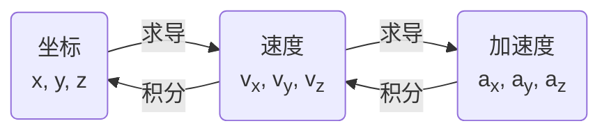

# 1.1 质点运动学

## 位移、速度、加速度

### 位置矢量（位矢）

- 建立直角坐标系后，物体的位置可以用 $A(x,y,z)$ 表示。
- 向量 $\vec r=\overrightarrow{OA}$ 称为位置矢量（位矢），也记为 $\vec r=x\vec i+y\vec j+z\vec k$。

### 运动方程

质点坐标 $x,y,z$ 随 $t$ 的变化关系。将 $t$ 消掉即可得到轨迹方程。

::: example

已知质点的运动学方程为

$$
\vec r=4t^2\vec i+(2t+3)\vec j
$$

则质点运动的轨迹方程为？

---

$$
\left\{\begin{array}l
x=4t^2\\
y=2t+3
\end{array} \right.\Rightarrow
t={y-3\over 2}
\Rightarrow
x=(y-3)^2
$$

:::

### 位移与路程

- 物体的位置变化称为**位移** $\Delta \vec r$，用起点到终点的有向线段表示。
- 物体实际运动的路径长称为**路程** $\Delta s$。

> [!warning]
>
> - $\Delta\vec r$ 是位移，$|\Delta\vec r|$ 是位移的大小，$\Delta r$ 是物体到原点距离的变化（$r$ 理解为极坐标中的半径，物理中没有实际含义）
> - 只有 ${\rm d}s =|{\rm d}\vec r|$是对的，$\Delta s\ne|\Delta\vec r|$，$\Delta r\ne|\Delta\vec r|$，${\rm d}r\ne|{\rm d}\vec r|$
> - 出现 $\Delta r$、${\rm d}r$ 基本都是错的

### 速度与速率

- 平均速度 $\vec v=\dfrac{\Delta\vec r}{\Delta t}$，平均速率是路程除以时间 $\bar v=\dfrac{\Delta s}{\Delta t}$

- 瞬时速度就是对每个坐标分量求导

  $$
  \vec v={{\rm d}\vec r\over{\rm d}t}={{\rm d}x\over{\rm d}t}\vec i+{{\rm d}y\over{\rm d}t}\vec j+{{\rm d}z\over{\rm d}t}\vec k
  $$

- 瞬时速率是瞬时速度的大小

  $$
  v=\left|{{\rm d}\vec r\over{\rm d}t} \right|={{\rm d}\vec s\over{\rm d}t}=\sqrt{
  \left({{\rm d}x\over{\rm d}t} \right)^2+\left({{\rm d}y\over{\rm d}t} \right)^2+\left({{\rm d}z\over{\rm d}t} \right)^2}
  $$

  > [!warning]
  >
  > $\left|\dfrac{{\rm d}\vec r}{{\rm d}t} \right|$ 不能写成 $\dfrac{{\rm d}r}{{\rm d}t}$ 或者 $\dfrac{{\rm d}|\vec r|}{{\rm d}t}$

::: example

一运动质点在某瞬时位于矢径 $\vec r=(x,y)$ 的端点处，其速度大小为

$$
{\bf A.\,}\frac{{\rm d}r}{{\rm d}t}\qquad
{\bf B.\,}\frac{{\rm d}\vec r}{{\rm d}t}\qquad
{\bf C.\,}\frac{{\rm d}|\vec r|}{{\rm d}t}\qquad
{\bf D.\,}\sqrt{
\left({{\rm d}x\over{\rm d}t} \right)^2+\left({{\rm d}y\over{\rm d}t} \right)^2}
$$

A 和 C 显然错误。B 是矢量。故选择 D。

:::

::: example

一个质点在 $Oxy$ 平面内运动，运动学方程为 $x=2t$，$y=19-2t^2$（单位为米），则在第 2 秒内质点的平均速度大小为 $\underline{\hspace{3em}}$，第 2 秒末的瞬时速度大小为 $\underline{\hspace{3em}}$。

---

令 $t=1$，有 $\cases{x=2\\y=17}$。令 $t=2$，有 $\cases{x=4\\y=11}$。

得到 $\Delta\vec r=(2,-6)$，故有

$$
\vec v=\dfrac{\Delta\vec r}t=(2,-6)\Rightarrow|\vec v|=2\sqrt{10}\operatorname{m/s}
$$

又有

$$
\begin{gathered}
\left.{{\rm d}x\over {\rm d}t}\right|_{t=2}=2,\quad\left.{{\rm d}y\over{\rm d}t}\right|_{t=2}=-4t|_{t=2}=-8 \\
\vec v=\sqrt{2^2+8^2}=2\sqrt{17}\operatorname{m/s}
\end{gathered}
$$

:::

### 加速度

- 平均加速度 $\vec a=\dfrac{\Delta\vec v}{\Delta t}$

- 瞬时加速度就是对每个速度分量求导
  $$
  \vec a={{\rm d}\vec v\over{\rm d}t}={{\rm d}v_x\over{\rm d}t}\vec i+{{\rm d}v_y\over{\rm d}t}\vec j+{{\rm d}v_z\over{\rm d}t}\vec k
  $$

> [!warning]
>
> 加速度与速度同号为加速、异号为减速，而不是正数加速、负数减速。

::: example

某个质点作直线运动的运动学方程为 $x=3t-5t^3+6$，则该质点作

1. 匀加速直线运动，加速度沿 $x$ 轴正方向
2. 匀加速直线运动，加速度沿 $x$ 轴负方向
3. 变加速直线运动，加速度沿 $x$ 轴正方向
4. 变加速直线运动，加速度沿 $x$ 轴负方向

---

$$
\begin{gathered}
v={{\rm d}x\over{\rm d}t}=3-15t^2\\
a={{\rm d}v\over{\rm d}t}=-30t<0
\end{gathered}
$$

故这是变加速直线运动，加速度沿 $x$ 轴负方向，选择 4。

:::

### 位移、速度、加速度的互求

$$
\begin{array}m
v={{\rm d}x\over{\rm d}t}& a={{\rm d}v\over{\rm d}t}\\
x=x_0+\int_0^tv{\rm d}t & v=v_0+\int_0^ta{\rm d}t
\end{array}
$$

::: example

一质点沿x方向运动，其加速度随时间变化关系为 $a=3+2t$，如果质点从原点出发，初始时的速度 $v_0$ 为 $5\operatorname{m/s}$，则当 $t=3\operatorname{s}$ 时，质点的速度 $v=$ $\underline{\hspace{3em}}$，位置坐标 $x=$ $\underline{\hspace{3em}}$。

---

$$
\begin{gathered}
v=v_0+\int_0^t(3+2t){\rm d}t=5+3t+t^2,\quad v|_{t=3}=23\operatorname{m/s} \\
x=x_0+\int_0^t(5+3t+t^2){\rm d}t=6t+\frac32 t^2+\frac13 t^3,\quad x|_{t=3}=37.5\operatorname{m}
\end{gathered}
$$

:::

## 圆周运动的参数

### 切向和法向加速度

- 加速度可以沿速度方向分解
- 与速度方向平行的称为切向加速度，改变速度的大小 $a_t=\dfrac{{\rm d}v}{{\rm d}t}$
- 与速度方向垂直的称为法向加速度，改变速度的方向 $a_n=\dfrac{v^2}\rho$
- 其中 $\rho$ 为曲率半径，若为圆周运动就为半径

::: example

在半径为 $R$ 的圆周上运动的质点，其速率与时间关系为 $v=ct^2$，从 $0$ 时刻到 $t$ 时刻，质点走过的路程为 $s=$ $\underline{\hspace{3em}}$；$t$ 时刻质点的切向加速度为 $a_t=$ $\underline{\hspace{3em}}$，法向加速度为 $a_n=$ $\underline{\hspace{3em}}$，总加速度的大小为 $a=$ $\underline{\hspace{3em}}$。

---

$$
\begin{align}
s&=\int_0^tct^2{\rm d}t=\frac13ct^3\\
a_t&={{\rm d}\over{\rm d}t}ct^2=2ct\\
a_n&={v^2\over\rho}={c^2t^4\over\rho}\\
a&=\sqrt{(2ct)^2+\left(c^2t^4\over R \right)^2}
\end{align}
$$

（考试时不化到最简一般也算对）

:::

### 圆周运动参数的互求

类比位移、速度与加速度的关系：

$$
\begin{array}m
\omega={{\rm d}\theta\over{\rm d}t}& \alpha={{\rm d}\omega\over{\rm d}t}\\
\theta=\theta_0+\int_0^t\omega{\rm d}t & \omega=\omega_0+\int_0^t\alpha{\rm d}t
\end{array}
$$

> [!note]
>
> 高中学的直线运动五大公式中，只要把位移、速度与加速度替换成角位移、角速度与角加速度，就可以接着用了。

此外还有角量与线量的关系：

- 线速度 $v=\omega R$
- 法向加速度 $a_n=\dfrac{v^2}R=\omega^2R$
- 切向加速度 $a_t=\dfrac{{\rm d}v}{{\rm d}t}=\alpha R$

::: example

一质点从静止出发，沿半径为 $R=1$ 的圆周运动，角加速度 $\alpha=12t^2-6t$，则质点的角速度 $\omega=$ $\underline{\hspace{3em}}$，切向加速度 $a_t=$ $\underline{\hspace{3em}}$，法向加速度 $a_n=$ $\underline{\hspace{3em}}$，总加速度为 $a=$ $\underline{\hspace{3em}}$。

---

$$
\begin{align}
\omega&=\int_0^t(12t^2-6t){\rm d}t=4t^3-3t^2\\
a_t&=\alpha R=12t^2-6t\\
a_n&=\omega^2R=(4t^3-3t^2)^2\\
a&=\sqrt{a_t^2+a_n^2}=\sqrt{(12t^2-6t)^2+(4t^3-3t^2)^4}
\end{align}
$$

:::

## 相对运动

若相对只有平动，则位移、速度、加速度都满足：**A 的实际 = A 相对于 B + B 的实际**，简记为「**绝对 = 相对 + 牵连**」。

::: example

某人骑自行车以速率 $v$ 向西行驶，今有风以相同速率从北偏东 $30\degree$ 方向吹来，试问人感到风从哪个方向吹来？

---

找到几个要素：

- 牵连：人的速度，向西的 $v$
- 绝对：风的对地速度，南偏西 $30\degree$ 的 $v$（注意题中的方向是风的来向，速度方向与来向相反）
- 相对 = 绝对 - 牵连 = 南偏东 $30\degree$

因此人感觉到风从北偏西 $30\degree$ 吹来。

:::
