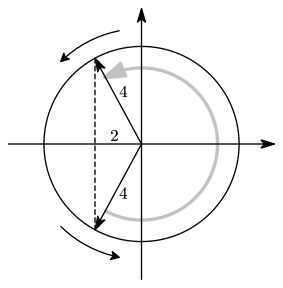
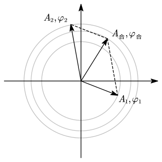
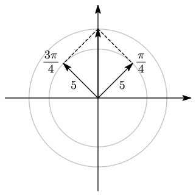

# 1.4 机械振动与机械波

## 简谐运动的描述

### 运动学方程

$$
x = A\cos(\omega t+\varphi)
$$

写成正弦或余弦都可以，根据自己的教材处理。

求导可得：

$$
\begin{gathered}
v =-\omega A\sin(\omega t+\varphi) \\
a =-\omega^2A\cos(\omega t+\varphi)=-\omega^2x
\end{gathered}
$$

::: example

简谐振动的表达式为 $x=Acos(3t+\varphi)$ (SI)，已知 $t=0$ 时的位移为 $0.04\operatorname m$，速度为 $0.09\operatorname{m/s}$，求振幅和初相。

---

代入公式有

$$
\begin{gathered}
0.04 = A\cos\varphi \\
0.09 =-3A\sin(3t+\varphi)
\end{gathered}
$$

解得 $\tan\varphi=-\dfrac34$，$\varphi=-37\degree$

:::

### 旋转矢量法

即运动学方程的几何描述。

长度为 $A$ 的矢量在圆上逆时针旋转，在 $x$ 轴上的投影就是位移。

::: example

质点做简谐振动，振幅为 $A=4$，周期 $T=2$。质点在 $t=0$ 时刻第一次通过 $x=-2$，且速度为正方向。求质点再次通过 $x=-2$ 处的时间。

---

第一次速度为正方向，故第一次应该是下面那个。因此实际旋转过程是右边那一半。

由左边的两个 $2:\sqrt3:1$ 的直角三角形可以看出，转动的角度是 $\dfrac34\pi$，即 $\dfrac23$ 个圆，因此所用的时间为 $\dfrac23\times2=\dfrac43$。

:::

### 简谐运动的特征量

- 圆频率 $\omega$，周期 $T=\dfrac{2\pi}\omega$，频率 $\nu=\dfrac1T$

  弹簧振子 $T=2\pi\sqrt{\dfrac mk}$；单摆 $T=2\pi\sqrt{\dfrac lg}$

- 振幅 $\displaystyle A=\sqrt{x_0^2+\left(v_0\over\omega\right)^2}$

- 初相位 $\varphi=\arctan\left(-\dfrac{v_0}{\omega x_0} \right)$

::: example

写出下列简谐振动的运动学方程。

---

从图中可以看出，$A=10\operatorname{cm}$，$T=12\operatorname s$，故有 $\omega=\dfrac{2\pi}T=\dfrac\pi6$。

图像相当于余弦曲线向左平移 $\dfrac\pi3$，因此运动学方程为

$$
x = 10\cos\left(\frac\pi6t+\frac\pi3 \right)\;(\operatorname{cm})
$$

:::

### 简谐振动的判断依据

- 回复力与位移成正比，且指向平衡位置：$F=-kx$
- 振动方程可化为 $\displaystyle m{\mathrm d^2 x\over\mathrm dt^2}=-kx$ 或 $\displaystyle {\mathrm d^2x\over \mathrm dt^2}+\omega^2x=0$
- 对于单摆，可对悬点取转动定律，$\displaystyle-gml\theta=ml^2{\mathrm d^2\theta\over\mathrm dt^2}$

::: example

如图所示，横截面均匀的光滑 U 形管中有适量液体，液体的总长度为 $L$，忽略摩擦和液体黏性
求液面上下微小起伏（$y\ll L$）的自振周期。

---

目标就是把 $F=-kx$ 写出来。我们以下图红色部分作为研究对象。

设管道横截面为 $S$，那么绿色部分对红色部分产生的压力为 $\rho g(2y)S$。红色部分的长度为 $L-2y$，质量为 $\rho(L-2y)S$，所以我们可以写出：

$$
-2\rho gyS=(L-2y)\rho S\cdot{\mathrm d^2y\over \mathrm dt^2}
$$

故有

$$
{\mathrm d^2y\over\mathrm dt^2}+{2gy\over L}=0
$$

和 $\displaystyle {\mathrm d^2x\over \mathrm dt^2}+\omega^2x=0$ 对照，就有

$$
\begin{gathered}
\omega=\sqrt{2g\over L} \\
T={2\pi\over\omega}=2\pi\sqrt{L\over2g}
\end{gathered}
$$

:::

## 简谐振动的能量与合成

### 简谐振动的能量

- 动能

  $$
  E_k=\frac12mv^2=\dfrac12m\omega^2A^2\sin^2(\omega t+\varphi)
  $$

- 势能

  $$
  E_p=\frac12kx^2=\frac12m\omega^2A^2\cos^2(\omega t+\varphi)
  $$

- 总能量

  $$
  E=E_k+E_p=\frac14kA^2=\frac12m\omega^2A^2
  $$

- 在一个周期内，动能和势能的平均值各占一半。

::: example

在弹簧振子中，物体质量为 $0.01\operatorname{kg}$，简谐振动的运动学方程为 $x=0.1\cos\left(8\pi t+\dfrac{2\pi}3\right)$

1. 求通过平衡位置时的动能和势能
2. 在什么位置上动能与势能相等

---

1.

通过平衡位置时的势能为一定为 $0$。故有

$$
E_k=E=\frac12m\omega^2A^2=3.16\times10^{-2}\operatorname J
$$

2.  $$
    \begin{gathered}
    \sin\left(8\pi t+\frac{2\pi}3\right)=\cos\left(8\pi t+\frac{2\pi}3\right) \\
    \Rightarrow \cos\left(8\pi t+\frac{2\pi}3\right)=\pm{\sqrt2\over2} \\
    \Rightarrow x=\pm {\sqrt2\over20}\operatorname m
    \end{gathered}
    $$
    :::

### 简谐振动的合成

只研究同方向、同频率的简谐振动合成。

- $x_1=A_1\cos(\omega t+\phi_1)$ 与 $x_2=A_2\cos(\omega t+\phi_2)$ 的合成仍是同频率简谐振动
- 特例：同相时 $A=A_1+A_2$，反相时 $A=|A_1-A_2|$

使用旋转矢量法求解振动合成：绘出 $t=0$ 时的分振动的矢量，利用矢量合成得到合振动的矢量。

::: example

两个同方向、同频率简谐振动的方程分别为 $x_1=5\cos\left(5t+\dfrac14π\right)$，$x_2=5\cos\left(5t+\dfrac34π\right)$，则合振动的振动方程为 $\underline{\hspace{3em}}$。

---

故合振动为：

$$
5\sqrt2\cos\left(5t+\frac12\pi \right)
$$

:::

## 机械波的形成与传播

### 波的相关概念

- 机械波产生的条件

  - 有做机械振动的物体（波源）
  - 有连续的介质

- 横波和纵波

  - 横波：振动方向与传播方向垂直
  - 纵波：振动方向与传播方向平行

- 机械波的传播

  - 机械波是上游质元带动下游质元振动，下游的相位比上游更晚
  - 波动是振动状态的传播，而不是介质的传播

- 波的几何描述

  - 波线：表示波传播方向的射线
  - 波面：振动相位相同的点组成的面
  - 波阵面（波前）：某时刻波到达的各点所构成的面

### 波的特征量

- 波速 $u$：振动状态的传播速度，不是质元运动速度
- 周期 $T$：一个完整波通过波线上某点所需时间
  - 频率 $v=\dfrac1T$
  - 角频率 $\omega=2\pi v$
- 波长 $\lambda$：波线上相邻的振动状态相同的两质元间的距离，波每传播 $\lambda$，相位就落后 $2\pi$

::: example

平面简谐波。波速为 $6.0\operatorname{m/s}$，振动周期为 $0.1\operatorname s$，则波长为 $\underline{\hspace{3em}}$。在波的传播方向上，有两质点（其间距离小于波长）的振动相位差为 $\dfrac{5\pi}6$，则此两质点相距 $\underline{\hspace{3em}}$。

---

$$
\begin{gathered}
\lambda=uT=0.6\operatorname m \\
\Delta s=\Delta\theta\cdot{\lambda\over2\pi}={5\lambda\over12}=0.25\operatorname m
\end{gathered}
$$

:::

### 波函数

描述任意时间 $t$、任意位置 $x$ 处质点的位移 $y$ 的函数 $y=f(t,x)$。

$$
\begin{gathered}
y=A\cos\left[ \omega\left(t\mp\frac xu\right)+\varphi_0 \right] \\
或\:y=A\cos\left( \omega t\mp\frac{2\pi}\lambda x+\varphi_0 \right)
\end{gathered}
$$

其中，正向传播取负号，负向传播取正号。

::: example

已知一平面简谐波的表达式为 $y=A\cos\pi(4t+2x)$

1. 求该波的波长，频率和波速
2. 求 $t=4.2\operatorname s$ 时刻，离坐标原点最近波峰位置
3. 求 $t=4.2\operatorname s$ 时刻后，第一次有波峰通过原点的时间

---

1.

- $\omega=4\pi$，$T=\dfrac12\operatorname s$，$f=2\operatorname {Hz}$；
- $\lambda=1\operatorname m$；
- $u=\dfrac\lambda T=2\operatorname {m/s}$。

2.
$$
y=A\cos(16.8\pi+2\pi x)=A\cos(0.8\pi+2\pi x)
$$
令 $0.8\pi+2\pi x=2k\pi$，得 $x=$

:::
