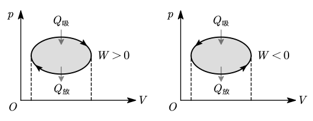
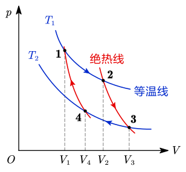

# 2.2 热力学定律

## 热力学第一定律

### 准静态过程

- 热力学系统从一个状态变化到另一个状态称为过程，完成过程的具体方法称为途径
- 准静态过程是指系统的每一状态都无限接近于平衡状态的过程
- 改变系统状态的方法是做功或传热

> [!warning]
>
> - $p,V,T,E$ 是状态量，其变化与途径无关
> - 做功 $W$ 和传热 $Q$ 是过程量，与具体途径有关

### 热力学第一定律

$$
Q =\Delta E+W
$$

- 内能变化：$\Delta E=\dfrac i2\nu R\Delta T$，升温为正，降温为负

- 功：$W=\int_{V_1}^{V_2}p\mathrm dV$，等于 $p-V$ 图下方面积，膨胀为正，压缩为负

  

- 热量：$Q=C_m\nu\Delta T$，吸热为正，放热为负

  - 体积不变，使用定体摩尔热容 $C_{V,m}=\dfrac i2R$
  - 压强不变，使用定压摩尔热容 $C_{p,m}=\dfrac{i+2}2R$
  - 比热容比 $\gamma=\dfrac{i+2}i$

::: example

$1\operatorname {mol}$ 双原子理想气体从 $300\operatorname K$ 升温到 $350\operatorname K$，分别在等体、等压、绝热的条件下，求该过程吸收的热量、增加的内能和对外做的功。$R=8.314\operatorname {J/(mol\cdot K)}$。

---

双原子理想气体，有 $i=5$。

**等体过程：**

$$
\begin{align}
W&=\int_{V}^Vp\mathrm dV = 0\operatorname J \\
Q&={5\over2}R\nu\Delta T = 1039\operatorname J\\
\Delta E&= Q-W = 1039\operatorname J
\end{align}
$$

**等压过程：**

$$
\begin{align}
Q&=\frac72R\nu\Delta T = 1455\operatorname J\\
\Delta E&=\frac 52\nu R\Delta T = 1039\operatorname J\\
W&= Q-\Delta E = 416\operatorname J
\end{align}
$$

> [!tip]
>
> 等压过程中，$W=\int_{V_1}^{V_2}p\mathrm dV=p\Delta V$，根据 $pV=\nu RT$，因此也可以通过 $W=\nu R\Delta T$ 计算 $W$。

**绝热过程：**

$$
\begin{align}
Q&= 0\\
\Delta E&=\frac 52\nu R\Delta T = 1039\operatorname J\\
W&= Q-\Delta E =-1039\operatorname J
\end{align}
$$

:::

::: example

比热容比 $\gamma=1.4$ 的理想气体进行如图循环，状态 $A$ 的温度为 $300\operatorname K$。$R=8.314\operatorname {J/(mol\cdot K)}$。求：

1. 状态 $B$，$C$ 的温度和气体物质的量；
2. 各过程中气体对外作的功；
3. 整个循环中气体对外做的总功和吸收的总热量；
4. 各过程中气体吸收的热量。

---

**1.**

$$
\gamma ={i+2\over i}= 1.4\Rightarrow i = 5
$$

由 $pV=\nu RT$，有

$$
\begin{align}
\nu&={p_AV_A\over RT_A}= 0.32\operatorname {mol} \\
T_B&={p_BV_B\over\nu R}= 225\operatorname K \\
T_C&={p_CV_C\over\nu R}= 75\operatorname K
\end{align}
$$

**2.**

气体对外做功即 $p-V$ 图线下面积，有

$$
\begin{align}
W_{AB}&=\frac12\times(100+400)\times(6-2)= 1000\operatorname J \\
W_{BC}&=-100\times(6-2)=-400\operatorname J \\
W_{CA}&= 0\operatorname J
\end{align}
$$

**3.**

经过一个循环回到 $A$ 点，前后内能不变，故有

$$
\begin{align}
W_总&= W_{AB}+W_{BC}+W_{CA}= 600\operatorname J \\
Q_总&=\Delta E_总+W_总 = W_总 = 600\operatorname J
\end{align}
$$

**4.**

> $B\to C$ 和 $C\to A$ 分别是等压变化和等体变化，$Q$ 可以代公式计算。$A\to B$ 不好计算，可以用 $Q_总$ 减去上面两个过程来处理。

$$
\begin{align}
Q_{BC}&={i+2\over2}R\nu\Delta T =-1400\operatorname J\\
Q_{CA}&=\frac i2R\nu\Delta T = 1500\operatorname J\\
Q_{AB}&= Q-Q_{BC}-Q_{CA}= 500\operatorname J
\end{align}
$$

:::

## 等值过程

| 等值过程 |   不变量    |       热量 $Q$        |    内能变化 $\Delta E$     |             做功 $W$              |      热一简化形式      |
| :------: | :---------: | :-------------------: | :------------------------: | :-------------------------------: | :--------------------: |
| 等体过程 |     $V$     |   $\dfrac i2\nu RT$   |  $\dfrac i2\nu R\Delta T$  |                $0$                |      $Q=\Delta E$      |
| 等压过程 |     $p$     | $\dfrac {i+2}2\nu RT$ |  $\dfrac i2\nu R\Delta T$  |            $p\Delta V$            | $Q=\Delta E+p\Delta V$ |
| 等温过程 | $T$ ($pV$)  |        非零值         | $\dfrac i2\nu R\Delta T=0$ |    $\nu RT\ln\dfrac{p_1}{p_2}$    |         $Q=W$          |
| 绝热过程 | $pV^\gamma$ |          $0$          |  $\dfrac i2\nu R\Delta T$  | $\dfrac{p_1V_1-p_2V_2}{\gamma-1}$ |     $0=\Delta E+W$     |

绝热过程中的 $\gamma$ 是上面提到的比热容比 $\dfrac{i+2}i$。

> [!warning]
>
> 气体的绝热自由膨胀（向真空膨胀）不做功、不传热，内能不变.

::: example

气缸内盛有 $1\operatorname {mol}$ 温度为 $27\degree\mathrm C$，压强为 $1 \operatorname {atm}$ 的氮气。先使它等压膨胀到原来体积的 $2$ 倍，再等体升压使其压强变为 $2 \operatorname {atm}$，最后使它等温膨胀到压强为 $1 \operatorname {atm}$。求氮气在全过程中对外做的功、吸的热、内能的变化。$R=8.314\operatorname {J/(mol\cdot K)}$。

---

氮气为双原子分子，有 $i=5$，$p_0=1\operatorname {atm}=10^5\operatorname {Pa}$。

$$
\begin{align}
T_A&= T_0 = 27\degree\mathrm C = 300\operatorname K\\
T_B&= 2T_A = 600\operatorname K\\
T_C&= 2T_B = 1200\operatorname K\\
T_D&= T_C = 1200\operatorname K
\end{align}
$$

故有

$$
\Delta E_总 =\frac52\nu R(T_D-T_A)= 18700\operatorname J
$$

在 $A$ 点有

$$
p_AV_0 =\nu RT_A\Rightarrow V_0 ={\nu RT_0\over p_0}
$$

$W$ 等于 $p-V$ 图线下面积，有

$$
\begin{align}
W_总&= W_{AB}+W_{CD}\\
&= p_0V_0+\int_{2V_0}^{4V_0}{4p_0V_0\over V}\mathrm dV \\
&= p_0V_0+4p_0V_0\ln 2 \\
&= 6915\operatorname J
\end{align}
$$

故有

$$
Q_总 = W_总+\Delta E_总 = 28115\operatorname J
$$

:::

## 循环过程与热机

### 循环过程

- 循环过程
  - 从某一状态开始，经过一系列变化，回到原来的状态，对应 $p-V$ 图上的闭合曲线
  - 循环一周内能不变 $\Delta E=0$，做功大小等于闭合曲线的面积
- 热循环（正循环）：$W=Q_吸-Q_放$，热循环效率 $\eta=\dfrac W{Q_吸}=1-\dfrac{Q_放}{Q_吸}$
- 冷循环（逆循环）：$|W|=Q_放-Q_吸$，制冷系数 $w=\dfrac{Q_吸}W$

::: example

如图所示，$abcda$ 为 $1\operatorname {mol}$ 单原子分子理想气体的循环过程，求：

1. 气体循环一次，在吸热过程中从外界共吸收的热量；
2. 气体循环一次对外做的净功；
3. 热循环效率。

---

单原子分子，有 $i=3$。

据图分析可得，吸热过程为 $abc$ 部分。因此，有

$$
\begin{align}
Q_吸&= W_{abc}+\Delta E_{abc} \\
&=\left [2+\frac32(2\times3-1\times2) \right]\times10^5\times10^{-3} \operatorname J\\
&= 800\operatorname J
\end{align}
$$

循环一次的净功为闭合图线围成的面积，即

$$
W_总 = 10^5\times10^{-3}\operatorname J = 100\operatorname J
$$

故有

$$
\eta =\frac W{Q_吸}= 12.5\%
$$

:::

### 卡诺热机

- 工作物质只和两个恒温热源交换热量的无摩擦的准静态循环
- 由两个等温过程和两个绝热过程组成
- 卡诺热机是效率最高的热机（是理想化的模型）
  - 热循环效率 $\eta=1-\dfrac{T_2}{T_1}$
  - 制冷系数 $w=\dfrac{T_2}{T_1-T_2}$

::: example

一卡诺热机，低温热源的温度为 $27\degree\mathrm C$，热机效率为 $40\%$，其高温热源温度为 $\underline{\hspace{3em}}\operatorname K$。今欲将该热机效率提高到 $50\%$，若低温热源保持不变，则高温热源的温度应增加 $\underline{\hspace{3em}}\operatorname K$。

---

$$
\begin{gathered}
\eta=1-{300\operatorname K\over T_1}=40\%\Rightarrow T_1=500\operatorname K \\
\eta'=1-{300\operatorname K\over T_1'}=50\%\Rightarrow T_1'=600\operatorname K\Rightarrow\Delta T_1=100\operatorname K
\end{gathered}
$$

:::

## 热力学第二定律

- 热力学第二定律的表述
  - 开尔文表述：其唯一效果是热量全部转变为功的过程是不可能的
  - 克劳修斯表述：热量不能自动地从低温物体传向高温物体
- 熵增原理：孤立系统内一切过程熵不会减少
  - 对于可逆过程（例如无摩擦的准静态过程）而言，$\Delta S=0$
  - 对于不可逆过程（自然过程）而言，$\Delta S>0$
- 熵增原理的统计意义：一个孤立系统其内部自发进行的过程，总是由热力学概率小的宏观态向热力学概率大的宏观态过渡

::: example

一绝热容器被隔板分成两半，一半是真空，另一半是理想气体。若把隔板抽出，气体将进行自由膨胀，达到平衡后（　　）。

1. 温度降低，熵增加
2. 温度不变，熵增加
3. 温度降低，熵不变
4. 温度不变，熵不变

---

气体对真空膨胀不做功，容器绝热，故前后内能不变，因此温度不变；膨胀后混乱程度增加，熵增加。因此选择 2。

:::

::: example

根据热力学第二定律判断，下列哪种说法是正确的：

1. 热量能从高温物体传到低温物体，但不能从低温物体传到高温物体
2. 功可以全部变为热，但热不能全部变为功
3. 气体能够自由膨胀，但不能自动收缩
4. 有规则运动的能量能够变为无规则运动的能量，但无规则运动的能量不能变为有规则运动的能量

---

1. 错误。可以通过做功实现（冰箱、空调）。
2. 错误。热可以全部变为功，只要不是唯一效果。
3. 正确。参考上例，气体自由膨胀是熵增go'ig
4. 错误。有规则运动的能量即动能，无规则运动的能量即内能，二者可以相互转化。

:::
