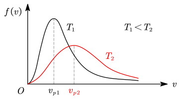

# 2.1 气体动理论

## 理想气体

### 理想气体的微观假设

- 忽略分子本身的形状和大小
- 不考虑分子间除碰撞外的相互作用
- 所有碰撞均为弹性碰撞

### 理想气体状态方程

#### 形式 1

$$
pV =\nu RT
$$

- $\nu$：物质的量（高中化学中用 $n$ 表示，但是大物中 $n$ 表示分子数密度，因此使用 $\nu$ 表示物质的量），$\nu=\dfrac mM=\dfrac N{N_A}$
  - 阿伏伽德罗常数 $N_A\approx6.02\times10^{23}\operatorname {mol^{-1}}$
- $R$：气体常数，$R=8.314\operatorname {J/(mol\cdot K)}$（考试时会给，无需记忆）

#### 形式 2

$$
p = nkT
$$

- $n$：分子数密度，$n=\dfrac NV$
- $k$：玻尔兹曼常数，$k=\dfrac R{N_A}=1.38\times10^{-23}\operatorname {J/K}$（考试会给）

> [!warning]
>
> 注意区分 $\nu$ 和 $n$ 的含义。

::: example

已知一容器内的理想气体在温度为 $273\operatorname K$、压强为 $1.0\times10^{-2} \operatorname {atm}$ 时，其密度为 $1.24\times10^{-2}\operatorname {kg/m^3}$，则该气体的摩尔质量 $M =$ $\underline{\hspace{3em}}$。

---

做题时若无特别说明，大气压均取 $10^5\operatorname {Pa}$。因此该气体压强为 $10^3\operatorname {Pa}$。

根据 $pV=\nu RT$，将 $\rho=\dfrac mV$ 代换 $V$ 得到

$$
pm =\nu RT\rho\Rightarrow M =\frac m\nu =\frac{\rho RT}p = 28\operatorname {g/{mol}}
$$

:::

## 温度和压强

### 热平衡

- 热平衡态：两个系统长时间热接触达到的共同平衡态
- 热平衡定律（热力学第零定律）：分别与第三个系统处于同一热平衡态的两个系统也处于热平衡
- 温度：处于同一热平衡态下的热力学系统所具有的共同的宏观性质
  - 如果两个系统处于热平衡态，则他们的温度相等

> [!warning]
>
> 温度是宏观性质，只有大量分子的系统才能说温度，单个分子没有温度的概念。

### 温标

- 温标：温度的数值标度
- 热力学温标 $T(\mathrm K)=$ 摄氏温标 $t(\degree\mathrm C)+273.15$
- $0\operatorname K=-273.15\degree\mathrm C$ 称为绝对零度，绝对零度不可达到（热力学第三定律）

> [!warning]
>
> 热学计算时，摄氏温标一律要先化为热力学温标。

### 理想气体的温度

$$
\bar\varepsilon_t =\frac12m\overline{v^2}=\frac32kT
$$

- 温度与分子的平均平动动能成正比
- 方均根速率 $\displaystyle\sqrt{\overline{v^2}}=\sqrt{3kT\over m}=\sqrt{3RT\over m}$

> [!warning]
>
> $\overline{v^2}$ 是 **先将粒子的速度平方，然后取平均**；而不是先平均再平方（$\bar v^2$）。

### 理想气体的压强

$$
p =\frac13nm\overline{v^2}=\frac23n\bar\varepsilon_t
$$

压强与粒子的平均动能、分子数密度有关。其中，$m$ 为 **单个分子** 的质量。

::: example

一瓶氦气和一瓶氮气密度相同，分子平均平动动能相同，而且它们都处于热平衡状态，则它们的温度与压强大小关系如何？

---

由于分子平动动能 $\bar\varepsilon_t=\dfrac32kT$ 相等，$k$ 是常数，因此二者温度相等。

对于压强，有

$$
p = n\cdot\frac23\bar\varepsilon_t
=\frac NV \cdot\frac23\bar\varepsilon_t
={mN_A\over M}{\rho\over m} \cdot\frac23\bar\varepsilon_t
=\frac1M\cdot\frac23\rho\bar\varepsilon_tN_A
$$

由于 $M_\mathrm{He}=4\operatorname {g/{mol}}$，$M_\mathrm{N_2}=28\operatorname {g/{mol}}$，氮气摩尔质量大，故其压强小。

:::

::: example

在容积为 $10^{-2}\operatorname m^3$ 的容器中装有 $100\operatorname g$ 的气体，若气体分子的方均根速率为 $200\operatorname {m/s}$，则气体的压强为 $\underline{\hspace{3em}}$。

---

$$
p=\frac13nm\overline{v^2}
=\frac13\cdot{N\over V}\cdot {m_总\over N}\cdot\overline{v^2}
={m_总\overline{v^2}\over 3V}
= 1.33\times10^5\operatorname {Pa}
$$

:::

## 内能与能量均分定理

### 能量均分定理

$x,y,z$ 每个方向对应的平动动能为 $\dfrac12kT$：

$$
\dfrac12m\overline{v_x^2}=\dfrac12m\overline{v_y^2}=\dfrac12m\overline{v_z^2}=\frac13\bar\varepsilon_t =\frac12kT
$$

### 气体分子的自由度

|            | 平动自由度 $t$ | 转动自由度 $r$ | 总自由度 $i$ |
| :--------: | :------------: | :------------: | :----------: |
| 单原子分子 |       3        |       0        |      3       |
| 双原子分子 |       3        |       2        |      5       |
| 多原子分子 |       3        |       3        |      6       |

对这几个数字的理解：任何分子在 $x,y,z$ 三个空间轴上平动都是自由的。因此都有 $t=3$。将每个原子抽象为几何意义上的一个点，就有：

- 单原子分子的转动是「无意义」的，转与不转没有区别，因此 $r_1=0$；
- 双原子分子在转动时，以两原子连成的直线为轴进行旋转是「无意义」的，因此「缺失」了一个轴，$r_2=3-1=2$；
- 多原子分子无论如何转动都会产生变化，因此三个转动自由度都在，$r_{3+}=3$。

### 理想气体的内能

$$
E =\frac i2\nu RT =\dfrac i2 pV
$$

::: example

$1\operatorname {mol}$ 氧气贮于一氧气瓶中，温度为 $27\degree\mathrm C$，这瓶氧气的内能为 $\underline{\hspace{3em}}\operatorname J$；分子的平均平动动能为 $\underline{\hspace{3em}}\operatorname J$；分子的平均总动能为 $\underline{\hspace{3em}}\operatorname J$。（气体常数 $R=8.314\operatorname {J/(mol\cdot K)}$，玻尔兹曼常数 $k=1.38\times10^{-23}\operatorname {J/K}$）

---

氧气是双原子分子，$i=3+2=5$；温度 $T=27\degree\mathrm C=300\operatorname K$，故有

$$
\begin{align}
E&=\frac52\nu RT = 6235.5\operatorname J \\
\bar\varepsilon_t&=\frac32kT = 6.21\times10^{-21}\operatorname J \\
\bar\varepsilon&=\frac52kT = 1.035\times10^{-20}\operatorname J
\end{align}
$$

:::

::: example

用绝热材料制成的一个容器，体积为 $2V_0$，被绝热板隔成 A、B 两部分，A 内储有 $1 \operatorname {mol}$ 单原子分子理想气体，B 内储有 $2\operatorname {mol}$ 刚性双原子分子理想气体，A、B 两部分压强相等均为 $p_0$，两部分体积均为 $V_0$，求：

1. 两种气体各自的内能 $E_A$，$E_B$;
2. 抽去绝热板，两种气体混合后处于平衡时的温度 $T$。

---

**1.**

$$
\begin{align}
E_A&=\frac {i_A}2p_AV_A =\frac32p_0V_0 \\
E_B&=\frac {i_B}2p_BV_B =\frac52p_0V_0
\end{align}
$$

**2.**

由于容器绝热，因此把板拿掉前后，系统内能不变。故有：

$$
\begin{align}
E_A+E_B&= E_A'+E_B' \\
\left(\frac32+\frac52 \right)p_0V_0&=\frac32\cdot RT+\frac52\times2\cdot RT \\
\Rightarrow T&={8p_0V_0\over13R}
\end{align}
$$

:::

::: example

容积为 $20.0\operatorname L$ 的瓶子以速率 $v=200\operatorname {m/s}$ 匀速运动，瓶子中充有质量为 $100\operatorname g$ 的气体。设瓶子突然停止，气体的全部定向运动动能都变为热运动的动能，瓶子与外界没有热量交换。

1. 若瓶子中的气体为氦气，求温度、压强的增加量。
2. 若瓶子中的气体为氢气，再求上述增加量。

---

1. 氦气是单原子分子，$i=3+0=3$。热运动的动能即理想气体的内能。故有

   $$
   \begin{align}
   \frac12mv^2&=\frac32\nu R\Delta T&&\Rightarrow\Delta T = 6.41\operatorname K \\
   &=\frac32\Delta pV&&\Rightarrow\Delta p = 6.67\times 10^5\operatorname {Pa}
   \end{align}
   $$

2. 氢气是双原子分子，$i=3+2=5$，故有
   $$
   \begin{align}
   \frac12mv^2&=\frac52\nu R\Delta T'&&\Rightarrow\Delta T'= 3.85\operatorname K \\
   &=\frac52\Delta p'V&&\Rightarrow\Delta p'= 4\times 10^5\operatorname {Pa}
   \end{align}
   $$

:::

## 速率分布律

### 速率分布函数

- 速率分布函数 $f(v)$ 表示处于速率 $v$ 附近、单位速率区间内的概率；
- 某个区间内的图像下方面积表示该区间的概率，整个曲线下方面积是 $1$。

### 三种统计速率

- 最概然速率 $v_p$：使 $f(v)$ 取最大值的速率（高中称最可几速率）
- 平均速率：$\displaystyle\bar v=\int_0^{+\infty}vf(v)\mathrm dv$
- 方均根速率：$\displaystyle\sqrt{\overline{v^2}}=\sqrt{\int_0^{+\infty}v^2f(v)\mathrm dv}$

::: example

设某假想气体的速率分布函数如下：

$$
f(v)=\left\{\begin{array}l
av^2&0\le v\le v_0\\
0&v>v_0
\end{array} \right.
$$

求：

1. 常数 $a$ 与 $v_0$ 的关系；
2. 最概然速率、平均速率和均方根速率。

---

**1.**

$$
\begin{gathered}
\int_0^{+\infty} f(v)\mathrm dv
=\int_0^{v_0}av^2\mathrm dv
=\left.a\cdot\frac13v^3\right|_0^{v_0}
=\frac13av_0^3=1 \\
\Rightarrow a={3\over v_0^3}
\end{gathered}
$$

**2.**

$$
\begin{gathered}
f(v)_\max=f(v_0)\Rightarrow v_p=v_0 \\

\bar v=\int_0^{+\infty}vf(v)\mathrm dv
=\int_0^{v_0}av^3\mathrm dv
=\frac{ v_0^4}4\cdot\frac3{v_0^3}
=\frac34v_0 \\

\overline{v^2}=\int_0^{+\infty}v^2f(v)\mathrm dv
=\int_0^{v_0}av^4\mathrm dv
=\frac35v_0^2
\Rightarrow \sqrt{\overline{v^2}}={\sqrt{15}\over5}v_0
\\
\end{gathered}
$$

:::

### 麦克斯韦速率分布律

温度越高，曲线向下、向右移动，速率大的分子比例越大。

$$
\begin{align}
v_p&=\sqrt{2kT\over m}=\sqrt{2RT\over M} \\
\bar v&=\sqrt{8kT\over\pi m}=\sqrt{8RT\over\pi M} \\
\sqrt{\overline{v^2}}&=\sqrt{3kT\over m}=\sqrt{3RT\over m}
\end{align}
$$

::: example

图示的曲线分别表示氢气和氦气在同一温度下的分子速率的分布。

- 氦气分子的最概然速率为 $\underline{\hspace{3em}}$，氢气分子的最概然速率为 $\underline{\hspace{3em}}$；
- 氢气分子的平均速率为 $\underline{\hspace{3em}}$，氢气分子的方均根速率为$\underline{\hspace{3em}}$。

---

首先的问题是，谁是氢气，谁是氦气？根据 $v_p=\sqrt{\dfrac{2RT}M}$，氦气摩尔质量大，最概然速率小，因此左边那个峰是氦气，有 $v_p(\mathrm {He})=1000\operatorname {m/s}$。由此氢气分子的最概然速率为：

$$
\sqrt2\cdot v_p(\mathrm {He})=1000\sqrt2\operatorname {m/s}
$$

根据上面的比例系数，氢气分子的平均速率为：

$$
\sqrt{8\over2\pi}v_p(\mathrm{H_2})=1000\sqrt{8\over\pi}\operatorname {m/s}
$$

氢气分子的方均根速率为：

$$
\sqrt{3\over2}v_p(\mathrm{H_2})=1000\sqrt3\operatorname {m/s}
$$

:::

## 碰撞频率与自由程

- 平均碰撞频率 $\bar z$
  - 单位时间一个气体分子与其他分子碰撞次数
  - 若假设只有一种分子，且视为直径为 $d$ 的球，则 $\bar z=\sqrt2\pi d^2n\bar v$
- 平均自由程 $\bar\lambda$
  - 气体分子在相邻两次碰撞之间飞行的平均路程
  - 公式：$\bar\lambda=\dfrac{\bar v}{\bar z}=\dfrac1{\sqrt2\pi d^2n}$

> [!warning]
>
> 平均自由程与分子运动的速率无关。

::: example

气缸内盛有一定量的氢气（可视作理想气体），当温度不变而压强增大一倍时，氢气分子的平均碰撞频率变为原来的 $\underline{\hspace{3em}}$ 倍，平均自由程变为原来的 $\underline{\hspace{3em}}$ 倍。

---

根据 $pV=\nu RT$，压强增大一倍，体积变为原来的一半。

根据 $\bar z=\sqrt2\pi d^2n\bar v$，温度不变则 $\bar v$ 不变，体积减半则 $n$ 变为原来的 $2$ 倍，故平均碰撞频率变为原来的 $2$ 倍。

根据 $\bar\lambda=\dfrac{\bar v}{\bar z}$，因此平均自由程变为原来的 $0.5$ 倍。

:::
