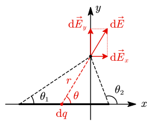
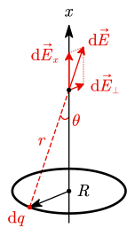
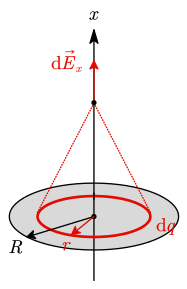
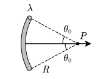
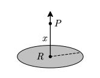
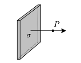
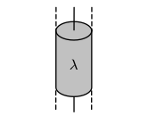
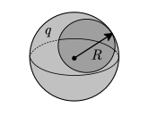
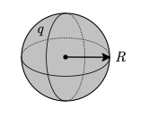

# 4.1 电场强度

定义：相对观察者静止的电荷所激发的电场

## 电荷

- 符号：$Q=ne$
- 单位：库仑 $\operatorname C$
- 元电荷 $e\approx 1.6\times10^{-19}\operatorname C$
- 电荷的电量与它的运动状态无关。
- 电荷守恒定律：在一个孤立系统中总电荷量是不变的，即在任何时刻系统中的正电荷与负电荷的代数和保持不变。
- 点电荷：当带电体的大小、形状与带电体间的距离相比可以忽略时，就可把带电体视为一个带电的几何点。（理想模型）

## 库仑定律

- 公式：$F=k\dfrac{q_1q_2}{r^2}$
- ==静电力常量 $k=\dfrac1{4\pi\varepsilon_0}$，其中 $\varepsilon_0$ 称为真空介电常数。==

对于多个点电荷相互作用，可以通过矢量叠加处理，即 $F=\sum k\dfrac{q_0q_i}{r_i^2}$

对于电荷连续分布的带电体，需要用微积分处理：
$$
\mathrm d\vec F={q_0\mathrm dq\over 4\pi\varepsilon_0r^2}\vec r^0
\Rightarrow \vec F=\int_Q{q_0\mathrm dq\over 4\pi\varepsilon_0r^2}\vec r^0
$$

其中，$\vec r^0$ 为沿连线上的单位向量。

## 电场强度

- 符号：$E$
- 单位：$\operatorname {N/C}$ 或 $\operatorname {V/m}$
- 定义式：$\vec E=\dfrac{\vec F}{q_0}$
- 文字表述：电场中某点的电场强度的大小等于单位电荷在该点受力的大小，其方向为正电荷在该点受力的方向。

点电荷的电场：
$$
\vec E={\vec F\over q_0}=\frac1{4\pi\varepsilon_0}\frac q{r^2}\vec r^0
$$
对于连续分布的带电体，使用微积分处理：
$$
\mathrm d\vec E=\frac1{4\pi\varepsilon_0}{\mathrm dq\over r^2}\vec r^0\Rightarrow
\vec E=\int\frac1{4\pi\varepsilon_0r^2}\vec r^0
$$

> [!note]
>
> **矢量积分的一般步骤**
>
> 1. 设坐标，取积分微元，这里是 $\mathrm dq$（按电荷的分布情况取）；
> 2. 写出点电荷 $\mathrm dq$ 的电场强度 $\mathrm d\vec E$ 的大小、方向（标在图上）；
> 3. 坐标分解 $\mathrm d\vec E$（在图上也要画出）；
> 4. 对 $\mathrm d\vec E$ 的各坐标分量积分。
>
> 积分微元的常见情况：
>
> - 线分布：$\lambda\mathrm dl$，其中 $\lambda$ 为面密度
> - 面分布：$\sigma\mathrm dS$，其中 $\sigma$ 为面密度
> - 体分布：$\rho\mathrm dV$，其中 $\rho$ 为体密度

有关若干点电荷在空间产生的场强问题，高中已经考烂了，此处不再提供例题

::: example

长为 $L$ 的均匀带电直杆，电荷线密度为 $\lambda$，讨论它在空间一点 P 产生的电场强度（P 点到杆的垂直距离为 $a$）。

---

先建立坐标系：

如果用长度来积分，每个点与 P 的距离都要通过勾股定理计算，不方便，因此采用角度来积分。

取微元，列表达式：
$$
\mathrm dq=\lambda\mathrm dx\Rightarrow\mathrm d\vec E={k\mathrm dq\over r^2}=k{\lambda\mathrm dx\over r^2}
$$
由几何关系可得：
$$
\begin{gathered}
r\sin\theta=a\Rightarrow r=a\csc\theta \\
a=x\tan(\pi-\theta)\Rightarrow x=-a\cot \theta\Rightarrow\mathrm dx=a\csc^2\theta\,\mathrm d\theta
\end{gathered}
$$
代入可得：
$$
\begin{gathered}
\mathrm d\vec E
=k{\lambda\mathrm dx\over r^2}=k{\lambda a\csc^2\theta\,\mathrm d\theta\over a^2\csc^2\theta}
=\frac{k\lambda}a\mathrm d\theta\\\\
\Rightarrow\begin{cases}\displaystyle
\mathrm d E_x=\frac{k\lambda}a\cos\theta\,\mathrm d\theta \\
\displaystyle
\mathrm d E_y=\frac{k\lambda}a\sin\theta\,\mathrm d\theta \\
\end{cases}
\end{gathered}
$$
因此有
$$
\begin{align}
E_x&=\int_{\theta_1}^{\theta_2}\frac{k\lambda}a\cos\theta\,\mathrm d\theta=\frac{k\lambda}a(\sin\theta_2-\sin\theta_1) \\
E_y&=\int_{\theta_1}^{\theta_2}\frac{k\lambda}a\sin\theta\,\mathrm d\theta=\frac{k\lambda}a(\cos\theta_1-\cos\theta_2) \\
\end{align}
$$

---

**讨论：**

- $a\gg L$ 直接看成点电荷
  $$
  E=k{\lambda L\over a^2}={\lambda L\over 4\pi\varepsilon_0a^2}
  $$

- $L\gg a$ 无限长带电棒
  $$
  \begin{cases}
  \theta_1=0\\
  \theta_2=\pi
  \end{cases}
  \Rightarrow
  \begin{cases}
  E_x=0 \\
  E_y=k\dfrac{2\lambda} a=\dfrac{\lambda}{2\pi\varepsilon_0a}
  \end{cases}
  $$

:::

::: example

半径为 $R$ 的均匀带电细圆环，带电量为 $Q$。求圆环轴线上任意一点 P（与圆心距离为 $x$）的电场强度。

---

建系取 $\mathrm dq$：

由于圆环上电荷对称分布，因此 $\vec E_\perp=0$。
$$
\mathrm d\vec E_x=\mathrm d\vec E\cos\theta=k\frac{\mathrm dq}{r^2}\cos\theta
$$
由几何关系可得：
$$
\begin{gathered}
r\cos\theta=x\Rightarrow r=x\sec\theta \\
\cos\theta=\frac xr=\frac x{\sqrt{R^2+x^2}}
\end{gathered}
$$
故有
$$
\begin{align}
\vec E_x&=\int_0^{Q}k\frac{\mathrm dq}{x^2\sec^2\theta}\cos\theta \\
&=\frac k{x^2}\cos^3\theta\int_0^Q\mathrm dq\\
&=\frac {kQ}{x^2}{x^3\over(R^2+x^2)^{3/2}} \\
&=\frac1{4\pi\varepsilon_0}{Qx\over(R^2+x^2)^{3/2}}
\end{align}
$$
此结论==可以直接使用==。

---

**讨论：**

1. 当 P 在圆环中心（$x=0$）

   $Qx$ 项为零，则 $E=0$。

2. 当 $x\gg R$ 时，$R^2+x^2\approx x^2$
   $$
   E=\frac1{4\pi\varepsilon_0}{Qx\over x^3}=\frac Q{4\pi\varepsilon_0x^2}
   $$
   直接将圆环视为点电荷也可推得此结论。

这两个结论==可以直接使用==。

:::

::: example

电荷面密度为 $\sigma$ 的圆板在轴线上任一点 P（与圆心距离为 $x$）的电场强度。

---

借用上个例子的结论，积分微元取圆环。
$$
\begin{align}
\mathrm dq&=2\pi r\sigma\mathrm dr \\
\mathrm dE&=\frac1{4\pi\varepsilon_0}\cdot\frac{x\mathrm dq}{(r^2+x^2)^{3/2}} \\
&=\frac{x\sigma}{2\varepsilon_0}\cdot\frac{r\mathrm dr}{(r^2+x^2)^{3/2}} \\
E&=\int\mathrm dE\\
&=\frac{x\sigma}{2\varepsilon_0}\int_0^R\frac{r\mathrm dr}{(r^2+x^2)^{3/2}} \\
\end{align}
$$

:::

## 场强相关的结论

|           模型            |         描述         |                             公式                             |          重要程度           |
| :-----------------------: | :------------------: | :----------------------------------------------------------: | :-------------------------: |
|    |        点电荷        |       $E=\dfrac1{4\pi\varepsilon_0}\cdot\dfrac q{r^2}$       |            必背             |
|    |       带电直棒       |      $E=\dfrac\lambda{2\pi\varepsilon_0x}\sin\theta_0$       |  $\textcolor{yellow}{★★★}$  |
|  |   带电 弧形棒   |      $E=\dfrac\lambda{2\pi\varepsilon_0R}\sin\theta_0$       |  $\textcolor{yellow}{★★★}$  |
|   |       带电圆环       |       $E=\dfrac{qx}{4\pi\varepsilon_0(R^2+x^2)^{3/2}}$       |   $\textcolor{yellow}{★}$   |
|  |       带电圆板       | $E=\dfrac\sigma{2\varepsilon_0}\left[1-\dfrac x{\sqrt{R^2+x^2}} \right]$ |   $\textcolor{yellow}{★}$   |
|  | 无限大 带电平面 |               $E=\dfrac\sigma{2\varepsilon_0}$               | $\textcolor{yellow}{★★★★★}$ |
|   | 无限长 带电直棒 |            $E=\dfrac\lambda{2\pi\varepsilon_0x}$             | $\textcolor{yellow}{★★★★}$  |
|  | 无限长 带电圆柱 | $\begin{cases}E=\dfrac{\lambda r}{2\pi\varepsilon_0R^2}&(r<R)\\E=\dfrac\lambda{2\pi\varepsilon_0r}&(r>R)\end{cases}$ |                             |
|  |       带电球壳       | $\begin{cases}E=0&(r<R)\\E=\dfrac q{4\pi\varepsilon_0r^2}&(r>R)\end{cases}$ |                             |
|   |   带电 实心球   | $\begin{cases}E=\dfrac{qr}{4\pi\varepsilon_0R^3}&(r<R)\\E=\dfrac q{4\pi\varepsilon_0r^2}&(r>R)\end{cases}$ |                             |

上述结论==均可直接使用==，并且可以二次推导。

::: example

一宽为 $b$ 的无限长均匀带电平面薄板，其电荷面密度为 $\sigma$，如图所示。试求平板所在平面内，距薄板边缘为 $a$ 处（设为点 $P$）的电场强度。

<<< ./images/exp-long-plate.ggb#graphing

---

在薄板内取一窄条，宽为 $\mathrm dx$，则该窄条的电荷线密度为 $\lambda=\sigma\mathrm dx$，对 $P$ 的场强为 $\mathrm dE=\dfrac\lambda{2\pi\varepsilon_0x}=\dfrac{\sigma\mathrm dx}{2\pi\varepsilon_0x}$。

则有
$$
E=\int_a^{a+b}\frac{\sigma\mathrm dx}{2\pi\varepsilon_0x}
=\frac{\sigma}{2\pi\varepsilon_0}\int_a^{a+b}\frac1x\mathrm dx=\frac{\sigma}{2\pi\varepsilon_0}\ln\frac{a+b}a
$$
:::
