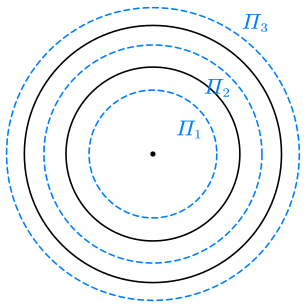

# 4.3 电势与电势能

## 电势能

- 电场力做功与路径无关 $\Rightarrow$ 电场力是保守力 $\Rightarrow$ 存在电势能
- 电势能零点可以自定义，一般默认无穷远处
- $\displaystyle W_M=\int_r^\infty\vec F\mathrm d\vec r=\int_r^\infty q_0\vec E\mathrm d\vec r$
  - 对于点电荷，有 $\displaystyle W_M=\int_r^\infty\frac{qq_0}{4\pi\varepsilon_0r^2}\mathrm dr=\frac{qq_0}{4\pi\varepsilon_0r}$
- 电场力做功 $A=-(W_2-W_1)$
- 电场力做正功 $\Longleftrightarrow$ 电势能减小

## 电势

- 电势 $V$ 定义为电势能与试探电荷的电荷量之比 $\displaystyle V=\frac{W_M}q=\int_0^\infty \vec E\mathrm d\vec r$
  - 对于点电荷，有 $V=\dfrac q{4\pi\varepsilon_0r}$
- 电势能 = 电荷 × 电势 = 电场力做功
- 沿着电场线方向，电势降落最快
- 电场强度与电势是描述静电场性质的两个基本物理量

求电势的三种题型：

- 离散型：$V=\dfrac q{4\pi\varepsilon_0r}$
- 连续型：$\mathrm dV=\dfrac{\mathrm dq}{4\pi\varepsilon_0r}$，$\displaystyle V=\int\frac{\mathrm dq}{4\pi\varepsilon_0r}$
- 已知场强求电势：$\displaystyle V=\int_r^\infty\vec E\mathrm d\vec l$

::: example

一均匀带电半圆环，半径为 $R$，电量为 $+Q$，求环心处的电势。

---

取一段线元 $\mathrm dl$，其带电量 $\mathrm dq=\dfrac Q{\pi R}\mathrm dl$，产生的电势为 $\mathrm dV=\dfrac {Q\mathrm dl}{4\pi^2\varepsilon_0 R^2}$

$$
V=\int_0^{\pi R}\mathrm dV=\frac Q{4\pi\varepsilon_0R}
$$

:::

> [!tip]
>
> **带电（部分）圆环电势分布结论**
>
> 对于圆环 / 半圆环 / 部分圆环，若其总带电量为 $Q$，则在圆心处的**电势**为：
>
> $$
> V_O=\frac Q{4\pi\varepsilon_0 R}
> $$
>
> 考得比较多，尽量记忆。

::: example

如图所示，在半径为 $R_1,R_2$ 的两个同心球面上分别均匀带电 $q_1,q_2$，求三个区域内的电势分布。

---

> 先通过高斯定理求出电场分布，积分得到电势分布。

如图，建立三个高斯面 $\varPi_1,\varPi_2,\varPi_3$。

$$
\varPhi=\oint\vec E\mathrm d\vec S=\frac{\sum q_内}{\varepsilon_0}\Rightarrow E=\frac{\varPhi}{4\pi r^2}=\frac{\sum q_内}{4\pi\varepsilon_0r^2}
$$

因此对于三个高斯面分别有

$$
\begin{array}{cl}
r<R_1 & E_1=0 \\
R_1<r<R_2 & E_2=\dfrac{q_1}{4\pi\varepsilon_0r^2} \\
r>R_2 & E_2=\dfrac{q_1+q_2}{4\pi\varepsilon_0r^2}
\end{array}
$$

故有

$$
\begin{align}
r<R_1\,时\quad V_1
&=\int_r^{R_1}0\mathrm dr
  +\int_{R_1}^{R_2}\frac{q_1}{4\pi\varepsilon_0r^2}\mathrm dr
  +\int_{R_2}^\infty\frac{q_1+q_2}{4\pi\varepsilon_0r^2}\mathrm dr \\
&=\frac1{4\pi\varepsilon_0}\left(\frac{q_1}{R_1}+\frac{q_2}{R_2} \right) \\
R_1<r<R_2\,时\quad V_2
&=\int_{r}^{R_2}\frac{q_1}{4\pi\varepsilon_0r^2}\mathrm dr
  +\int_{R_2}^\infty\frac{q_1+q_2}{4\pi\varepsilon_0r^2}\mathrm dr \\
&=\frac1{4\pi\varepsilon_0}\left(\frac{q_1}{r}+\frac{q_2}{R_2} \right) \\
r>R_2\,时\quad V_2
&=\int_{r}^\infty\frac{q_1+q_2}{4\pi\varepsilon_0r^2}\mathrm dr \\
&=\frac{q_1+q_2}{4\pi\varepsilon_0r} \\
\end{align}
$$

:::

> [!tip]
>
> **带电球壳电势分布结论**
>
> $$
> \begin{cases}
> V=\dfrac Q{4\pi\varepsilon_0R} & r<R \\
> V=\dfrac Q{4\pi\varepsilon_0r} & r>R
> \end{cases}
> $$

::: example

已知在直角坐标系中，某静电场的电势函数 $V=a(x^2+y)$，式中 $a$ 为一常量，则电场中任意点的场强为 $\underline{\hspace{3em}}$。

---

$$
\begin{gathered}
\frac{\partial V}{\partial x}=2ax\qquad
\frac{\partial V}{\partial y}=a \\
\Rightarrow \vec E=-2ax\vec i-a\vec j
\end{gathered}
$$

:::
