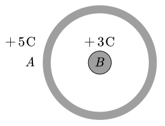

# 4.4 导体

## 静电平衡

导体有如下性质：

1. 电荷分布在外表面，内部场强处处为零（静电屏蔽）
2. 导体表面电场强度 $E=\dfrac\sigma{\varepsilon_0}$
3. 导体是等势体，表面是等势面，但场强并非处处相等
4. 导体表面曲率越大（尖锐），电荷密度越大

::: example

半径为 $R$ 的金属球体是一个等势体，其电势 $V=100\operatorname V$ 则球心处的场强大小为 $\underline{\hspace{3em}}$。

---

静电屏蔽，内部场强为 $0$。

:::

::: example

均匀带电无限大平板附近的场强大小为 $\underline{\hspace{3em}}$，均匀带电无限大平板导体附近的场强大小为 $\underline{\hspace{3em}}$。

---

$\dfrac\sigma{2\varepsilon_0}$，$\dfrac\sigma{\varepsilon_0}$

简单理解这个两倍关系，就是导体内部 $E=0$ 没有电场线，但导体表面电荷的电场线总要发射出去，就全部往外了。记住即可，不要深究。

:::

::: example

如图所示，金属球 $B$ 被一同心金属球壳 $A$ 所包围，分别给 $A,B$ 两导体以电量 $+5\operatorname C$ 和 $+3\operatorname C$ ，则 $A$ 球壳的外表面带电量为？

---

在 $A$ 的内部做出一个高斯面。由于 $A$ 内场强为零，因此高斯面上的电通量为零，高斯面内的净电荷量为零。故 $A$ 的内表面电荷量应为 $-3\operatorname C$。

$A$ 的总电量为 $5\operatorname C$，因此外表面电荷为 $5-(-3)=8\operatorname C$。

:::

> [!tip]
>
> 结论：导体 **球壳内表面上电荷** 与 **球壳内的电荷** 代数和为零。

::: example

一个带电达到静电平衡时（　　）。

**A.** 表面上电荷密度大处电势较高 **B.** 导体内任意两点的电势差等于零 **C.** 导体内部的电势比表面的电势高 **D.** 表面曲率较大处电势较高

---

导体是等势体，因此 ACD 错误，B 正确。

:::

::: example

![]./images/conduct-exp-2.svg)

一个未带电的空腔导体球壳，内半径为 $R$，在空腔内离球心的距离为 $d$ 处（$d<R$），固定一点电荷 $+q$ 则在球心 $O$ 处的电势为 $\underline{\hspace{3em}}$，用导线把球壳接地后，再把地线撤销，选无穷远为电势零点，则球心 $O$ 的电势为 $\underline{\hspace{3em}}$。

---

:::

## 导体的场强和电势