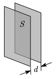

# 4.5 电容器

## 概念

- 电容器是由导体构成，电荷量等值异号，分布在极板内侧
- 电容公式：$C=\dfrac qU$，单位为法拉 $\operatorname F$

  - 电容大小只与极板大小、形状、相对位置以电介质有关
  - $q$ 代表一侧的电荷量取正， $U$ 代表极板间电压

- 极板间电场强度：$E=\dfrac\sigma{\varepsilon}=\dfrac Ud$
- 极板间电势差：$U=\dfrac qC=E\cdot d$
- 极板间相互作用力：$F=\textcolor{red}{\dfrac12}E\cdot q$

  - 极板间的 $E$ 由两极板共同贡献，如果看的是其中一个极板的受力就要扣除自己的，因此只有一半

- 电容串并联公式：和电阻相反

  - 串联：$\dfrac1{C_{eq}}=\dfrac1{C_1}+\dfrac1{C_2}$
  - 并联：$C_{eq}=C_1+C_2$

- 对于==含介质==的电容器，有 $\varepsilon=\varepsilon_0\cdot\varepsilon_r$
  - $\varepsilon$：介电常量（电容率）
  - $\varepsilon_0$：真空中的介电常量（真空中电容率）
  - $\varepsilon_r$：某介质的相对介电常量（相对电容率），$\varepsilon_r\ge1$
  - 相比于真空，含介质的电容器有 $C=\varepsilon_rC_0$，$E=\dfrac{E_0}{\varepsilon_r}$

## 常见电容器公式

|              示意图              |        名称        |                真空电容                 |                              含介质电容                               |
| :------------------------------: | :----------------: | :-------------------------------------: | :-------------------------------------------------------------------: |
|  |  ==平行板电容器==  |       $C=\dfrac{\varepsilon_0S}d$       |       $C=\dfrac{\varepsilon_0\textcolor{red}{\varepsilon_r}S}d$       |
|          |    圆柱形电容器    | $C=\dfrac{2\pi\varepsilon_0l}{\ln R/r}$ | $C=\dfrac{2\pi\varepsilon_0\textcolor{red}{\varepsilon_r}l}{\ln R/r}$ |
|            |     球形电容器     |  $C=4\pi\varepsilon_0\dfrac{Rr}{R-r}$   |  $C=4\pi\varepsilon_0\textcolor{red}{\varepsilon_r}\dfrac{Rr}{R-r}$   |
|          | ==孤立导体电容器== |         $C=4\pi\varepsilon_0R$          |         $C=4\pi\varepsilon_0\textcolor{red}{\varepsilon_r}R$          |

::: example

平行板电容器两板间距为 $d$，极板面积为 $S$，在真空时的电容、自由电荷面密度、电势差、电场强度的大小分别用 $C_0,\sigma_0,U_0,E_0$ 表示。

1. 如充电后与电源断开，将 $\varepsilon_r$ 的均匀介质充满电容器，则 $C,\sigma,U,E$ 的值为？
2. 与电源保持连接，将 $\varepsilon_r$ 的均匀介质充满电容器，则 $C,\sigma,U,E$ 的值为？

---

1. 充电后与电源断开，则电荷量 $Q$ 不变
   - $C=\varepsilon_rC_0$
   - $\sigma=\dfrac QS$ 不变，$\sigma=\sigma_0$
   - $U=\dfrac QC=\dfrac Q{\varepsilon_rC_0}=\dfrac{U_0}{\varepsilon_r}$
   - $E=\dfrac Ud=\dfrac{E_0}{\varepsilon_r}$
2. 与电源保持连接，则电压 $U$ 不变
   - $C=\varepsilon_rC_0$
   - 连接电源，$U=U_0$ 不变
   - $\sigma=\dfrac QS=\dfrac{CU}S=\varepsilon_r\dfrac{C_0U_0}S=\varepsilon_r\sigma_0$
   - $E=\dfrac Ud=\dfrac{U_0}d=E_0$

:::

::: example

一空气平行板电容器，电容为 $C$ ，两极板间距离为 $d$，充电后，两极板间的相互作用力为 $F$，则两极板间的电势差为 $\underline{\hspace{3em}}$，极板上的电荷为 $\underline{\hspace{3em}}$。

---

根据已知，有 $C=\dfrac{\varepsilon_0S}d$，$F=\dfrac12Eq\Rightarrow E=\dfrac{2F}q$

有电势差 $U=\dfrac qC=Ed=\dfrac{2F}qd$，故有 $q^2=2FCd$，$q=\sqrt{2FCd}$

故有 $U=\dfrac qC=\sqrt{\dfrac{2Fd}C}$

:::
