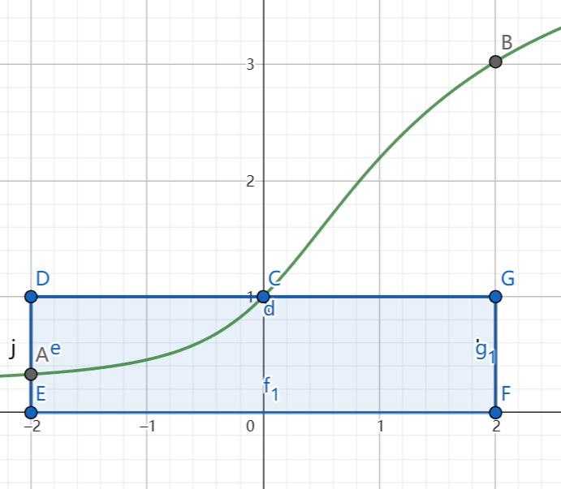
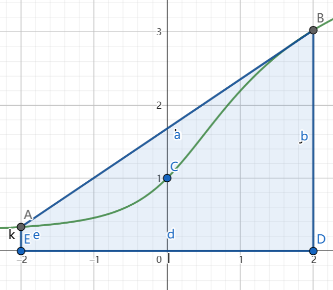

# 积分的全局行为（三）——积分估计

## 积分近似公式

现有分割$P:a=x_0<x_1<...<x_n=b.$

$f(x)$是定义在$[a,b]$上的函数。

现欲对$\int_a^bf(x)\text{d}x$进行估计。

### 方案一：矩形公式

如图，我们过区间中点作一个矩形，以矩形的面积来替代该区间的积分值。

即
$$
\int_a^bf(x)\text{d}x\approx\sum_{k=1}^{n}f(\frac{x_{k-1}+x_k}{2})\Delta x_k.
$$
为了把约等号变成等号，我们需要对其进行误差估计。

即考虑
$$
\begin{align}
&|\int_{x_{k-1}}^{x_k}f\text{d}x-f(\frac{x_{k-1}+x_k}{2})\Delta x_k|\\
&=|(-\int_{(x_{k-1}+x_k)/2}^{x_{k-1}}+\int_{(x_{k-1}+x_k)/2}^{x_k})f(x)\text{d}x-f(\frac{x_{k-1}+x_k}{2})\Delta x_k|\\
&=|2·\frac{1}{2}f(\frac{x_{k-1}+x_k}{2})\Delta x_k+\int_{x_{k-1}}^{x_k}f''(x)·\frac{(\Delta x)^2}{8}\text{d}x-f(\frac{x_{k-1}+x_k}{2})\Delta x_k|\\
&=|\int_{x_{k-1}}^{x_k}f''(x)·\frac{(\Delta x)^2}{8}\text{d}x|\\
&=f''(\xi_k)\frac{(\Delta x)^3}{24}.\exists\xi_k\in[x_{k-1},x_{k}]
\end{align}
$$
上式是由带有积分余项的Taylor公式得到的。

即
$$
\int_a^bf(x)\text{d}x=\sum_{k=1}^{n}[f(\frac{x_{k-1}+x_k}{2})\Delta x_k+f''(\xi_k)\frac{(\Delta x)^3}{24}].
$$

### 方案二 梯形公式

如图，我们过区间首尾两端点作一个梯形，用梯形面积估计积分面积。

利用和矩形公式一样的操作，我们可以得到一般的梯形公式。而对于特殊的分割，我们有更特殊的表达式。例如：

**Euler-Maclaurin 求和公式** 设函数$f\in C^{2m+2}[a,b],h=\frac{b-a}{n},x_i=a+ih,i=0,1,2,...,n.$则有
$$
\begin{align}
&\frac{b-a}{n}\sum_{i=1}^{n}\frac{1}{2}[f(x_{i-1})+f(x_i)]-\int_a^bf(x)\text{d}x\\
&=\sum_{k=1}^{m}\frac{B_{2k}}{(2k)!}h^{2k}[f^{(2k-1)}(b)-f^{(2k-1)}(a)]+\frac{B_{2m+2}}{(2m+2)!}h^{2m+2}f^{(2m+2)}(\xi)(b-a).
\end{align}
$$
其中，$\xi\in[a,b],B_{2k}$是Bernoulli数。

### 方案三：抛物线公式(Simpson公式)

（图比较难画，这里就不展示了。）

我们过区间端点、区间中点作一条抛物线，用抛物线的积分面积来近似地表示原函数的积分面积。

（自己慢慢算吧！）

下面我们给出均匀分割的误差公式

设$f\in C^4[a,b]$，且$M_4=\max\limits_{[a,b]}f^{(4)}(x),$则有
$$
|\int_a^bf(x)\text{d}x-S_n|\le\frac{(b-a)^5}{2880n^4}M_4.
$$
证明方法和我们在矩形公式中运用的一样。

### 特殊的函数——次数不大于3的多项式函数的万能公式

$$
\int_a^bp(x)\text{d}x=\frac{1}{6}[p(a)+4p(\frac{a+b}{2})+p(b)](b-a).
$$

::: info 证明

令$q(t)=p(a+t(b-a)),t\in[0,1]$，则只需证
$$
\int_0^1q(t)\text{d}t=\frac{1}{6}[p(0)+4p(\frac{1}{2})+p(1)].
$$
然后利用积分为线性运算，分别代入$q(t)=1,t,t^2,t^3$即可。

:::

这个公式之所以被称为万能公式，是因为它在初等数学的体积计算中具有十分强大的威力：只要将一个几何体的两底面和中截面以1:1:4加权平均，然后再乘高，就能得到体积公式了。容易验证此公式对球、圆锥、圆台的体积都适用。

## Wallis公式

这是一个与阶乘有关的公式，它在处理与阶乘有关的极限问题中是非常有用的。
$$
\lim_{n\rightarrow+\infty}\frac{1}{2n+1}[\frac{(2n)!!}{(2n-1)!!}]^2=\frac{\pi}{2}.
$$
::: info 证明

我们之前得到过Euler积分的相关结果：
$$
\begin{align}
&I_{2n}=\frac{(2n-1)!!}{(2n)!!}\frac{\pi}{2}\\
&I_{2n+1}=\frac{(2n)!!}{(2n+1)!!}.
\end{align}
$$
我们可以发现：
$$
\frac{I_{2n+1}}{I_{2n}}=\frac{1}{2n+1}[\frac{(2n)!!}{(2n-1)!!}]^2\frac{2}{\pi}.
$$
如有$\lim\limits_{n\rightarrow+\infty}\frac{I_{2n+1}}{{I_{2n}}}=1$，则原式自然成立。

现在我们来证明$\lim\limits_{n\rightarrow+\infty}\frac{I_{2n+1}}{{I_{2n}}}=1.$

注意到
$$
\cos^{2n+2}<\cos^{2n+1}<\cos^{2n},
$$
因此有
$$
I_{2n+2}<I_{2n+1}<I_{2n}.
$$
即
$$
I_{2n+2}=\frac{2n+1}{2n+2}I_{2n}<I_{2n+1}<I_{2n}
$$
两边同除$I_{2n}$，根据夹逼性，即得
$$
\lim_{n\rightarrow+\infty}\frac{I_{2n+1}}{I_{2n}}=1.
$$
故有
$$
\lim_{n\rightarrow+\infty}\frac{1}{2n+1}[\frac{(2n)!!}{(2n-1)!!}]^2=\frac{\pi}{2}.
$$
:::

下面我们给出几个等价形式
$$
\begin{align}
&\frac{(2n)!!}{(2n-1)!!}\sim\sqrt{\pi n},(1)\\
&\frac{(n!)^22^{2n}}{(2n)!}\sim\sqrt{\pi n}.(2)
\end{align}
$$

### Stirling公式

一般形式
$$
\ln n!=\ln\sqrt{2\pi}+(n+\frac{1}{2})\ln n-n+\frac{B_2}{1·2n}+\frac{B_4}{3·4n^3}+...+\frac{B_{2m}}{(2m-1)(2m)n^{2m-1}}+\theta_n\frac{B_{2m+2}}{(2m+1)(2m+2)n^{2m+1}}.
$$
其中$\theta_n\in(0,1),B_n$是Bernoulli数。

我们只证明只含有前三项的最简单的Stirling公式
$$
n!\sim\sqrt{2\pi n}(\frac{n}{e})^n.
$$
::: info 证明

构造数列$a_n=\frac{n!e^n}{n^{n+1/2}}.$

只需证明数列$a_n\rightarrow\sqrt{2\pi}.$
$$
\begin{align}
a_{n-1}&=\frac{(n-1)!e^{n-1}}{(n-1)^{n-1/2}}\\
&=\frac{n^{n+1/2}}{(n-1)^{n-1/2}}·\frac{1}{en}a_n\\
&=(1+\frac{1}{n-1})^{n-1/2}e^{-1}a_n
\end{align}
$$
记$b_n=(1+\frac{1}{n-1})^{n-1/2}$，易知$b_n\rightarrow e.$

作
$$
\begin{align}
b_{n}&=(1+\frac{1}{n-1})^{n-1/2}\\
&=1+\sum_{k=1}^{n}\binom{n-1/2}{k}\frac{1}{(n-1)^k}+o(\frac{1}{(n-1)^p}).
\end{align}
$$
计算
$$
\binom{n-1/2}{k}\frac{1}{(n-1)^k}/\binom{n+1/2}{k}\frac{1}{n^k}=\frac{n(n+1/2-k)}{n+1/2}>1
$$
因此有$b_n>b_{n+1}.$

因此$\inf\limits_{n\in\mathbb{N}}\{b_n\}=e.$

故$a_{n-1}=b_ne^{-1}a_n>a_n.$

由于$a_n$单调有界，有$a_n$收敛。设其极限为$\alpha\ge 0.$

结合上面的结论及Wallis公式，有
$$
\sqrt{\pi}=\lim_{n\rightarrow+\infty}\frac{(n!)^22^{2n}}{(2n)!\sqrt{n}}=\lim_{n\rightarrow+\infty}\frac{a_n^2}{a_{2n}\sqrt{2}}=\frac{\alpha^2}{\sqrt{2}\alpha}.
$$
即
$$
\alpha=\sqrt{2\pi}.
$$
故有
$$
n!\sim\sqrt{2\pi n}(\frac{n}{e})^n.
$$
