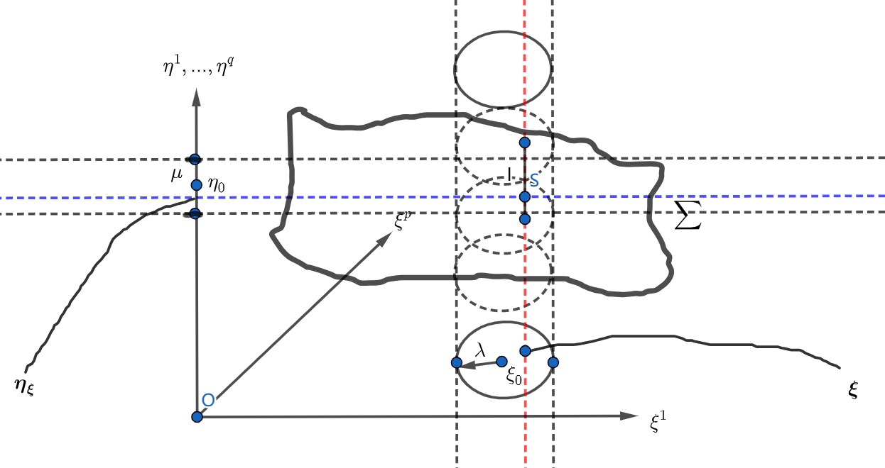

# 因果分解的思想与方法——隐映照定理

## 因果分解：理解事物之间的关系

当我们研究两个集合时，不仅要看它们各自包含什么，还要看它们之间是如何相互关联的。这种关联关系在数学中被称为“映射”或“映照”。我们可以用一个简单的符号来表示这种关系：

自变量因变量

这里的“自变量”是影响变化的因素，而“因变量”则是被影响的结果。

在数学分析中，我们通常研究的是那些有**有限自由度**的系统。那么，如何描述这些系统中的事物呢？主要有两个步骤：

1. **表征**：描述事物的具体内容。
2. **关系**：描述事物之间的关联。

举个例子，假设我们要描述一个事物，可以用以下方式：

- **表征**：用一组变量来表示事物的状态，比如：

  这里的  是描述事物的变量。

- **关系**：用方程来描述这些变量之间的关系，比如：

  这里的  是描述变量之间关系的方程。

举个例子，假设我们要描述一个四维空间中的事物，可以用以下方式：

事物刻画表征关系

不过，这种描述方式有一个问题：它没有明确指出哪些变量是“因”（自变量），哪些是“果”（因变量）。

**隐映照定理**就是用来解决这个问题的。它帮助我们进行**因果分解**，也就是明确区分哪些变量是原因，哪些是结果。

**定理** （隐映照定理）设 $\mathfrak D_x \times \mathfrak D_y \ni \{\boldsymbol \xi, \boldsymbol \eta\} \mapsto \boldsymbol f(\boldsymbol \xi, \boldsymbol \eta) \in \mathbb R^q$，其中 $\mathfrak D_x \subset \mathbb R^p, \mathfrak D_y \subset \mathbb R^q,\  \mathfrak D_x, \mathfrak D_y$ 均为开集。

设有 $\boldsymbol f(\boldsymbol \xi_0, \boldsymbol \eta_0) = \boldsymbol 0 \in \mathbb R^q$。如有 $\boldsymbol D \boldsymbol f_{\boldsymbol \eta} (\boldsymbol \xi_0, \boldsymbol \eta_0)$==非奇异==，且 $\boldsymbol f(\boldsymbol x, \boldsymbol y) \in  C^1(\mathfrak D_x \times \mathfrak D_y, \mathbb R^q)$则：

在 $\boldsymbol \xi_0$ 的周围作一个邻域 $B_{\lambda}(\boldsymbol \xi_0)$，设有$\boldsymbol \xi \in B_{\lambda}(\boldsymbol \xi_0)$；

在 $\boldsymbol \eta_0$ 的周围作一个邻域 $B_{\mu} (\boldsymbol \eta_0)$，

则 $\exists ! \boldsymbol \eta \in B_{\mu} (\boldsymbol \eta_0), \text{ s.t. } \boldsymbol f(\boldsymbol \xi, \boldsymbol \eta) = \boldsymbol 0 \in \mathbb R^q.$

这就构造出一个==映照==：$B_{\lambda}(\boldsymbol \xi_0) \ni \boldsymbol \xi \mapsto \boldsymbol \eta(\boldsymbol \xi) \in B_{\mu} (\boldsymbol \eta_0)$. 此映照满足 $\boldsymbol \eta (\boldsymbol \xi) \in C^1(B_{\lambda}(\boldsymbol x_0), \mathbb R^q)$

解释：

在上面的定理中，我们将自变量进行了因果分解：$\boldsymbol \xi$ 为因，而 $\boldsymbol \eta$ 为果。

下面我们将以图示化的方式解释上面的定理。

在上图中，我们把坐标系分为两部分：因部分$\boldsymbol \xi$，果部分$\boldsymbol \eta$.

我们作一个集合：$\sum = \{(\boldsymbol \xi, \boldsymbol \eta) | \boldsymbol f(\boldsymbol \xi, \boldsymbol \eta) = \boldsymbol 0 \in \mathbb R^q\}$。

我们已知 $\boldsymbol f(\boldsymbol \xi_0, \boldsymbol \eta_0) = \boldsymbol 0 \in \mathbb R^q$，则 $(\boldsymbol \xi_0, \boldsymbol \eta_0) \in \sum$. 我们在 $\boldsymbol \xi_0$ 的周围作一个球 $B_\lambda (\boldsymbol \xi_0)$，然后我们可以垂直因坐标系作一个圆柱，其在因坐标系上的投影就是球 $B_\lambda (\boldsymbol \xi_0)$，如图所示。同理可以在 $\boldsymbol \eta_0$ 的周围作球 $B_{\mu}(\boldsymbol \eta_0)$ 及其圆柱。这两个圆柱会产生一个交圆柱。我们接下来的研究就产生在这个交圆柱中。

在 $B_{\lambda} (\boldsymbol \xi_0)$ 取一个点 $\boldsymbol \xi$ ，然后向上作一个垂线（图中红线），与交圆柱会产生一个公共线段（图中实线段）。根据定理，在这个实线段上，有且只有一个点位于 $\sum$ 内，即：

$$
\exists ! \boldsymbol \eta \in B_{\mu} (\boldsymbol \eta_0), \text{ s.t. } \boldsymbol f(\boldsymbol \xi_0, \boldsymbol \eta_0) = \boldsymbol 0 \in \mathbb R^q.
$$

## 定理的证明

### 引理1 压缩映照定理

设有向量值映照 $\boldsymbol f(\boldsymbol x): \mathbb R^m \supset \mathfrak D_x \ni \boldsymbol x \mapsto \boldsymbol f(\boldsymbol x) \in \mathbb{R}^m$，其中 $\mathfrak D_x$是闭集。

$f(\boldsymbol x)$ 满足：$\exists \alpha \in [0, 1),\forall \boldsymbol x, \boldsymbol y \in \mathfrak D_x, \text{ s.t. } d(\boldsymbol f(\boldsymbol x), \boldsymbol f(\boldsymbol y) ) \le \alpha d(\boldsymbol x, \boldsymbol y).$

则有：

$$
\exists ! \boldsymbol x_{\star} \in \mathfrak D_x, \text{ s.t. } \boldsymbol f(\boldsymbol x_{\star}) = \boldsymbol x_{\star} \in \mathbb R^m.
$$

::: info 证明

我们之前学习数列极限时，有过这样的经验：给出递推公式的数列，往往会收敛于其**不动点**。

根据这一点，我们尝试构造如下点列：

取点列 $\boldsymbol x_0, \boldsymbol x_1, ... , \boldsymbol x_n$，满足

$$
\begin{align}
& \boldsymbol x_1 = \boldsymbol f(\boldsymbol x_0) \\
& \boldsymbol x_2 = \boldsymbol f(\boldsymbol x_1) \\
& ... \\
& \boldsymbol x_n = \boldsymbol f(\boldsymbol x_{n - 1}) \\
\end{align}
$$

与题中式子尝试建立联系：

$$
d(\boldsymbol f(\boldsymbol x_n), \boldsymbol f(\boldsymbol x_{n - 1}) ) = d(\boldsymbol x_{n + 1}, \boldsymbol x_n ) \le \alpha d(\boldsymbol x_n, \boldsymbol x_{n - 1})
$$

因此有

$$
\begin{align}
d(\boldsymbol x_{n + p}, \boldsymbol x_n ) & \le d(\boldsymbol x_{n + p}, \boldsymbol x_{n + p - 1}) + ... + d(\boldsymbol x_{n + 1}, \boldsymbol x_n) \\
& \le \sum_{i = 0}^{p - 1} \alpha^{i} d(\boldsymbol x_{n + 1}, \boldsymbol x_n) \\
& \le \alpha^{n} d(\boldsymbol x_1, \boldsymbol x_0) \sum_{i = 0}^{p - 1} \alpha^i \\
& = \frac{\alpha^n (1 - \alpha^p)}{1 - \alpha} d(\boldsymbol x_1, \boldsymbol x_0) \\
& \rightarrow 0.
\end{align}
$$

根据 **Cauchy 收敛原理**，点列 $\{\boldsymbol x_n\}$ 收敛。

对递推公式 $\boldsymbol x_n = \boldsymbol f(\boldsymbol x_{n - 1})$ 两边取极限，有

$$
\exists \boldsymbol x_{\star} \in \mathfrak D_x (闭集的性质), \boldsymbol x_{\star} = \boldsymbol f(\boldsymbol x_{\star}).
$$

下面证明 $\boldsymbol x_{\star}$ 是唯一的，即不依赖于初始值 $\boldsymbol x_0$ 的选取。

设有点列 $\{\boldsymbol {\tilde{x}_n}\}$ 和 $\{\boldsymbol {\hat{x}_n}\}$，它们分别集聚于 $\boldsymbol {\tilde{x}}_{\star}$ 和 $\boldsymbol {\hat{x}}_{\star}$，其中假设 $\boldsymbol {\tilde{x}}_{\star} \neq \boldsymbol {\hat{x}}_{\star}$ 则有

$$
d( \boldsymbol {\tilde{x}}_{\star}, \boldsymbol {\hat{x}}_{\star} ) = d(\boldsymbol f(\boldsymbol {\tilde{x}}_{\star}), \boldsymbol f(\boldsymbol {\hat{x}}_{\star}) ) \le \alpha d( \boldsymbol {\tilde{x}}_{\star}, \boldsymbol {\hat{x}}_{\star} ) < d( \boldsymbol {\tilde{x}}_{\star}, \boldsymbol {\hat{x}}_{\star} ).
$$

这与假设 $\boldsymbol {\tilde{x}}_{\star} \neq \boldsymbol {\hat{x}}_{\star}$ 是矛盾的！

因此

$$
\exists ! \boldsymbol x_{\star} \in \mathfrak D_x, \text{ s.t. } \boldsymbol f(\boldsymbol x_{\star}) = \boldsymbol x_{\star} \in \mathbb R^m.
$$

$\square$

:::

### 引理2 一个有关矩阵范数的不等式

设有向量值映照 $\boldsymbol f(\boldsymbol x): \mathbb R^m \supset \mathfrak D_x \ni \boldsymbol x \mapsto \boldsymbol f(\boldsymbol x) \in \mathbb R^n$，现欲估计

$$
|\boldsymbol f(\boldsymbol x + \Delta \boldsymbol x) - \boldsymbol f(\boldsymbol x)|_{\mathbb R^n}.
$$

对于一个向量值映照，如果我们想要利用我们熟悉的一元函数的结论，需要将其==直线单参数化==。

但困难之处在于，我们之前处理的大多是 $\boldsymbol f(\boldsymbol x + \Delta \boldsymbol x) - \boldsymbol f(\boldsymbol x)$，而不是其模长。那么我们该如何将模长的结果单参数化呢？

不妨考虑模长的平方，这样就省去了开根号这一步。

容易发现：令

$$
\varphi (t) = [\boldsymbol f(\boldsymbol x + t \Delta \boldsymbol x)]^{\text{T}} [\boldsymbol f(\boldsymbol x + \Delta \boldsymbol x) - \boldsymbol f(\boldsymbol x)]
$$

则有

$$
|\boldsymbol f(\boldsymbol x + \Delta \boldsymbol x) - \boldsymbol f(\boldsymbol x)|_{\mathbb R^n} ^ 2 = \varphi(1) - \varphi(0).
$$

于是我们就可以利用 **Lagrange 中值定理**，将上式的结果化为

$$
|\boldsymbol f(\boldsymbol x + \Delta \boldsymbol x) - \boldsymbol f(\boldsymbol x)|_{\mathbb R^n} = \dot{\varphi}(\theta).
$$

接下来我们就需要计算

$$
\dot{\varphi}(\theta) = [\boldsymbol D \boldsymbol f(x + \theta \Delta \boldsymbol x) \Delta \boldsymbol x]^{\text{T}} [\boldsymbol f(\boldsymbol x + \Delta \boldsymbol x) - \boldsymbol f(\boldsymbol x)] .
$$

根据 Cauchy-Schwarz 不等式，两个向量的内积不超过它们的模长之积，有

$$
|\boldsymbol f(\boldsymbol x + \Delta \boldsymbol x) - \boldsymbol f(\boldsymbol x)|_{\mathbb R^n} ^ 2 \le |\boldsymbol D \boldsymbol f(\boldsymbol x + \theta \Delta \boldsymbol x) \Delta \boldsymbol x|_{\mathbb R^n} |\boldsymbol f(\boldsymbol x + \Delta \boldsymbol x) - \boldsymbol f(\boldsymbol x)|_{\mathbb R^n}.
$$

再根据矩阵范数的三角不等式，有

$$
|\boldsymbol f(\boldsymbol x + \Delta \boldsymbol x) - \boldsymbol f(\boldsymbol x)|_{\mathbb R^n} \le |\boldsymbol D \boldsymbol f(\boldsymbol x + \theta \Delta \boldsymbol x)|_{\mathbb R^{n \times n}} |\Delta \boldsymbol x|_{\mathbb R^n} \le \sup_{\theta \in [0, 1]} |\boldsymbol D \boldsymbol f(\boldsymbol x + \theta \Delta \boldsymbol x)|_{\mathbb R^{n \times n}} |\Delta \boldsymbol x|_{\mathbb R^n}.
$$

这说明两个向量值映照的因变量在两点之间的距离，可以由它的 Jacobi 阵的范数和自变量的距离来控制。

### 证明隐映照定理

考虑将此问题转化为不动点的唯一性问题。考虑构造

$$
\boldsymbol \phi_{\boldsymbol \xi}(\boldsymbol \eta): B_{\mu}(\boldsymbol \eta) \ni \boldsymbol \eta \mapsto \boldsymbol \phi_{\boldsymbol \xi}(\boldsymbol \eta) \stackrel {\triangle}{=} \boldsymbol \eta - (\boldsymbol D_{\boldsymbol \eta} \boldsymbol f)^{-1} (\boldsymbol \xi_0, \boldsymbol \eta_0) \boldsymbol f(\boldsymbol \xi, \boldsymbol \eta) \in \mathbb R^q
$$

易证：

$$
\boldsymbol \phi_{\boldsymbol \xi}(\boldsymbol \eta) = \boldsymbol \eta \Leftrightarrow \boldsymbol f(\boldsymbol \xi, \boldsymbol \eta) = \boldsymbol 0 \in \mathbb R^q.
$$

现估计

$$
\begin{align}
& \ \ \ \ \left|\boldsymbol \phi_{\boldsymbol \xi}(\boldsymbol \eta) - \boldsymbol \eta_0 \right|_{\mathbb R^q} \\
& = \left|\boldsymbol \phi_{\boldsymbol \xi}(\boldsymbol \eta) - \boldsymbol \phi_{\boldsymbol \xi}(\boldsymbol \eta_0) + \boldsymbol \phi_{\boldsymbol \xi}(\boldsymbol \eta_0) - \boldsymbol \eta_0 \right|_{\mathbb R^q} \\
& \le \left|\boldsymbol \phi_{\boldsymbol \xi}(\boldsymbol \eta) - \boldsymbol \phi_{\boldsymbol \xi}(\boldsymbol \eta_0) \right|_{\mathbb R^q} + \left|\boldsymbol \phi_{\boldsymbol \xi}(\boldsymbol \eta_0) - \boldsymbol \eta_0 \right|_{\mathbb R^q} \\
\end{align}
$$

根据有限增量公式，有估计

$$
\left|\boldsymbol \phi_{\boldsymbol \xi}(\boldsymbol \eta) - \boldsymbol \phi_{\boldsymbol \xi}(\boldsymbol \eta_0) \right| \le \sup_{\theta \in (0, 1)} \left| \boldsymbol D \boldsymbol \phi_{\boldsymbol \xi}(\boldsymbol \eta_0 + \theta(\boldsymbol \eta - \boldsymbol \eta_0)) \right|_{\mathbb R^{q \times q}} |\boldsymbol \eta - \boldsymbol \eta_0|_{\mathbb R^q}.
$$

考虑到

$$
\boldsymbol D \boldsymbol \phi_{\boldsymbol \xi}(\boldsymbol \eta) = \boldsymbol I_q - (\boldsymbol D_{\boldsymbol \eta} \boldsymbol f)^{-1}(\boldsymbol \xi_0, \boldsymbol \eta_0) \boldsymbol D_{\boldsymbol \eta}\boldsymbol f(\boldsymbol \xi, \boldsymbol \eta).
$$

估计

$$
\begin{align}
& \ \ \ \ |\boldsymbol D \boldsymbol \phi_{\boldsymbol \xi} (\boldsymbol \eta)|_{\mathbb R^{q \times q}} \\
& = \left| \boldsymbol I_q - (\boldsymbol D_{\boldsymbol \eta}\boldsymbol f)^{-1}(\boldsymbol \xi_0, \boldsymbol \eta_0) \boldsymbol D_{\boldsymbol \eta} \boldsymbol f(\boldsymbol \xi, \boldsymbol \eta) \right|_{\mathbb R^{q \times q}} \\
& = \left| (\boldsymbol D_{\boldsymbol \eta} \boldsymbol f)^{-1}(\boldsymbol \xi_0, \boldsymbol \eta_0) [\boldsymbol D_{\boldsymbol \eta} \boldsymbol f (\boldsymbol \xi_0, \boldsymbol \eta_0) - \boldsymbol  D_{\boldsymbol \eta} \boldsymbol f(\boldsymbol \xi, \boldsymbol \eta)] \right|_{\mathbb R^{q \times q}} \\
& \le \left| (\boldsymbol D_{\boldsymbol \eta} \boldsymbol f)^{-1}(\boldsymbol \xi_0, \boldsymbol \eta_0) \right|_{\mathbb R^{q \times q}} \left| \boldsymbol D_{\boldsymbol \eta} \boldsymbol f (\boldsymbol \xi_0, \boldsymbol \eta_0) - \boldsymbol D_{\boldsymbol \eta} \boldsymbol f(\boldsymbol \xi, \boldsymbol \eta) \right|_{\mathbb R^{q \times q}}.
\end{align}
$$

以上我们设定 $\boldsymbol \xi \in B_{\lambda}(\boldsymbol \xi_0), \boldsymbol \eta \in B_{\mu}(\boldsymbol \eta_0)$.

欲运用压缩映照定理，需满足**包含性条件**和**压缩性条件**。要证包含性条件，根据上面的分析，只需证

$$
|\boldsymbol D \boldsymbol \phi_{\boldsymbol \xi}(\boldsymbol \eta)|_{\mathbb R^{q \times q}} < 1.
$$

取 $\boldsymbol \xi \in B_{\tilde \lambda}(\boldsymbol \xi_0), \boldsymbol \mu \in B_{\tilde \mu}(\boldsymbol \eta_0)$，其中 $\tilde \lambda < \lambda, \tilde \mu < \mu$，使得

$$
\left| \boldsymbol D_{\boldsymbol \eta} \boldsymbol f(\boldsymbol \xi_0, \boldsymbol \eta_0) - \boldsymbol D _{\boldsymbol \eta} \boldsymbol f(\boldsymbol \xi, \boldsymbol \eta) \right|_{\mathbb R^{q \times q}} < |\boldsymbol D_{\boldsymbol \eta} \boldsymbol f(\boldsymbol \xi_0, \boldsymbol \eta_0)|_{\mathbb R^{q \times q}}.
$$

此处运用了 $\boldsymbol f(\boldsymbol \xi, \boldsymbol \eta) \in C^1(\mathfrak D_{\boldsymbol \xi} \times \mathfrak D_{\boldsymbol \eta}; \mathbb R^q)$.

> [!note]
>
> 在此处粗体的 $\boldsymbol D$ 表示 Jacobi 阵，手写体的 $\mathfrak D$ 表示定义域。

则有

$$
|\boldsymbol D \boldsymbol \phi_{\boldsymbol \xi}(\boldsymbol \eta)|_{\mathbb R^{q \times q}} < 1.
$$

**包含性条件**已然成立。下面证明**压缩性条件**。

估计

$$
\begin{align}
&\ \ \ \ \left|\boldsymbol \phi_{\boldsymbol\xi} (\boldsymbol \eta_2) - \boldsymbol \phi_{\boldsymbol \xi}(\boldsymbol \eta_2) \right|_{\mathbb R^q} \\
& \le \sup_{\theta \in (0, 1)} \left| \boldsymbol D_{\boldsymbol \xi}(\boldsymbol \eta_1 + \theta(\boldsymbol \eta_2 - \boldsymbol \eta_1)) \right|_{\mathbb R^{q \times q}} |\boldsymbol \eta_2 - \boldsymbol \eta_1|_{\mathbb R^q} \\
& < |\boldsymbol \eta_2 - \boldsymbol \eta_1|.
\end{align}
$$

因此压缩性条件成立。

故映照 $\boldsymbol \phi_{\boldsymbol \xi}(\boldsymbol \eta)$ 有且只有一个不动点。因此在 $\boldsymbol \xi_0$ 的一个邻域 $B_{\lambda} (\boldsymbol \xi_0)$ 和 $\boldsymbol \eta_0$ 的一个邻域 $B_{\mu}(\boldsymbol \eta_0)$ 内存在从 $\boldsymbol \xi$ 到 $\boldsymbol \eta$ 的一个映照 $\boldsymbol \eta_{\boldsymbol \xi}$，使得

$$
\boldsymbol f(\boldsymbol \xi, \boldsymbol \eta_{\boldsymbol \xi}) = 0.
$$

下面证明这个映照满足 $\boldsymbol \eta_{\boldsymbol \xi} \in C^1 (B_{\lambda}(\boldsymbol \xi_0); \mathbb R^q)$.

#### 连续性

考虑 $\forall \boldsymbol \xi, \boldsymbol \xi + \Delta \boldsymbol \xi \in B_{\lambda}(\boldsymbol \xi_0)$，估计

$$
\begin{align}
& \ \ \ \ \boldsymbol \eta(\boldsymbol \xi + \Delta \boldsymbol \xi) - \boldsymbol \eta(\boldsymbol \xi) \\
& = \boldsymbol \phi(\boldsymbol \xi + \Delta \boldsymbol \xi, \boldsymbol \eta(\boldsymbol \xi + \Delta \boldsymbol \xi)) - \boldsymbol \phi(\boldsymbol \xi, \boldsymbol \eta(\boldsymbol \xi))\\
& = \boldsymbol D_{\boldsymbol \xi} \boldsymbol \phi(\boldsymbol \xi, \boldsymbol \eta(\boldsymbol \xi)) \Delta \boldsymbol \xi + \boldsymbol D_{\boldsymbol \eta} \boldsymbol \phi (\boldsymbol \xi, \boldsymbol \eta(\boldsymbol \xi)) [\boldsymbol \eta(\boldsymbol \xi + \Delta \boldsymbol \xi) - \boldsymbol \eta(\boldsymbol \xi)] + o \left ( \sqrt{|\Delta \boldsymbol \xi|_{\mathbb R^m}^2 + |\boldsymbol \eta_{\boldsymbol \xi + \Delta \boldsymbol \xi} - \boldsymbol \eta_{\boldsymbol \xi}|_{\mathbb R^m}^2} \right ) \\
& = (\boldsymbol D_{\boldsymbol \eta} \boldsymbol f)^{-1}(\boldsymbol \xi_0, \boldsymbol \eta_0) · \boldsymbol D_{\boldsymbol \xi} \boldsymbol f(\boldsymbol \xi, \boldsymbol \eta_{\boldsymbol \xi}) · \Delta \boldsymbol \xi + (\boldsymbol I_q - (\boldsymbol D_{\boldsymbol \eta} \boldsymbol f)^{-1} (\boldsymbol \xi_0, \boldsymbol \eta_0) · \boldsymbol D_{\boldsymbol \eta} \boldsymbol f(\boldsymbol \xi, \boldsymbol \eta_{\boldsymbol \xi})) [\boldsymbol \eta(\boldsymbol \xi + \Delta \boldsymbol \xi) - \boldsymbol \eta(\boldsymbol \xi)] + o(|\Delta \boldsymbol \xi|_{\mathbb R^m}). \\
\end{align}
$$

则有

$$
(\boldsymbol D_{\boldsymbol \eta} \boldsymbol f)^{-1} (\boldsymbol \xi_0, \boldsymbol \eta_0) · \boldsymbol D_{\boldsymbol \eta} f (\boldsymbol \xi, \boldsymbol \eta_{\boldsymbol \xi}) · [\boldsymbol \eta_{\boldsymbol \xi + \Delta \boldsymbol \xi} - \boldsymbol \eta_{\boldsymbol \xi}] = (\boldsymbol D_{\boldsymbol \eta} f)^{-1} (\boldsymbol \xi_0, \boldsymbol \eta_0) · \boldsymbol D_{\boldsymbol \xi} \boldsymbol f(\boldsymbol \xi, \boldsymbol \eta_{\boldsymbol \xi}) · \Delta \boldsymbol \xi (1 + o(1)).
$$

设定 $\boldsymbol D_{\boldsymbol \eta} \boldsymbol f$ 在 $(\boldsymbol \xi_0, \boldsymbol \eta_0)$ 的一个邻域内非奇异，则有

$$
\boldsymbol \eta(\boldsymbol \xi + \Delta \boldsymbol \xi) - \boldsymbol \eta(\boldsymbol \xi) = (\boldsymbol D_{\boldsymbol \eta} \boldsymbol f)^{-1} (\boldsymbol \xi, \boldsymbol \eta_{\boldsymbol \xi}) \boldsymbol D_{\boldsymbol \xi} \boldsymbol f(\boldsymbol \xi, \boldsymbol \eta_{\boldsymbol \xi}) \Delta \boldsymbol \xi + o(\Delta \boldsymbol \xi).
$$

这就是可微性。$\square$
