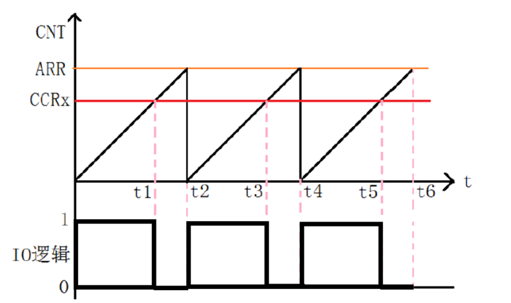

# 2.6 PWM呼吸灯

## 理论知识

### 何为PWM

PWM (Pulse Width Modulation) 即 脉宽调制，改变脉冲信号的宽度并输出。

高频PWM波可以让设备进行频繁开关通断。

### PWM波的参数

- 周期：PWM波形中相邻的高低电平持续时间总和
- 频率：略
- 占空比：**高**电平持续时间占总时间的比值
- 电平：高低电平之间电压差

### PWM波在TIM定时器中的形成方式

- 先将输入频率依据PSC进行分频得定时器主频
- 以向上计数为例，即CNT：0->ARR
- 引入新比较值CCR (Capture Compare Register) ，需在代码中设定
  - CNT<CCR 输出一种电平
  - CNT>=CRR输出另外一种电平



## 工程配置

MCU HSE等配置过程略去。

下面以正点原子F103ZET6精英板为例。

该开发板使用通用定时器TIM3产生PWM控制DS0的亮度。

1. 按照原理图，找到DS0对应的引脚，使能TIM3_CH2功能
2. 配置TIM3并将其设置为内部时钟模式
   1. Clock Sourse: Internal Clock
   2. PSC=0
   3. ARR=499
   4. Counter Mode: Up
   5. 内部时钟不分频
   6. auto-reload preload: Disable （此项是否使能无影响，如使能则新的ARR配置后会延迟到当次溢出中断发生后再改为新值
   7. 通道极性 (CH Polarity) 设置成有效电平（一般高电平为有效电平）
   8. PWM mode, mode 1表示CNT小于CCR则输出有效电平，即CCR为多少则有多少个计数器时间为有效电平。mode2反之
   9. Pulse （脉冲），为0表示一直输出脉冲，若非0，则输出指定数量脉冲
   10. Fast Mode: Disable, 若使能会让波形驱动能力强、响应快速，但耗电高

## 具体实现

1. 声明比较寄存器变量 `uint16_t pwmVal=0;` （在此实验中可设为全局变量）

2. 使能PWM输出通道 `HAL_TIM_PWM_Start(&htim3,TIM_CHANNEL_2);` （配置为 TIM3 的 CH2通道）

3. 呼吸灯具体实现

   ```C
   while(pwmVal<500){
       pwmVal++;
       __HAL_TIM_SetCompare(&htim3,TIM_CHANNEL_2,pwmVal);
       HAL_Delay(1);
   }
   while(pwmVal>0){
       pwmVal--;
       __HAL_TIM_SetCompare(&htim3,TIM_CHANNEL_2,pwmVal);
       HAL_Delay(1);
   }
   ```

   