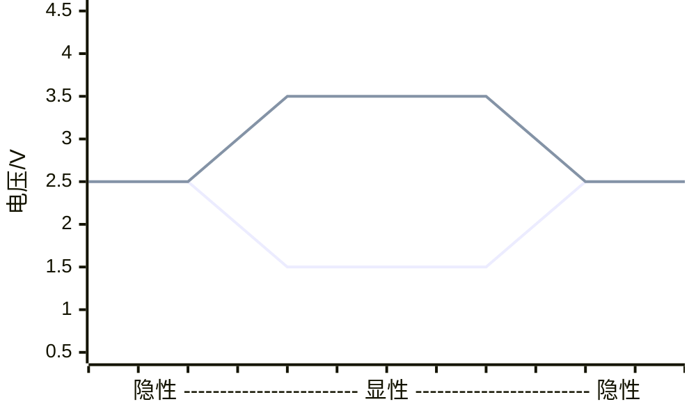

# 3.1 CAN通信

## 何为CAN总线

多电控单元间交换数据使用的**多主机局部网络串行通信协议**

总的来说，就是一条通信线路上连接多个节点，各个节点都通过这条线路来发送信息，当一个节点发送消息时，其他节点监听；当多个节点发送消息是，按照优先级发送。

可实现 点对点，点对多点，全局广播的功能。

$$
一般认为有两个层级
\begin{cases}
		数据链路层 \\
		物理层\\
	\end{cases}
$$

## 通信基础知识-链路

- 地址
- 冲突检测与避免
- 误码校验
- 滤波器与掩码（此部分内容摘抄自中科大RM系列教程之CAN通信）
  - 用于配置接收设备，注意，是过滤通过，而非过滤排除机制。即符合条件的报文会接收
  - 滤波器用于过滤出想要接收的信息，掩码Mask用于匹配想要接收的信息ID
  - 如何过滤与匹配？以CAN ID作为匹配规则。标准格式中的CAN ID长度为11b，也就是CAN ID最大为0x7ff
  - **例**
    - 一个CAN ID为0x114，如果我要配置一个滤波器只接收这个CAN ID的帧的话，就需要配置滤波器过滤目标为0x114，掩码为0x7ff。流程就是把掩码变成二进制01串，为1的位要与过滤目标一致
    - 一段CAN_ID为0x114~0x117，如果我要配置一个滤波器只接收这一段CAN ID的帧的话，就需要配置滤波器过滤目标为0x114，掩码为0x7fc。也就是把掩码变成二进制01串，为1的位要与过滤目标一致

## 数据格式

### 帧类型

#### 数据帧

数据帧包含以下部分

- 帧起始（SOF）：单个显性位组成，总线空闲时，发送节点发送帧起始。其他节点同步于该帧起始位
- 仲裁域：决定发送优先级
  - ID：顾名思义，所发送数据的身份标识，大小为11字节。
  - SRR：替代远程帧请求位，为显性
  - IDE：识别符扩展位，在整个数据格式中处于第14位。在标准帧格式中位于控制域，为显性；在扩展帧格式中位于仲裁域，为隐性
  - RTR：远程帧发送标识位，为显性

- 控制域
  - IDE：已在仲裁域中解释过，不再赘述
  - r0, r1：保留位0和1，在目前的CAN总线规范中没有明确定义用途。一般用于隐性电平填充。
  - DLC：数据段长度码；BCD编码，范围0~8

- 数据域：MSB优先传输
- CRC域：数据检错，CRC校验值存放于CRC段
- 应答域（ACK）：帧起始到CRC段之间的内容没有错误，则在ACK段发送显性电平
  - ACK槽：发送节点发送隐性电平；接收正确的节点发送显性电平 → 总线与结果为显性电平。发送节点据此可判断发送成功
  - ACK界定符：1个隐性电平

- 帧结尾（EOF）：7个连续隐性位组成

相信上述内容有许多专有名词难以理解，这些内容将在文末进行阐释。

**标准帧格式** 如下

<table>
<tr>
<th> </th>
<th>帧起始</th>
<th colspan=2>仲裁域</th>
<th colspan=3>控制域</th>
<th>数据域</th>
<th colspan=2>CRC域</th>
<th colspan=2>ACK域</th>
<th>帧结束</th>
</tr>
<tr>
<th>组成部分</th>
<td>SOF</td>
<td>ID[0:10]</td>
<td>RTR</td>
<td>IDE</td>
<td>r0</td>
<td>DLC</td>
<td>Data:Byte0~Byte7</td>
<td>CRC_Value[0:14]</td>
<td>CRC界定符</td>
<td>ACK槽</td>
<td>ACK界定符</td>
<td>EOF</td>
</tr>
<tr>
<th>数据大小/bit</th>
<td>1</td>
<td>11</td>
<td>1</td>
<td>1</td>
<td>1</td>
<td>4</td>
<td>0~64</td>
<td>15</td>
<td>1</td>
<td>1</td>
<td>1</td>
<td>7</td>
</tr>    
</table>

**扩展帧格式** 较 **标准帧格式** 有如下区别

<table>
<tr>
<th> </th>
<th>...</th>
<th colspan=5>仲裁域</th>
<th colspan=3>控制域</th>
<th>...</th>
</tr>
<tr>
<th>组成部分</th>
<td>...</td>
<td>ID[0:10]</td>
<td>SRR</td>
<td>IDE</td>
<td>ID[11,28]</td>
<td>RTR</td>
<td>r1</td>
<td>r0</td>
<td>DLC</td>
<td>...</td>
</tr>
<tr>
<th>数据大小/bit</th>
<td>...</td>
<td>11</td>
<td>1</td>
<td>1</td>
<td>18</td>
<td>1</td>
<td>1</td>
<td>1</td>
<td>4</td>
<td>...</td>
</tr>
</table>

#### 远程帧

与数据帧相比，远程帧无数据域，由6个部分组成，也有标准格式和扩展格式，且RTR为1（隐性电平）。

**标准帧格式** 如下

<table>
<tr>
<th> </th>
<th>帧起始</th>
<th colspan=2>仲裁域</th>
<th colspan=3>控制域</th>
<th colspan=2>CRC域</th>
<th colspan=2>ACK域</th>
<th>帧结束</th>
</tr>
<tr>
<th>组成部分</th>
<td>SOF</td>
<td>ID[0:10]</td>
<td>RTR</td>
<td>IDE</td>
<td>r0</td>
<td>DLC</td>
<td>CRC_Value[0:14]</td>
<td>CRC界定符</td>
<td>ACK槽</td>
<td>ACK界定符</td>
<td>EOF</td>
</tr>
<tr>
<th>数据大小/bit</th>
<td>1</td>
<td>11</td>
<td>1</td>
<td>1</td>
<td>1</td>
<td>4</td>
<td>15</td>
<td>1</td>
<td>1</td>
<td>1</td>
<td>7</td>
</tr>    
</table>

**扩展帧格式** 较 **标准帧格式** 有如下区别

<table>
<tr>
<th> </th>
<th>...</th>
<th colspan=5>仲裁域</th>
<th colspan=3>控制域</th>
<th>...</th>
</tr>
<tr>
<th>组成部分</th>
<td>...</td>
<td>ID[0:10]</td>
<td>SRR</td>
<td>IDE</td>
<td>ID[11,28]</td>
<td>RTR</td>
<td>r1</td>
<td>r0</td>
<td>DLC</td>
<td>...</td>
</tr>
<tr>
<th>数据大小/bit</th>
<td>...</td>
<td>11</td>
<td>1</td>
<td>1</td>
<td>18</td>
<td>1</td>
<td>1</td>
<td>1</td>
<td>4</td>
<td>...</td>
</tr>
</table>
#### 数据帧与远程帧的区别

| 比较内容    | 数据帧                      | 远程帧               |
| ----------- | --------------------------- | -------------------- |
| ID          | 发送节点的ID                | 被请求发送节点的ID   |
| SRR         | 0（显性电平）               | 1（隐性电平）        |
| RTR         | 0（显性电平）               | 1（隐性电平）        |
| DLC         | 发送数据长度                | 请求的数据长度       |
| 有无数据段  | 有                          | 无                   |
| CRC校验范围 | 帧起始+仲裁域+控制域+数据域 | 帧起始+仲裁域+控制域 |

#### 错误帧

CAN-bus 错误类型

- CRC错误：发送节点计算得到的CRC值与接收到的CRC值不匹配
- 格式错误：传输的数据帧格式与任何一种合法帧格式不符
- 应答错误：发送节点在ACK阶段没有接收到应答信号
- 位发送错误：发送节点在发送时发现总线电平与发送电平不相同
- 位填充错误：传输信号违反“位填充”规则

当出现以上5种错误类型之一时，发送或接收节点将发送错误帧，结构为 `错误标识 + 错误界定符`

主动错误标识：由处于主动错误状态的节点发送 ↓

<table>
	<tr>
		<th colspan=6>6个连续显性电平位</th>
		<th colspan=8>8个连续隐性电平位</th>
	</tr>
    <tr>
        <td>0</td>
    	<td>0</td>
    	<td>0</td>
    	<td>0</td>
    	<td>0</td>
    	<td>0</td>
    	<td>1</td>
    	<td>1</td>
    	<td>1</td>
    	<td>1</td>
    	<td>1</td>
    	<td>1</td>
    	<td>1</td>
    	<td>1</td>
    </tr>
</table>

被动错误标识：由处于被动错误状态的节点发送 ↓

<table>
	<tr>
		<th colspan=6>6个连续隐性电平位</th>
		<th colspan=8>8个连续隐性电平位</th>
	</tr>
    <tr>
    	<td>1</td>
    	<td>1</td>
    	<td>1</td>
    	<td>1</td>
    	<td>1</td>
    	<td>1</td>
    	<td>1</td>
    	<td>1</td>
    	<td>1</td>
    	<td>1</td>
    	<td>1</td>
    	<td>1</td>
    	<td>1</td>
    	<td>1</td>
    </tr>
</table>

为防止无法正常接收的节点一直发送错误帧干扰通信，CAN-bus规定了节点的三种状态及行为

- REC：接收错误计数器

- TEC：发送错误计数器

复位时二者都被清零

#### 过载帧

当某接收节点没有做好接受下一帧数据准备时，将发送过载帧来通知发送节点

过载帧结构 `过载标志 + 过载帧界定符`

<table>
	<tr>
		<th colspan=6>6个连续显性电平位（过载标志）</th>
		<th colspan=8>8个连续隐性电平位（过载帧界定符）</th>
	</tr>
    <tr>
        <td>0</td>
    	<td>0</td>
    	<td>0</td>
    	<td>0</td>
    	<td>0</td>
    	<td>0</td>
    	<td>1</td>
    	<td>1</td>
    	<td>1</td>
    	<td>1</td>
    	<td>1</td>
    	<td>1</td>
    	<td>1</td>
    	<td>1</td>
    </tr>
</table>

由于存在多个节点同时过载且过载帧发送有时间差，可能出现叠加超6个位的情况

#### 帧间隔

用于将数据帧或远程帧和他们之前的帧分开，但过载帧和错误帧前不会插入帧间隔

<table>
<tr>
    <td>...</td>
	<td>其他帧</td>
	<td>帧间隔</td>
	<td>数据帧或远程帧</td>
	<td>...</td>
	<td>其他帧</td>
	<td>数据帧或远程帧</td>
	<td>...</td>
</tr>
</table>
- 帧间隔过后，若无节点发送帧则总线进入空闲

<table>
<tr>
    <td>...</td>
	<td>帧间隔</td>
	<td>0~∞</td>
	<td>...</td>
</tr>
</table>

- 帧间隔过后，如果被动错误节点要发送帧，则先发送8个隐性电平的传输延迟，再发送帧

<table>
<tr>
    <td>...</td>
	<td>帧间隔</td>
	<td>传输延迟（8个隐性位）</td>
    <td>被动错误节点发送帧</td>
	<td>...</td>
</tr>
</table>

> [!warning]
>
> 保证主动错误节点优先发送，避免被动错误节点因硬件故障干扰整个网络

## 收发模式

- 常规模式

  - 向总线发送

  - 从总线接收

- 回环模式

  - 向总线和本机发送

  - 不从总线接收仅从本机接收

- 静默模式

  - 不向总线发送仅向本机发送

  - 从总线和本机接收

- 回环静默模式

  - 不向总线发送

  - 不从总线接收

  - 自收自发

## 一些疑惑及解答

### *何为显性电平？何为隐性电平？[^2]*

**答：**显性电平在逻辑层面表现为0，隐性电平在逻辑层面表现为1；显性电平覆盖隐性电平；均为隐性电平时总线上才为隐性电平。CAN采用差分电压发送电平（`Vdiff`）`V_diff = CAN_H - CAN_L`

**例** CAN总线为“隐性”（逻辑1）时，CAN_H和CAN_L的电平为2.5V（电位差V_diff为0V）

*为什么要有120Ω的电阻？*

CAN_H与CAN_L通过120Ohm电阻连接在一起，防止总线上传输的高频信号存在反射振铃效应导致信号不稳定、寄生电容导致信号响应速度变慢等情况

**图解**

下面一条为 `CAN_Low`，上面一条为 `CAN_High`。

### *CAN通信采用双绞线传输的优点？*

**答：** 使外部干扰在两根导线上产生的噪声相同，以便后续的差分电路提取出有用信号

### *仲裁域如何实现仲裁功能？*

**答：** CAN控制器在发送数据的同时监测数据线的电平是否与发送数据对应电平相同，如果不同则停止发送并做其他处理 ↓

1. 如果该位处于仲裁域，则退出总线竞争
2. 如果处于其他域，则产生错误时间（ACK或被动错误标志传输期间除外）

简而言之，显性电平覆盖隐性电平。同一位电平不相同时，显性电平继续发送，隐性电平的进入只听模式

### *数据帧与遥控帧的优先级*

**答：** 数据帧优先级>遥控帧优先级，因为数据帧仲裁段RTR为显性

*标准格式与扩展格式的优先级*

**答： **标准格式优先级>扩展格式优先级，因为标准格式IDE位为显性电平，扩展格式IDE位为隐性电平。

> [!warning]
>
> 对于前11位ID相同的标准格式和扩展格式才适用于此规则，前11位ID不相同的适用于仲裁规则

### *r0, r1作用？什么是隐性电平填充？[^3]*

**答：** r0与r1为保留位，在当前的CAN标准中，这些位的具体用途并未明确定义。之所以用于隐性电平填充是因为 数字越大优先级越小，若为1（即隐性电平）则永远不会用得到它。

### *BCD编码？[^4]*

**答： **BCD码（Binary-Coded Decimal），用4位二进制数来表示1位十进制中的0~9这10个数码，是一种二进制的数字编码形式，用二进制编码的十进制代码。

| 十进制 | BCD表达格式 |
| ------ | ----------- |
| 0      | 0000        |
| 1      | 0001        |
| 2      | 0010        |
| 3      | 0011        |
| 4      | 0100        |
| 5      | 0101        |
| 6      | 0110        |
| 7      | 0111        |
| 8      | 1000        |
| 9      | 1001        |

此处仅列出上文中所需要的知识，具体请查阅参考资料 [4]

### *什么是MSB数据？*

**答： **最高有效位，二进制中代表最高值的比特位，这一位对数值的影响最大。

**例** 以数字9为例子，其二进制为1001，若MSB发生错误，即最高位1变为0，则整个数字变为了1，误差为8。

此处仅列出上文中所需要的知识，具体请查阅参考资料[^5]

### *CRC如何计算？[^6][^7]*

**答：** CRC全称为 循环冗余校验。其根本思想是在要发送的帧后面附加一个数，作为数据校验码，并生成一个新帧发给接收端，用于验证数据是否损坏。

从数学上讲，CRC是数据的模二多项式 (polynomial) 除法的余数。因此，CRC可以写成 `CRC = data % 2 polynomial`

#### 计算过程

1. 选定CRC生成多项式G(x)作为除数。G(x)决定了校验码的生成方式，常用的CRC多项式包括CRC-16（即除数共17位）、CRC-32。注意，G(x)的最高位和最低位必须为1。**例** 以4位CRC（二进制共5位）作为示例 `11001` 表示的就是 $G(x)=x^4+x^3+1$

   > [!warning]
   >
   > 由于选择不同的多项式将导致相同数据产生不同的CRC，所以发送方和接收方需要使用共同的多项式。
   > 对于CRC来说，根据具体的使用场景，有些多项式比其他多项式更适合使用。例如，某些多项式可能更容易检测出连续位错误或交替位错误。

2. 看所选定的除数二进制位数（假设为k位），然后在要发送的数据帧（假设为m位）后面加上k-1位“0”，然后以这个加了k-1个“0“的新帧（一共是m+k-1位）以“模2除法”方式除以上面这个除数，所得到的余数（也是二进制的比特串）就是该帧的CRC校验码，也称之为FCS（帧校验序列）。

   > [!warning]
   >
   > 余数的位数一定要是比除数位数只能少一位，哪怕前面位是0，甚至是全为0（附带好整除时）也都不能省略。

3. 再把这个校验码附加在原数据帧（就是m位的帧，注意不是在后面形成的m+k-1位的帧）后面，构建一个新帧发送到接收端

4. 最后在接收端再把这个新帧以“模2除法”方式除以前面选择的除数，如果没有余数，则表明该帧在传输过程中没出错，否则出现了差错。

#### 什么是模2除法

*模2减法*

**答：** 模2运算是对二进制数逐位进行的运算，不存在进位或借位，每个位被视为独立的数。（其实就是C语言中的异或运算）

下表为模2减法的数据表，其公式为 $bit1-bit2=XOR$

| bit1 | bit2 | XOR  |
| ---- | ---- | ---- |
| 0    | 0    | 0    |
| 0    | 1    | 1    |
| 1    | 0    | 1    |
| 1    | 1    | 0    |

*模2除法*

模二除法的执行类似于算术除法，唯一的区别是我们使用模二减法(XOR)而不是算术减法来计算每一步的余数。

**例** 假设被除数为 `100100`，除数为 `1101` 

1. 计算除数长度为 `L`，在示例中为 `4`

2. 在被除数后面加上 `L-1` 位，这里为 `3`（即CRC长度）

3. 用二进制模2进行计算，得到的余数即为CRC结果：`001`

$$
\begin{align}
1111&01\\
1101 \,\smash{\hbox{$\big)$}}\mkern-8mu 
\overline{\:\: 1001} & \overline{00000} \\
1101&\\
\hline
100&0\\
110&1\\
\hline
10&10 \\
11&01 \\
\hline
1&110 \\
1&101 \\
\hline
&0110 \\
&0000 \\
\hline
&\hspace{9mu}1100 \\
&\hspace{9mu}1101 \\
\hline
&\hspace{18mu}001 \\
\end{align}
$$

关于 **模2运算** 的更多知识，请参阅参考资料[^8]。

*何为主动错误状态？何为被动错误状态？[^9]*

**答：** 主动错误（Active Error）是指节点在发送数据帧时发现总线上存在错误，并且主动向其他节点通知该错误。主动错误通常是由于发送节点检测到仲裁场（Arbitration Field）或控制位（Control Field）上的错误而产生的。

被动错误（Passive Error）是指节点在接收数据帧时检测到总线上存在错误，但不会主动通知其他节点。被动错误通常是由于接收节点检测到数据位（Data Field）或CRC（Cyclic Redundancy Check）校验错误而产生的。接收节点会将错误信息记录下来，但不会对其他节点进行任何主动干预。被动错误表示总线上存在一些问题，但并不影响其他节点的正常通信。

*主动错误和过载帧格式一致，如何区分？[^10]*

**答： **过载帧与主动错误帧具有相同的格式。但是，过载帧只能在帧间间隔产生，因此可通过这种方式区分过载帧和错误帧（错误帧是在帧传输时发出的）。

*CSMA/CD协议*

此部分内容较长，单开一节讲起

## 参考资料

[^1]: [图解CAN总线数据的组成和帧格式_can总线帧头-CSDN博客](https://blog.csdn.net/LEON1741/article/details/106199472)

[^2]: [CAN总线电平（隐性与显性）_can显性和隐性电平-CSDN博客](https://blog.csdn.net/skyxiao/article/details/116116018)

[^3]: [CAN总线基础（2）--数据帧深层解析_can数据帧-CSDN博客](https://blog.csdn.net/kian9one/article/details/139899769)

[^4]: [BCD码是什么 - 知乎 (zhihu.com)](https://zhuanlan.zhihu.com/p/159070549)

[^5]: [一文读懂大端、小端、字节序、MSB、LSB、MSBs、LSBs_msb和lsb是什么意思-CSDN博客](https://blog.csdn.net/wangyx1234/article/details/130352079)

[^6]: [CRC码计算及校验原理计算_crc校验码怎么算出来的-CSDN博客](https://blog.csdn.net/resilient/article/details/117368600)

[^7]: [CRC校验(1)：CRC原理、计算例子和最优多项式的选择_crc多项式-CSDN博客](https://blog.csdn.net/tilblackout/article/details/131195357)

[^8]: [模2运算的加减乘除运算_模2乘法运算详解-CSDN博客](https://blog.csdn.net/ljx1400052550/article/details/105929971)

[^9]: [CAN通讯中 主动错误和被动错误的区别？- CSDN文库](https://wenku.csdn.net/answer/48m7g5d31t)

[^10]: [CAN总线过载帧 - alifpga - 博客园 (cnblogs.com)](https://www.cnblogs.com/alifpga/p/8655327.html)

[^11]: [【中科大RM电控合集】小白也能看懂的CAN通信+STM32CubeMX编程_哔哩哔哩_bilibili](https://www.bilibili.com/video/BV1HY411D7Ar/?spm_id_from=333.788&vd_source=2ee5fc1c6809e2f0f5d2bd967fead481)