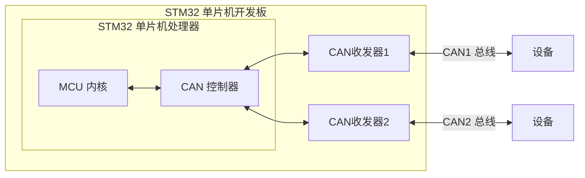

# CAN通信与HAL库

此部分内容主要讲述CubeMX中CAN通信的配置，并以STM32F103ZET6为例讲述其实际用法。

## CubeMX配置

Connectivity -> CAN 启用

注意到 Parameter Sttings 下有许多配置选项，下面一一解释其用途。

**BiteTimings Parameters**

- Prescaler (for Time Quantum) ：预分频系数，不再赘述。

- Time Quanta in Bit Segment 1 ：时间段1，定义采样点的位置，BS1

- Time Quanta in Bit Segment 2 ：时间段2，定义发送点的位置，BS2

- ReSynchronization Jump Width ：重新同步跳跃宽度 ==（暂时不知道什么用处）==

- 波特率计算
  - $CLK_{分频后} = CLK / PSC$
  - $T = SYNC + BS1 + BS2$
  - $目标波特率= CLK_{分频后} / T$


- 波特率 = $\dfrac1{正常的位时间}$
- 正常的位时间 $=1\times t_q+t_{BS1}+t_{BS2}$，其中
	- $t_{BS1}=t_q\times({\rm TS1[3:0]}+1)$
	- $t_{BS2}=t_q\times({\rm TS2[2:0]}+1)$
	- $t_q=({\rm BRP[9:0]}+1)\times t_{\rm PCLK}$，这里 $t_q$ 表示一个时间单元
	- $t_{\rm PCLK}=$ APB 时钟的时间周期

**Basic Parameters**

- Time Triggered Communication Mode ：时间触发模式
- Automatic Bus-off Management ：自动离线管理
- Automatic Wake-Up Mode ：自动唤醒
- Automatic Retransmission ：自动重传
- Receive Fifo Locked Mode ：锁定模式
- Transmit Fifo Priority ：报文发送优先级

**Advanced Parameters**

模式：

- Normal：正常模式，双机通讯
- Loopback：回环模式，自收自发
- Silent：静默模式，不能向总线发送显性位(逻辑0)，只能发送隐性位(逻辑1)，可从总线接收数据。
- Loopback combines with Silent：静默回环，输出端直接发送至自己的输入端，不从总线接收数据。

此处以CAN通信驱动GM6020电机转动为例。

### 硬件实现

- STM32自带CAN控制器，箭头表示收发关系，直线表示我们自行接到外部的总线
- 发送方式：把发送的数据加到CAN收发器中，由它自主控制发送
- 接收方式：从接收队列（FIFO队列）选择接收



### CUBEMX配置

- 查看原理图，明确元件与引脚的对应关系
  - 在本实验中，明确LED和CAN即可
- 配置STM32CubeMX
  - Serial Wire、外部时钟、时钟树
  - 配置LED引脚
    - 初始状态为高电平表示灯灭
    - 上拉电阻，尽量别浮空
  - 配置CAN参数
    - Prescaler=9 即从APB1中分频出来
    - Time Quanta in Bit Segment 1&2 均为2，采样在两者间
    - Operating Mode=Loopback 使用回环模式（自收自发）
    - 使能中断 Rx Tx

### 代码配置

CAN通信初始化

```C
void can_init(CAN_HandleTypeDef *hcan){//初始化CAN
	can_filter_init(hcan);
	HAL_CAN_Start(hcan);
	HAL_CAN_ActivateNotification(hcan, CAN_IT_RX_FIFO0_MSG_PENDING);
}

void can_filter_init(CAN_HandleTypeDef *hcan){
	CAN_FilterTypeDef config;
	
    config.FilterActivation=CAN_FILTER_ENABLE;//启用滤波器
	config.FilterFIFOAssignment=CAN_FILTER_FIFO0;//收发通道为FIFO0
	config.FilterMode=CAN_FILTERMODE_IDMASK;//配置滤波器模式->ID过滤
	config.FilterScale=CAN_FILTERSCALE_32BIT;
	config.FilterIdHigh=0x0000;//ID高八位
	config.FilterIdLow=0x0000;//ID低八位
 	config.FilterMaskIdHigh=0x0000;
	config.FilterMaskIdLow=0x0000;
	config.FilterBank=0;//过滤器0
	config.SlaveStartFilterBank=0;
	
	HAL_CAN_ConfigFilter(hcan,&config);
}
```

以上代码照抄即可，不过注意 `MaskId` 和 `FilterId` 有什么区别呢？

`MaskId` 设置的是 对应 `MaskID` 为1的bit必须与 `FilterID` 中的bit位相同的 CANID 才能接收 ，当 `MaskId=0` 时，不过滤消息。

CAN接收

```C
void HAL_CAN_RxFifo0MsgPendingCallback(CAN_HandleTypeDef *hcan){
	if(hcan->Instance==CAN1){
		can_motor_receive(hcan);
		
	}
}

void can_motor_receive(CAN_HandleTypeDef *hcan){
	CAN_RxHeaderTypeDef rx_header;
	uint8_t can_rx[8];
	HAL_CAN_GetRxMessage(hcan,CAN_RX_FIFO0,&rx_header,can_rx);
	switch(rx_header.StdId){
		case 0x206:{
			motor_decode(&motor_data,can_rx);
		}
        case xxx:{
             xxxxxxxx;
        }
        default: xxxx;
	}
}
```

CAN发送

```C
void can_motor_transmit(CAN_HandleTypeDef *hcan,CAN_TxHeaderTypeDef *tx_header,uint32_t *tx_mail,uint16_t m_voltage){
	tx_header->StdId=0x1FF;//发送的CANID
	tx_header->IDE=CAN_ID_STD;//采用标准帧格式
	tx_header->RTR=CAN_RTR_DATA;
	tx_header->DLC=0x08;//数据长度为8位

	m_data[2]=m_voltage>>8;//电机ID为2 设置高八位
	m_data[3]=m_voltage;//低八位
	
	HAL_CAN_AddTxMessage(hcan,tx_header,m_data,tx_mail);//发送CAN驱动电机
}
```

Main()中记得要 `can_init(&hcan1);`

