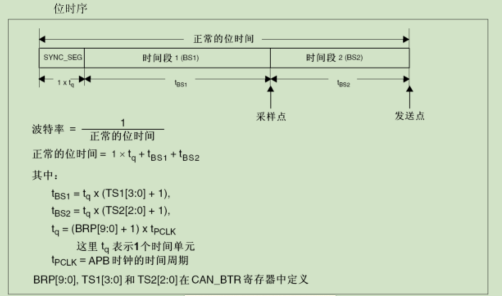

# CAN通信与HAL库

此部分内容主要讲述CubeMX中CAN通信的配置，并以STM32F103ZET6为例讲述其实际用法。

## CubeMX配置

Connectivity -> CAN 启用

注意到 Parameter Sttings 下有许多配置选项，下面一一解释其用途。

**BiteTimings Parameters**

- Prescaler (for Time Quantum) ：预分频系数，不再赘述。

- Time Quanta in Bit Segment 1 ：时间段1，定义采样点的位置，BS1

- Time Quanta in Bit Segment 2 ：时间段2，定义发送点的位置，BS2

- ReSynchronization Jump Width ：重新同步跳跃宽度（暂时不知道什么用处）

- 波特率计算
  - $ CLK_{分频后} = CLK / PSC$
  - $ T = SYNC + BS1 + BS2 $
  - $目标波特率= CLK_{分频后} / T $

**Basic Parameters**

- Time Triggered Communication Mode ：时间触发模式
- Automatic Bus-off Management ：自动离线管理
- Automatic Wake-Up Mode ：自动唤醒
- Automatic Retransmission ：自动重传
- Receive Fifo Locked Mode ：锁定模式
- Transmit Fifo Priority ：报文发送优先级

**Advanced Parameters**

模式：

- Normal：正常模式，双机通讯
- Loopback：回环模式，自收自发
- Silent：静默模式，不能向总线发送显性位(逻辑0)，只能发送隐性位(逻辑1)，可从总线接收数据。
- Loopback combines with Silent：静默回环，输出端直接发送至自己的输入端，不从总线接收数据。