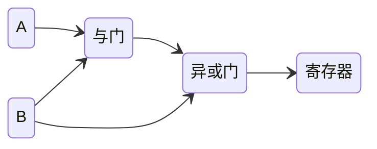
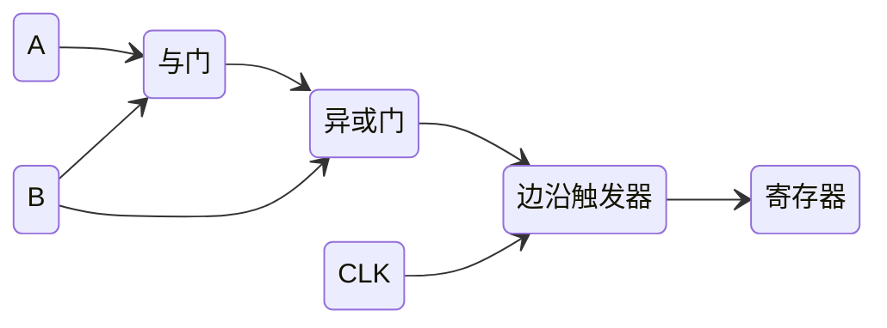
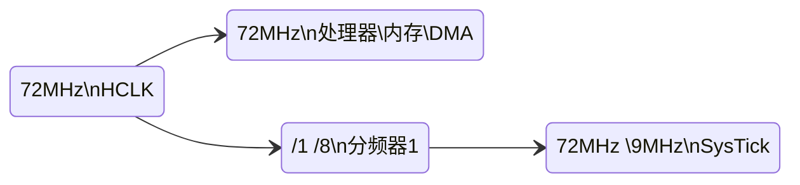
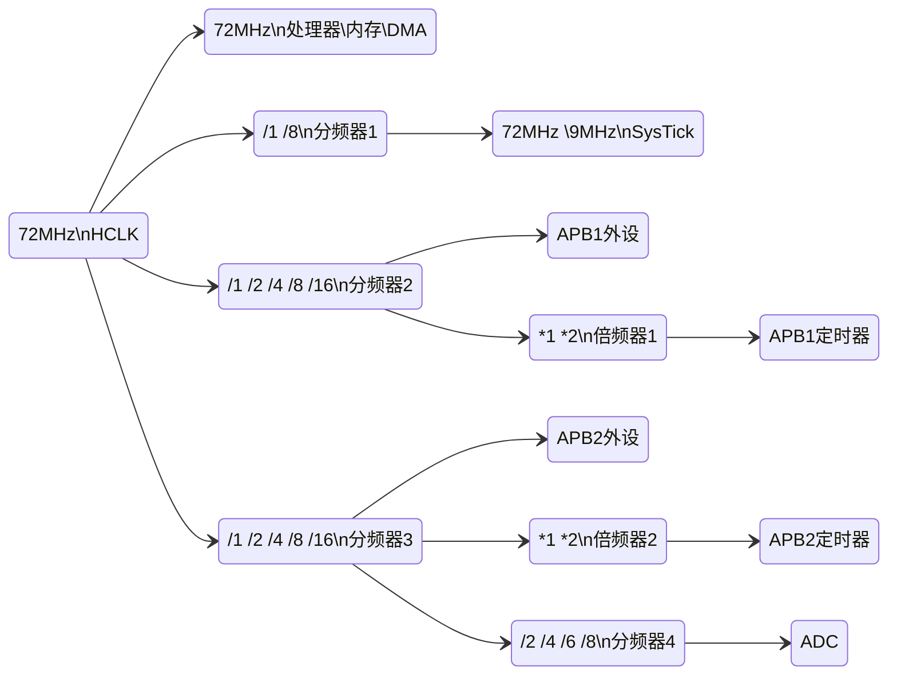

# 2.7 RCC时钟

## 为什么需要时钟？

想必大家学习单片机的时候都有个疑问，为什么实现功能前都需要时钟？

对相关知识又了解的同学都应该知道，单片机的内部数据计算是通过 与门 非门 等逻辑运算器进行的，数据经过这些单元进行运算后才被存入寄存器中供程序读写。而这些运算是需要时间的，如果在前一步运算还未进行的情况下，进行了下一步的运算，这会导致写入寄存器的数据出错，影响程序的运行。

以下图为例

我们记 `A` 处的输入为 `输入1` ， `B` 处的输入为 `输入2` ， 与门的输出为 `输出1`

假设 `A` `B` 的输入皆为高电平 `1` ，此时 与门 的输出也为高电平 `1` ，在异或门的两条输入皆为高电平时，其输出就是低电平 `0` 。

倘若由于外部影响，`B` 处电平变为低电平 `0` ，在理想状态下 与门 由于电路转变而输出低电平 `0`，经过异或门的运算，存入寄存器的值为 `0` 。

乍一看好像没有问题是不是？

但是要注意 与门 的运算需要时间，在与门进行运算的这一段时间内，异或门两端输入的电平为 `1 0` 此时输出的值变为了 `1` ，待与门运算完毕后 异或门 两端 才会收到 `0 0` 两个低电平，进而才会计算得到低电平 `0`。

看吧这不就出事了？

为了避免这种情况的出现，我们就必须引入边沿触发器，定期刷新寄存器的值，以弥补计算时间的影响。

该边沿触发器有一个输入端，一个输出端，和一个控制端，我们在边沿触发器的控制端输入一定频率的方波信号，当检测到方波的上升沿时，才会将左侧的运算刷新至右侧的寄存器中，其他时间不论左侧数据如何变化，右侧的寄存器数值将不会刷新。此方波即为时钟信号。

不仅在电路的层面上需要时钟，在外设层面上也需要时钟进行控制。如 串口：波特率；定时器：计时；IIC/SPI：时钟线；ADC：采样间隔。

## 时钟树

### 常用知识[^1]

STM32芯片内部有一条先进高性能总线AHB (Advances High Performance Bus) ， 提供各个设备间的通信。

在这条总线内部有一条时钟线HCLK，处理器、内存 和 DMA 直接连接到HCLK上，使用其时钟信号。此时便有了第一条时钟线，其时钟频率与HCLK相同。

在处理内部有一个系统滴答定时器（ `SysTick` ），`HAL_Delay();` 函数便是使用该定时器实现的。`SysTick` 经过分频器与 `HCLK` 相连。

*分频器的作用是什么呢？*

分频器相当于对时钟频率作除法，起到降频的作用，此处 `SysTick` 的分频器有 `/1 /8` 两个选项，也就是说，可以把 `HCLK` 的频率（假设为 72MHz）降为 9MHz 或 保持72MHz 供 `SysTick` 使用。

而其他外设并非直接接入先进高性能总线，而是通过 `APB1` , `APB2` 等先进外设总线间接接入 `AHB` 中。

> [!warning]
>
> 各个外设实际接在APBx，请根据原理图进行查看，此处仅作参考。

`APB1` 与 `APB2` 采用的时钟线 `PCLK1` `PCLK2` 由 `HCLK` 经过分频得到（此处的分频器可选择 `/1 /2 /4 /8 /16` ），并给各个外设使用。

对于 通用/基本/高级定时器 则又通过一个倍频器接入，用于重新提升频率。此处的倍频器有 `*1 *2` 两个选项，当预分频器为 `/1` 时，倍频器为 `*1` ，其他情况下倍频器的值皆为 `*2` 。

值得注意的 `ADC` 有一个专属的分频器，其值可为 `/2 /4 /6 /8` 。

到这儿我们已经完成了时钟树的右侧。

*那么HCLK中的时钟频率又是从哪里来的呢？*

不难知道，HCLK主要来自 高速外部时钟`HSE (High Speed External Clock)` 和 高速内部时钟`HSI (High Speed Internal Clock)`

`HCLK` 默认使用 `HSI` 其时钟频率为8MHz，但其精度不够。

`HSE` 则是从外部接入晶振产生脉冲，其时钟频率也为8MHz但精度远远高于 `HSI` 。

`HSI` 和 `HSE` 可任选其一作为`SYSCLK` 再经过分频后接入 `HCLK` ，由于频率为8MHz，经过分频后其频率只能小于8HMz，那么该如何产生72MHz的频率呢？

这时候就要引入一个新的器件 PLL锁相环 ，HSI通过一个固定值为 `/2` 的分频器接入 PLL锁相环，而 `HSE` 通过 `/1 or /2` 的分频器接入PLL。PLL锁相环可通过上图中的 `*PLLMul` 将频率翻倍后作为 `SYSCLK` 接入时钟树。

> [!warning]
>
> 记得要点选相对应的选项，如上图选择的是 HSE经过PLL锁相环倍频后接入时钟树。

### 其他时钟组成[^2]

- *LSI&LSE*
  - LSI是低速内部时钟，RC振荡器，频率为40kHz，提供低功耗时钟。　 
  - LSE是低速外部时钟，接频率为32.768kHz的石英晶体。
  - 其中LSI是作为IWDGCLK(独立看门狗)时钟源和RTC时钟源 而独立使用 。
- *FCLK*
  - 自由运行时钟，不受休眠影响。
  - 。时钟频率直接来自于 `SYSCLK` 后的预分频器。
- Enable CSS
  - 时钟监视器，当 `HSE` 出现故障时将切换至 `HSI。`
- USB时钟
  - 当需要使用USB模块时，PLL必须使能，并且时钟频率配置为48MHz或72MHz

## 一些疑问及解答

*ADC是什么？[^3]*

**答：**将模拟信号转换为数字信号，由于具体应用较复杂，此处不再赘述，请查阅参考资料[^3]。

*PLL锁相环的工作原理[^4]*

**答：**PLL基本上是一个闭环的反馈控制系统，它可以使PLL输出与一个参考信号保持固定的相位关系。PLL一般由鉴相器、电荷放大器（Charge Pump）、低通滤波器、（电）压控振荡器、以及某种形式的输出转换器组成。为了使得PLL的输出频率是参考时钟的倍数关系，在PLL的反馈路径或（和）参考信号路径上还可以放置分频器。

压控振荡器产生周期性的输出信号，如果其输出频率低于参考信号的频率，鉴相器通过电荷放大器改变控制电压使压控振荡器就的输出频率提高。如果压控振荡器的输出频率高于参考信号的频率，鉴相器通过电荷放大器改变控制电压使压控振荡器就的输出频率降低。低通滤波器的作用是平滑电荷放大器的输出，这样在鉴相器进行微小调整的时候，系统趋向一个稳态。

*IWDG[^5]*

**答：**一个能够产生复位信号的计数器。

- 独立看门狗复位：这种方式使用独立的看门狗来监控单片机系统的工作状态，当单片机工作异常时，看门狗会产生复位信号，将单片机系统复位。

- 特征：
  1. 独立看门狗是一个递减计数器产生的复位。
  2. 时钟信号是有独立RC振荡器产生。
  3. 可以在待机和停止模式下运行。
  4. 当看门狗被激活后，当递减为0是产生复位。
- 喂狗：如果在计数没减到 0 之前，重置计数器的值的话，那么就不会产生复位信号，这个动作我们称为喂狗。
- 作用：检测外界电磁干扰或硬件导致程序跑飞的问题。

## 参考资料

[^1]: [【STM32】超清晰STM32时钟树动画讲解_bilibili](https://www.bilibili.com/video/BV1ph4y1e7Ey)
[^2]: [【STM32】系统时钟RCC详解(超详细，超全面)_stm32 rcc-CSDN博客](https://blog.csdn.net/qq_37006625/article/details/138134997)
[^3]: [STM32 ADC详解 - 知乎 (zhihu.com)](https://zhuanlan.zhihu.com/p/352424817)
[^4]: [锁相环PLL原理 && 时钟产生方法_pll 参考时钟-CSDN博客](https://blog.csdn.net/zhandoushi1982/article/details/4590043)
[^5]: [IWDG(独立看门狗)-CSDN博客](https://blog.csdn.net/m0_56399733/article/details/135430430)