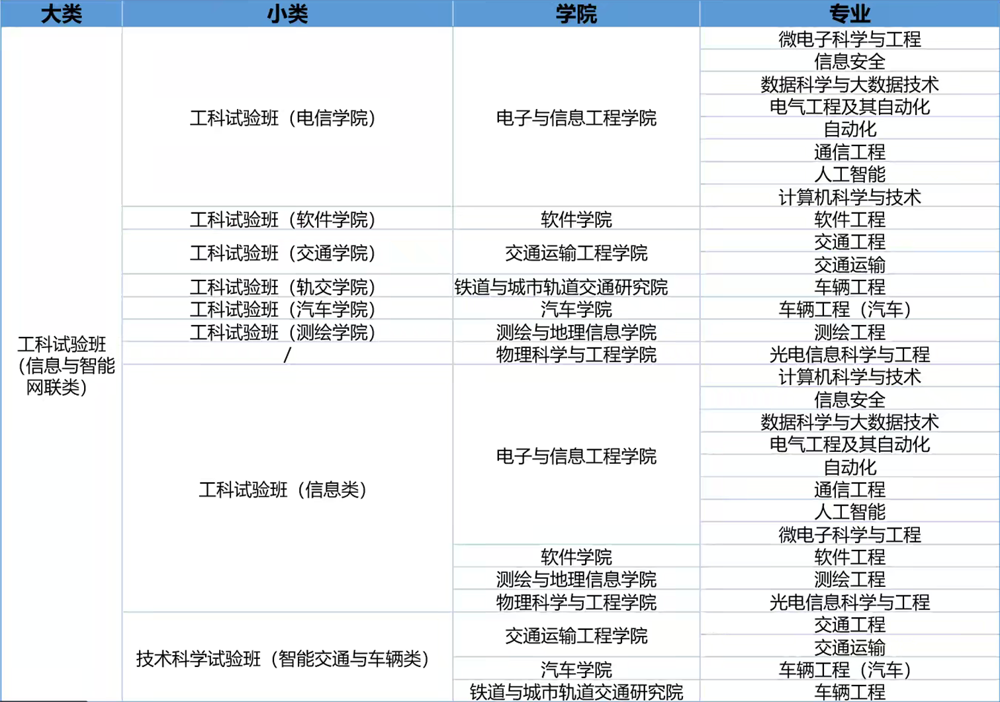
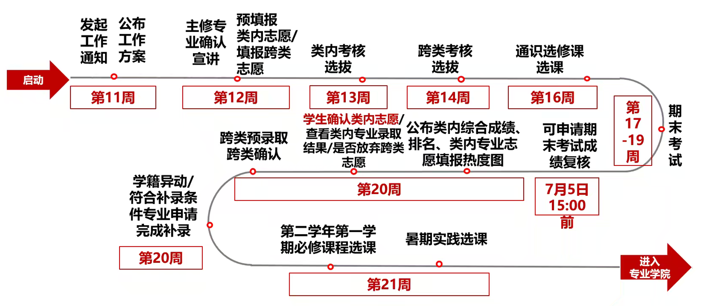
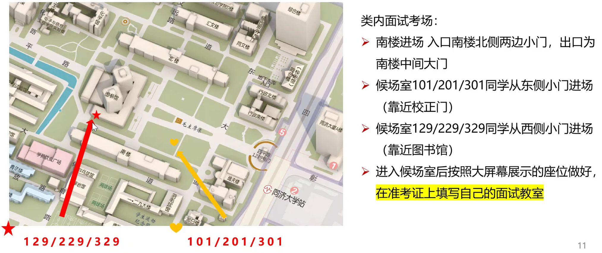

# 同济 2024 级主修专业确认信息

## 综合成绩构成及各模块占比

| 成绩构成 | 类内确认 | 跨类确认 | 具体内容                                          |
| -------- | -------- | -------- | ------------------------------------------------- |
| 课程绩点 | ≥ 60%    | ≥ 50%    | 第一学年课程的平均绩点                            |
| 面试成绩 | 10%      | ≥ 10%    | 各大类/学院主修专业确认工作小组拟定，制定评分标准 |
| 特色评测 | ≥ 10%    | ≥ 10%    | 各大类/学院确定特色测评的具体内容                 |
| 五育成绩 | 10%      | 10%      | 各学院根据规定给出                                |

工科试验班（信息与智能网联类）成绩占比如下：

| 成绩构成 | 类内确认 |
| -------- | -------- |
| 课程绩点 | 70%      |
| 面试成绩 | 10%      |
| 特色评测 | 10%      |
| 五育成绩 | 10%      |

其中特色评测具体内容为：

1. 以下 6 门课程绩点或相应的数学类和物理类课程加权平均折算成满分为 8 分的分数：
   1. 《高等数学 B（上）》
   2. 《高等数学 B（下）》
   3. 《大学物理精 I（上）》
   4. 《大学物理精 I（下）》
   5. 《高级语言程序设计》
   6. 《高级语言程序设计实验》
2. 创新项目或竞赛，不累计，满分 2 分
   1. 创新项目：获得大学生创新项目立项，可获得 2 分
   2. 竞赛：ACM、ICPC 国际大学生程序设计竞赛并获奖，可获得 2 分

## 信息与智能网联类专业表

## 实施程序

1. **启动主修专业确认** 
   类内志愿**预填报**，跨类志愿填报
   
2. **类内/跨类考核及选拔** 
   面试、特色评测
   
3. **公布满足条件的新生奖学金获得者** 
   第一学年期末考试成绩出来后，根据预填报志愿情况录取，公布新生奖学金获得者名单
   
4. **类内确认志愿** 
   公布类内综合成绩排序预填报志愿热度，据此再次确认类内志愿顺序
   
5. **类内录取** 
   公布类内录取结果，此时可取消跨类志愿
   
6. **跨类录取** 
   专业学院公布预录取名单，学生分三批次确认；一旦被跨类录取，原类内专业视作自动放弃
   
7. **部分特色专业申请补录** 
国家基础学科拔尖学生培养基地或 2018 年以来设立的新专业，且未录满
### 2024 级时间表

类内专业志愿预填报后，可在第 20 周类内志愿确认环节根据预填报志愿热度、综合成绩排名做调整；跨类志愿填报后不再做调整。在类内专业确认后，可以选择是否放弃跨类志愿。

==**必须**进行预填报！==**否则将无法正常确认，只能服从调剂！**

| 时间                    | 内容                                                         | 解读                                                         |
| ----------------------- | ------------------------------------------------------------ | ------------------------------------------------------------ |
| 5.14 15:00 - 5.16 12:00 | 查看接收计划、咨询、预填报类内和填报跨类志愿                 | 类内所有专业进行拖拽填报，必填；跨类志愿选填，最多填报 3 个；==专业计划数包含新生奖学金获得者，自己计算时应扣除==。 |
| 5.22                    | 查看类内考核安排                                             | 导出面试安排 PDF，打印准考证、准备面试                       |
| 5.25                    | ==参加类内面试考核==                                         | 准时参加类内面试，细节见后                                   |
| 5.26 - 5.30             | 跨类面试考核                                                 | 同上                                                         |
| 7.5 15:00 前            | 可申请第一学年第二学期==期末考试成绩复核==（成绩出来后如有异议，即可申请复核） | 对期末成绩有异议，可通过填写《同济大学学生成绩复核申请表》（附件 6）申请复核，提交至瑞安楼 200A ，截止时间：7.5 15:00 前 |
| 7.7                     | 公布符合新生奖学金优先选拔条件的学生名单，==公布类内综合成绩和专业志愿预填报热度图== | 对综合成绩有异议，在 7.7 15:00 前提交《新生院主修专业确认综合成绩复核申请表》（附件 7），交至瑞安楼 200A。指标课程根据学分加权平均。 |
| 7.8                     | 公布综合成绩排名 确认类内志愿（9:00~15:00）             | **根据综合成绩排名、志愿预填报热度、新生奖学金获得者的录取情况的情况再次确认志愿**，如果不需要调整可以不操作。 |
| 7.9                     | 查看类内专业录取结果，确认是否放弃跨类志愿                   | 1 系统上查询主修专业录取通知书                               |
| 7.12                    | 部分专业补录                                                 |                                                              |

### 类内面试要求

- 携带准考证、学生证、身份证
- 严禁将手机、电脑等智能电子设备带入面试考场
- 在候场室的相应座位上耐心等候，并根据工作人员的提示==将面试具体考场号填写在准考证相应栏==
- 面试主要考查学生在知识储备、逻辑思维能力、语言表达能力、临场反应能力等方面的综合素养和能力，内容可涵盖学生所在大类所有学科基础知识。==考生须根据考查范围准备 2 分钟左右自述==。
- 每位考生==有效面试时间不少于 5 分钟，全程不超过 8 分钟==。考生应注意把握和合理分配时间，超时将被工作人员中断面试。
- 考生因不可抗力无法参加面试，应在面试前按照要求提交补面试申请，由工作组另行安排补面试。如果学生未在规定时间内到达考场，且未提交补面试申请，视为自动放弃，不再安排补面试。

## 备注

### 类内志愿填报为顺序志愿而非平行志愿

学生所在类内所有专业均应排序填报，将根据学生志愿顺序，系统按照综合成绩从高到低自动录取，直至专业类内接收计划录满为止。第一志愿选拔录取结束后，若该专业还有剩余名额，依序在第二志愿填报该专业的学生中进行录取。后序志愿同理，直至所有学生完成类内主修专业确认。如学生已被所报前序志愿录取，则不再参加后序志愿录取过程。

### 不参加类内主修专业确认的情况

招生时己有明确专业属性，招生时录取到工科试验班（汽车学院）、工科试验班（轨交院）、工科试验班（测绘学院）、工科试验班（航力学院）、工科试验班（设计创意学院）、工科试验（软件学院）、理科试验班（材料学院）、理科试验班（物理学院）、理科试验班（航力学院）、医学试验班（医学院）、医学试验班（口腔）等学生，以及通过二次选拔进入基础学科拔尖学生培养基地（拔尖班）、双学士学位复合型人才培养项目、人才培养模式创新实验区的学生，**不参加类内主修专业确认，可以参加跨类主修专业确认**。双学士学位项目学生可申请转入除第一主修专业以外的专业。

### 重缓考科目成绩记录问题

根据《学生手册》相关规定，缓考成绩覆盖在上学期原成绩记载处，重考成绩记载在实际取得成绩的学期。因此，第一学期课程重缓考成绩计入主修专业确认平均绩点，第二学期缓考按照 4 月 8 日在 1 系统发布的《新生院 2024 - 2025 学年第二学期缓考工作实施细则》执行；==第二学期重考成绩不计，视为零分==。

### 信息获取渠道

- 教学管理信息系统：http://1.tongji.edu.cn

  主修专业确认实施办法文件汇编、工作通知等

- 新生院官方网站：http://xsy.tongii.edu.cn

  主修专业确认实施办法文件汇编

### 咨询方式

- 主修专业确认政策：可咨询新生院教学事务管理中心

  联系电话：021-65983051, 65985424, 65985426

  办公地址：瑞安楼 200A

- 跨类专业确认方案：可咨询各专业学院（见文件汇编各学院跨类实施方案）
