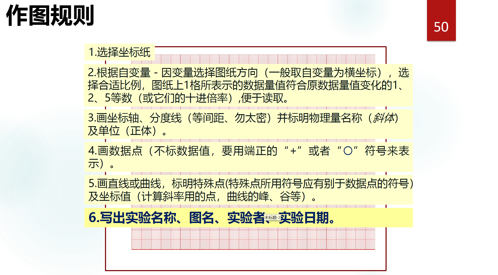

# 数据处理

## 有效数字及其运算规则

在物理实验中，涉及到的都是有单位的数据，由若干位的可信数字与末尾一位的可疑数字组成。
$$
\begin{align}
& 2.32\underline{7} \text{ kg } 有4位有效数字，其中\underline{7}是可疑数字;\\
& 22\underline{0} \text{ V } 有3位有效数字，其中\underline{0}是可疑数字.\\
\end{align}
$$

### 加减法（尾数对齐）

**与不确定度最大项的末位有效数字对齐。**
$$
57.3\underline 1 + 0.015\underline 6 - 2.2434\underline 2 = 55.0\underline 8218 = 55.08
$$
**解释**：57.31的可疑数字在百分位，0.0156的可疑数字在万分位，2.24342的可疑数字在十万分位，57.31的可疑数字位数最高，因此结果位数与57.31相同。

### 乘除法（位数对齐）

**与最少个数的有效数字相同。**
$$
57.3\underline{1} \times 0.015\underline 6 \div 2.2434\underline 2 = 0.39\underline 851 = 0.399.
$$
**解释**：57.31的有效数字为4位，0.0156的有效数字为3位，2.24342的有效数字为6位，0.0156的有效数字位数最少，因此结果位数与0.0156相同。

> [!tip]
>
> - 计算时至少多保留一位；
> - 即使是用计算机计算，也要对计算结果运用修约规则。

### 修约规则

> [!note]
>
> 4舍6入5成双

末位数字小于5或大于5都遵循四舍五入原则；等于5，则前一位数字变成大于等于它的最小偶数。

## 不确定度

- 构建：待测量的测量模型；
- 分析模型中每一个输入量的标准不确定度；
  - A类/ B类
- 获得待测量的合成标准不确定度；

例如，用秒表测量单摆的周期：
$$
T = T_0 + T_1 + T_2
$$
其中$T_0$是秒表的示值，$T_1$是秒表的仪器误差，$T_2$是人的反应时间。

- 多次测量数据之间的差异——用统计方法分析（A类）；
- 秒表的仪器误差——根据经验推算（B类）；
- 人的反应时间——根据经验推算。

### A类标准不确定度

$$
u_A(\bar{x}) = \sqrt {\frac{\sum\limits_{i = 1}^{n} (x_i - \bar x)^2}{n(n - 1)}}, 其中平均值\bar x = \frac{\sum\limits_{i = 1}^{n} x_i}{n}.
$$

测量一个球的直径$D$，测量了十次，结果如下表，求该球的直径及其标准不确定度。

| $D/\text{mm}$ | $12.337$ | $12.349$ | $12.333$ | $12.353$ | $12.339$ | $12.352$ | $12.345$ | $12.348$ | $12.356$ | $12.340$ |
| ------------- | -------- | -------- | -------- | -------- | -------- | -------- | -------- | -------- | -------- | -------- |

解：平均值：
$$
\bar D = \frac{1}{10} \sum_{i = 1}^{10} D_i = 12.3452 \text{ mm.}
$$
标准不确定度：
$$
u_A(\bar D) = \sqrt {\frac{\sum_{i = 1} ^ {10} (D_i - D)^2}{10 \times 9}} = 0.0024 \text{ mm}.
$$

> [!warning]
>
> 此时尚未完成$D$的所有不确定度评定！计算作为中间过程，都多保留了一位小数。

### B类标准不确定度

$$
\boxed{标准不确定度u_B(x) = \frac{a}{c}.}
$$

$a$: 仪器最大允许误差；

$c$: 与概率相关的置信因子。

本课程均采用矩形分布假定，因此$c = \sqrt 3$，上面的公式可化为
$$
u_B(x) = \frac{a}{\sqrt 3}.
$$

### 获得待测量的合成标准不确定度

#### 直接测量量

假设测量模型为$L = L_0(仪器示值) + L_1(仪器偏差)$，则经过多次测量后，其合成标准不确定度为
$$
\boxed{u(L) = \sqrt {u_A(L_0)^2 + u_B(L_1)^2}}
$$

#### 间接测量量

设间接测量量$y$由直接测量量$\boldsymbol x$合成，且满足$y = f(\boldsymbol x)$，则$y$的标准不确定度$u_C(y)$为
$$
u_C(y) = \sqrt {\sum_{i = 1}^{n}(\frac{\partial f}{\partial x_i})^2 u^2(x_i)}.
$$

> [!note]
>
> 在高维微积分中，我们常常使用上标表示分量；上面的公式中为避免混乱，我们统一使用上标表示幂次，下标表示分量。
>
> 下面的公式中，在不引起争议的情况下，我们按照高维微积分的规定使用上标表示分量；像上面的公式一样，上标的含义不同，容易引起误会的情况下，我们使用上标表示幂次，下标表示分量。

灵敏系数指：$\frac{\partial f}{\partial x^i}.$

##### 几个常见的合成公式

- 加减：$y = x_1 \pm x_2$
  $$
  u_C^2(y) = u^2(x_1) + u^2(x_2).
  $$
  ::: details 
  $$
  \begin{align}
  & \frac{\partial f}{\partial x_1} = 1,\\
  & \frac{\partial f}{\partial x_2} = \pm 1.\\
  \end{align}
  $$
  因此$u_C^2(y) = u^2(x_1) + u^2(x_2).\square$

  :::

- 乘除：$y = x_1 x_2$或$y = \frac{x_1}{x_2}.$
  $$
  (\frac{u_C(y)}{y})^2 = (\frac{u(x_1)}{x_1})^2 + (\frac{u(x_2)}{x_2})^2.
  $$
  ::: details
  $$
  \begin{align}
  & \frac{\partial f}{\partial x_1} = x_2,\\
  & \frac{\partial f}{\partial x_2} = x_1.\\
  \end{align}
  $$
  因此有
  $$
  u_C^2(y) = x_2^2 u^2(x_1) + x_1^2 u^2(x_2).
  $$
  整理即得原式。$\square$

  :::

- 乘方：$y = x^n.$
  $$
  (\frac{u_C(y)}{y})^2 = (n\frac{u(x)}{x})^2.
  $$
  ::: details
  $$
  \frac{\text{d} y}{\text{d} x} = n x^{n - 1}.
  $$
  因此有
  $$
  u_C^2(y) = n^2 x^{2n - 2} u^2(x).
  $$
  稍作变形即得原式。$\square$

  :::

## 作图

### 最小二乘法

$$
s(k, b) = \sum_{i = 1}^{n}(y_i - kx_i - b)^2 \rightarrow \min \Rightarrow \begin{cases}
\frac{\partial s}{\partial k} = 0\\
\frac{\partial s}{\partial b} = 0\\
\end{cases}
$$

因此有
$$
\begin{align}
& k = \frac{\sum_{i = 1}^{n} x_i y_i - n \bar x \bar y}{\sum_{i = 1}^n x_i^2 - n \bar x ^2}\\
& b = \bar y - k \bar x.
\end{align}
$$

### 相关系数

$$
r = \frac{\sum_{i = 1}^n x_i y_i - n \bar x \bar y}{\sqrt {\sum_{i = 1}^n x_i^2 - n\bar x^2}\sqrt {\sum_{i = 1}^n y_i^2 - n \bar y^2}}. 
$$

