# 宿舍智能家居折腾日志 1：基础篇

> 本文首发于 [舟济社区](https://home.tongji.icu/t/topic/2070)。

## 引子

谁没幻想过动动嘴就能控制一切的生活呢？反正我是从小一直幻想着家里能实现全屋智能化——出门不用带钥匙，不用下床就能开关灯……可惜这么久了梦想终究没成为现实。

这段时间在研究怎么提升宿舍生活质量，就又想起了智能化。这篇文章是笔者大一下期末时写成，大二就要换宿舍了，因此目前的建设都是不需要固定安装、拔了就走的，因此应该会比较有参考价值。发文时正值暑假，读者如果是大学生、又正好有兴趣，也可以参考本文构思一下你自己的宿舍智能化之旅。文末会给出文中提到所有设备的具体品牌与型号。

就不多啰嗦了，直接开始。

## Level 1: 不入网

其实不联网的话，也有一些智能产品可以用了。一般有两种：一类是自带传感器，根据环境执行结果；另一类是通过蓝牙直接连接手机进行控制。

### 内置传感器

第一种自带传感器的，最常见的就是各种感应灯了。这个应该是可以算广义的智能家居的。

我买了一个米家夜灯装在厕所里。其中内置了光传感器和人在传感器，当且仅当环境光暗且有人时点亮。这样晚上起床上厕所时就不用专门开灯了，夜灯的光也很柔和。

包装内附一个底座用于粘在瓷砖上，底座内有铁片，灯上有磁铁，灯通过磁吸吸附在底座上。若电量低，灯打开时会闪烁三下提示充电，此时直接拔下来用 Type-C 数据线充电，充完再吸回去就行了。

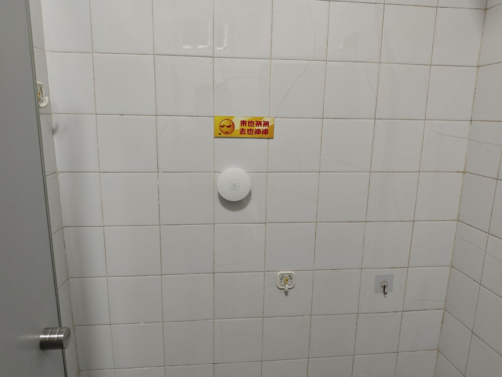

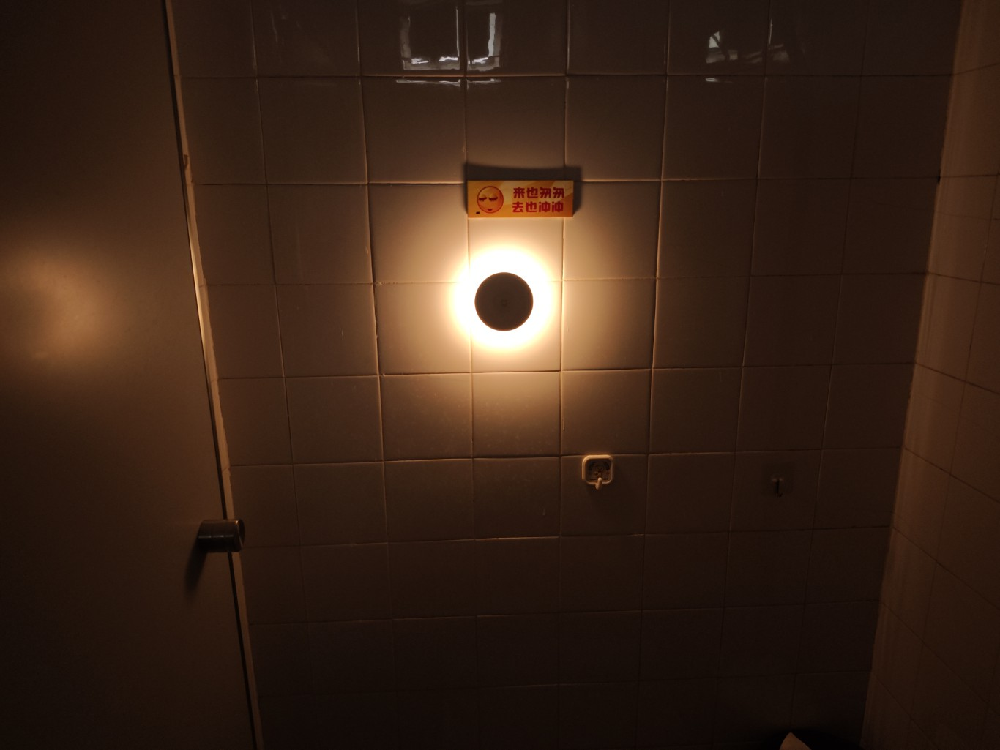

米家还有另一款插电式的夜灯，为 220V 两脚插供电，直接插在插座上。只有环境光传感器，没有人在传感器，只要环境光暗就开，不管有没有人在，也可以酌情选购。

### 蓝牙直连手机控制

蓝牙连接的设备可能会更贴近「传统意义上的智能设备」一点。有一些蓝牙闹钟就是这个类型。

我这里要介绍的是上个学期刚住进来的时候购入的门锁控制器。笔者的宿舍门锁是传统的钥匙锁，没有刷卡开门之类的装置，所以每次出门都得带钥匙，非常不方便。但是如果直接换掉学校的锁又不现实，我就开始寻找改造的方法，找到了这样一款设备，我直接上淘宝买的成品：

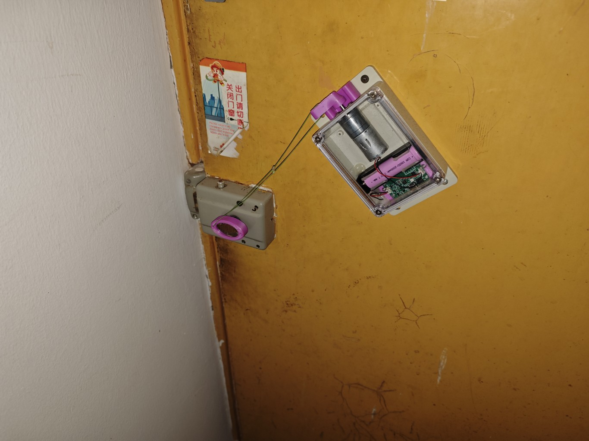

这个设备我都说不出它叫什么，暂且叫它蓝牙开锁装置吧。它的工作逻辑非常「物理」，我画了一个简图：

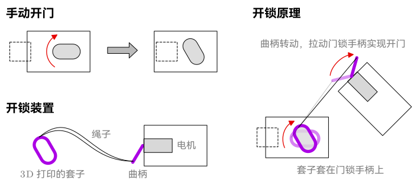

这套装置可以适配几乎所有门锁——只需要更换不同形状的套子、不同长度的曲柄即可。内部是一根 18650 供电，可以通过 Type-C 接口充电。控制是通过蓝牙直连手机，通过手机上的 App 开锁。

买成品的商家同时提供 App，也有上架各大应用商店，名字叫「易拉开门」。App 上可以设置密码、转动速度、等待时间等参数。

> 题外话：我看 B 站上很多自称自己做开锁装置的，手机上控制用的 App 也是这个，我怀疑有买成品改装博流量的嫌疑。

那这样出门就不用带钥匙了，在门口打开手机 App 就可以呼唤门那边的装置帮你开门了。

那么上面这些设备都没有连接网络，意味着只有人在附近的时候才能控制。要想实现远程控制，就来到了第二个等级——

## Level 2: WLAN 入网

现在学校宿舍通常都是有配无线网的，但是要注意，这个无线网大概率是没法直接用的，因为 IoT 设备通常只能连接 **WPA-2 Personal 认证**的网络，而校园网通常是通过学生信息（校园网账户等）认证登录的。

> **有关认证形式**
>
> 如果你连接这个 Wi-Fi 时，只是系统弹框要求输入**密码**，那这个网络大概率就是 WPA-2 Personal，可以直接用。
>
> 如果连接时是系统弹框要求输入**账号和密码**，那么这个网络通常是 WPA-2 Enterprise，那就不能直接用；如果连接时**弹出一个网页**要求登录之类的，也不能直接用。

如果你宿舍的校园网不能直接用，那就需要**一台无线路由器**来接入校园网，然后这个路由器再开一个 WPA-2 Personal 的 Wi-Fi 供 IoT 设备连接。类似于手机连入校园网，然后再开一个热点，让 IoT 设备连接到热点上。当然，如果你宿舍有全时运行不关机的智能设备（例如台式电脑），也可以用这个设备开热点。

笔者宿舍有两个校园无线网，一个是 WPA2-Enterprise，另一个是网页认证。因此我购入了一个迷你路由器，小小的非常可爱：

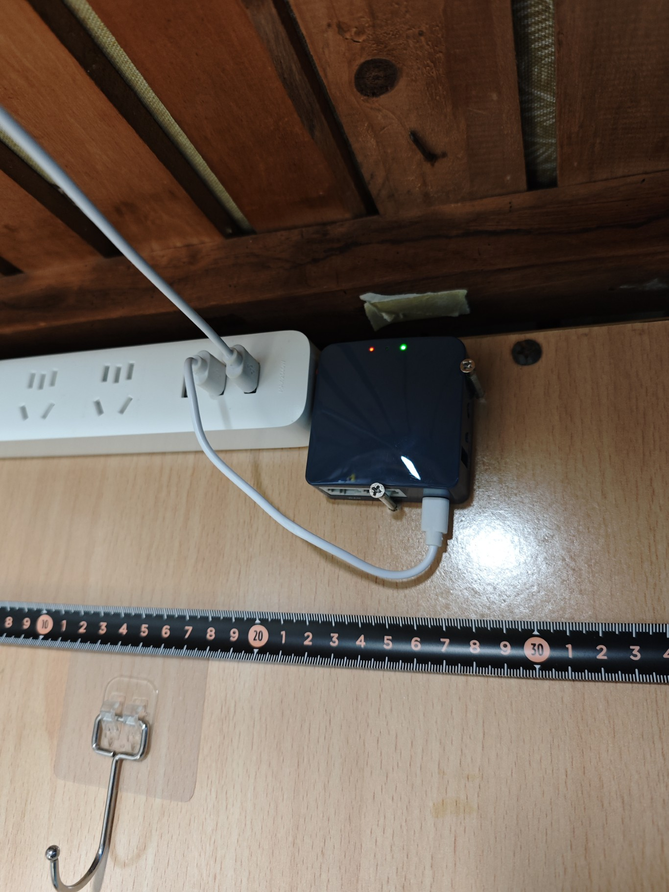

> **路由器选购注意事项**
>
> 接入 WPA2-Enterprise 需要硬件设备支持，因此在购买前**记得向客服确认是否能连接**！
>
> 至于网页认证的形式要如何认证并转发，笔者没有特别研究过，就不多说了。

解决了网络问题，才算有了 IoT 设备入网的基础。接下来就可以购入一些支持 Wi-Fi 入网的智能设备了。

### 平台选择

你先别急！有一个非常重要的问题：你要选择什么平台的设备？

早年的 IoT 市场「群雄争霸」，涌现了一大堆智能设备平台。这些平台有些是独立运营然后与设备厂商合作，有些是设备厂商直接下场做平台。软件公司的平台例如有阿里的天猫、百度的小度，传统家电厂商的比如格力、美的，一些自助创业的比如易微联、涂鸦智能，还有手机厂商跨界过来的苹果、小米、华为。

发展了这么久，慢慢也尘埃落定了——小米凭借恐怖的家电产业整合能力和亲民的价格，苹果凭借软硬件生态的深厚功底，二者成为了首选。尤其是如果你的手机是安卓，那基本可以无脑选小米了。此外由于如今科技圈充斥着大量不太理性的声音（~~你居然不提我们 XX 厂，你是不是不爱国？你 XX 厂的产品质量这怎么样那怎么样，怎么比得了 XX~~），这里就不多说了。你杠你对。

无论你选择哪家的产品，如果有可能，**尽量购置同平台的设备**。毕竟你也不想手机上装上好几个平台的 APP 控制不同的设备吧。

> 当然还有一种解决方法——使用开源项目 HomeAssistant，在本地自建服务器进行转发与整合。这部分本文就不展开讨论了。

笔者是小米全家桶用户（手机、手环、笔记本），使用的是米家。米家支持的设备款式是目前市面上最多的。并且米家也相对开放，提供了接口供各设备厂商接入，所以你能看到不少第三方且支持米家的设备。此外米家还有官方的 HomeAssistant 支持，对后续可能的 DIY 也更加友好。

### 空调伴侣

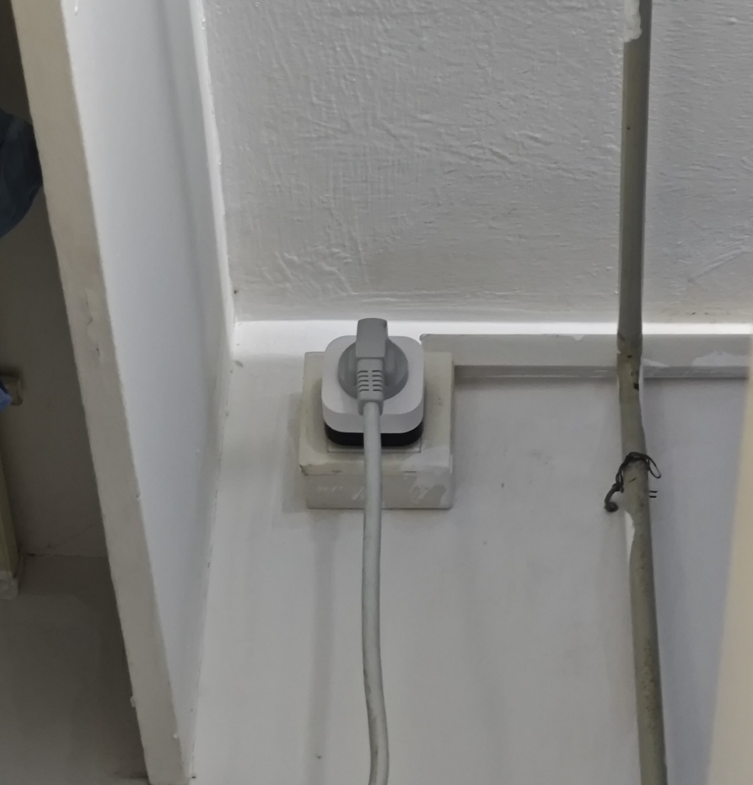

空调伴侣算是改造传统家电的典范产品之一。学校的空调肯定是不能直接换成米家的，而我们的需求只是联网控制。

空调伴侣是这样一种产品：它插在插座上，然后空调插在它身上。内置红外遥控模块，然后自身连入网络，相当于一个联网的空调遥控器。在手机上操作之后，空调伴侣会向空调发送红外指令，实现空调联网控制。此外通常空调伴侣还自带电量计量功能，手机上可以看到空调的实时功率以及每天的用电量。

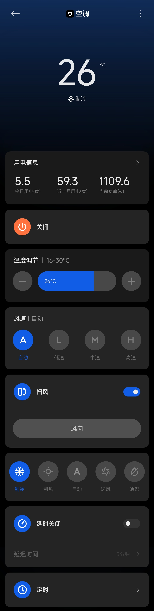

### 照明

这里的照明指的是桌前的「小照明」。

台灯我是直接换成了小米台灯 1S，百来块钱，有些小贵。插电的，Wi-Fi 入网。

我在床板底下加装了一根飞利浦的 LED 灯管，是用一根 两脚插-8字接头线供电，内置适配器。对于这样直接通过 220V 供电的设备，可以通过加接智能插座来实现智能化。我目前是用的小米智能插座 3（￥59），带电量计量功能，感觉有点浪费。后续可能会考虑买个通断器改造一下。

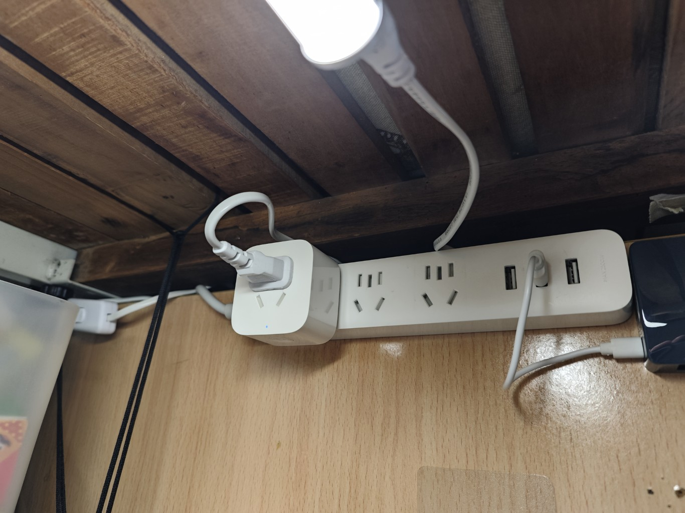

### 蓝牙门锁入网

前面提到的这个门锁是蓝牙的，因此每次开门都要走到门口、等待蓝牙连接，然后才能开锁。我便询问商家有没有可能通过 Wi-Fi 入网。商家提供了一个类似 U 盘的蓝牙开锁信号发射器，在对码之后，上电即发送蓝牙开锁信号。于是我就加接了一个 USB 通断器：

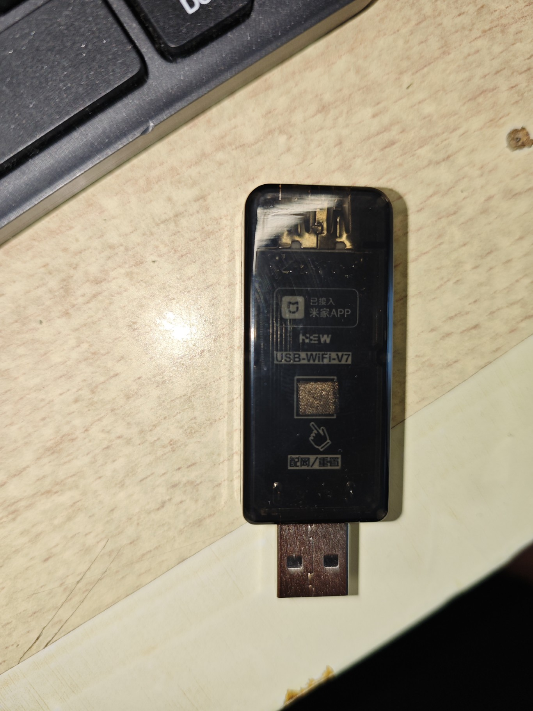

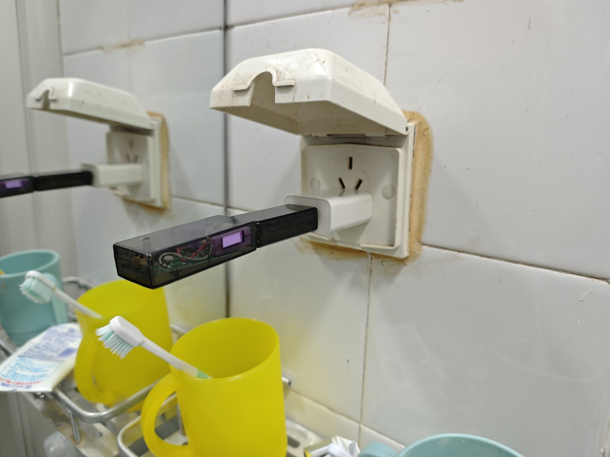

USB 通断器接入 Wi-Fi，全时在网。切换到「点动模式」，设置为「每次接通后 10s 自动断开」。那么就可以通过网络控制通断器，通断器给蓝牙信号发射器上电，发射器向门锁发送开锁信号。

### 控制与自动化

控制设备这里最基本的当然就是在米家 App 中进行操作了。如果是小米手机或者购买了小米智能音箱，也可以喊小爱同学来操作。

除此之外，米家中可以设置工作流（称为「手动控制」），允许定义一系列操作，按设定好的步骤执行。工作流中也可以调用现有的其他工作流。

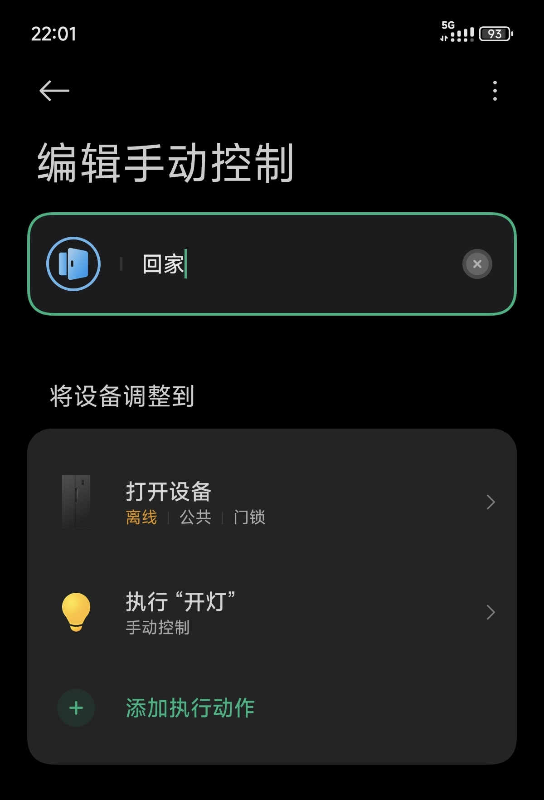

除此之外，还可以设置工作流的语音别名，可以自己设置短语来触发工作流：

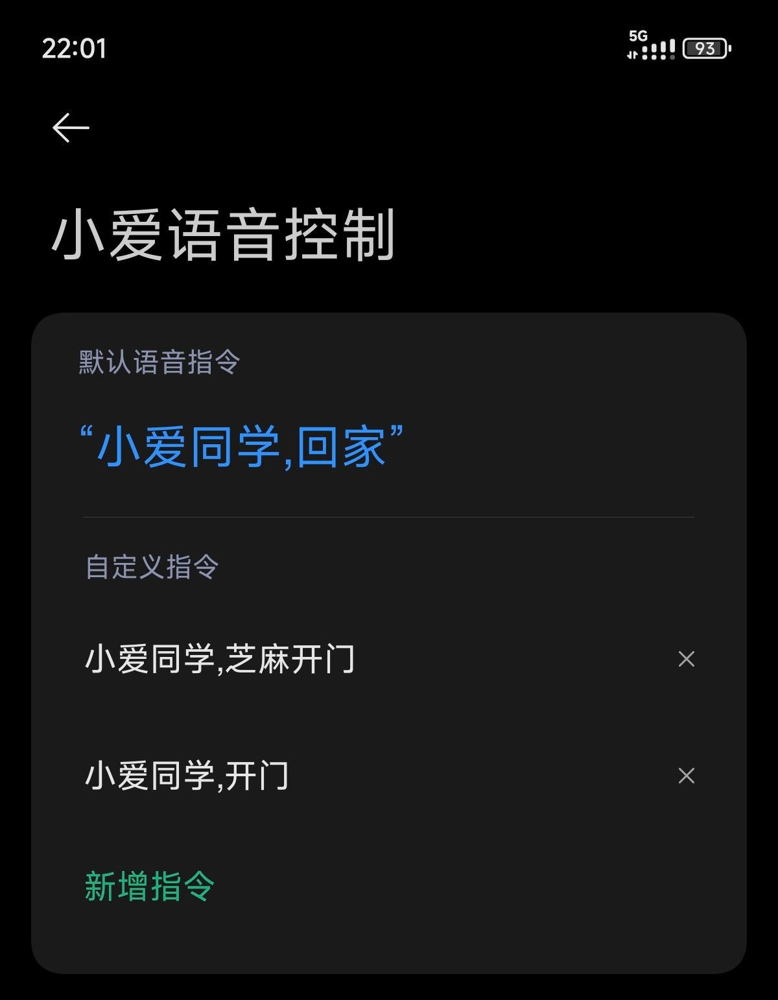

还有一个更有意思的东西：小米碰碰贴

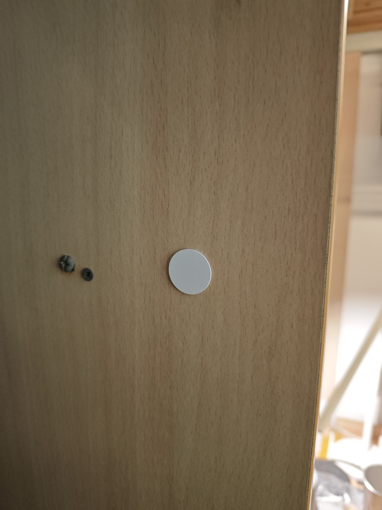

简单来说这就是一个 NFC 标签。在米家 App 上可以将标签与工作流绑定，这样手机碰上去就会执行指定的操作。例如可以：

- 在门外贴一个碰碰贴，与「开门」绑定在一起
- 在床上贴一个碰碰贴，与「延时关灯」绑定在一起
- 在门内贴一个碰碰贴，与「关闭所有设备」绑定在一起

而且由于操作是从手机发出的，需要米家 App 登录账号且有权限，因此不必担心有别人盗刷开门之类的。

## Level 3: 蓝牙、Mesh、Zigbee

到这里你可能会有一个疑问：用手机来碰 NFC 标签好像确实不错，但为什么不能买一个**无线按钮**贴在床上，按一下关灯，岂不比拿着手机优雅许多？

这里就要谈到 Wi-Fi 方式入网的局限性了：**功耗高**。Wi-Fi 设计的本意就不是为了极致的功耗，而是更关注传输速率。我们刚刚提到的智能家居设备都是插电的，事实上，**通过 Wi-Fi 入网的智能家居设备基本上都是插电的**。如果是靠电池供电的设备，续航数个月是基本要求，根本撑不起 Wi-Fi 那么高的功耗。那这些设备要想入网，就得另辟蹊径了。

智能家居的场景下，我们关注的是功耗和连接稳定性。由此就发展出了更多适合智能家居的通信协议。主流的包括蓝牙、蓝牙 Mesh、Zigbee。这些通信方式带宽不高，但在功耗上十分优秀，而且对应的通信组件的价格也更低，适合部署在无线开关、传感器、无线窗帘电机

但是问题来了，通过这些协议通信的设备要如何接入网络？

这时候就需要这样一个设备：它自身通过 Wi-Fi 或有线的方式接入互联网，同时又带有蓝牙、Zigbee 等协议的通讯能力，能够将来自网络的控制信息转发给这些设备，实现联网控制。这样的设备我们通常称为**网关**（在智能家居场景下的含义）。

以米家为例，可以在「我的-中枢与网关-了解网关」中获取到接入米家的网关设备列表，按需购买。目前笔者购入了米家多模无线网关 2，但由于还没有就此折腾出什么名堂来，所以这篇文章就到此为止了。

后面大概率还会继续折腾，我会在此帖下随缘更新。这也是我在舟济开的第一条帖子，如有错漏还望海涵，也欢迎回帖讨论！
