# 宿舍智能家居折腾日志 2：Mesh 设备篇

> 本文首发于 [舟济社区](https://home.tongji.icu/t/topic/2070)。

煮波分流去了测绘，所以接着住西南八，楼上搬楼下（
这两天刚收拾完，更一些内容

前面提到上了智能家居网关，这里主要是提一些走网关的设备与玩法。

## 温湿度计

一口气买了三个米家温湿度计 2，蓝牙入网，一个放室内、一个放阳台、一个放衣柜。

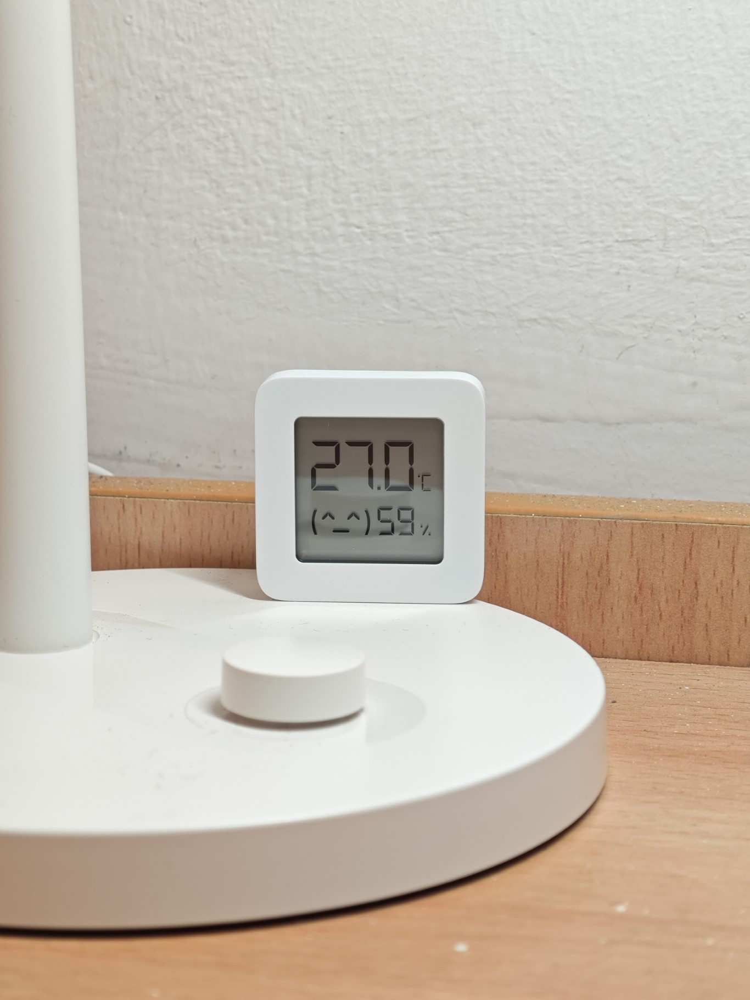

2 代的价格现在大概是十几块吧，3 代屏幕更大，贵十块钱左右，可以自行选择。

除了看温湿度和记录历史数据之外，还可以通过设置自动化来和空调联动，例如温度太低就将空调开高一些：

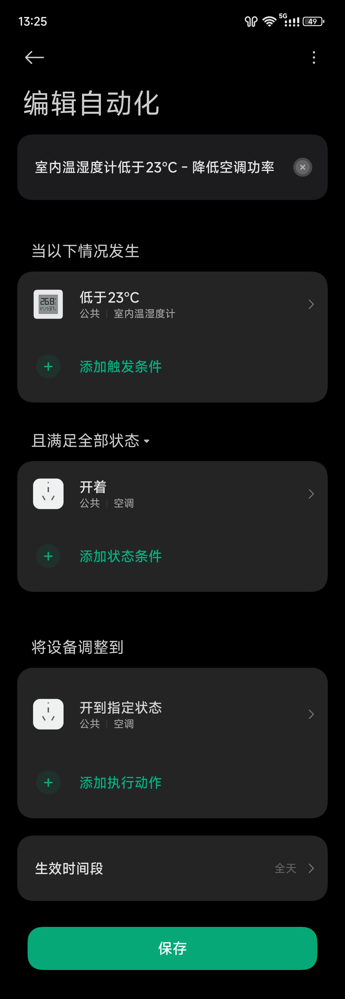

此外，有温湿度计之后就可以将数据绑定到家庭信息顶部，直接显示在首页：

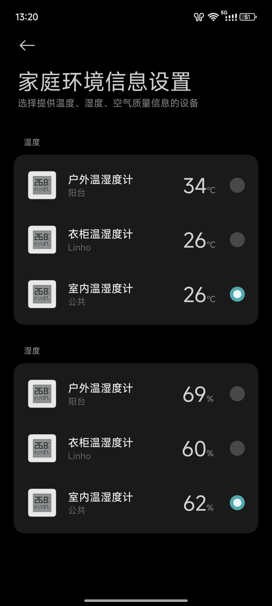

## 无线开关

前面文章结尾提到了无限开关需要蓝牙网关，那么现在就可以了。

我在桌边和床头各粘了一个，并绑定控制逻辑：

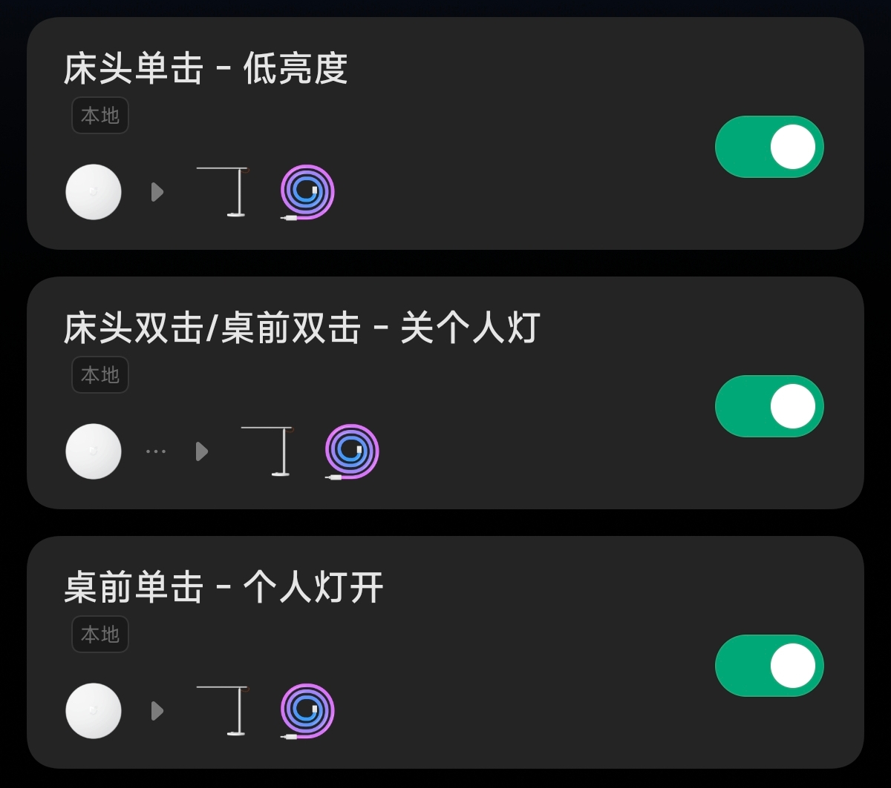

这样开关个人灯具就不需要分别去按两个了。

> 这里有一个 `本地` Tag，表明这里的控制是从网关走的。
>
> 因为这里的智能家居设备全部都在同一个局域网下（前面提到的路由器转发出来的网络），也没有开 AP 隔离之类的，因此这些设备可以直接在局域网互相访问和控制，不需要走云端服务器。一方面响应更快，另一方面即使外部网络断开也能执行控制。

## 智能开关

这部分其实是我最想讲的地方，那就是将宿舍内已有的公共照明智能化。我也想借此机会科普一点有关智能开关的内容。

我们知道我国家庭电路中，有火线（相线）、零线（中性线）和接地线，零火电压为交流 220V。负载接在火线和零线之间工作，如果有金属外壳或与水、燃气相关则需接地，防止外壳感应生电引发麻手或是漏电引发危险。

传统开关通常是装在火线上，通过机械结构控制火线的闭合和断开，实现控制负载的效果：

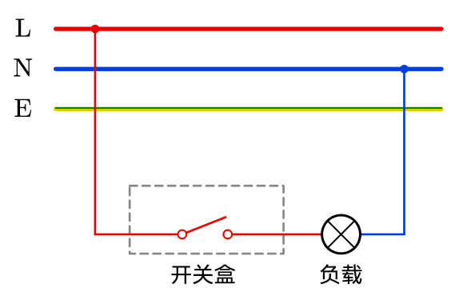

那我们想到，如果这个开关能够连接网络控制，那对应的负载（灯）不也就变成智能的了？我们希望把开关换成继电器（或双向可控硅等），然后加入一些控制电路，联网控制继电器。但是这里有个问题，控制由于需要联网，是需要持续供电的。当开关断开时，构不成回路，开关盒内没有电流，控制电路的电从何而来？

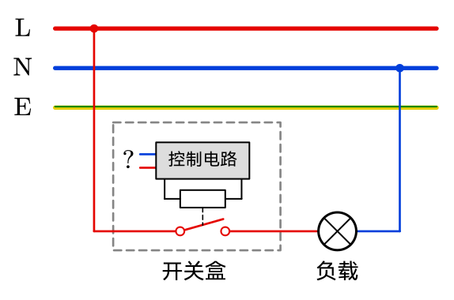

所以传统的智能开关**要求在开关盒中额外预留零线**。控制电路接在火线和这跟额外的零线两端工作。

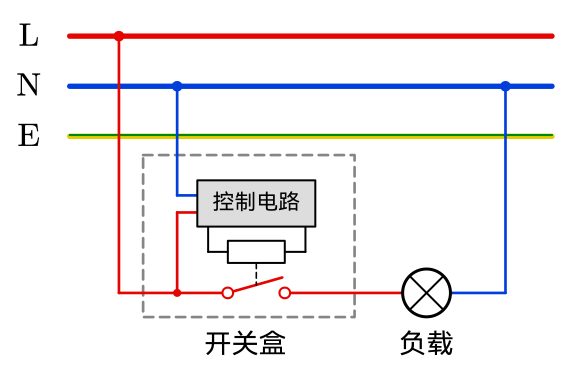

这种方案称为**零火**方案。

但是对于已经装修好的房子来说，加零线就得打掉重新布线，并不现实。于是后来出现了新物种：**单火开关**：

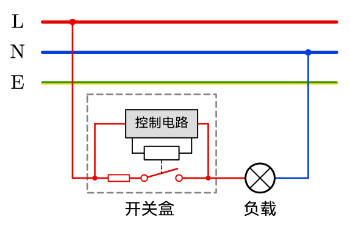

单火开关的控制电路与负载串联。控制电路有一个很高的阻抗，让微弱的电流流过（通常是毫安或微安级），让这个小电流给控制电路供电。由于控制电路阻抗高，分到大部分电压，负载两端电压很小，表现为关闭状态。这种做法无需额外加接零线，适合老房改造。

但是这种做法也有问题。如果负载的功率太小（例如 3W 以下），对应地，负载的阻抗也会比较大，因此与控制电路串联时会分到更多的电压，反应出的现象就是即使开关关闭，灯具也会微亮或闪烁，尤其是对于 LED 灯这种对微小电压也敏感的负载。

曾经单火和零火都是分成两个款式分开卖的，现在小米直接就把二者做进了一款里。开关上有零线的接线孔，如果接零线就按零火模式工作，如果不接就按单火模式工作：

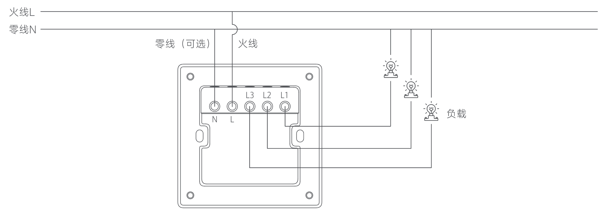

西南八宿舍的灯都是荧光灯，需要高电压才能启动；此外还有一个排气扇，而电动机也基本不受小电流影响，因此完美符合单火方案。剩下的问题就是如何把开关换掉了。

> **警告！**
>
> 更换开关板应由专业电工操作，请勿自行尝试！
>
> 进行操作前应先关闭电闸，请勿带电操作！

反正通过某些方式，我换上了智能开关板：

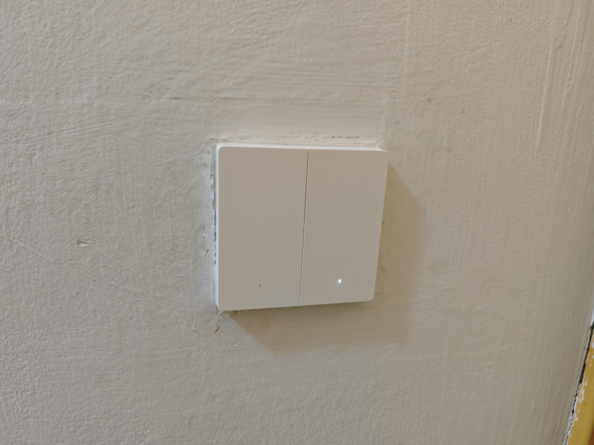

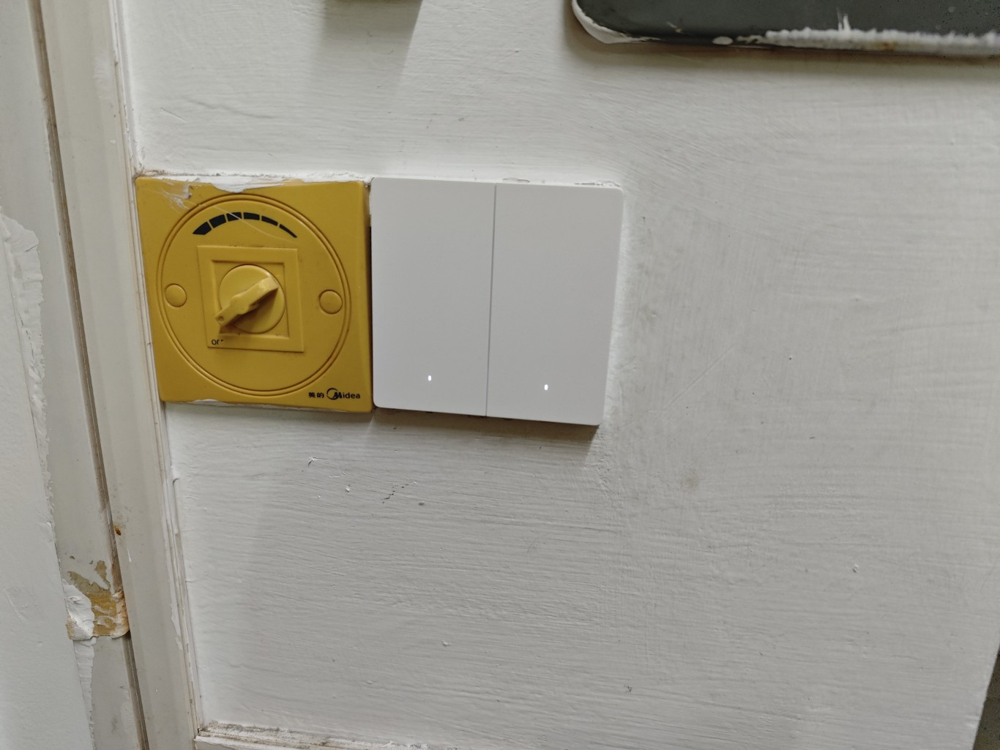

智能开关板是走蓝牙 Mesh 协议的（因为也需要低功耗），在米家 App 中绑定之后接入网关。可以在 App 中自定义每个键对应的设备名称和图标，显示在首页：

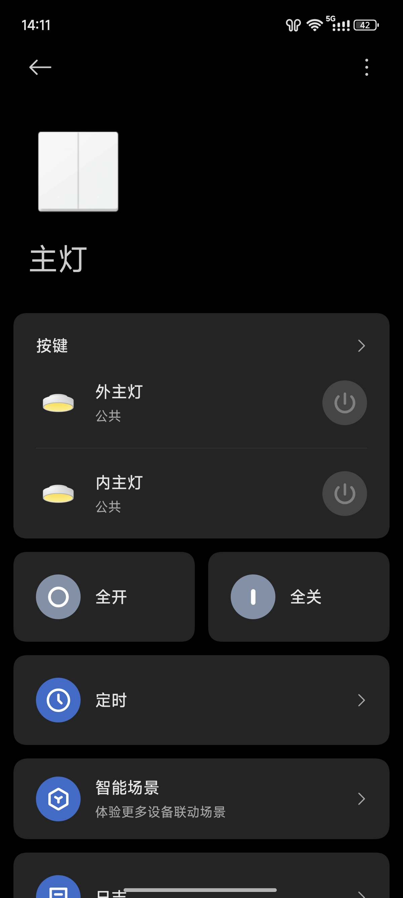

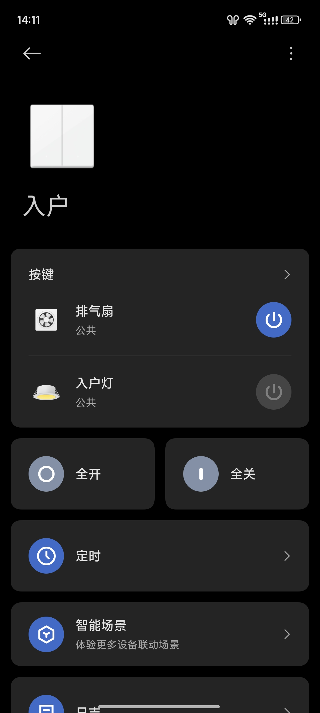

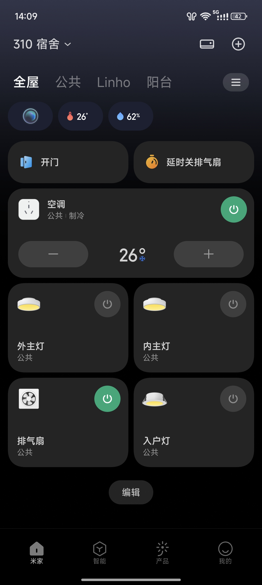

还可以设置一些定时任务：

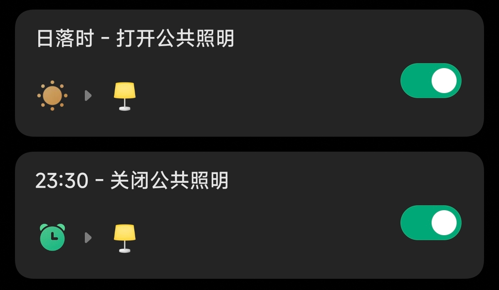

那么至此宿舍的智能化改造已经基本完成了，公共部分所有用电的东西都已联网，我自己桌上的灯也都已联网。暂时没有想到什么新东西，后续如果有的话会接着更。
