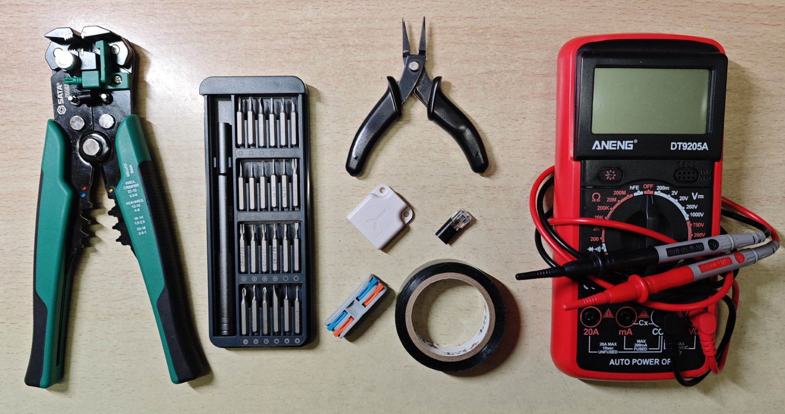

# 宿舍智能家居折腾日志 3：设备改造篇

> 本文首发于 [舟济社区](https://home.tongji.icu/t/topic/2070)。

对于非智能设备，我们之前介绍过可以通过智能插座或者 USB 通断器这类比较成熟的消费品来改造。但是这类产品有两个问题：

- 贵：这好像是我的问题？
- 不够客制化：例如相当多的设备并不是靠控制电源开闭就能实现的，常常有额外的开关等

因此本篇会使用更底层一些的模块来来对现有设备进行改造，实现入网。这就涉及一点点拆接线路。

## 工欲善其事，必先利其器

除了剪刀、美工刀这些人人都有的工具之外，如果你需要干点电工活，强烈建议你购置这些工具：

- 自动剥线钳：握一下就可以把电线的绝缘皮剥下来并且不伤铜丝。露出铜丝之后才能接线或焊线
- 螺丝刀：推荐买可更换刀头的，适应各种类型的螺丝
- 尖嘴钳：夹东西、掰东西都很好用，而且比手指力气更大而且还不会疼。尖嘴钳相比一般的钳子更适合细活
- 接线端子或焊接工具：如果你有焊接的能力和条件，直接焊当然是更好的。如果没法焊接，我们可以用接线端子来接：
  - 低压端子：推荐 D2 接口的免剥接线端子。这种端子只需要确定好正负之后把线塞进去，不需要剥，直接压紧扣上，里面会有刀片自动把线割开并接上。另一头是 D2 接口，不分公母旋转对插，非常灵活方便
  - 市电端子：需要把电线的绝缘层剥开然后夹进去，两头都夹紧就连上了
- 多用电表：高中教过怎么用了

## 市电通断器替换智能插座

我桌面顶上的 LED 灯管是 8 字尾接口供电。所谓的 8 字尾其实就是两脚插换了一个形状，本质仍然是 220V 市电。之前使用的是智能插座来控制通断，比较浪费，一是贵，二是用电计量功能用不着。

因此可以使用一个用于灯具的 Mesh 通断器。这种通断器有两个输入端和两个输出端，均为 220V 交流。剪开 8 字尾供电线并用剥线钳剥去绝缘皮，使用接线端子讲供电线与通断器连接起来，就有了一根带智能通断功能的 8 字尾供电线。同样的道理也适用于其他各类市电供电设备。

使用端子连接后记得扯一扯看有没夹紧，然后用多用表欧姆挡检查是否接通。如果有裸露的铜芯，用电工胶带缠几圈或用热缩膜裹住防止触电或短路。

**注意：市电危险性高，错误接线可能导致触电或火灾，务必在断电状态下操作，并确保接线绝缘良好。**

Mesh 灯具通断器我买的这个只要 16 块钱，比智能插座便宜多了。智能插座我打算后续冬天给电热毯用。

## 智能门锁改造

在前面的文章中我提到我在宿舍门锁上加装了一个开门装置，通过蓝牙连接操作开门。但是这个蓝牙是他们自己的手机 App 用他们自己的协议开门，没有接入米家。为此商家提供了一个 USB 信号发射棒，配对后，使用 USB 给发射棒上电，发射棒发射蓝牙开锁信号，门锁开门。这样就可以通过米家通断器控制发射棒电源，间接实现门锁入网。

问题在于宿舍门口没有插座，因此通断器+发射棒的组合只能装在厕所里，信号被一堵墙挡住，时好时坏。此外有时候出门去公共澡堂时还要多带个手机，我就打算把这套逻辑重构一下，支持米家控制开门和刷卡开门。

整理一下需求：

- 需要在门外布置刷卡装置，门外没有电源因此需要电池供电
- 需要在门附近布置蓝牙信号发射棒
- 刷卡成功后和米家远程操作后，需要向发射棒提供 5V 电压

我找到了这样一个门禁模块：

支持接 NFC 天线刷卡开锁，或者指纹模块指纹开锁，或者两个都接。开锁卡和指纹都可以自行录入。其他的几个接口用途是：

- 输入电源：DC 3.5V-15V 宽电压输入
- 应急电源：应急电源接口电压高于输入时，执行应急开锁
- 解锁按钮：两个电极导通时直接执行开锁
- 输出接口：开锁时输出电压带动负载（电机等），电压等于输入电源电压，输出模式可以通过设置键调整（常开 / 常闭、动作模式、动作时间等）

那这块板就完美符合我们的需求了：

- 有刷卡装置，而且可以自行录入开锁卡
- 有输出，可以接到蓝牙发射棒
- 有解锁干接点，可以接入米家

这里我要解释一下智能干接点这个东西。所谓干接点其实就是两个金属触点，两个触点用导线导通就视为动作状态。步过相比于一般的开关还是有些区别的，干接点通常不用于带负载，只用于维护状态；而开关的话通常负载电流是直接流过开关的。那么智能干接点模块是这样一个东西：它通过蓝牙或 WiFi 入网，通过网络来控制两个触点的导通与否。这样只要是通过干接点控制的设备（例如这里的门锁），我们只要将智能干接点模块装上去，通过网络控制两个触点导通，就可以控制这个设备了。

因此可以这样接线：

我选用的是封装好的 8.4V 锂电池组，从电池出来分成两路分别给门禁模块和智能干接点模块供电。干接点的控制端接在门禁模块的开锁按钮端；门禁模块的输出端接到一个直流降压模块降到 5V，然后接到蓝牙发射棒上。在接上 NFC 天线即可。

这样就有两个控制路径：

- 刷卡：NFC 天线 $\to$ 门禁模块输出 $\to$ 蓝牙发射棒 $\to$ 拉门器开锁
- 网络：米家 $\to$ 干接点模组 $\to$ 门禁模块输出 $\to$ 蓝牙发射棒 $\to$ 拉门器开锁

我没有选用指纹模组，因为一般出门都会带校园卡或者智能手环，都可以刷；而便宜的指纹模块容易出各种问题，贵的指纹模块太贵，遂作罢。

接线实物如图：

现在商家发的模块上面都是焊好线或者接口的，这里我用的是 D2 接线端子，把线塞进去夹上就可以把一对导线变成 D2 接口，插上拔掉都很方便。D2 是一种常见的弱电接线端子标准（旋转插拔，不分公母），淘宝上很容易买到。当然如果你会焊接的话也可以。

那么剩下的故事就是如何把这堆东西放到门口去了。我用了一个透明塑料盒，把这些全部塞进去然后粘在门口：

这样就完成了一套既有刷卡能力、又有在线控制能力的门锁。要知道成品智能门锁基本都要五百块钱以上，正常价位是几千块钱。

唯一一点问题就是刷卡开锁不会在米家留下日志记录。如果你门口有供电条件，也可以采取这样的思路：

- 仍然插电使用 USB 通断器控制蓝牙发射棒
- 在门外使用电池组、门禁模块和 NFC 天线，不同的是输出端换成米家电压反馈模块
- 在米家设置自动化，有电压反馈时让 USB 通断器给蓝牙发射棒供电

这里的米家电压反馈模块，你可以理解为一个电压传感器，门禁模块动作时给输出端提供电压，电压反馈模块就会在米家上报一个事件，可以用这个事件来触发自动化。理论上来说这个方案会更通用一点，因为任意可以通过米家控制的设备都可以被这个触发。

## 小结

这里相当于提供了几个例子。因为干接点、通断器等是相当多设备的控制手段，因此购买这种控制板或者控制器并自己进行一些简单的接线操作，就可以花不多的成本将普通设备智能化并接入米家。完全可以在宿舍行动起来。

接下来还会更新一期有关网络配置的，敬请期待。
