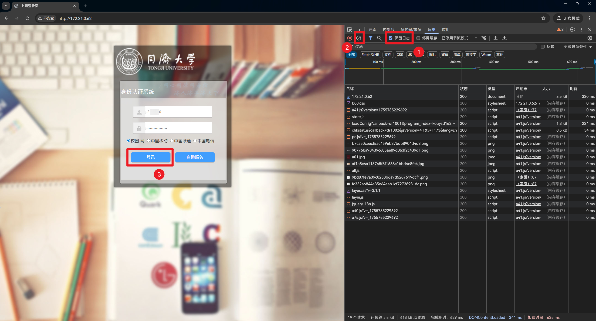
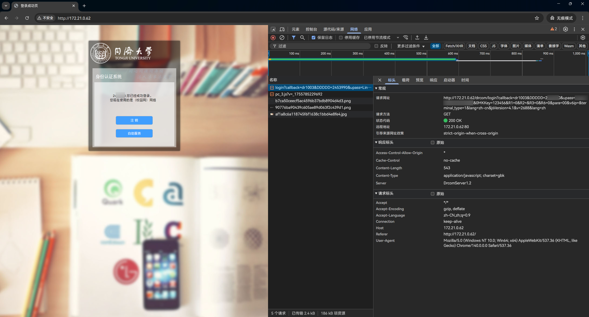
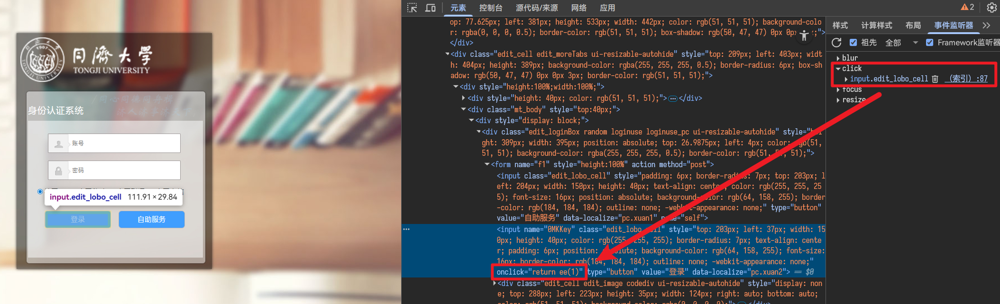
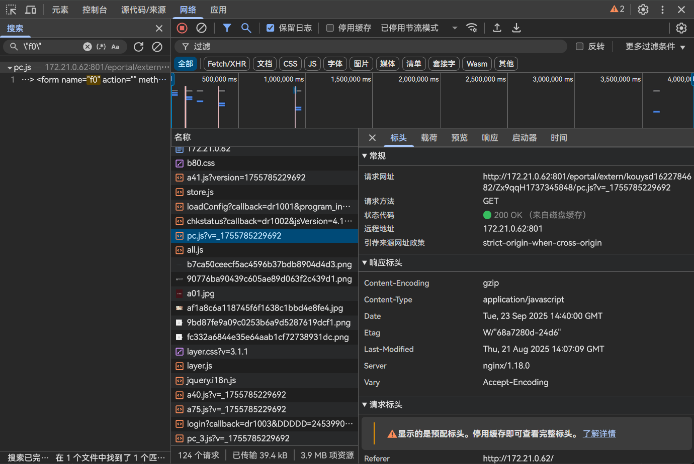

# 宿舍智能家居折腾日志 4：网络进阶篇

> 本文首发于 [舟济社区](https://home.tongji.icu/t/topic/2070)。

前面提到，我在宿舍用一个百来块钱的路由器连接了学校的 TJ-WIFI 网络，并给出一个 WPA-2 Personal 的网络供智能家居设备接入。但是可能是这路由器太菜了，网络经常掉线，因此我买了一个新路由器来中继。

还有一个问题是 TJ-WIFI 是 WPA2-Enterprise PEAP 认证，相当多的路由器的控制面板没有办法设置中继这种认证方式。因此我们这篇考虑一下宿舍区的另一个网络 TJ-DORM-WIFI。

TJ-DORM-WIFI 是 WebUI（Portal）认证的形式登录，原理大概就是你在页面上登录之后，网络就会对你这个设备放行。因此不需要路由器有某些特殊能力，只需要路由器连接网络，手机/电脑连接路由器，在手机/电脑上完成登录操作，路由器整体就会被放行联网。

但是网络不稳定或超时都会导致登录过期等问题，路由器被踢下线。此时又要重新登上去登录。很麻烦。所以可以考虑研究一下这个 WebUI 的认证原理，看看能不能实现自动化认证。

## 宿舍网络 Portal 登录原理

接下来需要一点点 JS 调试知识，但是别担心，我们一步一步来。欢迎各位在宿舍打开电脑和我一起做，体验一下沉浸式调试。

> **本篇以学习/自动化运维为目的，不鼓励用于未授权的滥用**。

首先登录这个动作肯定是要发送某个网络请求，我们先来看这个网络请求长什么样。打开登录页面并输入账号密码。先别急着点登录按钮，按下 F12 打开开发人员工具，转到「网络」选项卡，然后：

1. 勾选「保留日志」，防止页面跳转导致记录丢失
2. 点击「清除网络日志」按钮（一般是图标🚫），清除掉前面的，我们只关注按下登录按钮之后的请求
3. 按下登录按钮，观察请求





按下登录之后的第一条请求看上去就很像，请求地址是 `http://172.21.0.62/drcom/login?<query>`，其中 `<query>` 参数如下：

| Key           | Value          |
| ------------- | -------------- |
| callback      | dr1003         |
| DDDDD         | `<校园网账号>` |
| upass         | `<校园网密码>` |
| 0MKKey        | 123456         |
| R1            | 0              |
| R2            |                |
| R3            | 0              |
| R6            | 0              |
| para          | 00             |
| v6ip          |                |
| terminal_type | 1              |
| lang          | zh-cn          |
| jsVersion     | 4.1            |
| v             | 5523           |
| lang          | zh             |

这些参数只有账号密码是我们输进去的，而且是明文，其他的一些参数不太清楚是什么意思。而且 `lang` 先后出现了两次。那接下来我们来看源码，看看这些参数是从哪里来的。

注销，然后刷新页面。这样我们就回到了登录之前的状态。

右键登录按钮选择「检查」（或者在元素选项卡点击左上角的检查按钮并选中登录按钮），转到「事件侦听器」选项卡，展开 `click` 事件。发现这个按钮只绑定一个事件侦听器，而且是直接定义在元素行内的 `onclick="return ee(1)"`。那很明显线索就是函数 `ee`。



转到「控制台」选项卡，输入 `ee` 并回车，果然返回一个函数：

```
ƒ ee(form_id){var form;if(form_id==1){form=window.f1;}else if(form_id==2){form=window.f2;}else if(form_id==3){form=window.f3;}else if(form_id==4){form=window.f4;}else if(form_id==5){if(!util.isValidMob…
```

点击这行函数输出，DevTools 会自动转到其源代码所在位置，为 `http://172.21.0.62/a40.js`，这里我们只看关键部分：

```js
;function ee(form_id) {
  var form;
  if (form_id == 1) {
    form = window.f1;
  } // else if ... else if ...
  } else {
    _alert(lang('没有任何提交'));
    return false;
  }
  // ...
  var checkIPv6AndLogin = function() {
    // ...
  }
  if (form_id == 4 && $('input[name=authorize]')[0] && $('input[name=authorize]')[0].style.display != 'none') {
    visitor.checkUserAuditState(form.DDDDD.value, checkIPv6AndLogin);
  } else {
    checkIPv6AndLogin()
  }
  return false;
}
```

好那么这里调用的是 `ee(1)`，因此 `if (form_id == 4 && ...)` 不会走进去，会走到 `else` 里面去。

不过呢这属于比较费脑子的做法，**在 DevTools 可以直接打断点调试**，何乐而不为呢。在 `visitor.checkUserAuditState` 和 `checkIPv6AndLogin()` 两个分支上都打上断点，然后登录，调试器就会停在 `checkIPv6AndLogin()` 这里。我们步入（因为后面没东西了，有就是在这里面）。

```js
var checkIPv6AndLogin = function () {
  if (enablev6 && term.ipv6 == "") {
    // ...
  } else {
    login.init(form);
  }
};
```

现在停在 `if` 这里，我们单步步过，发现进入了 `else`，那我们步入这个 `login.init(form)`：

```js
init: function(form) {
  this.form = form;
  this.tempAccountSuffix = this.getTempAccountSuffix();
  var ioModeEle = $('[name="checkIOMode"]')[0]
  if (page.login_method != 0 && ioModeEle) {
    if (ioModeEle.checked) {
      this.accountPrefix = parseInt(ioMode) == 0 ? '' : '_'
    } else {
      this.accountPrefix = parseInt(ioMode) == 0 ? '__' : ''
    }
  } else {
    if (customPerceive == 1)
      this.accountPrefix = accountPrefix == 1 ? (term.type != 2 ? ',b,' : ',a,') : "";
    else
      this.accountPrefix = accountPrefix == 1 ? (term.type != 2 ? ',0,' : ',1,') : "";
  }
  autoLogin.set(form);
  savePassword.set(form);
  this.setISP();
  this.login();
},
```

看到这里的 `this.setISP()` 和 `this.login()` 好像有点意思，我们在这两行各打一个断点，然后直接继续到断点，步入

```js
setISP: function() {
  var me = this;
  var set = function(value) {
    if (page.login_method == 0 && enableR3 == 1) {
      document.f0.R3.value = value;
    } else {
      me.tempAccountSuffix = value;
    }
  }
  if ($('select[name=ISP_select]')[0]) {
    set($('select[name=ISP_select] option:selected').val());
  } else if ($('div[name=ISP_radio]')[0]) {
    set($('div[name=ISP_radio] input[name=network]:checked').val());
  }
  return false;
},
```

`setISP` 没有我们要找的，直接步出，到 `this.login()` 步入

```js
login: function(success, fail) {
  this.account = term.account = this.form.DDDDD.value + this.tempAccountSuffix;
  this.prefixAccount = this.accountPrefix + this.form.DDDDD.value + this.tempAccountSuffix;
  cookie.set('DDDDD', II(escape(this.account)));
  cookie.set('upass', II(escape(this.form.upass.value)));
  cookie.set('mac', term.mac);
  qrCode.stop = true;
  this.default_login(success, fail);
},
```

初见端倪。这里就出现了 `DDDDD -> 账户`、`upass -> 密码` 的对应关系。这里只是在设置 cookie，现在要去 `this.default_login` 里看做了什么。在这一行打断点，继续执行，然后步入：

```js
default_login: function(success, fail) {
  page.login_method = 0;
  var f0 = document.f0;
  var upass = this.form.upass.value;
  if (page.en_md5) {
    upass = calcMD5(PID + upass + CALG) + CALG + PID;
  }
  term.ispid = f0.R3.value;
  var data = {
    'DDDDD': this.account,
    'upass': upass,
    '0MKKey': 123456,
    R1: f0.R1 ? f0.R1.value : '',
    R2: page.en_md5 ? 1 : '',
    R3: f0.R3 ? f0.R3.value : '',
    R6: f0.R6 ? f0.R6.value : 0,
    para: f0.para ? f0.para.value : '',
    v6ip: f0.v6ip ? f0.v6ip.value : ''
  };
  var ioModeEle = $('[name="checkIOMode"]')[0]
  if (ioModeEle) {
    data.R10 = ioModeEle.checked ? 1 : 0;
  }
  if (enPerceive >= 1)
    data.R7 = customPerceive;
  this.portal_login(data, success, fail);
},
```

这里就把我们刚刚看到的那些信息组装起来了，呈现为 `data` 对象。这个 `f0` 很奇怪，步过到 `var f0` 那句之后，我们在右侧的作用域 - 本地中可以看到 `f0` 指向一个 `form` 元素，点开发现是这样的：

```html
<div style="display: none" class="">
  <form name="f0" action="" method="post">
    <input name="DDDDD" type="hidden" value="" style="null" />
    <input name="upass" type="hidden" value="" style="null" />
    <input name="R1" type="hidden" value="0" style="null" />
    <input name="R2" type="hidden" value="0" style="null" />
    <input name="R3" type="hidden" value="0" style="null" />
    <input name="R6" type="hidden" value="0" style="null" />
    <input name="para" type="hidden" value="00" style="null" />
    <input name="0MKKey" type="hidden" value="123456" style="null" />
    <input name="buttonClicked" type="hidden" value="" style="null" />
    <input name="redirect_url" type="hidden" value="" style="null" />
    <input name="err_flag" type="hidden" value="" style="null" />
    <input name="username" type="hidden" value="" style="null" />
    <input name="password" type="hidden" value="" style="null" />
    <input name="user" type="hidden" value="" style="null" />
    <input name="cmd" type="hidden" value="" style="null" />
    <input name="Login" type="hidden" value="" style="null" />
    <input name="v6ip" type="hidden" value="" style="null" />
  </form>
</div>
```

一个被 `display: none` 隐藏起来的表单？而且 `R1` `R3` `R6` `para` `v6ip` 这几个属性都来自于这个表单，右键查看网页原始 HTML 发现没几个元素，实际上都是访问的时候通过 JS 装载的，那这个表单也是 JS 生成的，那一会儿再看。然后 `0MKKey` 是写死的 `123456`，不知何意。

这里还有一个细节是 `page.en_md5` 开关。如果这个开关为真，那密码会被 MD5 哈希一遍。但是我们刚刚看到请求中的密码是明文，因此这个开关是没有打开的。

> 在 a41.js 中有：
>
> ```js
> var page = {
>   // ...
>   // MD5 加密认证
>   en_md5: 0,
>   // ...
> };
> ```
>
> 是写死不做 MD5的。

看上去这一段关键在于 `this.portal_login(data, success, fail);`。直接打断点，继续，步入：

```js
portal_login: function(data, success, fail) {
  layer.msg(lang('正在登录...'));
  data.terminal_type = term.type;
  data.lang = language.lang.toLowerCase();
  var url = (page.login_method == 0 ? page.path : page.portal_api) + 'login';
  util._jsonp({
    url: url,
    data: data,
    success: function(json) {
      if (json.result == 1 || json.result == 'ok') {
        if (success) {
          success(json);
        } else {
          // ...
        }
      } else {
        if (fail) {
          fail(json)
        } else {
          // ...
        }
      }
    },
    error: function(error) {
      _alert(lang('认证方法调用出现异常，请刷新页面重试！'));
    }
  });
},
```

出现了 `_util.jsonp` 函数，还有回调。这里需要一点小知识，`jsonp` 是一种比较老的网络请求模式，因此请求相关代码就在里面。打断点、继续、步入：

```js
_jsonp: function (params) {
  var me = this;
  var lang = store.get("i18n_lang") == "en" ? "en" : "zh";
  //格式化参数
  var formatParams = function (data) {
    var arr = [];
    for (var name in data) {
      if (name == 'callback') {
        arr.unshift(encodeURIComponent(name) + '=' + encodeURIComponent(data[name]));
      } else {
        arr.push(encodeURIComponent(name) + '=' + encodeURIComponent(data[name]));
      }
    };
    // 添加一个随机数，防止缓存
    arr.push('v=' + random());
    // 添加中英文标识
    arr.push('lang=' + lang);
    return arr.join('&');
  };
  // 获取随机数
  var random = function () {
    return Math.floor(Math.random() * 10000 + 500);
  };

  params = params || {};
  params.data = params.data || {};

  // jsonp请求
  //创建script标签并加入到页面中
  var callbackName = 'dr' + me.increment(); // 自定义 callbackName
  var head = document.getElementsByTagName('head')[0];
  // 设置传递给后台的回调参数名
  params.data['callback'] = callbackName;
  // 默认带上 jsVersion
  params.data['jsVersion'] = jsVersion;
  var data = formatParams(params.data);
  var script = document.createElement('script');
  head.appendChild(script);
  //创建jsonp回调函数
  window[callbackName] = function (json) {
    head.removeChild(script);
    clearTimeout(script.timer);
    window[callbackName] = null;
    params.success && params.success(json);
  };
  //发送请求
  script.src = params.url + (params.url.indexOf('?') > 0 ? '&' : '?') + data;
  //为了得知此次请求是否成功，设置超时处理
  if (params.time) {
    script.timer = setTimeout(function () {
      window[callbackName] = null;
      head.removeChild(script);
      params.error && params.error({
        message: '超时'
      });
    }, params.time);
  }
},
```

那结束了，非常经典的 JSONP 模式请求，那就是把刚才那串 `data` 给送出去了。JSONP 的回调以 `dr` 开头，后面是一个自定义的数字。至于回调怎么样已经不太重要了——反正登录上了。有关 JSONP 是什么，可以自己上网搜一下或者问 AI。

这里也解释了为什么会出现两次 `lang`。在前面组装 `data` 的时候塞了一个 `lang` 进去，这里发送 JSONP 的时候又塞了一个 `lang` 进去。

那么这些参数的含义就要去看这个 `<form name="f0" action="" method="post">` 是从哪里冒出来的了。转到 DevTools 的网络选项卡，点开查找面板（注意不是「过滤」输入框）尝试搜索 `\"f0\"`，还真找到了而且只有一个：



打开来之后我真服了：

```js
var bodyContent =
  '<body><div id="center"><div id="edit_body" style="width:1200px;" class="">         <div style="display: none;" class="">             <form name="f0" action="" method="post">                 <input name="DDDDD" type="hidden" value="">                 <input name="upass" type="hidden" value="">                 <input name="R1" type="hidden" value="0">                 <input name="R2" type="hidden" value="0">                 <input name="R3" type="hidden" value="0">                 <input name="R6" type="hidden" value="0">                 <input name="para" type="hidden" value="00">                 <input name="0MKKey" type="hidden" value="123456">                 <input name="buttonClicked" type="hidden" value="">                 <input name="redirect_url" type="hidden" value="">                 <input name="err_flag" type="hidden" value="">                 <input name="username" type="hidden" value="">                 <input name="password" type="hidden" value="">                 <input name="user" type="hidden" value="">                 <input name="cmd" type="hidden" value="">                 <input name="Login" type="hidden" value="">                 <input name="v6ip" type="hidden" value="">             </form>         </div>...';
```

也就是说这玩意就是写死的。那结束了。从头到尾只有账号和密码是自己输入的。那我们可以解释一下前面各种参数的含义了：

| Key           | Value          | 解释                              |
| ------------- | -------------- | --------------------------------- |
| callback      | dr1003         | JSONP 的回调函数名                |
| DDDDD         | `<校园网账号>` | 校园网账号                        |
| upass         | `<校园网密码>` | 校园网密码                        |
| 0MKKey        | 123456         | 写死的 magic value                |
| R1            | 0              | 写死的 magic value                |
| R2            |                | 密码是否使用 MD5，写死的          |
| R3            | 0              | 写死的 magic value                |
| R6            | 0              | 写死的 magic value                |
| para          | 00             | 写死的 magic value                |
| v6ip          |                | 写死的 magic value                |
| terminal_type | 1              | 写死的 magic value                |
| lang          | zh-cn          | `portal_login` 函数插入的语言标识 |
| jsVersion     | 4.1            | 前端版本号                        |
| v             | 5523           | 生成的随机值，避免缓存            |
| lang          | zh             | `_jsonp` 函数插入的语言标识       |

也就是说只需要把账号密码写好并 `encodeURIComponent`，这个 URL：

```url
http://172.21.0.62/drcom/login?callback=dr<数字》&DDDDD=<账号>&upass=<密码>&0MKKey=123456&R1=0&R2=&R3=0&R6=0&para=00&v6ip=&terminal_type=1&lang=zh-cn&jsVersion=4.1&v=<随机数>&lang=zh
```

发一个 GET 请求就完成了登录。这里我们可以先在浏览器中尝试一下。先注销掉，然后再控制台中执行：

```js
const account = `<账号>`;
const passwrd = `<密码>`;
await fetch(
  `http://172.21.0.62/drcom/login?callback=dr1003&DDDDD=${encodeURIComponent(account)}&upass=${encodeURIComponent(passwrd)}&0MKKey=123456&R1=0&R2=&R3=0&R6=0&para=00&v6ip=&terminal_type=1&lang=zh-cn&jsVersion=4.1&v=2345&lang=zh`
);
```

刷新，发现已经登录成功。说明我们总结出来的这个没有问题。完全可以基于这个结果来做自动化了。

## 自动化登录

我们可以这样做：

- 在连上网络时，自动发送一次登录请求
- 设置一个 interval，例如每五分钟检查一次网络连接（例如 `ping 1.1.1.1`），如果网络断开，就发送登录请求

那么我们就需要一个设备，它有发送网络请求的能力，且与路由器长期连接。其实路由器自己就能做到这一点，问题在于你能不能把自己的脚本放进去。我的路由器是刷了 OpenWrt 的，因此我们接下来就以 OpenWrt 路由器为例来介绍自动化登录的构建。

接下来的工作完全可以问 ChatGPT 了。这里我把我问到并配好的流程整理一下提供出来，可以直接抄作业。

### 自动登录脚本

那么要自动登录，账号和密码就得保存在路由器上，这是必要之恶。因此我们考虑将账号密码等配置信息放在专门的配置文件里并限制文件权限。例如放在 `/etc/drcom.conf`

```ini
# /etc/drcom.conf
# Minimal required fields:
LOGIN_URL="http://172.21.0.62/drcom/login"
CALLBACK="dr1003"
UID="<账号>"
PASS="<密码>"
MKKEY="123456"
R1="0"
R2=""
R3="0"
R6="0"
PARA="00"
V6IP=""
TERMINAL_TYPE="1"
LANG="zh-cn"
JSVERSION="4.1"
V="9970"
OTHER_PARAMS=""
```

然后我们

```sh
chmod 600 /etc/drcom.conf
```

接下来完成登录脚本，这里要注意对参数执行 URL 转义。在 `/usr/bin/campus_login.sh`：

```sh
#!/bin/sh
# /usr/bin/campus_login.sh
# 简单校园 webui 登录脚本：读取 /etc/drcom.conf

CONF=/etc/drcom.conf
LOG=/var/log/campus_login.log

# load config
[ -r "$CONF" ] || {
  echo "$(date -Iseconds) ERROR: missing $CONF" >> "$LOG"
  exit 2
}
. "$CONF"

# required vars in /etc/drcom.conf:
# LOGIN_URL="http://172.21.0.62/drcom/login"
# UID="<账号>"
# PASS="<密码>"
# OTHER_PARAMS="&R1=0&R2=&R3=0..."   # 以 & 开头的额外 GET 参数（可选）

# check basic vars
[ -n "$LOGIN_URL" -a -n "$UID" -a -n "$PASS" ] || {
  echo "$(date -Iseconds) ERROR: config incomplete" >> "$LOG"
  exit 3
}

# helper: test internet (try a site that normally returns 204 or 200).
# If campus has captive portal, typical external URL will be redirected => treat as "not connected".
check_online() {
  # Prefer ping to reliable IP to avoid portal redirection ambiguity
  ping -c 2 -W 2 1.1.1.1 >/dev/null 2>&1 && return 0
  return 1
}

# encode password/uid safely: use curl --get --data-urlencode if available
do_login_with_curl() {
  # Build query string. Adjust callback/params if needed.
  # Note: original campus used callback=dr1003 and many params; supply essential ones.
  curl --silent --show-error --max-time 10 --get \
    --data-urlencode "callback=$CALLBACK" \
    --data-urlencode "DDDDD=$UID" \
    --data-urlencode "upass=$PASS" \
    --data-urlencode "0MKKey=$MKKEY" \
    --data-urlencode "R1=$R1" \
    --data-urlencode "R2=$R2" \
    --data-urlencode "R3=$R3" \
    --data-urlencode "R6=$R6" \
    --data-urlencode "para=$PARA" \
    --data-urlencode "v6ip=$V6IP" \
    --data-urlencode "terminal_type=$TERMINAL_TYPE" \
    --data-urlencode "lang=$LANG" \
    --data-urlencode "jsVersion=$JSVERSION" \
    --data-urlencode "v=$V" \
    "${LOGIN_URL}" 2>>"$LOG"
}

do_login_with_wget() {
  # naive wget fallback: build URL-encoded string manually (note: careful with special chars)
  # This is less safe for complex passwords; prefer curl.
  encoded_pass=$(echo -n "$PASS" | od -An -tx1 | awk '{for(i=1;i<=NF;i++)printf "%%%s", $i}' | tr '[:upper:]' '[:lower:]')
  # Minimal set of params; extend if campus requires more.
  url="${LOGIN_URL}?callback=${CALLBACK}&DDDDD=${UID}&upass=${encoded_pass}&0MKKey=${MKKEY}&R1=${R1}&R2=${R2}&R3=${R3}&R6=${R6}&para=${PARA}&v6ip=${V6IP}&terminal_type=${TERMINAL_TYPE}&lang=${LANG}&jsVersion=${JSVERSION}&v=${V}${OTHER_PARAMS}"
  wget -qO- --timeout=10 --tries=1 "$url" 2>>"$LOG"
}

# perform login
echo "$(date -Iseconds) INFO: login attempt" >> "$LOG"
if command -v curl >/dev/null 2>&1; then
  do_login_with_curl
  rc=$?
else
  do_login_with_wget
  rc=$?
fi

if [ $rc -eq 0 ]; then
  echo "$(date -Iseconds) INFO: login request sent (rc=$rc)" >> "$LOG"
else
  echo "$(date -Iseconds) WARN: login request failed (rc=$rc)" >> "$LOG"
fi

# optional: check online after login
sleep 2
if check_online; then
  echo "$(date -Iseconds) INFO: network reachable after login" >> "$LOG"
  exit 0
else
  echo "$(date -Iseconds) WARN: still offline after login" >> "$LOG"
  exit 1
fi
```

然后我们

```sh
chmod 700 /usr/bin/campus_login.sh
```

### 自动化触发

#### 在接口 up 时自动触发（hotplug）

把一个小 hook 放 `/etc/hotplug.d/iface/90-drcom`，在 `wwan` up 时调用脚本：

```sh
#!/bin/sh
# /etc/hotplug.d/iface/90-drcom
[ "$INTERFACE" = "wwan" ] || exit 0
[ "$ACTION" = "ifup" ] || exit 0

# 延迟一点再登录，保证 DHCP 完成
sleep 3
/usr/bin/campus_login.sh &
exit 0
```

保存后：

```sh
chmod 755 /etc/hotplug.d/iface/90-drcom
```

#### 定时保活（cron）

在 OpenWrt 编辑根 crontab（`/etc/crontabs/root`），每 5 分钟检查一次并重试登录（只在不可达时执行）：

编辑 `/etc/crontabs/root`，加一行：

```
*/5 * * * * /usr/bin/campus_keepalive.sh >/dev/null 2>&1
```

并写一个简单的 `campus_keepalive.sh`（放 `/usr/bin/campus_keepalive.sh`）：

```sh
#!/bin/sh
LOG=/var/log/campus_login.log
check_online() {
  ping -c 2 -W 2 1.1.1.1 >/dev/null 2>&1 && return 0
  return 1
}
# only run if wwan is up
if ifstatus wwan >/dev/null 2>&1; then
  if ! check_online; then
    echo "$(date -Iseconds) keepalive: offline, attempting login" >> /var/log/campus_login.log
    /usr/bin/campus_login.sh
  fi
fi
```

然后设置权限并重启 cron：

```sh
chmod 700 /usr/bin/campus_keepalive.sh
/etc/init.d/cron restart
```

好了那么我们就完成了自动化配置，要查看日志，只需要：

```sh
cat /var/log/campus_login.log
```

这样我们就实现了一套完整的，可以自动化登录 TJ_DORM_WIFI Portal 的解决方案，目前我在我的宿舍尝试之后，比原来的 TJ-WIFI 稳定很多。

此外要再提醒一下：**不要把自己的账号和密码发出来**！
