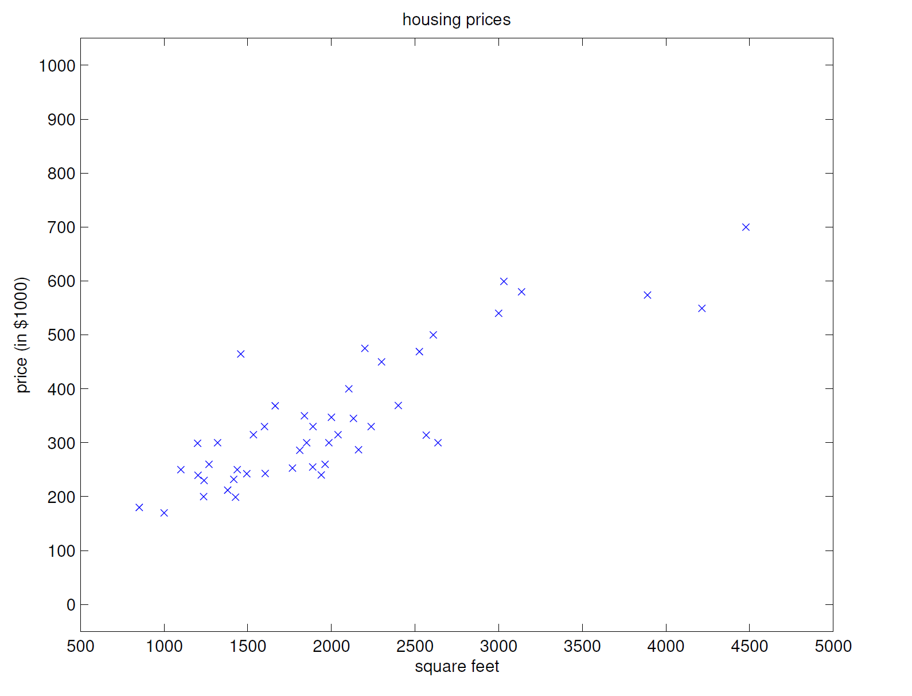

# 1.1 线性回归

假设我们有一个有关 47 间房子的居住面积和价格的数据集：

| 居住面积（平方英尺） | 价格（1000 $） |
| -------------------- | -------------- |
| 2104                 | 400            |
| 1600                 | 330            |
| 2400                 | 369            |
| 1416                 | 232            |
| 3000                 | 540            |
| $\vdots$             | $\vdots$       |

将其可视化如下：



我们的目标是：给定这样的数据集，我们应该如何预测其他房子的价格，也就是说，我们应该给出怎样的预测函数？

以下列举一些记号和术语，方便之后的讨论：

- 我们使用上标来表示训练数据，其中 $x^{(i)}$ 表示第 $i$ 个输入数据或输入特征 (input **features**)，$y^{(i)}$ 表示第 $i$ 个输出数据或目标变量 (**target** variables)；

- 一对 $(x^{(i)}, y^{(i)})$ 称为一个**训练样本**，而训练样本构成的数据集 $\set{(x^{(i)}, y^{(i)}) \mid i = 1, 2, \cdots, n}$ 被称为**训练集**；

- 一般用 $\mathcal X$ 表示输入数据的集合 $\mathcal{X} = \set{x^{(i)} \mid i = 1, 2, \cdots, n}$，一般用 $\mathcal Y$ 表示输出数据的集合 $\mathcal Y = \set {y^{(i)} \mid i = 1, 2, \cdots, n}$.

  在上例中，$\mathcal X = \mathcal Y = \mathbb R$.

- 利用上面的术语，我们可以给有监督学习一个更加正式的表述：给定训练集，我们需要学习获得一个函数 $h: \mathcal X \mapsto \mathcal Y$，使得 $h(x)$ 是 $y$ 的良好预测。由于历史原因，这个函数 $h$ 被称为**假设函数** (hypothesis)。上面讲述的过程可以用如下的流程图表示：

  ```mermaid
  graph TD
      %% 纵向流程 - 训练部分
      A[Training set] --> B[Learning algorithm]
      B --> H[h]
      
      %% 横向流程 - 预测部分
      subgraph 预测流程
          direction LR
          X[x] --> H
          H --> Y[predicted y]
      end
      
      %% 样式定义
      class A,B training
      class X,Y prediction
      class H model
      classDef training fill:#e6f7ff,stroke:#1890ff,stroke-width:2px
      classDef prediction fill:#f6ffed,stroke:#52c41a,stroke-width:2px
      classDef model fill:#fff2e8,stroke:#fa8c16,stroke-width:3px
  ```

  

- 如果我们想要预测的目标变量是一个连续随机变量，我们就把这类学习问题称作**回归**问题 (regression problem)；若目标变量是离散随机变量，则称这类学习问题为 (classification problem)。

## 线性回归

为了让我们的学习问题更加有趣，我们引入更加丰富的训练集：

| Living area (feet$^2$) | bedrooms | Price (1000$s) |
| ---------------------- | -------- | -------------- |
| 2104                   | 3        | 400            |
| 1600                   | 3        | 330            |
| 2400                   | 3        | 369            |
| 1416                   | 2        | 232            |
| 3000                   | 4        | 540            |
| $\vdots$               | $\vdots$ | $\vdots$       |

在这里，$x$ 是 $\mathbb R^2$ 中的二维向量：$x_1^{(i)}$ 表示第 $i$ 个训练样本的第一个分量（房子的面积），$x_2^{(i)}$ 表示第 $i$ 个训练样本的第二个分量（卧室数）。事实上，我们完全可以自由地选择使用什么输入特征进行学习，而特征的选取也是一个相当重要的话题，不过在此我们假设输入特征是给定的，以便于接下来的讨论。

为实施有监督学习，我们需要一个假设函数 $h$，在此处我们选择线性函数作为假设函数：
$$
h_{\theta} (x) = \theta_0 + \theta_1 x_1 + \theta_2 x_2.
$$
在此处，$\theta_i$ 被称为参数或权值 (parameters / weights)。如无歧义，我们可以丢弃下标 $\theta$，简记为 $h(x)$. 为简化我们的表达式，我们引入 $x_0 = 1$，因此从向量内积的角度看，上式可重写为
$$
h(x) = \sum_{i = 0}^{d} \theta_i x_i = \theta^{\text T} x,
$$
其中右端的 $\theta$ 是参数向量/权值向量，$x$ 是输入向量，$d$ 是输入特征数（不包含 $x_0$）。

现在，我们所需要做的就是找到 $\theta$ 的表达式，使得我们的假设函数 $h(x)$ 尽可能地接近 $y$. 为量化表示“接近”这一概念，我们定义**代价函数** (cost function)：
$$
J(\theta) = \frac{1}{2} \sum_{i = 1}^{n} (h_{\theta} (x^{(i)}) - y^{(i)})^2.
$$
我们的目标就是找到一个 $\theta$，使得 $J(\theta)$ 取得最小值。然后，取这个 $\theta$ 作为我们假设函数的参数向量。

### LMS 算法

我们可以使用一种算法，它从某个初始猜测值 $\theta$ 出发，然后不断地改变 $\theta$，使得 $J(\theta)$ 不断减小，直到 $\theta$ 能够收敛到某个确定的 $\theta_{\star}$. 我们可以考虑**梯度下降**算法 (gradient descent algorithm)，这个算法秉承着上面的思路，对 $\theta$ 不断进行更新：
$$
\theta_j := \theta_j - \alpha \frac{\partial}{\partial \theta_j} J(\theta).
$$

> [!warning]
>
> - 在接下来的所有语境中，我们用 $a := b$ 表示把 $b$ 赋值给 $a$，而用 $a = b$ 表示 $a$ 和 $b$ 相等。这是符合数学传统规定的。
> - 上式同时对所有 $j = 0, \cdots, d$ 执行。
> - $\alpha$ 称为学习率。

现在，我们只需计算 $J(\theta)$ 的各阶偏导数即可。由于 $J(\theta)$ 中有求和项，为了讨论的便利，我们先假设 $n = 1$，即我们只有一个训练样本，这样我们就可以忽略其中的求和符号：
$$
\begin{align}
\frac{\partial}{\partial \theta_j} J(\theta) &= \frac{\partial}{\partial \theta_j} \frac{1}{2} (h_{\theta}(x) - y)^2 \\
&= 2 \cdot \frac{1}{2}(h_{\theta}(x) - y) \cdot \frac{\partial}{\partial \theta_j} (h_{\theta}(x) - y) \\
&= (h_{\theta}(x) - y) x_j.
\end{align}
$$
因此对单个训练数据，我们的更新方法是：
$$
\theta_j := \theta_j + \alpha (y - h_{\theta}(x)) x_j
$$
这一法则称为 LMS 更新法则 (least mean squares)，也被称为 Widrow-Hoff 学习法则。我们可以发现，这一更新公式与误差项成比例：误差越大，需要更新的越多；反之越少。

对上面这个公式，如果我们将其写成向量的形式，可有：
$$
\theta := \theta + \alpha (y - h_{\theta}(x)) x.
$$
而对于由多个训练样本组成的训练集，我们有两种方式处理：

#### 方式一：批量梯度下降

利用
$$
\theta = \theta + \alpha \sum_{i = 1}^{n} (y^{(i)} - h_{\theta}(x^{(i)})) x^{(i)}.
$$
一次性处理训练集中的所有训练样本。这种方法的正确性是显然的：对于有限个训练样本，求和和求偏导显然是可以交换次序的（当然，无限项就需要斟酌是否能够交换次序了，一般来说和级数的一致收敛性相关）。这种方法被称为**批量梯度下降法** (batch gradient descent)。

> [!note]
>
> 批量梯度下降法的优缺点如下：
>
> - 优点：收敛稳定；
> - 缺点：计算开销大，在完成所有样本的计算之后才能更新参数。

#### 方式二：随机梯度下降

算法如下：
$$
\begin{align}
&\text{Loop} \{ \\
	& \quad \text {for } i = 1 \text{ to } n, \{ \\
		& \quad \quad \theta_j := \theta_j + \alpha (y^{(i)} - h_{\theta}(x^{(i)})) x_j^{(i)}, \text{ for every} j \\
	& \quad \} \\
&\}
\end{align}
$$
这种算法被称为随机梯度下降。

> [!note]
>
> 随机梯度下降的优缺点如下：
>
> - 优点：相比于批量梯度下降，随机梯度下降的计算开销较小，能够更快地“靠近”极值点；
> - 缺点：但是随机梯度下降的收敛是震荡的，有时候并不会收敛到极值点。
>
> 尽管如此，那些在极值点附近的震荡值是极值点的良好近似！所以在实际运用中，随机梯度下降的应用是更加广泛的。

### 正规方程

#### 矩阵函数微积分

对函数 $f: \mathbb R^{n \times d} \mapsto \mathbb R$，我们定义它的导数如下：
$$
\nabla_A f(A) = \begin{bmatrix}
\frac{\partial f}{\partial A_{11}} & \cdots & \frac{\partial f}{\partial A_{1d}} \\
\vdots & & \vdots \\
\frac{\partial f}{\partial A_{n1}} & \cdots & \frac{\partial f}{\partial A_{nd}} \\
\end{bmatrix}.
$$
假设 $A = \begin{bmatrix} A_{11} & A_{12} \\ A_{21} & A_{22} \end{bmatrix}$ 是一个 $2 \times 2$ 矩阵，函数 $f: \mathbb R^{2 \times 2} \mapsto \mathbb R$ 定义为
$$
f(A) = \frac{3}{2} A_{11} + 5 A_{12}^2 + A_{21} A_{22}.
$$
则其导数为
$$
\nabla_A f(A) = \begin{bmatrix}
\frac{3}{2} & 10 A_{12} \\
A_{22} & A_{21}
\end{bmatrix}.
$$

#### 最小二乘

接下来我们尝试找出 $\theta$ 的准确收敛值。给定一个训练集，我们定义一个 $n \times (d + 1)$ 矩阵 $X$，包含所有的输入特征：
$$
X = \begin{bmatrix}
(x^{(1)})^{\text T} \\
(x^{(2)})^{\text T} \\
\vdots \\
(x^{(n)})^{\text T} \\
\end{bmatrix}.
$$
定义 $\vec y$ 为 $n$ 维向量，包含所有的目标变量：
$$
\vec y = \begin{bmatrix}
y^{(1)} \\
\vdots \\
y^{(n)}
\end{bmatrix}.
$$
因为 $h_{\theta}(x^{(i)}) = (x^{(i)})^{\text T} \theta$，我们可以发现：
$$
X\theta - \vec y = \begin{bmatrix}
(x^{(1)})^{\text T} \theta - y^{(1)} \\
\vdots \\
(x^{(n)})^{\text T} \theta - y^{(n)} \\
\end{bmatrix} = \begin{bmatrix}
h_{\theta}(x^{(1)}) - y^{(1)} \\
\vdots \\
h_{\theta}(x^{(n)}) - y^{(n)} \\
\end{bmatrix}.
$$
根据二次型相关知识，我们有
$$
\frac{1}{2} (X \theta - \vec y)^{\text T} (X \theta - \vec y) = \frac{1}{2} \sum_{i = 1}^{n} (h_{\theta}(x^{(i)}) - y^{(i)})^2 = J(\theta).
$$

##### 微积分观点

因此，为找到使 $J(\theta)$ 取到最小值的 $\theta$，对左式，我们只需要对 $\theta$ 求导即可。
$$
\begin{align}
\nabla_{\theta} J(\theta) &= \frac{1}{2} \nabla_{\theta} (X \theta - \vec y)^{\text T} (X \theta - \vec y) \\
&= \frac{1}{2} \nabla_{\theta} ((X \theta)^{\text T} X \theta - (X \theta)^{\text T} \vec y - \vec y^{\text T} (X\theta) + \vec y^{\text T} \vec y) \\
&= \frac{1}{2} \nabla_{\theta} (\theta^{\text T} (X^{\text T} X) \theta - 2 (X ^{\text T} \vec y)^{\text T} \theta) \\
&= \frac{1}{2} (2 X^{\text T} X \theta - 2 X^{\text T} y) \\
&= X^{\text T} X \theta - X^{\text T} y.
\end{align}
$$
倒数第二个等号利用了恒等式 $\nabla_x b^{\text T} x = b$ 和 $\nabla_x x^{\text T} A x = 2 A x$，其中 $A$ 为对称阵。

因此，令 $\nabla_{\theta} J(\theta) = 0$，我们得到了正规方程：
$$
X^{\text T} X \theta = X^{\text T} \vec y.
$$
因此有
$$
\theta = (X^{\text T} X)^{-1} X^{\text T} \vec y.
$$

##### 线性代数观点

事实上，更简洁的理解方式是线性代数的理解方式。如果我们将 $X \theta$ 理解为 $X$ 的每一个列向量的线性组合，对于任意的 $\theta \in \mathbb R^{d + 1}$，$X \theta$ 张成了一个线性空间。一般而言，$\vec y$ 不在这一线性空间中，对应线性方程组 $X \theta = \vec y$ 无解；但如果我们将 $\vec y$ 投影到该线性空间中，以投影向量替代原线性方程组的右端常数项，那么我们就一定可以找到一组解，且这组解一定会使得 $J(\theta)$ 取到最小值。

不妨设 $\vec y$ 在这一线性空间的投影为 $X \theta$，那么 $\vec y - X \theta$ 就一定垂直于这个线性空间，也就是 $\vec y - X \theta$ 与 $X$ 的所有列向量的点积为零，即
$$
X^{\text T} (\vec y - X \theta) = O \in \mathbb R^{d + 1}.
$$
解得
$$
\theta = (X^{\text T} X)^{-1} X^{\text T} \vec y.
$$
---

正规方程提供了线性回归的精确数学解，是理解最小二乘本质的基础，但在大数据场景下梯度下降更实用。
