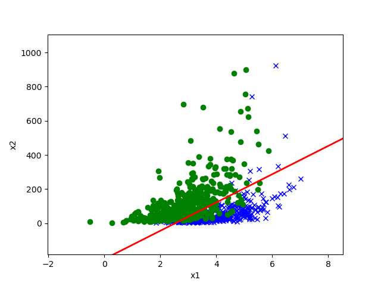

# 4.0 生成学习算法

在分类问题中，我们之前的处理方法是：给定特征，输出它属于哪一类。基于图示，我们可以将其表示为两个大圆 $A$ 和 $B$，我们的工作就是在这两个大圆圈中找到一条分界线（即 $\theta^{\text T} x$，正式名称是决策边界），这条分界线对应着 $p(y \in A) = p(y \in B) = 1/2$. 如下图：

现在我们介绍另一种算法。刚刚我们是给定特征判断属于哪一类，相当于是去计算 $p(y \mid x)$. 现在我们给定类去总结它有什么特征。比如，我们在绿色区域去总结其数据特点，然后在蓝色区域总结其数据特点，即计算 $p(x \mid y)$。现在我们的目标是给定某个特征，判断属于绿色区域还是蓝色区域，即我们需要通过 $p(x \mid y)$ 导出 $p(y \mid x)$，这就需要利用贝叶斯公式：
$$
p(y \mid x) = \frac{p(x \mid y) p(y)}{p(x)} = \frac{p(x \mid y) p(y)}{p(x \mid y = 1) p(y = 1) +  p(x \mid y = 0) p(y = 0)}.
$$
其中 $p(y)$ 可以用样本中 $y$ 类的占比来估计，即以频率估计概率。

我们把第一种方法，即直接拟合 $p(y \mid x)$ 的方法称为判别学习算法，把第二种方法，即拟合 $p(x \mid y)$，然后通过贝叶斯公式间接导出 $p(y \mid x)$ 的方法称为生成学习算法。