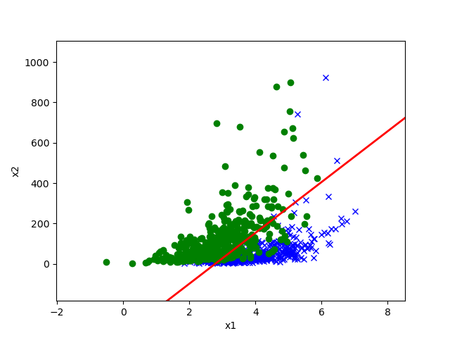

# 4.1 高斯判别分析 GDA

## 多元高斯分布

$d$ 维高斯分布，亦称 $d$ 维正态分布，以期望向量 $\mu$ 和协方差矩阵 $\Sigma \in \mathbb R^{d \times d}$ 为参数，其中 $\Sigma$ 是半正定矩阵，记作 $\mathcal N(\mu, \Sigma)$。其联合分布为
$$
p(x; \mu, \Sigma) = \frac{1}{(2 \pi)^{d/2} |\Sigma|^{1/2}} \exp
\left(
-\frac{1}{2} (x - \mu)^{\text T} \Sigma^{-1} (x - \mu)
\right).
$$

## 高斯判别分析模型 GDA

虽然名为“判别”，但 GDA 实际上是一种生成学习算法。由于历史原因，我们姑且叫它“判别”。

在 GDA 中，我们用多元高斯分布来拟合 $p(x \mid y)$，即
$$
\begin{align}
y & \sim \text{Bernoulli}(\phi) \\
x \mid y = 0 &\sim \mathcal N(\mu_0, \Sigma) \\
x \mid y = 1 &\sim \mathcal N(\mu_1, \Sigma) \\
\end{align}
$$
写出分布：
$$
\begin{align}
p(y) &= \phi^y (1 - \phi)^{1 - y} \\
p(x \mid y = 0) &= \frac{1}{(2 \pi)^{d/2} |\Sigma|^{1/2}} \exp \left( -\frac{1}{2} (x - \mu_0)^{\text T} \Sigma^{-1} (x - \mu_0) \right) \\
p(x \mid y = 1) &= \frac{1}{(2 \pi)^{d/2} |\Sigma|^{1/2}} \exp \left( -\frac{1}{2} (x - \mu_1)^{\text T} \Sigma^{-1} (x - \mu_1) \right)
\end{align}
$$
在此处，参数为 $\phi, \mu_0, \mu_1, \Sigma$，两个高斯分布的期望向量不同，但协方差矩阵相同。对数似然函数为
$$
\begin{align}
l(\phi, \mu_0, \mu_1, \Sigma) &= \log \prod_{i = 1}^{n} p(x^{(i)}, y^{(i)}; \phi, \mu_0, \mu_1, \Sigma) \\
&= \log \prod_{i = 1}^{n} p(x^{(i)} \mid y^{(i)}; \mu_0, \mu_1, \Sigma) p(y^{(i)}; \phi).
\end{align}
$$
为使对数似然函数最大化，通过计算对各参数的梯度，我们可以获得参数的值：
$$
\begin{align}
\phi &= \frac{1}{n} \sum_{i = 1}^{n} I\set{y^{(i)} = 1} \\
\mu_0 &= \frac{\sum_{i = 1}^{n} I\set{y^{(i)} = 0} x^{(i)}}{\sum_{i = 1}^{n} I\set{y^{(i)} = 1}} \\
\mu_1 &= \frac{\sum_{i = 1}^{n} I\set{y^{(i)} = 1} x^{(i)}}{\sum_{i = 1}^{n} I\set{y^{(i)} = 1}} \\
\Sigma &= \frac{1}{n} \sum_{i = 1}^{n} (x^{(i)} - \mu_{y^{(i)}})(x^{(i)} - \mu_{y^{(i)}})^{\text T}.
\end{align}
$$
下图是 GDA 给出的决策边界：

在这条红线上，我们的预测是 $p(y = 0 \mid x) = p(y = 1 \mid x) = 0.5$；在其中一侧，$p(y = 0 \mid x) > p (y = 1 \mid x)$，因此我们预测这一侧为 $y = 0$；在另一侧则反之，$p(y = 1 \mid x) > p(y = 0 \mid x)$，因此我们预测这一侧为 $y = 1$.

## GDA 与逻辑回归

如果我们把上面的结果代入贝叶斯公式，有
$$
p(y = 1 \mid x; \phi, \Sigma, \mu_0, \mu_1) = \frac{1}{1 + \exp(-\theta^{\text T} x)},
$$
其中 $\theta$ 是 $\phi, \Sigma, \mu_0, \mu_1$ 的函数。而上式正是逻辑回归函数——一个判别算法。

那么，通过 GDA 预测和通过逻辑回归预测的效果是否相同呢？答案是否定的。

我们刚刚已经说明了如果 $p(x|y)$ 是一个多元高斯分布（且具有相同的协方差矩阵 $\Sigma$ ），那么 $p(y|x)$ 则必然符合一个逻辑函数。然而，逆命题是不成立的，即假如 $p(y|x)$ 是一个逻辑函数，这并不能保证 $p(x|y)$ 一定是一个多元高斯分布。

这就表明**高斯判别模型相比逻辑回归对数据做了更强的假设**。 这也就意味着，在这两种模型的假设都成立的时候（即 $p(x \mid y)$ 确实符合高斯分布时），用 GDA 去拟合数据是更好的，因为它保存了更多的信息，即此时 GDA 是**渐进有效的（asymptotically efficient）**。 实际上，在面对非常大的训练集（训练样本规模 $m$ 特别大）时，严格来说，可能就没有什么别的算法能比 GDA 更好（“好”的标准可能如：对 $p(y|x)$ 估计的准确度等）。所以在这种情况下就表明，GDA 是一个比逻辑回归更好的算法；即便对于小规模的训练集，我们最终也会发现高斯判别分析（GDA）是更好的。

反之，由于逻辑回归做出的假设要明显更弱一些，所以因此逻辑回归的**通用性**也更强，同时也对错误的建模假设不那么敏感。有很多不同的假设都能够将 $p(y|x)$ 引向逻辑回归函数。例如，如果 $x|y = 0\sim \text{Poisson}(\lambda_0)$ 是一个泊松分布，而$x|y = 1\sim \text{Poisson}(\lambda_1)$也是一个泊松分布，那么 $p(y|x)$ 也将符合逻辑函数。逻辑回归也适用于这类的泊松分布的数据。但对这样的数据，如果我们强行使用 GDA，然后用高斯分布来拟合这些非高斯数据，那么结果预测的准确性就会降低。

总结：高斯判别分析方法（GDA）能够建立更强的模型假设，并且在数据利用上更加有效（比如说，使用比较少的训练集就能有"还不错的"效果），当然前提是模型假设争取或者至少接近正确。逻辑回归建立的假设更弱，因此对于偏离的模型假设来说更加稳定。如果训练集数据的确是非高斯分布的，而且是有限的大规模数据，那么逻辑回归几乎总是比GDA要更好的。因此，在实际中，逻辑回归的使用频率要比 GDA 高得多。（关于判别和生成模型的对比的相关讨论也适用于我们下面要讲的朴素贝叶斯算法（Naive Bayes），但朴素贝叶斯算法还是被认为是一个非常优秀也非常流行的分类算法。）