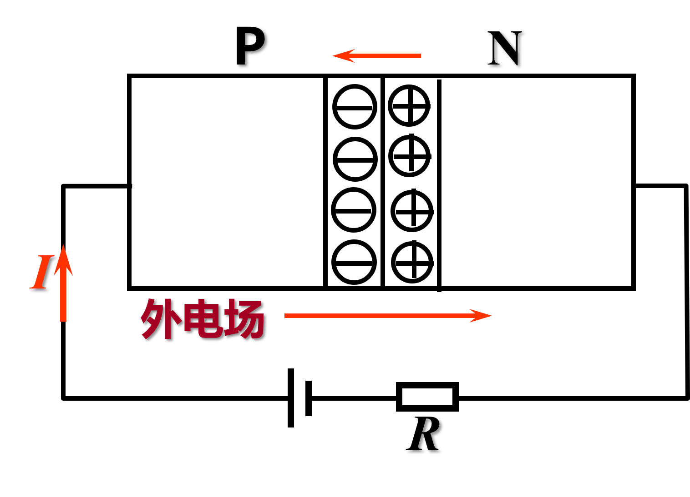
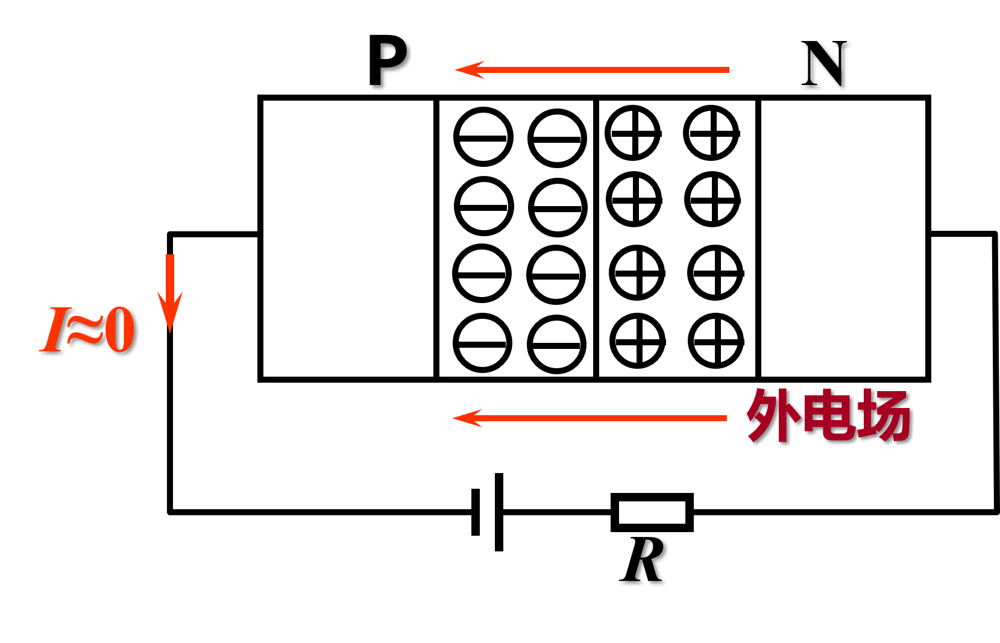

# 1.1 半导体基础知识

半导体：介于导体和绝缘体之间的物质，半导体器件是构成电子电路的基本器件。

特点：热敏特性、光敏特性、掺杂增强导电能力。

## 本征半导体

纯净且具有晶体结构的半导体。

在绝对零度时不导电。空穴和自由电子均参与导电（统称为载流子）。

对其施加 温度 或 光照（热激发） ，价电子获得能量，产生自由电子和空穴对（此现象称作本征激发）。

自由电子在运动的过程中遇空穴会填补，称作复合。

温度越高，载流子浓度越高，导电能力越强。

> [!warning]
>
> 本征半导体的载流子浓度低，导电能力弱

> [!note]
>
> （似乎不需掌握，作拓展）
>
> 理论分析表明，本征半导体浓度为
>
> $n_i=p_i=K_iT^{3 \over 2}e^{-E_{GO} \over (2kT)}$
>
> $n_i$和$p_i$表示自由电子与空穴浓度，$T$为热力学温度，$k$为玻尔兹曼常数，$E_{GO}$为热力学零度时破坏共价键所需能量（禁带宽度），$K_i$是与半导体材料载流子有效质量、有效能级密度有关的常量

## 杂质半导体

在本征半导体中掺入3价或5价元素的半导体。

**N型半导体** ：纯净本征半导体中掺入五价元素，自由电子为多数载流子（又称 **多子** ），空穴为少数载流子（又称 **少子** ）。

**P型半导体** ：纯净本征半导体中掺入三价元素，空穴为 **多子** ，自由电子为 **少子** 。

## PN结

P型半导体与N型半导体的交界面形成PN结，具有单向导电性。

### PN结的形成

先明确两个概念：

**扩散运动** ：多数载流子由于浓度差引起的运动，从浓度高的地方向浓度低的地方移动。形成PN结，产生内电场，阻止扩散运动。

**漂移运动** ：少数载流子由于内电场作用下引起的运动。增加多数载流子的浓度差，有利于扩散运动。

PN结形成的基本流程如下：浓度差 -> 扩散运动 -> 内电场加强 -> 增强漂移运动 -> 漂移运动和扩散运动达到动态平衡 -> 空间电荷区宽度一定 -> PN结形成。

在交界面附近，有一块区域缺少多子，此区域称为 **空间电荷区** 或 **耗尽层** （图中黄色区域）。

### PN结的特性

单向导电性，正向导通（外电场驱动扩散运动），反向截止（外电场驱动漂移运动，但由于少子数量极少，产生电流忽略不计）。

### PN结电容

记$C_i$为PN结的结电容

$C_b$为势垒电容（ 0.5pF~10pF) ：空间电荷区的宽度和空间电荷数量随外加电压而变化。与PN结的结构、制作工艺、掺杂浓度有关。 **反偏** 时占主导。

$C_d$为扩散电容：PN结正偏时，靠近耗尽层交界处，少子浓度高，且向远离耗尽层的方向扩散，扩散区的电荷积累与释放如同电容的充放电过程。 **正偏** 时占主导。

则
$$
C_i=C_b+C_d
$$

$C_b$和$C_d$一般极小，旨在高频信号下才考虑其作用。

