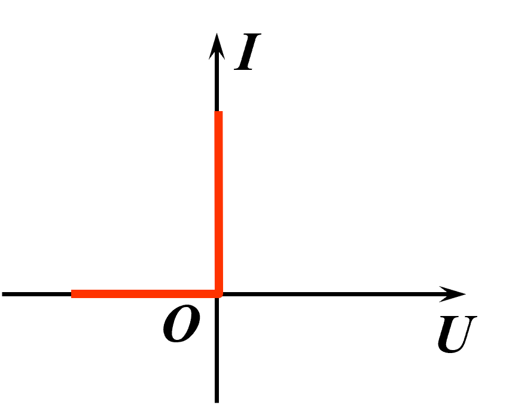
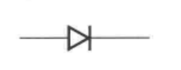
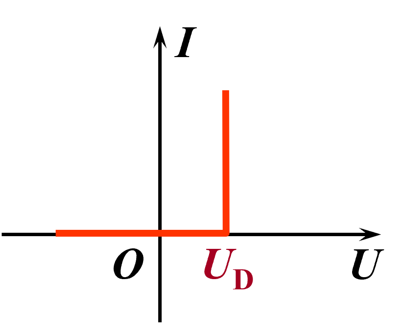
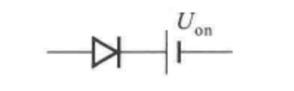
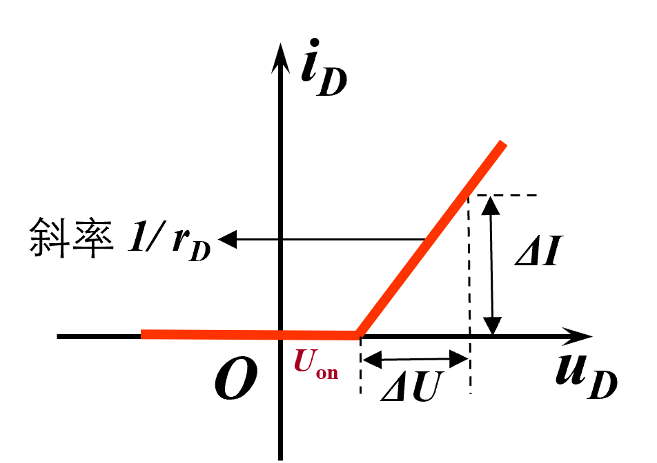
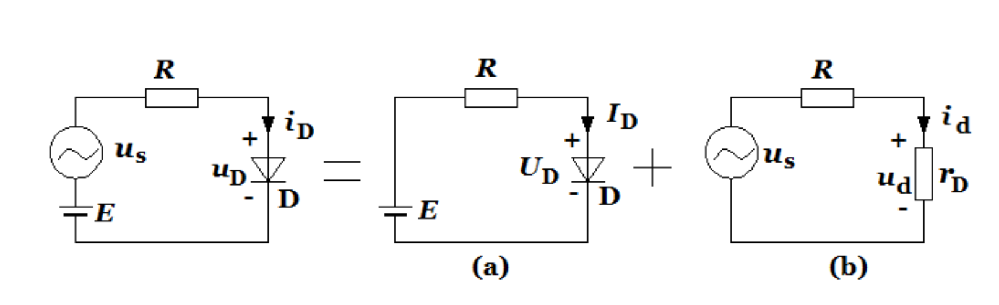
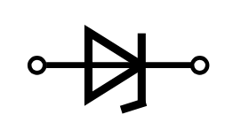
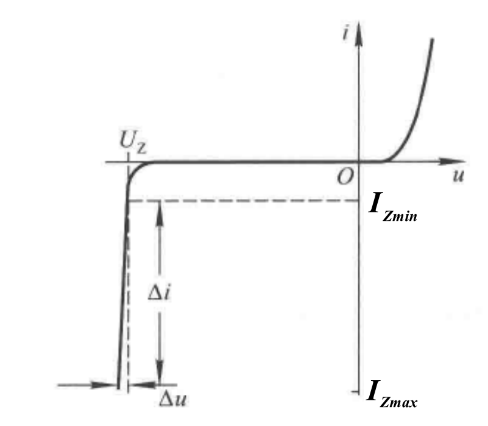

# 1.2 半导体二极管

由上一节知识，可以得到二极管的基本结构，由P区引出的电极为阳极，由N区引出的电极为阴极。

## 分类

**点接触型二极管** ：

特点：结面积小，结电容小

适用： 高频，小电流

**面接触型二极管** ：

特点：节面积大，结电容大

适用：低频，大电流

**平面二极管** ：

适用：节面积大的用于大功率整流，节面积小的用于数字脉冲电路中的开关管

## 主要参数

$U_{(BR)}$为反向击穿电压

$U_{RM}={U_{(BR)} \over 2}$为最高反向工作电压

$I_F$为最大整流电流（最大正向平均电流）

$I_R$未被击穿时的反向电流（越小单向导电性越好）

$R_D$直流电阻

$r_D={\Delta U \over \Delta I}$交流电阻

$f_M$最高工作频率

$I_S$为反向饱和电流

$U_T={kT \over q}$为温度电压当量

## 伏安特性

**伏安特性方程** ：
$$
I_D=I_S(e^{U_D \over U_T}-1)
$$

**图像** ：

| 材料 | 开启电压$U_{on}/V$ |   导通电压$U/V$    | 反向饱和电流$I_s/μA$ |
| :--: | :----------------: | :----------------: | :------------------: |
|  硅  |        0.5         | 0.6~0.8（常取0.7） |        ＜0.1         |
|  锗  |        0.1         | 0.2~0.3（常取0.3） |         几十         |

$0 \to U_{on}$的部分称作死区

**温度对二极管特性的影响** ：T升高时$U_{on}$以(2~2.5)mV/℃下降，图像表现为正向左移，反向下移。

## 等效电路

## 二极管常用电路模型

### 直流或低频大信号模型

**理想二极管模型** 

外加电压远大于二极管正向导通电压，且正向导通电阻可忽略不计时

近似正向导通、反向截止。

二极管视作理想开关。

**恒压降模型** 

外加电压与正向导通电压相差不多时，且正向导通电阻可忽略不计时

外加电压小于正向导通电压时截止，大于时导通

视作理想二极管 串联恒压源。

**二极管折线化模型** 

二极管正向电压和正向导通电阻均不可忽略时

视作理想二极管 串联恒压源 再串联电阻。

导通时 $u_D=U_{on}+r_Di_D$

截止时 $i_D=0$

二极管的动态电阻 $r_D= {\Delta U \over \Delta I}$

### 低频小信号模型

根据叠加性原理$i_D=I_D+i_d$，分为直流和交流分别计算响应，最后叠加。

计算交流响应时二极管近似为$r_D$，其阻值大小可由结电流方程求导得出。

$i_D=I_S(e^{U_D \over U_T}-1) \approx I_Se^{U_D \over U_T}$ 得 $r_D={\Delta u_D \over \Delta i_D}={{\rm d} u_D\over{\rm d} i_D}={U_T \over I_D}$

## 稳压二极管

又称齐纳二极管，工作范围是反向击穿区。

符号为

等效电路为

### 伏安特性

与常规二极管不同的是，在$0$至$U_Z$之间，图像很贴近x轴，即$I_S$极小，$U_Z$之后曲线极陡

**主要参数**

$U_Z$为稳定电压，即流过电流时稳压管两端的反向电压值

$I_{Zmin}$为进入稳压区的最小电流

$I_{Zmax}$为不至于损坏的最大电流

电流越大稳压效果越好，小于$I_{Zmin}$时不稳压。

> [!note] 
>
> 稳压条件：
>
> - 反向击穿区
> - $I_{Zmin} \leqslant$工作电流$\leqslant I_{Zmax}$

$P_{ZM}$最大耗散功率，$P_{ZM}=U_ZI_{Zmax}$，稳压管功率超过该值时会损坏

$r_Z$动态电阻（$几\Omega至几十\Omega$），其大小为稳压管两端电压和电流的变化量之比$r_Z={\Delta U_Z \over \Delta I_Z}$，其值越小稳压效果越好。

$C_T$温度系数，$C_T= {\Delta U_Z \over \Delta T}$。$U_Z$小于4V的管子$C_T$小于零，属于齐纳击穿；$U_Z$大于7V的管子$C_T$大于零，属于雪崩击穿。

> [!warning]
>
> 稳压管电路需串联合适大小的电阻来限制电流，来保证稳压管不超过$I_{Zmax}$

## 其他二极管

发光二极管

光电二极管

变容二极管、通道二极管、肖特基二极管...
