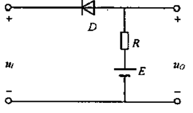

# 1.2.E 二极管的典型应用电路

## 二极管整流与检波

**整流** ：将交流变成直流的过程

**检波** ：将调制在高频信号上的低频信号捡取出来

**例 1** 半波整流

$u_1$为正弦波信号，试画出$u_o$的波形。

由二极管的单向导电性易知，只能导通$u_1$为正的部分。图略。

**例 2** 全波整流

## 二极管限幅

**例 3** 二极管限幅

如图所示，电路中的二极管为理想二极管，已知$E=3V$,$u_i=5sin \omega tV$，试画出电压的波形。

## 二极管在逻辑电路中的应用

**例 4** 二极管的优先导通原则

电位差大的二极管优先导通

取$U_A$和$U_B$为 0V 或 3V 的不同组合时，求$U_Y$

以下举两个例子

当$U_A=3V$，$U_B=3V$时，$U_Y=U_A+U_D=U_B+U_D=3.7V$

当$U_A=0V$，$U_B=3V$时，由于共阳极接法下，阴极电位低的优先导通，故$U_Y=U_A+U_D=0.7V$

