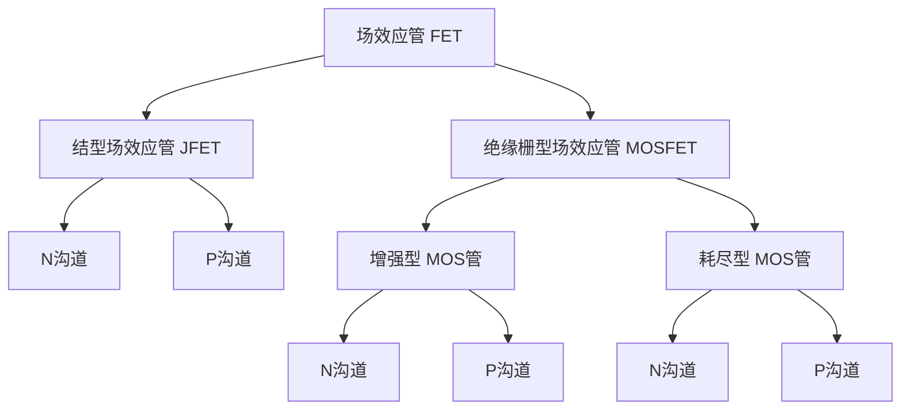

# 1.4 场效应管

## 分类



> **标注：** 箭头 N向里，P向外

---

## 1. 场效应管结构原理

* **三个电极**：源极 $s$ (source), 栅极 $g$ (gate), 漏极 $d$ (drain)
> **标注（红字）：** 与三极管对应：$b-g, c-d, e-s$


* 依靠漏极与源极间**导电沟道**（非耗尽层）导电。
* 依靠**一种**载流子导电，**单极型**晶体管。
* **栅源电压 ($U_{GS}$)**：决定导通/夹断（导通时，看作 $i_d = i_s$，有管压降 $U_{DS}$）。
* **栅漏电压 ($U_{GD}$)**：决定导通时，工作在 **可变电阻区** or **恒流区**。

---

## 2. 以 N沟道增强型 MOSFET 为例

* **$U_{GS} < U_{GS(th)}$**：
不存在导电沟道 $\rightarrow$ **截止**。
* **$U_{GS} > U_{GS(th)}$**：
形成导电沟道，$U_{GS} \uparrow$ 沟道 $\uparrow$。
* **可变电阻区**：
$U_{GD} > U_{GS(th)}$ 即 $U_{DS} < U_{GS} - U_{GS(th)}$
导电沟道沿源-漏方向变宽，漏极电流随 $u_{DS}$ 近似线性变化。
* **恒流区**：
$U_{GD} < U_{GS(th)}$ 即 $U_{DS} > U_{GS} - U_{GS(th)}$
导电沟道存在夹断区，且 $U_{DS}$ 越大，夹断区越长。漏极电流几乎不受 $u_{DS}$ 变化影响。

---

## 3. N沟道耗尽型 MOSFET

* 与增强型相比，存在**预埋导电沟道**。
* $U_{GS} = 0$：仍然导通。
* $U_{GS} < U_{GS(off)}$ 时：$U_{GS}$ 越小，导电沟道越窄，直至夹断。
* $U_{GS} > 0$ 时：
* $U_{GD}$ 与 $U_{GS}$ 在 $U_{GD(off)}$ 同侧：**可变电阻区**
* $U_{GD}$ 与 $U_{GS}$ 在 $U_{GD(off)}$ 异侧：**恒流区**


---

## 4. N沟道 JFET

* $U_{GS} = 0$：准静态。
* **注意**：不可工作在 $U_{GS}$ 正偏压下，因 $GS$ 导通。
* **工作状态分析**：
1. $U_{GS} < U_{GS(off)}$：**截止**。
2. $U_{GS(off)} < U_{GS} < 0$：**可变电阻区**。
$U_{GD} > U_{GS(off)}$（同侧）即 $U_{DS} < U_{GS} - U_{GS(off)}$。
3. $U_{GS(off)} < U_{GS} < 0$：**恒流区**。
$U_{GD} < U_{GS(off)}$（异侧）即 $U_{DS} > U_{GS} - U_{GS(off)}$。


> **分析工作状态：** 看 $U_{GS}$ 与 $U_{GD}$ 比较 $U_{GS(off)}$。

---

## 5. 场效应管输出特性曲线 ($i_D - u_{DS}$)

（以 N沟道增强型 MOSFET 为例）

```graph
{
  "target": "#output-char",
  "width": 500,
  "height": 300,
  "xAxis": { "label": "uDS", "domain": [0, 10] },
  "yAxis": { "label": "iD", "domain": [0, 10] },
  "data": [
    { "fn": "x < 3 ? 4*x - 0.5*x^2 : 7.5", "title": "uGS3=2Ugs(th)" },
    { "fn": "x < 2 ? 3*x - 0.5*x^2 : 4", "title": "uGS2" },
    { "fn": "x < 1 ? 2*x - 0.5*x^2 : 1.5", "title": "uGS1" },
    { "fn": "0", "title": "uGS=Ugs(th) 截止区" }
  ]
}

```

1. **截止区**：$i_D = 0$
2. **可变电阻区（非饱和区）**：$i_{D}$ 受 $u_{DS}$ 控制。可变电阻大小受 $u_{GS}$ 控制。
3. **恒流区（饱和区）**：$\star$ $i_D$ 仅受 $u_{GS}$ 控制。

---

## 6. 转移特性曲线 ($i_D - u_{GS}$)

取 $i_D - u_{DS}$ 中 $u_{DS}$ 恒定值：$i_D = f(u_{GS}) |_{u_{DS} = const}$。

```graph
{
  "target": "#transfer-char",
  "width": 400,
  "height": 300,
  "xAxis": { "label": "uGS", "domain": [0, 6] },
  "yAxis": { "label": "iD", "domain": [0, 10] },
  "data": [
    { "fn": "1.5 * (x/2 - 1)^2", "range": [2, 6], "title": "N沟道增强型" }
  ]
}

```

* **特点**：
1. 存在开启电压 $U_{GS(th)}$（或夹断电压 $U_{GS(off)}$）。
2. 场效应管工作在恒流区时，电压控制电流，$i_D$ 与 $u_{GS}$ 近似二次函数：
$i_D = I_{D0} (\frac{u_{GS}}{U_{GS(th)}} - 1)^2$


* **N沟道耗尽型 MOSFET**：
$i_D = I_{DSS} (\frac{u_{GS}}{U_{GS(off)}} - 1)^2$，$g_m = \frac{2}{|U_{GS(off)}|} \sqrt{I_{DSS} I_{DQ}}$
* **N沟道结型 FET**：
$i_D$ 同上。
> **标注（红字）：** P沟道与对应N沟道曲线关于原点中心对称 ($i_D: d \to s$)


### $\star$ 场效应管重要参数 —— 跨导 $g_m$

考虑微小扰动：$g_m = \frac{\Delta i_D}{\Delta u_{GS}}$

* 反映输入侧电压变化对输出侧漏极电流的控制。
* $g_m$ 与静态工作点 $Q$ 有关，是 $Q$ 处斜率。
* $g_m = \frac{\Delta i_D}{\Delta u_{GS}} = \frac{2}{U_{GS(th)}} \sqrt{I_{D0} I_{DQ}}$

---

## 7. 场效应管工作状态判断步骤

1. 确定类型，画转移曲线。
2. 判断 $U_{GS}$ 和 $U_{GS(th)}$ (或 $U_{GS(off)}$)，判断是否截止。
3. 由 $u_{DS}$ 和 $u_{GS} - U_{GS(th)}$ (或 $u_{GS} - U_{GS(off)}$) 大小判断区域。
* $\star$ 同侧或 $U_{GS}$ 与 $U_{GD}$ 在 $U_{GS(th)}$ (或 $U_{GS(off)}$) 同侧：**可变电阻区**；异侧：**恒流区**。


---

## FET 的低频小信号模型

设 $i_D = f(u_{GS}, u_{DS})$
则 $d i_D = \frac{\partial i_D}{\partial u_{GS}} \big|_{u_{DS}} du_{GS} + \frac{\partial i_D}{\partial u_{DS}} \big|_{u_{GS}} du_{DS}$
令 $\frac{\partial i_D}{\partial u_{GS}} \big|_{u_{DS}} = g_m$，$\frac{\partial i_D}{\partial u_{DS}} \big|_{u_{GS}} = \frac{1}{r_{ds}}$
则 $i_d = g_m u_{gs} + \frac{1}{r_{ds}} u_{ds}$

* $g_m$ —— 跨导，$r_{ds}$ —— 输出电阻

通常 $r_{gs} \to \infty$，$r_{ds} \gg R_L$，可认为断开。

* **(a) 截止区模型**：$i_g=0, i_d=0$
* **(b) 可变电阻区模型**：$D-S$ 间为可变电阻 $R_{ds}$
* **(c) 放大区交流小信号模型**：$D-S$ 间为受控电流源 $g_m u_{gs}$

**公式推导：**

* **对 N沟道增强型**：
$g_m = \frac{d i_D}{d u_{GS}} = 2 I_{D0} (\frac{u_{GS}}{U_{GS(th)}} - 1) \frac{1}{U_{GS(th)}} = \frac{2}{U_{GS(th)}} \sqrt{I_{D0} I_{DQ}}$
* **对 N沟道耗尽型**：
$g_m = \frac{d i_D}{d u_{GS}} = 2 I_{DSS} (1 - \frac{u_{GS}}{U_{GS(off)}}) \frac{-1}{U_{GS(off)}} = \frac{-2}{U_{GS(off)}} \sqrt{I_{DSS} I_{DQ}}$

---

## 8. 场效应管主要参数

1. **开启电压 $U_{GS(th)}$**（增强型）/ **夹断电压 $U_{GS(off)}$**（耗尽型）
2. **饱和漏极电流 $I_{DSS}$**：耗尽型 MOSFET，当 $U_{GS} = 0$ 时对应漏极电流。
3. **直流输入电阻 $R_{GS}$**：JFET $> 10^7 \Omega$；MOSFET $10^9 \sim 10^{15} \Omega$
4. **低频跨导 $g_m$**
5. **漏源动态电阻 $r_{ds}$**
6. **极间电容 $C_{gs}, C_{gd}, C_{ds}$**
7. **最大漏极功耗 $P_{DM} = U_{DS} \cdot i_D$**
8. **最大漏极电流 $I_{DM}$**
9. **栅源击穿电压 $U_{BR(GS)}$**
10. **漏源击穿电压 $U_{BR(DS)}$**
