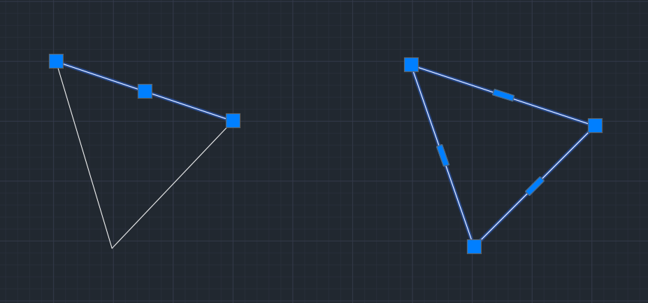
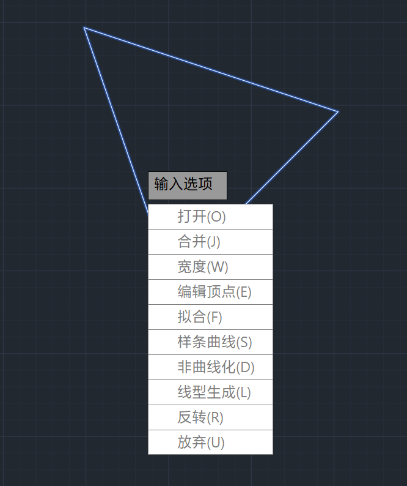
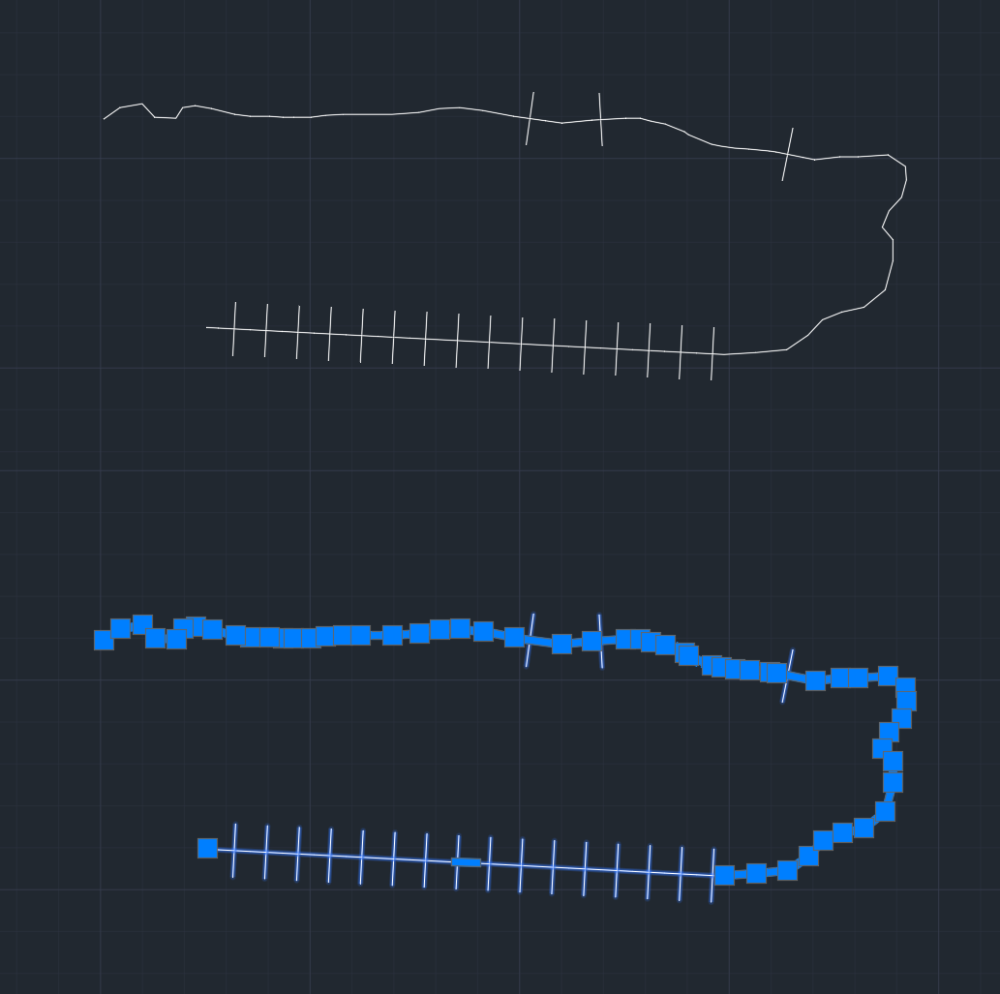
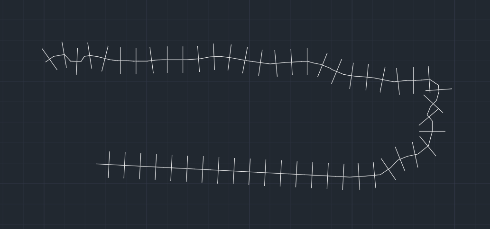

# 2 简单图形绘制

## 基础图形

### 线段 `LINE`

### 圆 `CIRCLE`

### 弧 `ARC`

## 捕捉与正交限制

### 捕捉

### 正交限制

## 折线 `PLINE`

使用 `PLINE` 命令可以绘制折线。绘制过程与 `LINE` 类似，`U` 回车可以放弃上一步、`C` 回车可以闭合路径。

`LINE` 多步画出的线段，在完成后是相互独立的实体，移动时相互独立。`PLINE` 画出的折线是一个整体。



通常在绘制地物时，优先使用 `PLINE` 而不是 `LINE` 进行绘制，可以方便编辑。

使用 `PEDIT` 命令编辑折线。



可以控制折线的打开 / 闭合、是否拟合为曲线等。

在设置线型时，比较复杂的折线在渲染上可能不甚美观，例如使用 `Track` 时：



这是因为默认渲染时，会单独处理每一条折线段，若折线段太短，不够放置图案，就会出现如图的状况。要修改，使用 `PEDIT` 中的线型生成，置为「开」，即可自适应渲染：



要默认启用线型生成，可以修改系统变量 `PLINEGEN` 实现。

使用 `SETVAR` 可以查询或设置变量。例如 `SETVAR ? pl*` 可以查询到如下信息：

```
命令: SETVAR 输入变量名或 [?] <CELTYPE>: ?
输入要列出的变量 <*>: pl*
PLATFORM          "Microsoft Windows NT Version 10.0 (Intel64)" (只读)
PLINECONVERTMODE  0
PLINEGEN          0
PLINETYPE         2
PLINEWID          0.0000
PLOTOFFSET        0
PLOTROTMODE       2
PLINEGCENMAX      50000
PLINEREVERSEWIDTHS 0
PLOTTRANSPARENCYOVERRIDE 1
PLQUIET           0
```

可以看到 `PLINEGEN` 的值为 `0`。使用 `SETVAR PLINEGEN 1` 可将其置为 `1`，此后绘制的折线将自动启用线型生成。

## 多线 `MLINE`