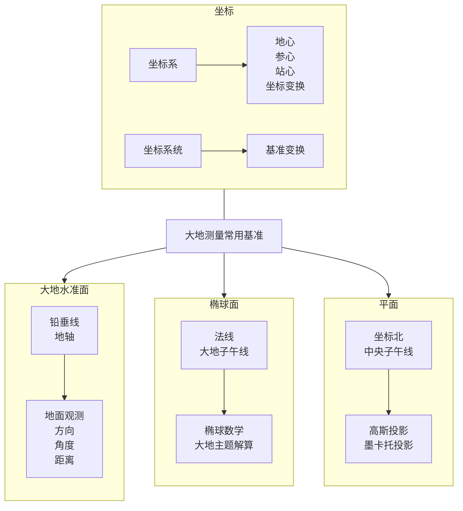

# 大地测量基础

<Tag orange>更新中</Tag>

同济大学测绘专业基础课程，课号 `CSG330203` / `03034803`。

教材使用施一民《现代大地控制测量》（第二版）。

## 记号

- 地心地固直角坐标 $(X,Y,Z)$
- 大地经度、纬度、椭球高 $(L,B,h)$，也常写作 $(\lambda,\varphi,h)$
- 长半轴、短半轴 $a,b$；第一偏心率 $e$；扁率 $f$
- 地球引力常数合并记作 $\mu=GM$
