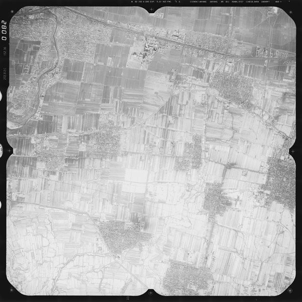
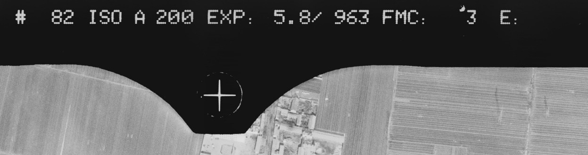
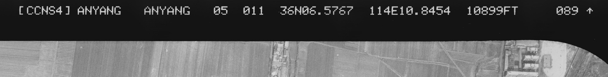
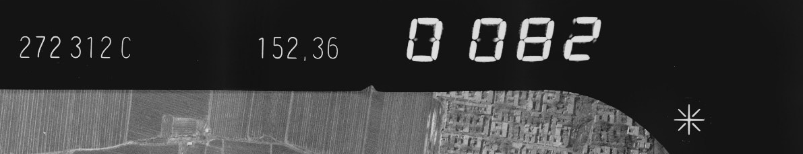
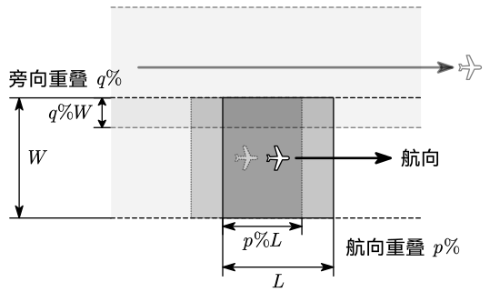
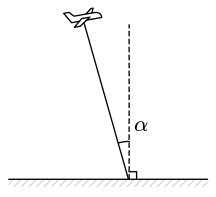
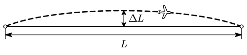
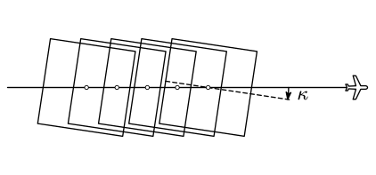
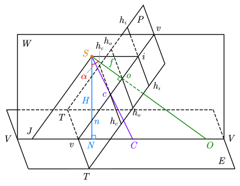

# 2 摄影测量基础知识

## 量测用相机

### 量测用相机的特点

主距：摄影机物镜后节点到像片主点的垂距。航空摄影时，物距可视为无穷远，像距几乎等于物镜焦距。故将物镜固定调焦于无穷远处，主距等于物镜焦距，均使用 $f$ 表示。

框标：胶片时代，在固定不变的承片框上，安置四个边的中点的标志。其目的是建立像片的直角框标坐标。两两相对的框标连线成正交，其交点成为像片平面坐标系的原点，从而使摄影的像片上构成直角框标坐标系。

如下是一张典型的航摄像片：

可以看到四个角点与四边中点均存在框标，呈十字形。顶部中间放大图：

顶部右侧放大图中可以看到是项目 `ANYANG` 的 `ANYANG` 分区，第 5 航线第 11 片：

左侧放大图：

==**量测用相机的特性**==：

- 像距固定不变是主距（几乎等于物镜焦距）
- 相片上有框标（数字形式隐含）
- 内方位元素已知
- 畸变小
- 结构精密
- 需同时曝光等

### 物镜畸变

- 切向畸变（一般不考虑）
- 径向畸变
  - 桶形畸变
  - 枕形畸变

畸变可以标定后使用公式修正。径向畸变修正量的经验公式：

$$
d_r=k_1r^3+k_2r^5+k_3r^7+\cdots
$$

## 航空摄影

### 摄影比例尺与航高

**摄影比例尺** $\dfrac1m$ 定义为航摄像片上一线段为 $l$ 的影像与地面上相应线段的水平距离 $L$ 之比，即有 $\dfrac1m=\dfrac lL$。

**摄影航高** $H$ 定义为摄影机的物镜中心至摄区的平均高程面（摄影基准面）的距离。

数量关系满足：

$$
\frac1m=\frac lL=\frac fH
$$

其中 $f$ 为摄影机主距。

当选定了摄影机和摄影比例尺后，即 $f$ 和 $m$ 为已知，航空摄影时就要求按计算的航高 $H$ 飞行摄影，以获得符合生产要求的摄影像片。

### 摄影资料的要求

**航向重叠**：同一条航线上相邻两像片的重叠比例。

**旁向重叠**：相邻航线的重叠比例。

**像片倾角** $\alpha$：摄影瞬间，摄影机轴与铅直方向的夹角。

**航摄最大偏距**：航向弯曲时，实际航线与目标航线的最大偏移距离。

**像片旋角** $\kappa$：相邻像片的主点连线与像幅沿航线方向两框标连线间的夹角。

==**传统航空摄影测量对空中摄影形式的要求**==：

- 合适的摄影比例尺
- 相对航高差 $\dfrac{\Delta H}H<5\%$
- 航向重叠 $p>60\%$，旁向重叠 $q>30\%$（航向、旁向重叠小于最低要求时，称航摄漏洞）
- 航线弯曲 $\dfrac{\Delta L}L<3\%$
- 旋片角 $\kappa<6\%$
- （主光轴竖直等）

==**为什么要有重叠度**==：

- 重叠区覆盖整个测区（立体测图的需要）
- 防止出现摄影漏洞（这样就不能用于测图）
- 在空三的时候用于连接相邻模型，补充性的地面控制

## 中心投影

设空间诸物点 $A,B,C,\cdots$ 按照某一规律建立投影射线，取一平面 $P$ 截割投影射线，在平面内得到相应的投影点 $a,b,c,\cdots$，则该平面称为投影面，在平面内得到的图形称为投影图。

若投影光线相互平行且垂直于投影面， 则称为**正射投影**，如图 (a) 所示。若投影光线会聚于一点，则称为**中心投影**，如图 (b) 中三种情况均属中心投影。投影光线会聚的点 $S$ 称为投影中心，由中心投影得到的图称为透视图。

当航空摄影机向地面摄影时，航摄像片是所摄地面的中心投影，类似上图 (b) 中的第一种情形。而地图是地面在水平面上正射投影的缩小，因此，摄影测量可以被认为是研究并实现将中心投影的航摄像片转换为正射投影（地图）的科学与技术。

==**针孔成像原理**==：光线沿直线传播，光从物体经过小孔到达屏幕形成倒立的实像，满足像点、针孔、物点三点共线。

==**框幅式影像成像的基本原理**==：满足中心投影原理，即物点、像点、投影中心三点共线。

==**中心投影与正射投影的区别**==：中心投影的光线会聚于一点（投影中心）；正射投影的投影光线互相平行且与投影平面正交。

==**竖直摄影与正直摄影**==：竖直摄影主光轴近似垂直于基准面（像片倾角为 2°~3°）；正直摄影主光轴严格垂直于基准面。

## 航摄像片上特殊的点、线、面

- $P$ 为倾斜的==像片面（投影面）==；$E$ 为水平的地面（物面），也称==基准面==
- $S$ 为摄影中心（投影中心）
  - $E\cap P=TT$ 为==透视轴==，透视轴上的点称为二重点
- 作直线 $So\perp$ 像平面 $P$，$So$ 称为摄影机轴
  - $So\cap P=o$ 为==像主点==；过 $o$ 作 $h_oh_o\parallel TT$，$h_oh_o$ 为==主横线==
  - $So\cap E=O$ 为地面主点
  - $So=f$ 为摄影机==主距==
- 作直线 $Sn\perp$ 地面 $E$，$Sn$ 称为主垂线
  - $Sn\cap P=n$ 为==像底点==
  - $Sn\cap E=N$ 为地底点
  - $SN=H$ 为==航高==
- $\angle oSN=\alpha$ 称为像片倾角
- 作 $\alpha$ 的平分线 $Sc$
  - $Sc\cap P=c$ 为==等角点==；过 $c$ 作 $h_ch_c\parallel TT$，$h_ch_c$ 为==等比线==
  - $Sc\cap E=C$ 为地面等角点
- 过主垂线 $Sn$ 与摄影机轴 $So$ 的面 $W$ 为==主垂面==，有 $W\perp E$ 且 $W\perp P$
  - $W\cap P=vv$ 为==主纵线==；过 $S$ 作 $SJ\parallel vv$，$SJ\cap E=J$ 称为==主遁点==
  - $W\cap E=VV$ 为==基本方向线（摄影方向线）==
  - 过 $S$ 作面 $Es\parallel E$，$Es$ 为合面（图中未画出）
  - $Es\cap P=h_ih_i$ 为==主合线（地平线）==
  - $h_ih_i\cap W=i$ 为==主合点==

根据中心投影特点可知， $i$ 点是 $E$ 面上一组平行于基本方向线 $VV$ 的平行线束在 $P$ 面上构像的合点，而 $n$ 是一组垂直于 $E$ 面的平行线束在 $P$ 面上构像的合点。

## 中英术语对照

| 英文术语                       | 中文术语   |
| ------------------------------ | ---------- |
| cartographic aerial camera     | 航摄相机   |
| metric camera                  | 量测用相机 |
| fiducial mark                  | 框标       |
| principal point                | 像主点     |
| principal distance             | 主距       |
| optical axis                   | 主光轴     |
| collimated light               | 准直光线   |
| radial distortion              | 径向畸变   |
| tangential distortion          | 切向畸变   |
| sidelap                        | 旁向重叠   |
| forward overlap                | 航向重叠   |
| perspective center             | 投影中心   |
| nominally vertical photographs | 竖直摄影   |
| vertical photographs           | 正直摄影   |

## 小测问题

- 量测用相机有哪些特性？
- 物镜畸变的种类，在摄影测量中如何处理？
- 传统航空摄影测量对空中摄影的形式有哪些要求？
